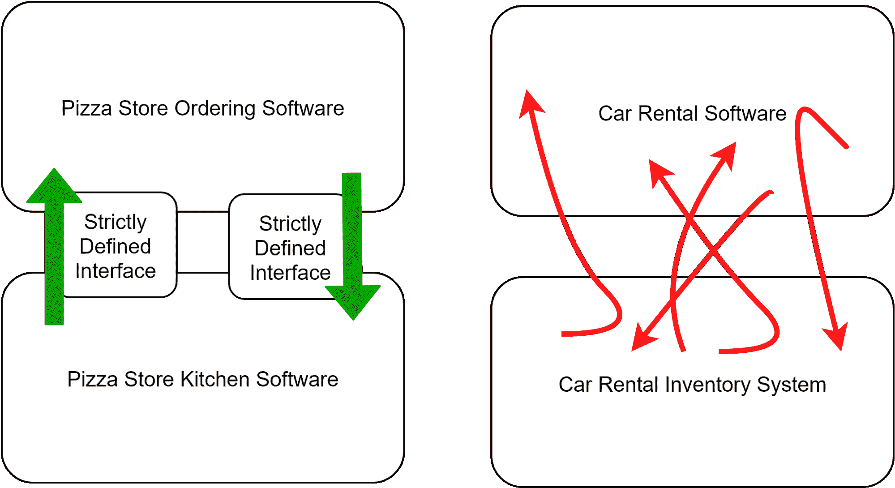

# Calico 可插拔数据平面的重要性

> 原文：<https://thenewstack.io/the-importance-of-calicos-pluggable-data-plane/>

[Chris Tom kins](https://www.linkedin.com/in/cdtomkins/)

[Chris 是 Tigera 的开发者倡导者，他在 Tigera 倡导用户需求，以支持 Project Calico 的用户和贡献者社区。](https://www.linkedin.com/in/cdtomkins/)

这篇文章将强调并解释可插拔数据层的重要性。但是为了做到这一点，我们首先需要一个类比。该说一说砖砌的花园墙了。

想象一下，你被要求修理花园的砖墙，因为一块砖在夏天的阳光下裂开了。你有你需要的设备，所以工作的大小将在很大程度上取决于在不干扰周围所有砖的情况下从墙上取下砖的容易程度。祝你好运。

既然我们已经记住了这个美妙的图像，让我们看看如何着手设计墙壁——以及如何维护它们。

## 关于软件耦合:固定和设计墙

“耦合”是用来描述软件之间相互依赖的术语。紧密耦合的系统相互依赖，难以分离；松散耦合的系统更像是设计来一起工作的积木，但是它们会干净利落地分开。因此，由于我们花园墙上的砖块紧密相连(在这种情况下，通过水泥)，试图移除其中一个被证明是困难的。

我们也可以认为软件是建在墙上的。支持现代互联网的协议存在于被称为互联网协议组的墙(即堆栈)中。在墙的顶部是诸如 HTTPS 之类的协议，其允许软件程序和人相互通信，在堆栈的更下方是用户不直接使用但对更高层的功能至关重要的协议(例如以太网、TCP)。

互联网协议套件墙中间(确切地说是第三排砖块)的协议之一是 IPv4。它已经被“破解”了一段时间。人们普遍认为 IPv4 需要被取代，但完成这项工作进展缓慢的最大原因之一是，从历史上看，IPv4 一直与网络堆栈中它上面和下面的协议紧密耦合。我们不能只是“搬开砖头”

虽然 IPv4 的挑战是许多人都熟悉的一个例子，但同样的原则适用于所有的软件工程。严格定义的软件接口意味着软件更容易保护、维护、改进和管理。看下图，我们可以想象一个设计良好的模块化软件解决方案(比萨饼店)与一个设计糟糕的解决方案(汽车租赁店)的对比。你喜欢哪一个？

那么，所有这些与 Tigera 的 Kubernetes 安全性和可观测性解决方案 Calico 有什么关系呢？

[Calico](https://www.projectcalico.org/) 从第一天起就被设计成四层墙:

*   数据模型(定义用于启用 Calico 的自定义资源)；
*   Felix 计算图(做出明智决策的“控制平面”)；
*   数据层驱动程序(负责数据层编程的简单、最小的驱动程序)；和
*   数据平面(负责转发数据包)。

每个组件不仅有一个明确定义的角色，而且有一个到它上面和下面的“砖块”的明确定义的 API 接口。有了印花棉布，你可以轻松更换砖块，在周末的剩余时间回到花园。

但是如果砖头没有碎呢？如果我们只是想要一块闪亮的新砖呢？

## 印花布:选择最好的砖块

当 Calico 问世时，它只支持单一数据平面，但其简单性、性能和兼容性确保了其迅速普及。此后，支持扩展到两个额外的数据层，增加了强大的功能。Calico 总共支持三种数据平面，使您能够为正确的工作选择正确的工具:

*   [Linux eBPF](https://www.projectcalico.org/introducing-the-calico-ebpf-dataplane/) (高性能、出色的可视性、改进的流量)
*   标准 Linux iptables(良好的性能、出色的兼容性、广泛的支持)
*   Windows HNS(支持 Windows 上的工作负载)

此外，由于矢量数据包处理(VPP)项目贡献者的辛勤工作，在 Calico 内部构建对第四个数据平面(VPP)的支持方面取得了重大进展。

Calico 在短时间内添加了多个数据平面，同时保持了丰富的网络策略模型，这证明了它的出色设计。

## 未来:非常闪亮的砖块

网络世界充满了将成为下一个大事件的协议和技术，但是没有兑现它们的承诺，有人吗？).

Calico 从第一天起就内置了对可插拔数据平面的支持，这确保了 Calico 始终能够支持数据平面技术的最新发展，并在数据平面之间优雅地移动，因为我们都知道未来会发生什么。

由于这种支持，Calico 能够为其策略引擎使用最佳的本地控制，并拥有适合当前和未来工作的数据平面技术。

*你知道你可以成为一名认证印花布操作员吗？在这个[免费的自定进度认证课程](https://academy.tigera.io/course/certified-calico-operator-level-1/)中，使用 Calico 学习 Kubernetes 网络和安全基础知识。*

## 进一步阅读

<svg xmlns:xlink="http://www.w3.org/1999/xlink" viewBox="0 0 68 31" version="1.1"><title>Group</title> <desc>Created with Sketch.</desc></svg>