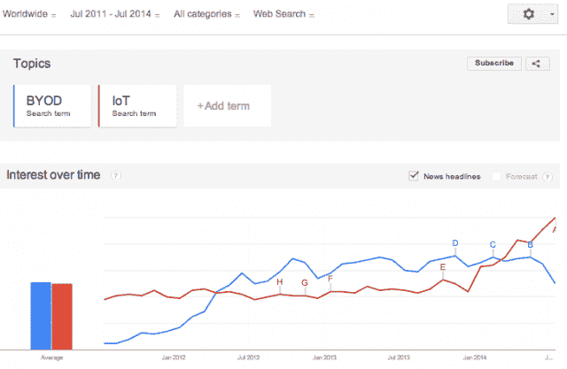
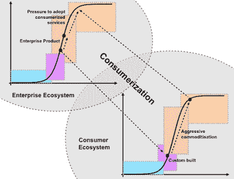

# 物联网及其负面反应

> 原文：<https://thenewstack.io/the-internet-of-things-and-the-negative-response-of-it/>

关于 IT 和物联网(IoT)的共生关系——让我们从趋势图开始。事实证明，在过去的三年里，有一个非常有趣的趋势，即从讨论“自带设备”转向“物联网”——无论我们谈论的是可穿戴设备还是联网设备，我们都不能忽视设备收集数据并与之交互的势头，根据任何已定义的 BYOD 政策的精神，这些设备可能称不上是“设备”。

大约在这一趋势开始的时候，LEF 研究员西蒙·沃德利写了一篇关于消费化的短文，他分享了以下地图:

当我们在 IT 环境中考虑 BYOD 的概念时，它通常是指笔记本电脑、平板电脑和手机。我还没有看到像谷歌眼镜、三星 Gear、Nest 甚至 Fitbit 这样的自带设备政策——这是因为这些不是它认为的企业生态系统的一部分。正如 Simon 在他的帖子中所写的，IT 战略不是一部政治宪法，而是一项运营要务:

消费化带来的采纳压力产生了积极的回应，如 BYOT(自带技术)和消极的回应，如影子 IT，即当一个组织无法满足其内部消费者的需求时

它处于一个独特的位置，通过从员工那里获取线索来提供竞争优势。实际上，这是一种摩擦练习。这在美国奥运滑雪服中显而易见，例如，它使用了赛车手博德·米勒练习赛中的 100 多万个数据点，来完善滑雪者紧身套装的设计和空气动力学。对于最终的成功，比如金牌，很容易立即理解它对团队价值链的影响。

在物联网的背景下，第一步是接受一切都将被连接，从而移动 IT 的目标——如果接受 BYOD 将事情从控制转移到实现，那么下一次发展必须从实现到改进。通过阅读下面的三句话，看看我的提议是多么令人愉快:

1.  它的任务是控制业务。
2.  它的使命是促进业务发展。
3.  它的使命是改善业务。

已经有迹象表明[数据创造和消费正在以比摩尔定律框架](http://bits.blogs.nytimes.com/2014/07/25/is-moores-law-less-important-to-the-tech-industry/?_php=true&_type=blogs&partner=rss&emc=rss&_r=0)更快的速度组织工作。从很多方面来说，这是一场比赛，比赛的基本结构可能会在实际比赛中发生根本性的变化，而不是在比赛之前或之后。在安全方面，它应该将政策合规视为竞争的拐杖，而不是专制的警棍。如果有一堆阻碍创新的复选框，那就发挥创造力。与业务部门合作，理解和预测(仅仅满足是不够的)用户的需求。

物联网是大趋势的融合:大数据、云计算、智能设备。如果你们像我一样是“成年人”,还记得 IT 带给你第一台笔记本电脑、第一部手机、第一个 WiFi 适配器的日子……这些都是通过增强用户能力使业务更加敏捷的投资。物联网是 IT 重新获得企业竞争优势的绝佳机会。诀窍是只关注最基本的:

*Tal Klein 是 Adallom 的营销副总裁，Adallom 是新堆栈的赞助商。*

*通过 Flickr 知识共享提供特色图片。*

<svg xmlns:xlink="http://www.w3.org/1999/xlink" viewBox="0 0 68 31" version="1.1"><title>Group</title> <desc>Created with Sketch.</desc></svg>