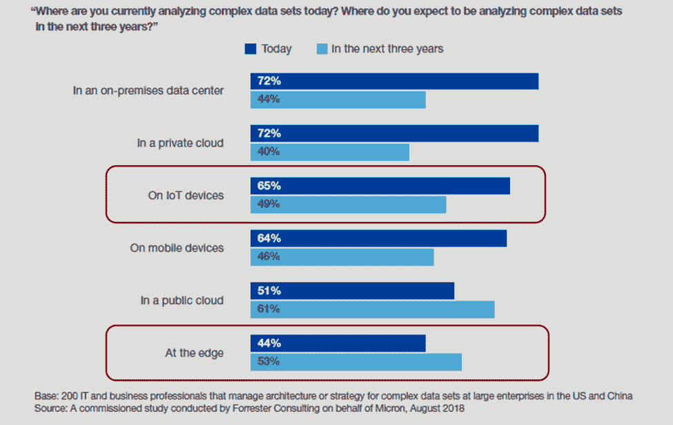

# 边缘的物联网

> 原文：<https://thenewstack.io/the-internet-of-things-on-the-edge/>

[边缘计算](https://thenewstack.io/category/edge-iot/)已经成为物联网(IoT)的重要趋势。Gartner Group 将边缘计算确定为 2019 年 T2 科技趋势之一。实施物联网解决方案的公司正在看到在边缘处理数据的真正好处，在数据被发送到云之前，更接近“事物”。Micron/Forrester [最近的一项调查](https://event.on24.com/eventRegistration/EventLobbyServlet?target=reg20.jsp&referrer=&eventid=1907807&sessionid=1&key=88F7E7A1575B07F34713B81CF42F8405&regTag=&sourcepage=register)证实了这一趋势，该调查发现，在未来 3 年内，53%的受访者预计将在边缘分析复杂的数据集。这就是为什么有些人大胆预测“边缘将吞噬云”

边缘计算正受到越来越多的关注，因为它解决了实施工业物联网用例的一些关键问题。

 [伊恩·斯克雷特

Ian Skerrett 是一名营销和商业战略顾问，专门研究物联网和开源行业。他与许多初创公司和大型成熟供应商合作，研究他们的物联网和开源战略。伊恩之前是 Eclipse 基金会的营销副总裁。在这个职位上，他帮助创建了 Eclipse IoT 开源社区。你可以通过 Twitter (@IanSkerret)或 LinkedIn 联系到 Ian Skerrett。](https://www.linkedin.com/in/ianskerrett/) 

在边缘处理大量传感器数据降低了网络带宽成本和云数据存储成本。边缘计算允许分析和过滤更靠近传感器的数据，因此只有相关数据被发送到云。

许多工业物联网用例要求亚秒级响应时间，以实现安全关键和精确操作。例如，如果一个人离一件工业设备太近，他需要立即停止工作。在这种情况下，停工的决定不能等到有了物联网云平台的返程。将处理移到靠近传感器的边缘，可以实现亚秒级的响应时间。

自动驾驶汽车是另一个需要亚秒级响应时间的用例，这可能是由于边缘计算。

工业物联网用例的安全和隐私要求也推动了对边缘计算的需求。工厂和关键基础设施正在使用边缘设备来保护关键工业流程和设备免受直接网络连接的影响。同样，这些机器产生的数据通常被视为私人和机密，因为边缘计算能够将敏感信息保留在工厂内。

最后，边缘计算还允许自主操作。如果出现网络连接问题，许多工业操作不能简单地停止。边缘计算允许设备和工厂在网络不可用的情况下继续运行。

## 边缘计算控制

边缘计算已经引起了技术供应商的注意。小型创业公司正在创建专门的边缘计算堆栈。物联网平台供应商拥有连接到物联网硬件供应商的边缘解决方案，甚至开源基金会也看到了边缘计算的潜在机会。

不同供应商和开源社区之间的市场动态仍在发展。一些供应商正在寻求提供完整的设备到云的解决方案，一些正在建立合作伙伴关系，还有一些正在合作开源社区中工作。没有明确的领导者，但似乎有些人比其他人取得了更多的成功。

### 物联网云提供商

物联网云提供商 edge solutions 专注于为客户提供集成的整体解决方案，包括设备到边缘再到云。它们让客户能够更轻松地构建、部署和管理与其云平台相连的物联网设备。对于许多希望快速推出新互联产品的客户来说，这是一个极具吸引力的故事。然而，这种集成解决方案的风险在于它会造成长期的供应商锁定。

亚马逊和微软是物联网云提供商的游击队。两者都有连接各自物联网云平台的边缘解决方案。亚马逊网络服务提供 [AWS 物联网 Greengrass](https://aws.amazon.com/greengrass/) ，允许连接的设备运行 AWS Lambda 功能，AWS 服务进行机器学习，数据同步，以及与 AWS 物联网核心的连接。同样，微软物联网边缘允许连接的设备运行 MS Azure 服务。微软已经采取措施让[物联网边缘成为 GitHub](https://github.com/Azure/iotedge) 上的开源项目。这似乎使物联网边缘更容易移植到其他硬件平台，但它似乎与 Azure 物联网中心云平台紧密相连。

谷歌已经宣布了云物联网边缘，似乎专注于在边缘提供人工智能功能。[云 IoT 边缘](https://cloud.google.com/iot-edge/)还在 alpha。过去，谷歌也曾宣布与广受好评的 edge 供应商 Foghorn 合作。

### 物联网平台

许多物联网平台供应商也在创建自己的边缘产品。Litmus Automation、 [Clearblade](https://www.clearblade.com/clearblade-edge-platform/) 、[博世物联网套件](https://www.bosch-si.com/iot-platform/iot-platform/gateway/software.html)、 [Software AG Cumulocity](http://cumulocity.com/guides/edge/overview/) 等公司提供与其物联网平台连接的边缘解决方案。其中许多公司的重点是能够在边缘硬件上运行数据分析和机器学习模型。

其中一些供应商还与物联网硬件供应商建立了合作伙伴关系。例如，Software AG 与戴尔和 Eurotech 合作，在戴尔和 Eurotech 的硬件上提供他们的 edge 软件解决方案。面向 edge 的集成硬件和软件解决方案将使这些公司更容易向客户推销联合解决方案。

### 边缘供应商

有许多风险投资支持的创业公司专注于提供边缘解决方案。像 [Foghorn](https://www.foghorn.io/) 和 [Swim](https://www.swim.ai/) 这样的公司专门在边缘提供机器学习和分析。其他公司如 [Zededa](https://www.zededa.com/) 和 [Edgeworx](https://edgeworx.io/) 正在将虚拟化技术和容器技术引入边缘设备。

所有这些公司都在与主要的物联网平台和物联网云提供商建立合作伙伴关系，以将其边缘解决方案连接到不同的物联网平台。他们将面临的挑战是支持所有不同的集成，这些集成通常基于供应商特定的 API 和协议。

### 物联网硬件供应商

物联网网关供应商正在投资在其硬件上运行的软件堆栈。这些软件堆栈正变得越来越复杂，以满足边缘计算用例的需求。有趣的是，许多硬件供应商正在基于开源项目构建他们的软件解决方案。

戴尔和 [Rigado](https://www.rigado.com/) 拥有运行 Ubuntu Core 的物联网网关，允许远程管理和部署在其网关设备上运行的软件。戴尔还是面向边缘计算的 EdgeX 开源项目的领导者。Eurotech 提供基于 T4 Eclipse Kura T5 的 T2 Everywhere 软件框架 T3，用于构建边缘计算应用。台湾一家大型网关制造商 ADLINK 开发了 [Vortex Edge 和 Vortex DDS](https://www.adlinktech.com/en/Edge-IoT-Solutions-and-Technology.aspx) ，使得在他们的网关上部署软件变得更加容易。Vortex DDS 基于 Eclipse Cyclone DDS 项目。

### 开源社区

开源基金会现在也加入了边缘计算的行列。开源基金会为公司和个人合作创造边缘计算技术提供了一个厂商中立的空间。对于担心供应商锁定的公司，特别是 AWS 和微软的孤岛式方法，新兴的边缘计算开源社区提供了一个有趣的替代方案。

在很大程度上，物联网云提供商、物联网平台供应商和边缘初创企业没有参与构建边缘技术的合作开源社区。有些人已经创建了自己的开源项目，但许多人继续专注于提供供应商特定的商业解决方案。商业解决方案通常是用开源技术构建的，但是公司并不积极参与。然而，缺乏这些供应商的参与并没有抑制为边缘计算开始合作开源项目的势头。

Linux 基金会最近宣布了 [LF Edge](https://www.lfedge.org/) 社区。LF Edge 包括 5 个不同的开源项目，包括 EdgeX 和 Zededa 的虚拟化项目 Project EVE。有 60 家成员公司，包括 Arm、AT & T、戴尔、爱立信、IBM、英特尔、华为、Red Hat、三星以及其他公司，已经同意就边缘计算的通用框架进行合作。

就企业赞助商而言，LF Edge 是迄今为止最大的开源合作。企业赞助商似乎是没有强大物联网平台产品的公司，因此他们可能会将开放边缘框架视为公平竞争的一种方式。整合 5 个项目和新 edge 项目的任务将会很有趣。如果他们成功了，这肯定会是一个挑战单一供应商物联网方法的社区。

Eclipse Foundation 是最早建立的物联网开源社区之一。Eclipse IoT 创建于 6 年前，拥有 30 多个开源项目，其中包括许多边缘计算项目。Eclipse Kura 是 Eclipse 的旗舰边缘计算项目，但也有 Eclipse ioFog 和 Eclipse fogO5，它们创造了创新的边缘技术。Eclipse 还托管边缘计算所需的流行行业标准的实现，如 MQTT、OPC-UA、DDS、CoAP 和 LWM2M。

OpenStack 基金会也在向边缘计算领域扩张。基于 Wind River 的代码贡献， [StarlingX](https://www.starlingx.io/) 项目是不同开源项目的集成，包括 CentOS、OvS-DPDK、Ceph、Kubernetes 和 OpenStack，目的是在边缘设备上运行云服务。该项目始于 2018 年 10 月，因此相对较新。

华为和百度也在 GitHub 上创建了自己的边缘计算项目。华为是 [KubeEdge](https://github.com/kubeedge) 的主要贡献者，它正在将 Kubernetes 扩展到边缘。该项目于 2018 年 9 月在 GitHub 上启动。百度在一月份刚刚宣布了 [openEdge](https://github.com/baidu/openedge) 项目。openEdge 似乎与百度的物联网云平台整合在一起，因此不清楚这项技术的独立性如何。

## 结论

很明显，边缘计算是任何物联网解决方案的重要组成部分。客户正受益于边缘计算解决方案的创新和多样性。在单个供应商提供云基础架构完全优势的易用性与将解决方案集成在一起的成本以及长期避免供应商锁定之间存在权衡。随着时间的推移，客户通常会要求针对边缘计算等分布式技术的异构计算解决方案。如果历史重演，行业将通过定义一套定义边缘和云如何通信的通用标准和协议来解决这个问题。像 web 技术一样，这些标准和协议很可能由厂商中立的开源和标准社区来实现。

*披露:戴尔和博世是客户；我以前的雇主是 Eclipse 基金会，我积极参与 Eclipse 物联网项目。*

<svg xmlns:xlink="http://www.w3.org/1999/xlink" viewBox="0 0 68 31" version="1.1"><title>Group</title> <desc>Created with Sketch.</desc></svg>