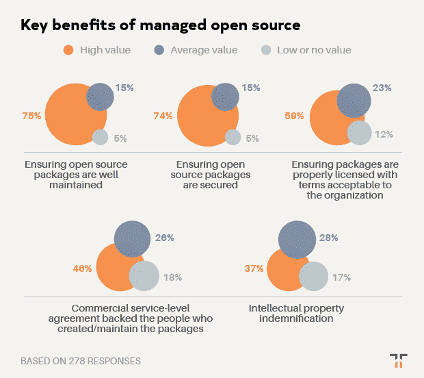

# 托管开源方法的主要优势

> 原文：<https://thenewstack.io/the-key-benefits-of-a-managed-open-source-approach/>

 [克里斯克

克里斯是 Tidelift 的营销主管。Chris 在创建开源技术公司方面拥有超过 20 年的经验，包括在 Red Hat 和技术品牌代理 New Kind 各工作了 10 年，在那里他帮助创建了 Ansible、NGINX 和 Anaconda 等品牌。](https://tidelift.com/) 

Tidelift 赞助了这篇文章。

*2019 年 6 月，Tidelift 和 New Stack 联合开展了一项专业软件开发人员调查。近 400 人回答了他们今天如何使用开源软件，是什么阻碍了他们，以及什么工具和策略可以帮助他们更有效地使用它。特别是，通过这次调查，我们有兴趣了解[受管开源战略](/how-managed-open-source-boosts-developer-productivity-and-saves-money/)如何帮助开发人员节省时间、加快开发速度并降低风险。*

在本帖中，我们分享了八个关键发现中的最后一个。如果你想在一个地方看到所有的结果，你可以点击下面的链接下载完整的调查报告。

### 发现 8:托管开源订阅的主要好处包括维护、安全和许可。

在我们之前的发现中，我们强调了开发人员在使用开源软件时面临的一些问题。开发人员喜欢使用开源软件，并且愿意更多地使用它。但是有几件重要的事情挡住了去路。

我们了解到他们对开源最大的担忧是可靠支持的可用性。他们今天不使用更多开源软件的最大原因是因为担心[组件在未来的维护情况如何](/what-is-the-biggest-concern-developers-have-about-open-source/)。我们了解了[维护挑战是如何消耗他们宝贵的代码编写时间的](/how-much-time-do-developers-spend-actually-writing-code/)。我们还了解到[无人维护或维护不足](/the-thorniest-open-source-maintenance-challenges-developers-face/)和[不可接受的许可组件](/the-most-important-factors-when-choosing-a-new-open-source-project/)会在组织中造成的破坏。

那么，开发人员如何应对这些挑战，以便利用开源的诸多优势，并在他们的组织中更有效地使用它呢？

一个答案是采用一种受管理的开源策略。托管开源提供了一种方式来帮助组织更好地管理他们使用的所有开源软件，确保它是最新的、安全的和维护良好的，同时提供标准的商业保证，如服务级别协议下的支持和知识产权赔偿(您可以在此了解更多关于[托管开源 Tidelift 的方法需要](https://tidelift.com/))。

我们向我们的调查对象解释了受管开源的概念，以便了解受管开源方法的哪些主要优势最吸引他们。

虽然受访者认为所有的好处都是值得的，但最有价值的应该不会让那些读过之前调查结果的人感到惊讶，因为它们直接解决了开发人员在使用开源组件时面临的许多挑战。

托管开源订阅最有价值的好处是，它有助于确保开源包在未来得到很好的维护。四分之三的受访者认同这种收益要么是高价值，要么是极高价值。

> 托管开源订阅最有价值的好处是，它有助于确保开源包在未来得到很好的维护。

紧随其后的是确保开源软件包的安全性，74%的人认为这种好处具有极高的价值或很高的价值。这也是评价极高价值(38%)最多的好处。

托管开源订阅的第三个最有价值的好处是确保组件拥有组织可接受的许可证，59%的受访者称这具有极高的价值或极高的价值。

拥有 1，000 多名员工的公司更有可能认为托管开源订阅的所有元素都是有价值的，但安全性表现突出，有 56%的公司报告说它非常有价值。

这项调查的证据是明确的。开发人员渴望更好地利用开源组件。但是在维护、安全和许可方面存在一些关键问题，需要加以解决。

一个[托管开源战略](/how-managed-open-source-boosts-developer-productivity-and-saves-money/)可以解决许多这样的问题，使开发者比以往任何时候都更容易扩展他们对开源的使用，提高他们对他们所使用的开源的信心，并获得时间专注于真正推动他们业务的重要工作。

想在一份报告中获得完整的调查结果吗？[让他们现在就过来](https://tidelift.com/subscription/managed-open-source-survey)。

## 关于本次调查

2019 年 Tidelift 管理的开源调查于 2019 年 6 月 24 日至 7 月 7 日进行。参与者通过 Tidelift 和新的 Stack 电子邮件列表和社交媒体联系。我们筛选了受访者，以确保他们在工作中使用开源构建应用程序，完整的调查样本是 369 名受访者。

*感谢新的堆栈，特别是 TNS 研究部负责人 [Lawrence Hecht](/author/lawrence-hecht/) ，帮助分析和产生这些发现。*

来自 Pixabay 的 Myriam Zilles 的专题图片。

<svg xmlns:xlink="http://www.w3.org/1999/xlink" viewBox="0 0 68 31" version="1.1"><title>Group</title> <desc>Created with Sketch.</desc></svg>