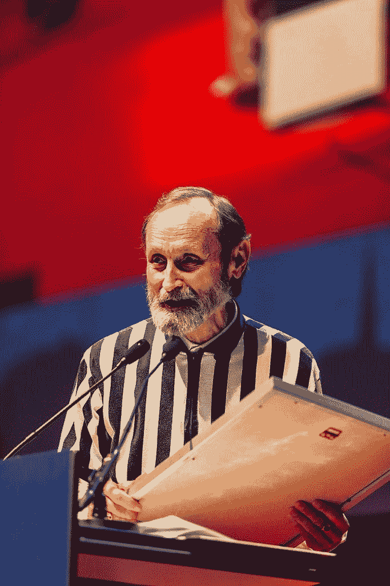

# “25 美分硬币之王”为他的电子游戏记录辩护

> 原文：<https://thenewstack.io/the-king-of-quarters-defends-his-video-game-records/>

视频游戏可能代表了极客的秘密文化，一个神奇的地下世界让我们许多人第一次接触到了计算机。这种魅力在 2007 年备受喜爱的纪录片《金刚之王:一把硬币》中得到了体现，这部纪录片展示了大金刚的世界冠军比利·米切尔(Billy Mitchell)面对一位坚定而认真的教师史蒂夫·威伯(Steve Wiebe)的挑战。

这部电影的口号？“当一个需要赢的失败者面对一个拒绝输的胜利者，会发生什么？”

https://www.youtube.com/watch?v=8hBs2oFjSWk

随着记录的出现和消失，电影对他们史诗般战斗的描绘仍然有着美好的回忆。但是整个遗产都岌岌可危吗？

在过去的 18 个月里，人们对比利·米切尔的一些高分、这部纪录片的准确性，甚至是世界纪录视频游戏的评判方式提出了新的质疑。因此，当 54 岁的前大金刚冠军比利·米切尔(Billy Mitchell)本月最终捍卫自己的声誉时，赌注似乎不仅仅代表着一生的视频游戏记录，以及视频游戏界标志性人物的声望。也许极客文化本身正处于危险之中，一场全新的戏剧正在*的非虚拟*世界上演，载入《吉尼斯世界纪录》，很快，很可能在一个非常真实的法庭上上演。

### 成为比利的重要性

《牛津美国杂志》2015 年的一篇简介回忆了年轻的比利·米切尔[如何在他父亲位于佛罗里达州好莱坞的餐厅](https://www.oxfordamerican.org/magazine/item/622-the-perfect-man)里玩电子游戏长大的。它描述米切尔成为“有史以来最有知识和最熟练的吃豆人玩家，在机器中投入 25 美分硬币”和“可能是有史以来最伟大的街机视频游戏玩家。”它甚至指出，1985 年“吉尼斯世界纪录”将《吃豆人》、《吃豆人小姐》、《大金刚》、《小金刚》、《蜈蚣》和《汉堡时间》的世界最高分记入米切尔的名下。

但是 30 年后，他们的记者发现米切尔仍然武断地谈论着《吃豆人》中四个鬼魂的独特个性。他们的文章指出，到 1983 年，米切尔已经了解到，在吃豆人的第 20 关之后，接下来的 234 关都是完全一样的——而且有“许多”地方，你可以简单地把你的吃豆人停在鬼魂永远找不到他的地方，“然后休息一下，吃个三明治，上个厕所，等等。”但最重要的是，它还描述了他和一个朋友如何破解了《吃豆人》神秘的最后一关的秘密，在这个游戏中，屏幕分成了两个游戏——左边的一个是普通的《吃豆人》游戏，而右边的一个是看似不可能的“文本和符号的混乱”——最终将米切尔引向了世界上第一个完美的《吃豆人》游戏。

但米切尔在《大金刚》中的高分为他在电子游戏史上赢得了特殊的地位，并在 2007 年的纪录片《金刚》中扮演了重要角色从纪录片中的片段来看，米切尔完美的自信可能会令人恼火。它显示米切尔接电话“世界纪录总部。我能帮你吗？”当一个脱口秀主持人问比利他怎么样时，比利回答“我很好。你没读过？”但这部电影似乎也将米切尔设定为一个不可战胜的恶棍，而一个倒霉的中学科学老师试图最终成为某方面的佼佼者。(在电影的高潮部分，电影制作人播放了莱昂纳德·科恩的不祥台词，“[大家都知道骰子已经装满了](https://www.youtube.com/watch?v=Lin-a2lTelg)……”)

米切尔后来[告诉 MTV 新闻](http://www.mtv.com/news/1560691/ex-donkey-kong-champ-finally-speaks-after-getting-bruised-by-new-doc/)“他们把史蒂夫描绘成一个居家男人，我猜他们把我描绘成一个枪杆子。”

## **故事的其余部分**

这部电影以史蒂夫·威伯最终创造了新的世界纪录而告终。但是四个月后——就在这部电影全国公映的前几周，米切尔宣布他再次打破了威伯的最高分。“这是前所未有的真实性，”米切尔[告诉 MTV 新闻](http://www.mtv.com/news/1565744/donkey-kong-king-reclaims-top-score-and-hes-got-witnesses-to-prove-it/)，因为它被来自 Twin Galaxies 的高级裁判现场验证，Twin Galaxies 是世界视频游戏高分的官方保管人。

沃尔特·戴，这位说话温和、会弹吉他的视频游戏裁判出现在纪录片中

他们报告说，米切尔甚至让位于华盛顿州雷蒙德市的任天堂美国总部对游戏机的内部电路板进行了鉴定，然后用一个清楚标明来自任天堂的信封寄回给他。然后，随着摄像机的转动，“米切尔把电路板从包装中取出，放入一个‘大金刚’橱柜中，只有在一名保安、一名公证人和附近 GameStop 的一名经理观看时才这样做。”然后，他仅在第二次尝试中就创造了新的世界纪录。

这一新纪录一直保持到 2010 年被纽约整形外科医生汉克·钱打破。

根据孪生星系的新闻稿，比利让这个记录保持了整整四个月。但是“在两个孪生星系裁判的监督下，一台摄像机记录着操纵杆的每一个动作，Mitchell 连续玩了将近 6 个小时[，直到他打破了两项世界纪录](https://www.businesswire.com/news/home/20100813005120/en/Billy-Mitchell-Video-Game-Hall-Famer-Reclaims)——一项是大金刚，另一项是小金刚。

五个星期后，史蒂夫·威伯真的回到了现场，并为自己夺回了大金刚的记录——这促使《时代》杂志讽刺道，“现在，[世界](http://techland.time.com/2010/09/20/steve-wiebe-back-on-top-reclaims-donkey-kong-world-record/)一切都好。”他们的作品似乎证明了纪录片的叙事仍然坚持比利·米切尔是你想要失去的人。“为维贝欢呼三声，他证明了坚持总会有回报，即使你不得不失去一些自尊，流下几滴眼泪来实现你的梦想。”

但据 Kotaku 报道，不到一个月之后，Chien 从 Wiebe 和 Mitchell 手中夺回了他的纪录，Chein [在接下来的四年里继续创造更高的纪录](https://kotaku.com/a-new-world-record-ends-hank-chiens-reign-as-donkey-kon-1631455818)，直到他们在 2014 年被新人 Robbie Lakeman 击败，后者在 2018 年 2 月创造了更高的纪录。

然后在 2018 年 2 月，米切尔被指控伪造他的一些高分比赛的录像带。双子星系不仅剥夺了他那些创纪录的头衔，还剥夺了他的所有记录(促使吉尼斯世界纪录也删除了比利的所有记录)。

## **撤销和反驳**

指控称，比利创纪录的游戏片段包括带有泄密标志的屏幕，看起来像是来自经典街机游戏摊位之外的其他地方，这表明这些片段实际上是在 MAME 硬件模拟器上创建的(这将使作弊变得容易得多)。比利坚称事实并非如此，并补充说他需要一段时间来理清指控的所有技术细节。

[https://www.youtube.com/embed/mjtn3EEG65Q?feature=oembed](https://www.youtube.com/embed/mjtn3EEG65Q?feature=oembed)

视频

这个月，米切尔终于做出了重大举动，向[公布了一份 156 页的文件包](https://docs.google.com/document/d/1lGODhaCGZ_ZLCwMHJS74ZNE0YrI5uD_yjxsTilYb9Ls/edit)来支持他的主张。来自洛杉矶曼宁卡斯律师事务所的一封信也要求吉尼斯世界纪录和双子星系纪录保持者在 9 月 23 日星期一之前撤回“诽谤”言论。

它指出，2019 年版的吉尼斯世界纪录甚至将米切尔标志性的完美游戏“吃豆人”降级为一个名为“从未有过的纪录”的新部分——这是一个甚至没有受到质疑的高分表现。

比利在 1999 年创下了他在传奇游乐场的记录，那里的楼层经理之前是一艘核动力潜艇的领航员，并拥有永久的最高机密许可。

米切尔的文件声称有“法庭证据”显示他有争议的大金刚游戏的磁带“很有可能被篡改”首先，这些磁带来自比利最严厉的批评者之一德韦恩·理查德，他在 2011 年发了一封电子邮件，发誓“我有一个扳倒他的总体计划。”证据包还声称两名证人——其中一人拒绝作证——被比利的宿敌要求帮助他们伪造一盘显示 MAME 增强型视频游戏的录像带。

当比利的一名调查人员后来向理查德索要录像带的副本进行审查时，他得到的回应是“你不是我的朋友，别再烦我了。”

米切尔的文件还引用了双胞胎星系的郄佳朝大厅的评论，承认他不能确认有争议的视频是否事实上来自原始表演。米切尔认为，他们拍摄的他 1050200 分表演的镜头现在已经有了边框，“尖叫着说它已经通过了编辑。”

数据包发现更多矛盾。调查人员声称，有证据表明，米切尔的磁带显示，MAME 的特定版本被用来制造高分——在版本. 116 和. 121 之间——通过在屏幕上出现一种被称为“大梁手指”的人工制品。有那么一会儿，只有两个马里奥的大梁画在屏幕的上方，倾斜的大梁确实让人联想到手指的形状。只有一个问题。那些版本的软件是在比利已经达到他的 1，050，200 的高分之后*才发布的。*

文件称，这表明录像带肯定被篡改过，“因为无论是比利·米切尔，还是任何与他有关的人，都没有时间旅行的能力。”

在至少一次展示这些致命镜头的活动中——在米切尔的记录已经被撤销之后——双子星系的郄佳朝音乐厅显然无意中发现了一个令人费解的 24 帧序列，而不是预期的 8 帧。

[https://www.youtube.com/embed/Iirf4_jiX0Y?start=12884&feature=oembed](https://www.youtube.com/embed/Iirf4_jiX0Y?start=12884&feature=oembed)

视频

但比利的整个证据包就像是在电子游戏记录的历史中穿行。也许最令人心酸的证词来自克里斯·艾拉，他是帮助米切尔在《吃豆人》中获得世界上第一个满分的老朋友。“所有这一切在我的脑海中非常清晰，包括目击者和媒体报道，因为它在我们成长的文化中非常重要，并帮助塑造了…

“我们共同经历的所有善意，有些人出于自己的原因选择忘记或忽略，这非常令人难过。”

* * *

# WebReduce

<svg xmlns:xlink="http://www.w3.org/1999/xlink" viewBox="0 0 68 31" version="1.1"><title>Group</title> <desc>Created with Sketch.</desc></svg>