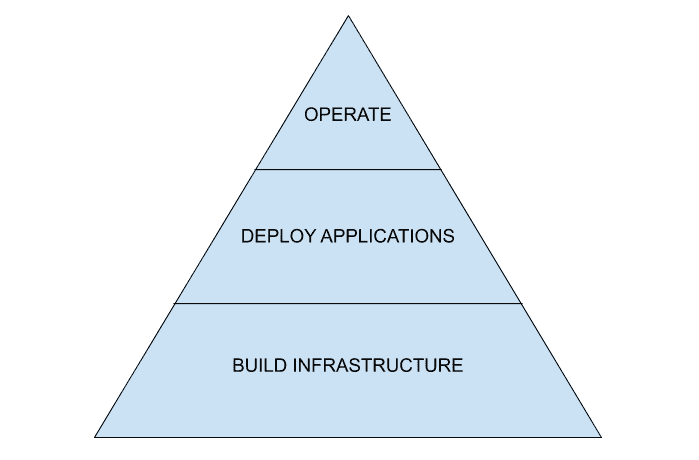

# 库伯内特的需求层次

> 原文：<https://thenewstack.io/the-kubernetes-hierarchy-of-needs/>

 [乔希·格罗斯

乔希·格罗斯是将新兴技术与商业价值联系起来的专家。他将有远见的技术专家转变为推动创新的变革推动者。Josh 与硅谷内外领先的工程和运营专业人士合作，提供推动业务发展的平台和客户体验。在过去的 10 年里，他与从预营收初创公司到上市企业的各种公司合作，以提高销售效率并发现关键的市场机会，包括 Cisco WebEx、Pertino(被 Cradlepoint 收购)、Dell EMC、Avi Networks(被 VMware 收购)。Grose 现在正在 Omnition.io 建立销售组织，这是一家与领先的 sre 和应用程序所有者合作的初创公司，旨在优化他们的微服务应用程序的性能并提高可用性。](https://www.Omnition.io) 

在我的职业生涯中，我很幸运能与硅谷一些最聪明的人和最前沿的公司一起工作。在过去的几年里，Kubernetes 一直主导着我的客户。我认识的大多数工程师都争先恐后地参与 Kubernetes 的项目，希望成为这场运动的一部分，增加他们的市场价值。但是，即使疯狂地采用 Kubernetes，我也目睹了许多项目远远没有达到它们最初的目标。

事实是 Kubernetes 是复杂的。生态系统正在快速进化。这导致许多团队将注意力转移到技术堆栈上。团队最终会对每个单独的组件和/或 CNCF 项目进行辩论，而不是将产品交付给客户并根据反馈进行迭代。

在所有这些失败中，成功的 Kubernetes 部署模式已经开始出现——更具体地说，这些公司用来将想法从白板变成产品的方法。我已经将这些知识整合到我所谓的“库伯内特需求层次”中

Kubernetes 的需求层次结构并不关注单个的技术组件，它是一个程序系统，使团队关注客户的可交付成果，并保持一致以实现业务成功。其目的是在不断变化的底层技术之上再上一层楼，并专注于确定需要解决的阶段，以便部署 Kubernetes 并在生产中编写代码。

Kubernetes 的需求层次由三个连续的阶段组成:构建、部署和运行。这个顺序对于建立势头是绝对重要的。在每个阶段，在进入下一个阶段之前，客户必须验证一个最低限度的可行产品(或可演示的功能)。这完成了三件事:

1.  作为一种强制功能，将重点放在可交付成果而不是个别技术上。
2.  通过实现定义明确的里程碑来获得企业和客户的支持。
3.  在您的团队和主要利益相关方之间建立明确的期望，形成推动进度和效率所需的持续反馈循环。

让我们更详细地看一下层次结构的每个阶段。

**建设基础设施**:你必须部署 Kubernetes。这不仅是展示进展的第一个里程碑，而且也给你第一次真实世界的经验，让你知道如何操作和与系统互动。您和您的团队将学习术语，建立您需要的可信度，并在部署阶段教授您将加入的开发人员。在这一点上，无论您选择部署普通的 Kubernetes 还是像 GKE 这样的托管服务都无关紧要。这一切都是为了达到一个可以提供服务的状态。

我经常看到开发人员在构建他们的 Kubernetes 环境之前就试图回答后期阶段的问题。“我应该与 Istio 整合吗？我们将如何跨数据中心的集群提供服务发现？”解决这些问题引入了不必要的复杂性。

请记住，这个阶段是关于交付一个可用的集群，并展示您的团队对其组件的掌握。你做得越快，你的团队就越可信，你的客户就越想和你合作。

**部署应用**:这是您开始考虑客户如何在平台上提供应用的地方。在构建任何东西之前，与您的客户一起定义基本要求。然后按规格建造。

例如，如果它是一个 12 因素、无状态的应用程序，那么没有必要立即提供存储持久性的解决方案。与其关注如何解决租用问题，不如先关注用户如何与 API 和推送代码进行交互。一旦你理解了应用的生命周期和你客户的能力，CICD 管道就变得相关了。

令人惊讶的是，在许多情况下，应用团队在过渡到 Kubernetes 时第一次体验微服务。这对你和你的团队来说是一个充当向导的巨大机会。保持技术简单，使这个过程更容易调试和优化。不要强制执行可能会产生额外学习曲线的流程或工具使用。

如果你的客户不愿意与你合作，他们会放弃这个平台，影响你团队的品牌和你招募其他内部客户的能力。

**操作**:恭喜！您的用户现在可以自由地推送代码，并对他们可以试验和实现更改的速度赞不绝口。您已经明智地选择了平台上的人员，确保您的团队了解客户需求，只选择适合现有平台功能和规模的应用程序。

不幸的是，你的工作还没有完成。您现在正亲身体验微服务的缺点。如果您的团队像我合作过的大多数团队一样组织，那么核心架构师和 sre 会随时待命处理每一个达到 PagerDuty 的警报。您发现大多数基于指标的警报不再相关。它们被它们所依赖的其他服务触发。更不用说，这是 SLO 的狂野西部，您将与应用程序团队携手定义它们。在一次事故中，您会发现大部分的挫折都是定位每个服务的定制仪表板来验证 sli。最终的结果将会是一些你曾经参与过的最大的作战室。

不要让这种事发生在你身上。在这里，您需要确定事件响应的优先级并建立 SLO。与您的客户合作，清楚了解客户如何监控他们的应用程序，哪些工作流最重要，以及他们是否有关联的(准确的)SLO。您的团队将不再能够成为每个服务的细微差别和失败模式的专家。

有成熟的技术和 CNCF 项目用于日志记录和度量，这两者在这些环境中仍然扮演着重要的角色。跟踪在监控微服务方面也取得了很大进展，因为它能够提供端到端的可见性、依赖关系图和性能分析。我合作过的最好的客户设计了可观察性数据管道和最佳实践，使服务所有者能够构建更高性能、更具弹性的应用程序。您可能实际上决定只负责监控基础设施。这也没关系，但要确保一开始就设定好期望。

这让我想起了最初是什么让我们来到这里。首先资助这个项目是有商业原因的。归根结底，这是为了更快地提供客户体验。

从业务方面考虑一下。当你的公司决定发布一个新产品时，他们基于客户的需求。这些需求驱动了它们所提供的特性的优先级。对何时交付什么有着共同的理解，客户的反馈和采纳决定了接下来会发生什么。早期的产品采用推动了持续的投资和产品的发展。以同样的方式对待你的平台。使用 Kubernetes 的需求层次来保持以客户为中心，并提供一个能够提供真正客户价值的平台。

<svg xmlns:xlink="http://www.w3.org/1999/xlink" viewBox="0 0 68 31" version="1.1"><title>Group</title> <desc>Created with Sketch.</desc></svg>