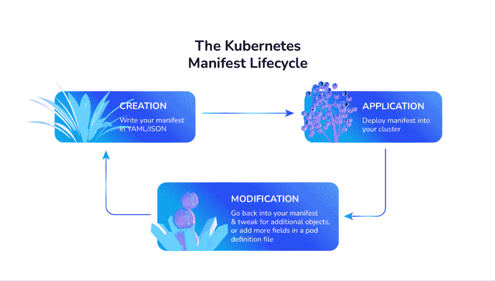
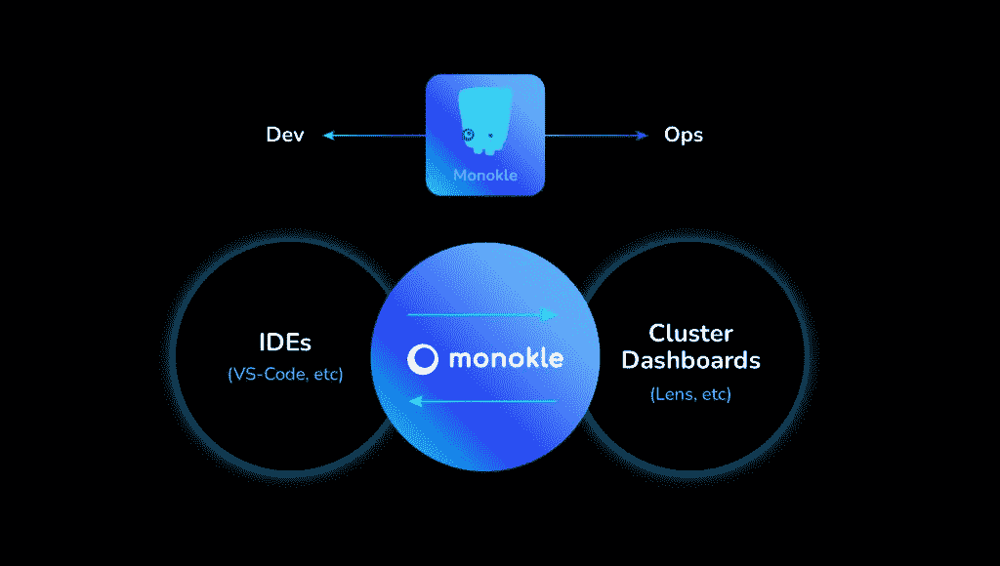

# 库贝奈特人的生命周期经常被忽视

> 原文：<https://thenewstack.io/the-kubernetes-manifest-life-cycle-too-often-overlooked/>

Kubernetes 完全改变了应用程序的交付和运行方式。如今，我们构建速度更快，不断发布代码，并以我们从未想象过的方式管理巨大的工作负载。但是，随着越来越多的组织采用和接受这种新的工作方式，复杂的云原生环境发展如此之快，以至于很难跟上。

 [克里斯蒂安·莱特

Christian 是 kube shop Monokle 的技术产品经理。Christian 在墨西哥、阿根廷和瑞士的不同行业担任安全和基础设施工程师。](https://kubeshop.io/people/christian-lete) 

Kubernetes 是帮助提高应用程序部署速度和可靠性的关键转变之一。然而，很少有人关注 Kubernetes 清单。

这些 YAML 文件描述了资源—从服务到部署和 pod 等。—您要创建的对象以及它们应该如何在集群中运行。即使在这里，事情也不简单。

不断增长的云原生生态系统意味着需要管理更多的工具和更多更大的清单，以及具有不同语法的代码的爆炸式增长，这对工程师个人来说越来越具有挑战性。更不用说跨微服务架构部署的固有挑战，在这种架构中，孤立的团队可能不知道服务的上下游变化。

## Kubernetes 清单管理

让我们仔细看看上面概述的 Kubernetes 清单生命周期。

1.  **创建** —清单的创建和编辑阶段包括几个任务:
    *   **验证**您的货单
        *   YAML 语法和目标 K8s 模式
        *   合规和政策(公司、OPA、安全等。)
        *   约定(命名、元数据等。)
        *   参考资源的完整性
        *   Helm、Kustomize 等工具的模板验证
    *   **版本控制**
        *   与版本相关的工作流；分支、评论等。
    *   **预览/验证/修复**
        *   如果您使用 Kustomize 或 Helm 之类的工具，您可能希望预览和验证这些工具生成的清单，并可能调试和修复相应模板中的任何错误。
2.  **应用** —与将清单部署到目标集群相关的任务
    *   **生成**要部署的清单，如果你使用 Kustomize/Helm/etc。
    *   **针对目标集群验证**清单中的对象引用
    *   **将您的清单与集群中的任何现有版本进行比较**,以评估更改的影响
    *   **应用回滚** —手动或可能使用基于 CI/CD/GitOps 的自动化方法
3.  **修改** —部署后，您通常需要:
    *   **调试**清单如果事情不按预期工作
    *   **修改集群中的**清单来解决当前的问题
    *   **停用**(删除)清单，当不再需要时，删除它们和它们对应的对象

今天用于执行上述所有任务的生态系统分为两个主要部分——用于编写和编辑清单的工具/集成开发环境(ide ),以及用于监控集群中运行的清单的集群检查工具。在任何一方，最流行和最常用的工具是用于编写的 Visual Studio 代码和用于监视的 Lens。

**Visual Studio Code** 是微软开发的精简代码编辑器，专注于软件开发，可能支持调试和版本控制等操作。它旨在为开发人员提供快速代码构建调试周期所需的工具。它是在麻省理工学院的许可下作为自由软件发布的。

**Intellij IDEA** 是另一个流行的开源 IDE，旨在通过智能编码辅助和人体工程学设计来最大限度地提高开发人员的工作效率。Apache 2.0 许可证中没有企业版。

**Lens** 为 Kubernetes 中运行的一切提供全面的情境感知。它旨在通过其用户界面降低 Kubernetes 集群运营人员的准入门槛。它也可以在麻省理工学院的许可下使用。

## 现有 Kubernetes 清单工具面临的挑战

像 Visual Studio 代码或其他通用 ide 这样的工具之间有一个根本的差距，它们没有很强的 YAML 语法概念，更不用说可以创建和编辑清单的对象、集群或其他 Kubernetes 构造，以及可以检查从清单创建并在集群中运行的对象的集群仪表板(如 Lens)。

虽然 VS 代码和 Intellij 使您能够轻松地编写清单，但它们在自动查找值或语法错误方面的能力有限。最重要的是，没有一个监控工具能够让您看到资源之间的关系和依赖关系。

如上所述，当前大多数解决生命周期特定部分的工具都是通过扩展/插件来实现的。不幸的是，将需要许多不同的插件来覆盖所有与清单相关的任务，并且这些插件不是从头开始构建来为 Kubernetes 清单生命周期的不同任务提供一致和连贯的支持，也没有为这些目的提供集成和平滑的 UI。

对我们来说，这是一个需要解决的重要挑战——我们希望让清单的创建、应用和修改变得更加简单和高效，以节省工程师宝贵的时间和精力。当然，还有压力。我们真的想帮助降低 YAML 诱发的心跳加速！

## Monokle 适合哪里？

当我们仔细观察这种情况时，我们意识到没有工具可以在整个生命周期中专门和一致地针对清单相关的工作流，这使得初学者和专家都很难在日常清单和 Kubernetes 相关的任务中尽可能地高效工作。

今天，您可能必须在不同的工具集之间切换，例如 IDE、CLI 语法或安全验证器等等，以全面完善与清单相关的工作流。

Monokle 专注于改进典型的 Kubernetes 工作流，这些工作流会产生令人头痛的问题，尤其是对于初次进入 Kubernetes 的人，但高级用户也可以从中受益。

### 单色特征:

*   立即识别并修复 YAML 语法错误。
*   Kubernetes 资源及其关系的快速概述。
*   调试并验证 Kustomize 和 Helm 的输出。
*   查找并修复配置错误。区分本地和远程资源并部署它们。
*   易于使用的编辑器和模板确保最佳实践和一致性。
*   验证工具的集成:例如，开放策略代理，它侧重于遵从性。

## 弥合库伯内特人的差距

我们希望帮助工程师在编码时快速获得所有清单及其包含的资源的高级视图，就像您在部署后场景中在 Lens 中一样。

但是就像 VS Code 和 IntelliJ IDEA 一样，我们也希望让工程师能够轻松地编辑资源，快速找到问题，而不必学习 YAML 语法，根据您的集群区分资源，预览和调试 Kustomize 或 Helm 生成的资源，等等。

这就是我们开发 Monokle 的原因，它正好位于编辑和可视化空间之间。它与 ide 和集群仪表板一起工作，帮助工程师高效地处理与清单相关的工作流。它旨在显著简化工作流程，使工程师能够在一个工具中可视化地管理整个 Kubernetes 清单生命周期。

### 如果你刚刚开始你的库伯内特之旅

对于喜欢使用命令行或 ide 的工程师来说，我们认为您仍然应该使用您喜欢的方法来编写清单。Monokle 只是在上面添加了一个支持层，以帮助突出对象的 YAML 语法错误和依赖关系的问题。

### 为了你的下一步

对于那些喜欢集群仪表板的人来说，Monokle 可以补充现有的生态系统，更进一步识别资源之间的关系，这样您就不必在代码中搜索关系。此外，关系会实时更新，任何断开的链接都会以警告的形式突出显示。

### 库伯内特生态系统的一部分

作为一个云原生项目，Monokle 支持 Kubernetes 工具，如 Kustomize 和 Helm，允许工程师共享资源和模板，并定义跨多个资源共享的公共值。

它还使工程师能够查看 Kustomize 文件或舵图，而无需将它们部署到正在运行的集群中——这是测试的一大进步，因为目前在不通读相当大的 Kubernetes YAML 文件的情况下调试 Kustomize 相当困难。谁真的想整天读 YAML 呢？

## 请告诉我们您面临的与清单相关的挑战？

我们真的很想听听你的想法。类似这样的内容对您的清单相关工作流有帮助吗？

### Monokle 入门

下载 Monokle 并试一试。然后让我们知道你是如何找到它的！我们总是很高兴从我们出色的社区获得反馈。在我们的[不和谐频道](https://discord.gg/6zupCZFQbe)上找到我们。

<svg xmlns:xlink="http://www.w3.org/1999/xlink" viewBox="0 0 68 31" version="1.1"><title>Group</title> <desc>Created with Sketch.</desc></svg>