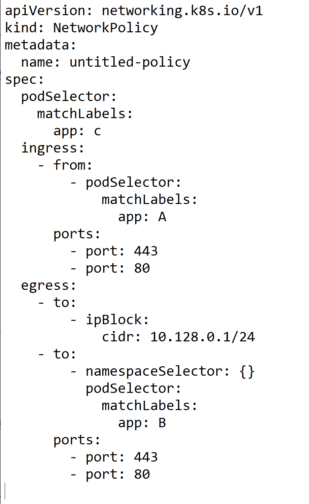
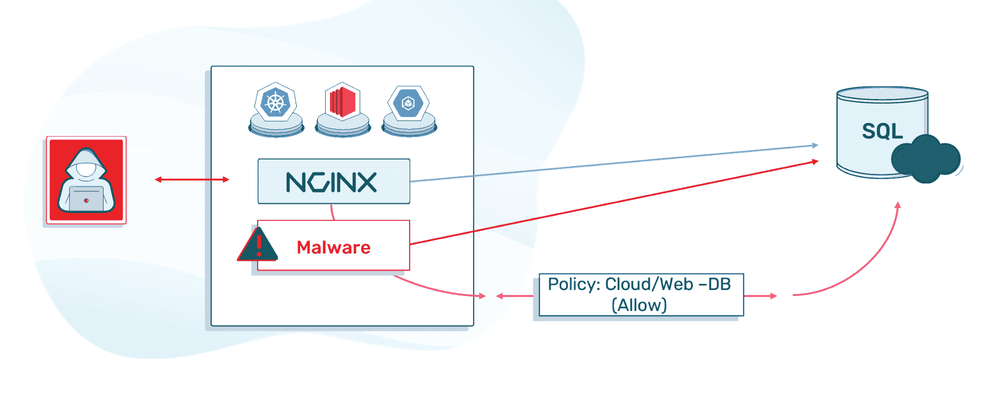
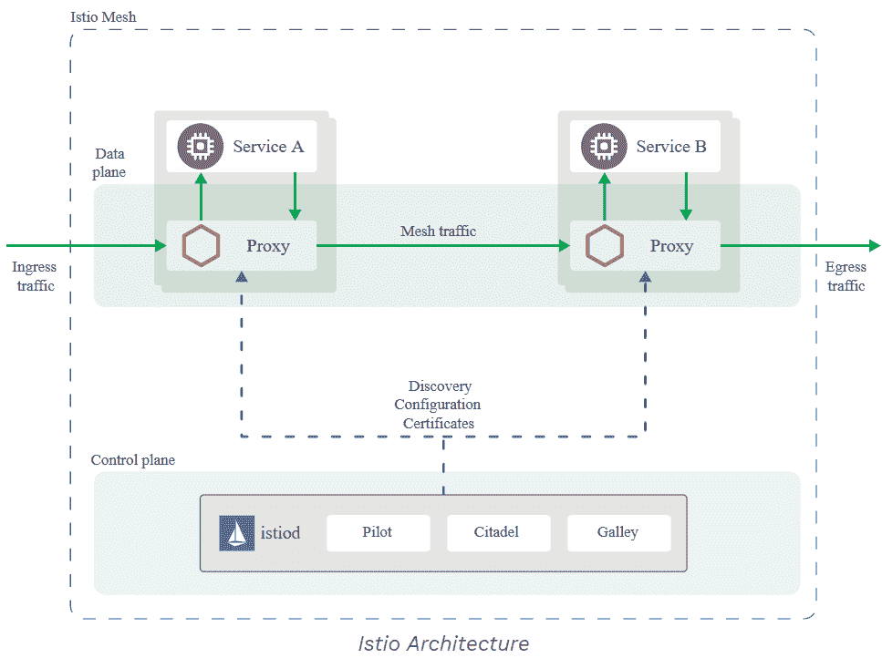

# Kubernetes 网络安全效应

> 原文：<https://thenewstack.io/the-kubernetes-network-security-effect/>

Kubernetes 有一个用于管理网络安全的内置对象:NetworkPolicy。虽然它允许用户通过入口和出口策略来定义 pod 之间的关系，但它是基本的，需要非常精确的解决方案 ip 映射，这种映射会不断变化，所以我交谈过的大多数用户都没有使用它。

## **还卡着防火墙？**

 [阿米尔·考尚斯基

阿米尔是 ARMO 公司的产品副总裁。他是一位具有创新和创造力的技术领导者，在产品生命周期的所有领域都有 20 多年的经验:产品管理、业务开发、技术服务、质量保证、IT 和软件工程。他在复杂产品和解决方案的开发和部署方面有着良好的记录，尤其是在网络安全领域。](https://www.linkedin.com/in/amir-kaushansky-9a6a5056/) 

过去，网络安全策略是用 IP 地址和子网来定义的。您将定义源和目的地，然后是目的地端口，然后是操作和跟踪选项。多年来，防火墙不断发展，变得具有应用感知能力，增加了高级恶意软件防御等功能。它不再是防火墙，而是一个完整的网络安全解决方案。

然而，大多数网络安全解决方案(即使在今天)都使用 IP 地址和范围作为源地址和目的地址。这是当这些设备转移到云时的第一个挑战。在这样一个快速变化的环境中，IP 地址一直在变化，你如何定义源/目的 IP；一个 IP 被分配给一个数据库工作负载，下一分钟又被分配给 web 工作负载。此外，如果您想了解云并在网络地址转换之前看到连接，您必须在应用程序内部。在 Kubernetes 中，在大多数情况下，当一个 pod 连接到外部资源时，它将经过网络地址转换——这意味着目的地将把源 IP 视为工作节点地址，而不是 pod。

对于基础设施即服务(IaaS)云部署，大多数公司可以通过在虚拟机(VM)上安装代理来解决这一挑战。

但当谈到 Kubernetes 时，它就是不起作用。为什么？

*   Kubernetes 中的一个普通 pod 只有几兆字节，因此您不能在一个 pod 中部署一个全标记的网络安全解决方案。将它放在 Kubernetes 之外可以在一定程度上解决南北向的问题(进出网络的流量)，但不能解决东西向的问题(网络内的流量和集群内的连接)。
*   Kubernetes 是类固醇上的云——豆荚迅速扩大和缩小。IP 分配发生变化，规则无法绑定到 IP 地址和子网。
*   不需要完全标记的网络安全。比如 Kubernetes 内部没有做深度包检查的要求。大多数公司都在寻找东西微分段——基本上是防火墙。

幸运的是，Kubernetes 是用 NetworkPolicy 对象创建的。该对象将每个 pod 单独视为一个许可者，您可以定义入口策略和出口策略。这两种策略都可以利用 IP 地址、子网(CIDR)和标签。不幸的是，Kubernetes 在本地安全策略中不支持 FQDN(完全合格的域名)。这意味着不可能制定一个限制访问 S3 或推特的政策。

网络安全由网络层实施，最常见的层是印花布、法兰绒和纤毛。根据设计，Kubernetes 网络是扁平的。一个名称空间中的一个微服务可以连接到另一个微服务，即使它在另一个名称空间中。

## **努力构建有效的 Kubernetes 网络政策**

您可能希望用户使用网络策略，但大多数用户并没有使用它。

创建网络策略是一项迭代任务:

1.  映射不同元素、访问应用程序的资源、应用程序连接的资源、端口和协议之间的通信。
2.  创建一个策略。
3.  运行应用程序并观察是否一切正常。
4.  找到并修复你错过的东西。
5.  每当您的网络或应用程序发生变化时，重复上述步骤。

问题是，在 Kubernetes 中，由 pods(微服务)组成的应用程序每天都会发生变化。您不可能与您的开发团队保持相同的步调—每次他们对应用程序进行更改时都要更新网络策略。

想象一下，你绘制了所有的通信模式，相应地创建了一个网络策略，一切都正常了。几个小时后，一名开发人员推出了一个新版本的微服务，该微服务使用了来自不同 pod 的 API，它停止了与现有 pod 和外部网站的通信。由于您忘记更新网络策略，您的新微服务停止工作。您不能调试错误，因为 Kubernetes 中没有网络日志。不仅如此，即使您成功地解决了这个问题，您可能仍然喜欢保留旧的策略，即允许新的 pod 与它停止通信的 pod 进行通信，从而使网络策略不正确，无法实现微分段目标。

最后，Kubernetes 没有可视化网络流量的内置功能，所以如果您中断了两个微服务之间的连接，祝您调试成功。

Kubernetes 网络策略是通过允许而不是阻止来配置的。这意味着，如果您想要阻止来自特定目标的单个对象，您需要选择不同的解决方案。

最后，最令人恼火的是，Kubernetes 网络策略的设置方式是，如果 pod A 和 B 需要通信，您需要为 pod A 定义出口流量，为 pod B 定义入口流量，这很容易出错，调试起来非常困难。

图 1:网络策略

在上面的例子中，我们展示了一个标签为“C”的 pod 的本地 Kubernetes 策略。该策略配置对象，以便 pod C:

*   连接到端口 443 和 80 上的 pod“A”
*   在端口 443 和 80 上初始化到 pod“B”的流量
*   将流量初始化为 10.128.0.1/24

大多数组织只是做南北网络安全(在集群之外)，并祈祷没有什么会破坏这种安全控制。

根据设计，Kubernetes 安全性也存在以下问题:

*   身份问题:如果带有两个容器的 pod A 连接到 pod B，pod B 会看到来自 pod A 的传入连接，但是它不知道是哪个容器创建了这个连接。这意味着没有办法在 pod 级别足够精细地实现安全护栏。因此，如果恶意软件在我的 pod 中运行，它将能够与其他 pod 通信。
*   清晰的连接:Kubernetes 中的所有连接都基于应用程序/开发人员编程。这意味着如果应用程序具有 HTTP REST API，攻击者可以拦截并解码通信(截至目前，大多数集群内通信都没有加密)。

该图展示了意图与实际流量的对比。网络管理员设置策略以允许网络到数据库的连接。他的意图是允许在 web pod 中运行的 NGNIX 与 SQL server 通信。但是，这也意味着在其中一个 web pods 上运行的恶意软件可以与 SQL server 通信。

## **伊斯蒂奥前来救援**

服务网格是控制应用程序不同部分如何彼此共享数据的一种方式。与管理这种通信的其他系统不同，服务网格是应用程序中内置的专用基础设施层。这个可见的基础设施层可以记录应用程序的不同部分交互得如何，因此随着应用程序的增长，优化通信和避免停机变得更加容易。

Istio 是当今最流行的服务网格解决方案。

为了克服我们到目前为止所讨论的设计问题，Istio 添加了一个边车容器，以便识别各个工作负载，并将东/西流量转移到 mTLS。现在，如果 pod A 连接到 pod B，pod A 和 B 将通过首先验证其证书来进行通信。恶意攻击者将无法拦截和解码流量。

这太棒了！但事实是，大多数组织仍然没有使用 Istio。事实上，2020 年末的最新 CNCF 报告表明，只有 30%的 Kubernetes 用户在使用服务网格(Istio 或其他)。这可能是因为 Istio 非常复杂，它有性能损失和延迟。

不仅如此，它还存在上述相同的身份问题，即如果恶意参与者进入 pod A 并创建了到 pod B 的连接，只要 Istio 策略允许，它仍将被允许访问。

图 2: Istio 1.9

在上图中，每个 pod 都有一个代理，它通过使用相互 TLS 隧道来保护来自原始容器的通信。可以看出，代理(特使)并不关心容器的身份。它可以是与其他服务通信的恶意容器，并被授予 Istio/Envoy 提供的身份。

## **Kubernetes 网络安全最佳实践**

尽管上述挑战相当有限，但仍有许多事情可以做。

Kubernetes 网络安全解决方案应遵循以下准则

*   **实施“零信任”**:每个微服务充当自己的许可者。因此，建议遵循零信任模型:不要信任，始终验证！由此每个请求在访问被批准之前被认证和授权。
*   **升级到 Mutual TLS** :为了加密不同微服务之间的通信，建议使用 Mutual TLS。这将确保即使主机上存在攻击者，它也无法拦截和解码流量。
*   提供网络可见性:你不能保护你看不见的东西。可见性是理解沟通模式的关键；不仅是工作的，还有不工作的，或者被丢弃的，等等。
*   **应用健壮的策略以满足快速变化**:当谈到策略语言时，使用一种处理微服务中不断变化的语言。在大多数情况下，更改将发生在集群内部。这意味着一旦设置了来自/去往集群的入/出流量，大多数更改将发生在微服务之间的通信中。

*要了解更多关于 Kubernetes 和其他云原生技术的信息，请考虑参加 5 月 4 日至 7 日举行的[kube con+CloudNativeCon Europe 2021–虚拟](https://events.linuxfoundation.org/kubecon-cloudnativecon-europe/)。*

<svg xmlns:xlink="http://www.w3.org/1999/xlink" viewBox="0 0 68 31" version="1.1"><title>Group</title> <desc>Created with Sketch.</desc></svg>