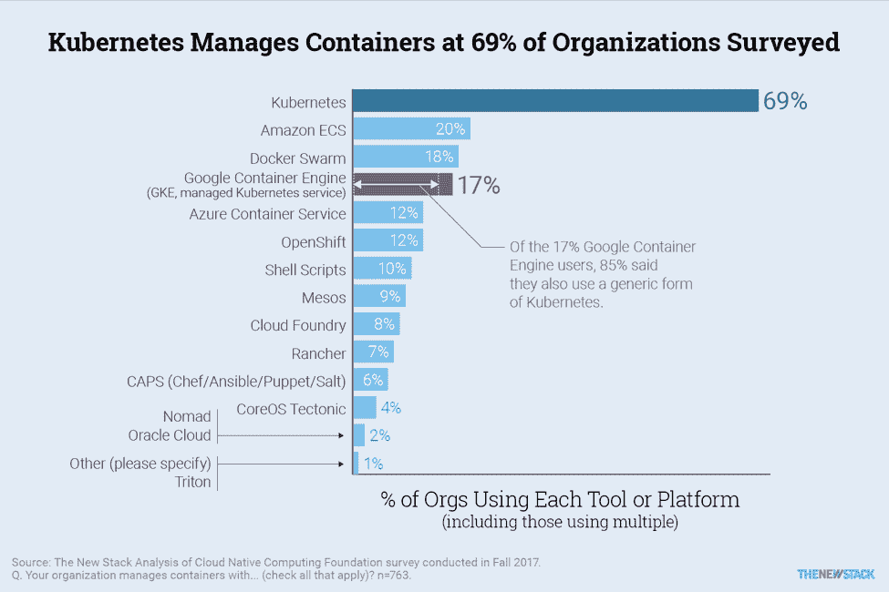
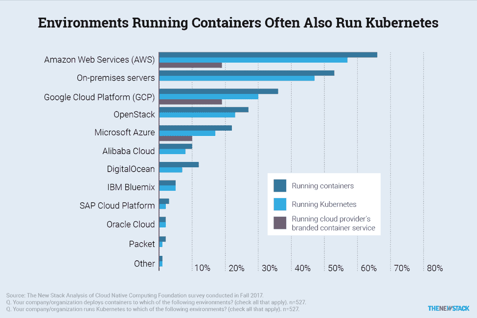
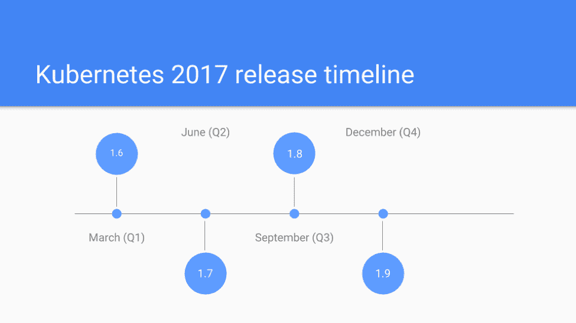

# Kubernetes 三周年纪念只是一个开始

> 原文：<https://thenewstack.io/the-kubernetes-third-year-anniversary-is-just-the-beginning/>

Linux 基金会赞助了这个故事。

很难相信 [Kubernetes 1.0](http://kuberneteslaunch.com/) 仅仅在三年前推出，而它的广泛采用可能会继续失控。

Kubernetes 生态系统确实是巨大的，许多组织无论是大的(想想[彭博](https://www.techatbloomberg.com/blog/bloomberg-awarded-first-cncf-end-user-award-contributions-kubernetes/))还是小的都在继续利用这个可能成为 IT 史上最成功的开源平台之一。

过去的一年对于 Kubernetes 作为一个平台的成熟及其大规模采用尤为重要。我们在下面重点介绍最突出的发展。

2018 年 3 月，Kubernetes 成为第一个获得[“已毕业”状态](https://www.cncf.io/blog/2018/03/06/kubernetes-first-cncf-project-graduate/)的 CNCF 项目。最近，Kubernetes 获得了 [2018 OSCON 最具影响力奖](https://kubernetes.io/blog/2018/07/19/kubernetes-wins-2018-oscon-most-impact-award/) [。](https://kubernetes.io/blog/2018/07/19/kubernetes-wins-2018-oscon-most-impact-award/)

## Google Cloud Next’17

### Kubernetes:云的 Linux

正如 Linux 基金会的执行董事 Jim Zemlin 最近在 Google Cloud Next’17 上所说的那样， [Kubernetes 是“云的 Linux](https://twitter.com/kubernetesio/status/840257886202683392)，反映了 Kubernetes 已经成为开源世界中速度最快的项目之一。

[新堆栈](https://thenewstack.io/data-says-kubernetes-deployment-patterns/)基于云计算本地计算基金会调查数据的最新分析显示，在容器领域也很难找到更成功的解决方案:

更重要的是，在使用容器技术的几乎所有情况下，Kubernetes 都是主导解决方案:

事实上，它的轨迹可以与 Linux 内核速度相媲美。

### 成长中的生态系统

 [伊霍尔·德沃雷茨基

Ihor 是云计算原生计算基金会(CNCF)的开发者倡导者，专注于开源社区中与 Kubernetes 相关的工作。他是 Kubernetes PM 特别兴趣小组(SIG-PM)的联合主席，致力于增强 Kubernetes 作为开源产品的功能。此外，Ihor 作为多个发布周期的功能负责人参与了 Kubernetes 的发布过程。Ihor 从 2005 年开始使用 Linux，拥有深厚的工程背景，负责与云计算领域、容器化工作负载和 Linux 系统紧密相关的项目。他最近的演讲包括在 Kubernetes 领导力和 Kubernetes 贡献者峰会、OpenStack 北美和 APAC 峰会、欧盟开源峰会、欧盟 ContainerDays、Google DevFests 和其他行业领先活动上的演讲。](https://www.cncf.io/) 

当然，如果没有开源社区的支持，Kubernetes 不会如此成功。虽然这是一个技术上复杂的解决方案，并且它解决了许多与容器编排相关的可能挑战，但它也不是一个灵丹妙药。例如，Kubernetes 没有单一的存储或网络解决方案，也没有监控、记录或包管理系统功能。与此同时，Kubernetes 是云原生世界的一个重要组成部分，它与作为这个生态系统主干的不同项目密切合作，并有机地互补。

Kubernetes 也是云本地计算基金会(CNCF)提供的一项技术。与此同时，除了 Kubernetes 之外，今天的 CNCF 还拥有超过 20 个不同的项目。虽然这些项目是独立的，并且有自己的治理、发布过程和功能范围，但是它们对 Kubernetes 社区也是有用的。

同时，云原生项目的全球生态系统要大得多。CNCF 已经成为[云原生景观](https://landscape.cncf.io/)中更大的一部分，它几乎涵盖了云原生世界中现存的所有技术。认证和教育项目也继续在 CNCF 提供的服务中扮演重要角色。

### 开放社区

一个充满活力的开发社区继续帮助 Kubernetes 成为一个非常成功的开源项目。在 Kubernetes 作为一个内部项目由谷歌创建后的短短几年内，Kubernetes 的[治理流程](https://kubernetes.io/blog/2017/10/kubernetes-community-steering-committee-election-results/)也为该平台的采用提供了支持。一个健康的社区是[任何成功的 source 项目](https://thenewstack.io/future-beyond-kubernetes-1-9/)的核心。

同时，开源社区不是“静态资产”。为了永久的成功和向前发展，任何开源项目都需要不断增长的贡献者来生存。这就是为什么 Kubernetes 社区正在致力于多个项目，专注于入职贡献者，包括 Kubernetes 指导计划、Kubernetes 贡献指南和[办公时间](https://kubernetes.io/blog/2018/03/expanding-user-support-with-office-hours/)，以及“会见我们的贡献者会议”、Outreachy 甚至[谷歌代码之夏(GSoC)](https://www.cncf.io/blog/2018/06/22/cncf-joins-google-summer-of-code-2018-with-projects-envoy-proxy-containerd-coredns-prometheus-kubernetes-and-rook/) ，这是世界上开源项目新贡献者最受欢迎和最知名的项目之一。一些杰出的贡献者也获得了行业认可。

## 版本、特性和路线图

Kubernetes 首先是一种技术。如果这项技术没有给组织带来如此深远的好处，这个项目显然不会如此成功。

Kubernetes 最重要的版本每年发布四次，每次都提供一组新的特性。补丁发布(提供安全补丁和错误修复)更加频繁，使代码库始终保持最新。

2017 年 Kubernetes 发布时间表示例

虽然 Kubernetes 的开发过程肯定不容易，但是 Kubernetes 的发布和规划过程更为复杂。今天，Kubernetes 不仅仅是一个技术项目，它还是一个可靠的产品，定义未来过程的[产品路线图](https://thenewstack.io/plotting-kubernetes-roadmap/)至少需要和开发过程本身一样的关注。

Kubernetes 对行业的影响是深远的。为了使其持续的采用率能够反映 Linux 的采用率，由于上述原因，它将需要开发人员社区、CNCF 和商业参与者的持续支持，他们将帮助为该平台铺平道路，以便它有一天成为 it 行业的主流组件。

*本文是即将于 8 月 29 日至 31 日在温哥华召开的开源峰会系列演讲的一部分。开源峰会将开源生态系统连接在一个屋檐下。它涵盖了基础开源技术；帮助生态系统领导者通过多样性授权峰会导航开源转型，并跟踪业务和合规性；并深入研究涉及开源的最新技术和最新趋势，包括网络、原生云、边缘计算、人工智能等等。这是开发人员、系统管理员、DevOps 专业人员和 It 架构师之间交流的绝佳机会，推动着技术的未来。*

云计算原生计算基金会是新堆栈的赞助商。

通过 Pixabay 的特征图像。

<svg xmlns:xlink="http://www.w3.org/1999/xlink" viewBox="0 0 68 31" version="1.1"><title>Group</title> <desc>Created with Sketch.</desc></svg>