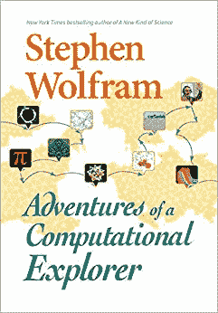

# 史蒂夫·沃尔夫勒姆最新的计算冒险

> 原文：<https://thenewstack.io/the-latest-computational-adventures-of-stephen-wolfram/>

在计算科学领域，史蒂夫·沃尔夫勒姆是我们最多产的思想家之一。在一生中让他的大脑在各种各样的主题上驰骋之后，本月他发布了他的新的思维拓展散文集，名为“[一个计算探险家的冒险](https://www.wolfram-media.com/products/adventures-of-a-computational-explorer.html)”

这本书里不止一篇文章触及了如何与外星文明沟通的诱人问题——无论是通过留守信标还是在实际对话中[，即使外星生命形式是*人造的*。但这最终是一个享受再一次观看伟大思想的机会——甚至可能找到一些灵感。](https://writings.stephenwolfram.com/2018/01/showing-off-to-the-universe-beacons-for-the-afterlife-of-our-civilization/)

“如果我希望从这本书的片段中得到一件事，那就是弄清事情是多么有趣，”沃尔夫拉姆在书的序言中写道，“深入理解特定的主题和问题是多么有趣。”

## **调查的一生**

Wolfram 在 20 岁的时候获得了加州理工学院的物理学博士学位——然后在他 21 岁的时候获得了麦克阿瑟奖学金项目的“天才补助金”。在接下来的十年里，他与诺贝尔奖获得者、物理学家理查德·费曼一起在 20 世纪 80 年代的早期并行处理计算机上工作，最终帮助将其应用于模拟流体动力学等物理过程。

当 26 岁的沃尔夫拉姆考虑创办自己的研究所时，费曼曾建议他不要这么做。他警告说，Wolfram 最终会管理事情，他会努力容忍“普通人”并“以容忍或耐心”对待他们的缺点…

但在两年内，Wolfram 成立了 Wolfram Research，并很快发布了用于技术计算的 [Wolfram Mathematica](https://www.wolfram.com/mathematica/) 系统，该系统如今拥有近 5000 个内置函数。(而且，[的网页解释说](https://www.wolfram.com/mathematica/)，现在“可以通过任何网络浏览器在云中无缝使用”)

2002 年，Wolfram Media 出版了开创性的“[一种新的科学，](https://www.wolframscience.com/nks/)”阐述了他的一个基本信念，即尽管几个世纪以来我们一直使用相对简单的数学方程来描述现实世界的现象，但“没有理由认为我们在自然界中看到的系统应该只遵循这样的传统数学规则，”他写道。

相反，Wolfram 写道，他已经看到简单的计算机程序产生复杂的行为，并相信它可以填补科学界的空白。“通过从程序的角度思考，我在本书中发展的这种新型科学第一次能够对非常复杂的行为做出有意义的陈述。”

## 与外星人交谈

从不同角度探讨相同主题的新书。“值得注意的是，计算范式——以及我对它的思考方式——经常会提供一种新的不同的见解，或者一种意想不到的前进方式，”他写道。

这本书的第一章是“快速，外星飞船可能如何工作？”其中描述了 Wolfram 在 2016 年科幻电影“[降临](https://www.youtube.com/watch?v=tFMo3UJ4B4g)中的工作沃尔夫拉姆记得电影制作人要求他阅读他们的剧本，这让他参与其中，“并亲自尝试尽我所能给它最好的科学。”

很快，Wolfram 发现自己在和电影中的明星杰瑞米·雷纳和艾米·亚当斯谈论令人兴奋的话题，比如量子力学或者我们的语言如何影响我们的思想。他写道，制作这部电影是一个有趣的挑战——尽管“最后，我基本上只有一个晚上来发明星际太空旅行可能是如何工作的。”

因此，他假设空间是一个节点网络，其中一些节点具有令人惊讶的长距离连接(例如，来自量子纠缠)，最终可以为来访的外星飞船提供类似虫洞的机制。

“显然所有这些物理细节在电影中并不直接需要。但仔细思考这些问题真的有助于对剧本提出一致的建议，”他写道。Wolfram 还被要求创建一些适当复杂的物理方程，出现在一个场景背景的白板上。在文章中，他解释了他的 24 个涂鸦中的每一个是如何与一个关于外星飞船的实际理论相对应的。(“也许宇宙飞船有着奇怪的类似老鼠背的形状，因为它在行进时会旋转，在这个过程中会在时空中产生引力波…”)

乐趣不止于此。Wolfram 把他的儿子 Christopher 带到了片场，他最终编写了电影中出现的大部分外星人计算机代码。

他自豪地指出，在电影中至少有一个镜头展示了一个 Wolfram 语言笔记本,“里面有相当优雅的 Wolfram 语言代码。是的，这些代码行实际上完成了笔记本中的转换。这是真实的东西，有真实的计算在进行。”

这一经历也给了 Wolfram 一个重新审视数学是否具有普适性的机会——足以让你用它来开始与外星人的对话。当然，他在《一种新的科学》中参考了可能的程序的计算宇宙，得出的结论是，除了数学，还有“其他抽象规则集合的无限多样性”——其中许多有利于产生技术。他考虑了 2D 几何图形、逻辑定理和细胞自动机等概念的普遍性。但他指出，你仍然需要问外星人，“你在地球上的意图是什么？”

有一次，他和他的儿子设计了一个清单，列出了外星人可能会给出的 18 个可能的答案。答案从“旅游”到“传教”，但他称这个问题“奇怪地类似于”我们如何与人工智能交流的问题——然后分享了他自己的见解。“我从基础科学中发现的一件事是，在‘智能’和单纯的‘计算’之间没有明显的界限。”

幸运的是，Wolfram 也在这个领域做了一些工作，他正在研究一种[符号话语语言](https://writings.stephenwolfram.com/2016/10/computational-law-symbolic-discourse-and-the-ai-constitution/)。"

## **电影与软件发布**

还有一部分将电影制作比作发布新版本的 Wolfram 编程语言。他在观看完成的电影时写道，“结果让我想起了我做过很多次的软件设计过程——尽可能地减少任何复杂性，让一切尽可能清晰和简洁。”

“在某些方面，我认为电影制作人比我们软件开发商更容易。毕竟，他们只需要制作一个人们可以观看的东西，”他写道。“在软件领域——尤其是语言设计领域——我们必须做出一些东西，让不同的人能够以各种不同的方式使用，包括我们无法直接预见的方式。

“当然，在软件中，你总是可以制作新的版本来逐步改进事物；在电影中，你只有一个镜头……但不知何故，总有一些没人预料到的事情要做，这需要很多精力、专注和推动才能把它们都集中在一起。”

沃尔夫拉姆写道，参与这部电影是一次令人兴奋的经历。他开玩笑说，如果外星人真的来到地球，这也让他“更有准备”

这本书还提到了[2007 年的一篇博文](https://blog.wolfram.com/2007/09/11/my-hobby-hunting-for-our-universe/)，这篇博文讲述了 Wolfram 对物理学基本定律的探索——以及是否有可能在包含所有可能规则的浩瀚宇宙中找到我们自己的世界。(“我认为，如果我们的宇宙就在那里，可以通过今天的技术找到，而我们甚至没有尝试过，那将是令人尴尬的…”)

有趣的是，那篇 2007 年的博客文章*也*包括了他的空间是节点网络的想法——尽管它接着转移到了关于时间、广义相对论和量子力学的问题。但和往常一样，这似乎又指向了他在 Mathematica 系统上的工作。“宇宙狩猎是一个非常技术密集型的行业。这些年来，我逐渐积累了我认为需要的技术，其中相当一部分出现在 Mathematica 的陌生角落。”虽然可能还需要很长时间才能有结论性的结果，但“宇宙狩猎是一个很好的爱好。”

* * *

# WebReduce

<svg xmlns:xlink="http://www.w3.org/1999/xlink" viewBox="0 0 68 31" version="1.1"><title>Group</title> <desc>Created with Sketch.</desc></svg>