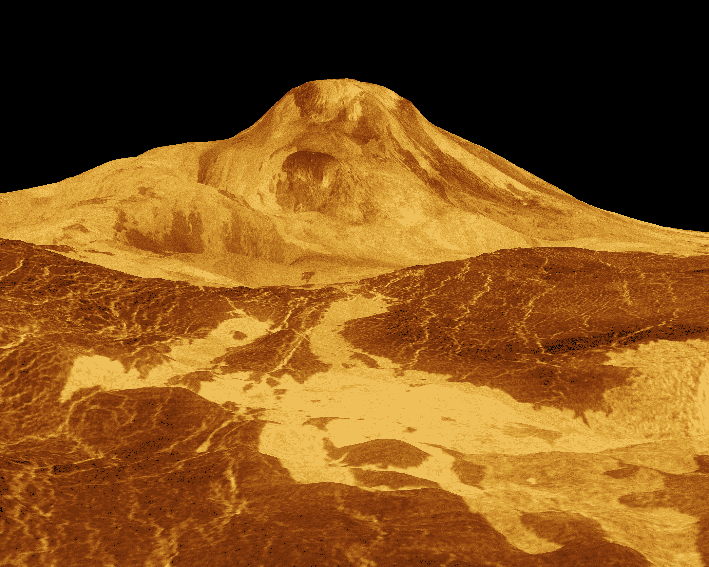
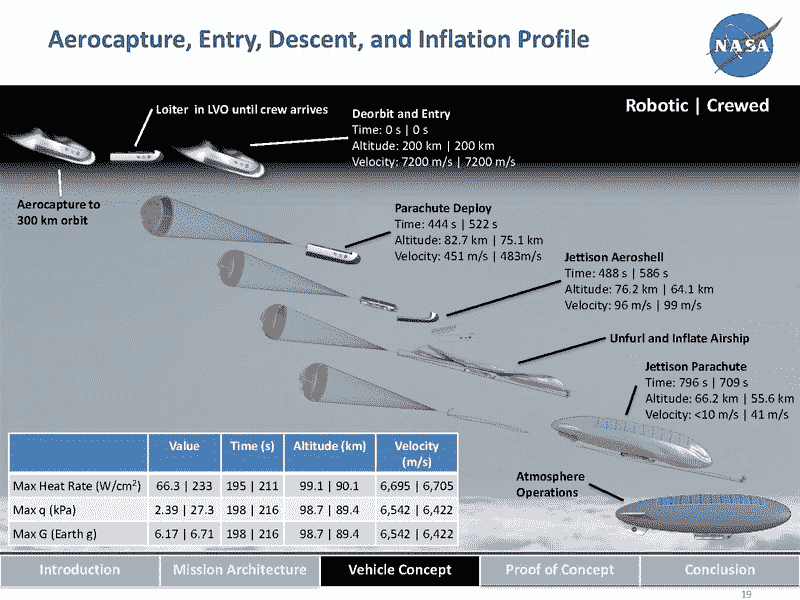
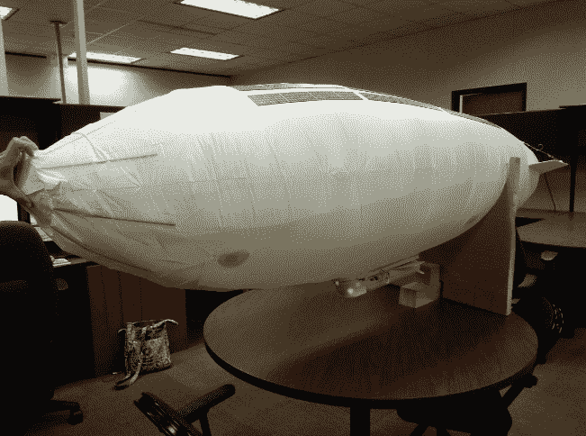

# 载人金星飞行的后勤工作

> 原文：<https://thenewstack.io/the-logistics-of-a-manned-mission-to-venus/>

当我们无畏地开拓尖端技术时，似乎每天我们都在与困难的后勤和部署作斗争。但本周，我们看到了一个新的提醒:人类有一天可能会取得一些更令人惊叹的成就。

两位英国学者提醒世人，美国国家航空航天局(NASA)正在探索载人登月的可能性。他们写道，这个想法“并不是让人类登陆荒凉的表面，而是利用稠密的大气层作为探索的基地”

## **右边的空间**

早在 2014 年，美国宇航局兰利研究中心发布了一个名为“[探索金星的方法](https://youtu.be/0az7DEwG68A)”的视频，称金星为“我们最近的行星邻居”金星大约比火星近 23%——在它最接近地球时距离地球仅 2500 万英里——每 584 天发生一次。这意味着前往金星的最佳“任务机会窗口”每一年半出现一次，而火星则是每两年一次，美国宇航局已经承认，前往我们最近的行星比前往火星更快。

坏处呢？金星表面的温度为华氏 863 度，对该行星表面的科学探索“发现金星是一片地狱般的荒地，”美国宇航局的一篇论文报道。“巨大大气层下的表面压力是地球表面压力的 92 倍，表面温度超过 735 开尔文，远远超过熔化大多数电子设备和金属所需的温度，天气系统基于硫酸的运动。”

金星上的火山比太阳系中任何其他行星都多，其表面的 65%被火山熔岩平原覆盖。(模拟色调基于来自寿命极短的苏联探测器的彩色图像。)科学家描述了一种“失控的温室效应……”

是的，硫酸。美国国家航空航天局的一个网页实际上描述了“完全覆盖整个星球的厚厚的硫酸云”，创造了一种超级温室效应，在亿万年的时间里，金星的表面已经成为我们整个太阳系中最热的地方之一。1981 年，俄罗斯发射了两颗金星探测器，它们在金星表面存活了整整 127 分钟，超过了 32 分钟的设计寿命，从而结束了为期四个月的金星之旅。

但是在地球表面上方 34 英里的地方,“霾层”变薄了，阳光透过来了，周围的硫酸含量也有了令人愉快的下降。

这两位英国学者写道:“尽管看起来令人惊讶，但金星的上层大气是太阳系中最像地球的地方。”。“34 英里处金星大气的气压大约是地球海平面气压的一半。事实上，你不穿压力服也没问题，因为这大致相当于你在乞力马扎罗山山顶遇到的气压。

[https://www.youtube.com/embed/0az7DEwG68A?feature=oembed](https://www.youtube.com/embed/0az7DEwG68A?feature=oembed)

视频

“你也不需要隔离自己，因为这里的温度在华氏 68 度到 86 度之间。这个高度以上的大气层也足够稠密，可以保护宇航员免受来自太空的电离辐射……[C]从前，你可以在飞艇外面的平台上散步，只带着你的空气补给，穿着化学防护服。”由于它更靠近太阳，太阳能电池实际上比在地球上产生的能量多 1.4 倍*。*

 *## 载人去地球外大气层的任务

甚至有人建议人类尝试[在金星](https://en.wikipedia.org/wiki/Colonization_of_Venus#Artificial_mountains)上建造 30 英里高的山，使用自动机器人推土机，创造一个可爱的定居山顶。一位美国国家航空航天局的研究人员还引用了两份不同的美国国家航空航天局的论文，这两份论文“都呼吁在雾霾层以上的金星上进行探索、居住和潜在的殖民，在那里可呼吸的空气(20%氧气，70%氮气)是一种升力气体，大气质量类似地球。”

美国国家航空航天局对载人金星任务的调查发生在两年多前——但是在本周发表在新闻[对话](https://theconversation.com/nasa-wants-to-send-humans-to-venus-heres-why-thats-a-brilliant-idea-104961)上的一篇文章中，他们受到了新一轮的关注。这篇发人深省的文章是在知识共享许可下发表的，因此很快就被许多其他媒体转载。人类似乎对我们最近的行星邻居有很多被压抑的好奇心。

[https://www.youtube.com/embed/5Hpb2gp4mtc?feature=oembed](https://www.youtube.com/embed/5Hpb2gp4mtc?feature=oembed)

视频

这篇文章的合著者之一是伊恩·惠特克，他在 2010 年获得了研究太阳如何与金星高层大气相互作用的博士学位，目前在诺丁汉特伦特大学教授天体物理学。更重要的是，他对“太空科学拓展”感兴趣，他在网上作者简介中把[描述为“鼓励学生和公众对我们的星球如何与太阳系相互作用产生兴趣。”](https://theconversation.com/profiles/ian-whittaker-425597)

他与同样获得了太阳研究博士学位的[加雷思·多里安](https://theconversation.com/profiles/gareth-dorrian-206088)合作，写了一篇关于人类 60 次成功登月的文章，“包括 8 次载人登月”，文章名为“[暂时忘记火星，重返月球的 5 个理由](https://theconversation.com/five-reasons-to-forget-mars-for-now-and-return-to-the-moon-101683)现在他们似乎在敦促读者暂时忘记火星，专注于金星——尽管至少有一篇美国宇航局研究人员的论文将金星任务描述为火星的“垫脚石”，作为“前往/在/来自另一个世界的操作的测试案例”

美国国家航空航天局做了一项关于金星任务的内部研究，然后开发了一个探索金星的“进化计划”，“重点是进入金星大气层 30 天载人任务的任务架构和飞行器概念。”一个关于该项目的网站链接到一个 75 页的 PDF 文件，标题为“[金星探索战略](https://ntrs.nasa.gov/archive/nasa/casi.ntrs.nasa.gov/20160006329.pdf)”——来自美国航空航天研究所 2015 年在帕萨迪纳举行的一次会议。

为期 30 天的金星之旅需要超过 14 个月才能完成——包括在 110 天的“出境旅行”后 300 天的返程其他细节包括一个比 747 更大的充气飞艇，将在抵达金星轨道后部署，太阳能电池板覆盖其大部分上表面，尽管在运输足够的气体以进行充气方面存在严重的后勤挑战！

漂浮在金星表面之上，研究人员可以随心所欲地部署科学研究设备，为未来的探险者铺平通往这座临时漂浮城市的道路，然后再进行漫长的返回地球的飞行。这个想法被称为高空金星操作概念(或“浩劫”)——它来自美国宇航局的“[太空任务分析部门](https://sacd.larc.nasa.gov/smab/)，该部门负责评估可行性，并通知美国宇航局的决策者，同时“激励世界的可能性艺术。”

美国宇航局的一个团队甚至[建造了一个“隔热气壳”](https://ntrs.nasa.gov/archive/nasa/casi.ntrs.nasa.gov/20160006580.pdf)的模型，它将包围所有的组件——包括宇航员将居住的充气飞艇底部的“可居住座舱”。他们使用现成的零件来监控他们的 1/53 比例模型，包括 Arduino Uno 微控制器，一度使用广告飞艇的气囊，并用 velcro 带系紧他们的充气飞艇。

但是这项研究最有趣的地方在于它确实存在。NASA 的另一篇论文以一个鼓舞人心的问题开始——“未来看起来像什么？然后列出了人类探索太空的原因。它的第二个要点实际上称金星为“人类居住的目的地”，称它是离地球最近的行星——也是环境友好的行星。它不仅设想了一个为期 14 个月的任务计划；这在“阶段 5:永久的人类存在”中达到高潮

它列出了两个目标，一个是突破，一个是垫脚石。目标一:“展示人类在深空和行星体周围生存和运作的能力。”第二个目标是:“开发先进的技术，使人类能够访问行星目的地。”

这两位英国作者本周写道，美国宇航局“目前正在进行一项概念性的载人金星任务。”但在他们的文章发表后不久，美国宇航局更新了他们的网页，澄清该项目“不再活跃。”虽然两位作者写道，“以目前的技术，这样的任务实际上是可能的”，但美国宇航局更谨慎地写道，“随着技术的进步和概念的进一步完善”，这些任务将是可能的。

但得知这项任务已经得到认真考虑，雄心勃勃的人类已经开始解决它可能面临的一些障碍，这仍然令人鼓舞。美国宇航局的研究人员已经确定了“关键的技术挑战”，包括“金星大气中的硫酸环境构成的威胁”——这导致了 2016 年的后续论文[描述了解决这些问题的两个“概念证明”](https://ntrs.nasa.gov/archive/nasa/casi.ntrs.nasa.gov/20160006580.pdf)。对于硫酸，研究人员评估了“候选”材料，发现 FEP-特氟隆可以保持太阳能电池板 90%的容量，“即使在浓硫酸中浸泡 30 天后”第二篇论文也从科学的角度对飞艇如何部署进行了更仔细的研究，并最终得出结论，使用飞艇探索金星是“可行的”

“金星有着相对适宜居住的高层大气，可以在人类未来的太空中发挥作用，”美国国家航空航天局总结道。

* * *

## WebReduce

<svg xmlns:xlink="http://www.w3.org/1999/xlink" viewBox="0 0 68 31" version="1.1"><title>Group</title> <desc>Created with Sketch.</desc></svg>*