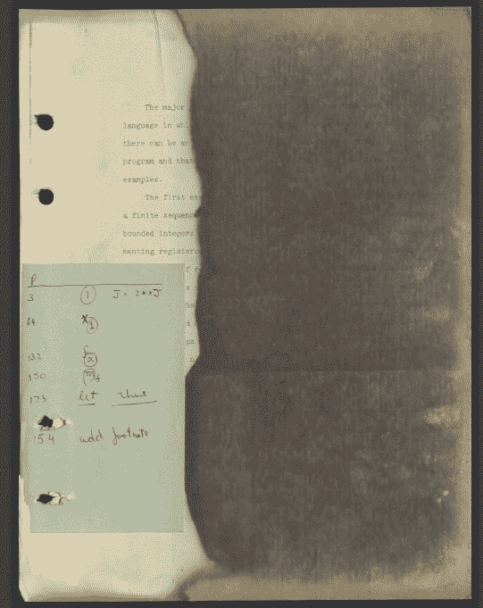
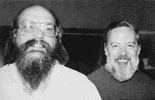

# Unix 先驱 Dennis Ritchie 遗失已久的计算论文

> 原文：<https://thenewstack.io/the-long-lost-computation-dissertation-of-unix-pioneer-dennis-ritchie/>

丹尼斯·里奇(在上面这张 1973 年的照片中，他和肯·汤普森站在一起)是计算机史上受人尊敬的人物。但在他因对操作系统和编程语言的贡献而成为传奇人物之前，里奇是哈佛大学应用数学专业的一名谦逊的研究生，他花大量时间玩视频游戏，并与大学图书馆争论装订学术论文的成本。

最近，硅谷的计算机历史博物馆瞥见了这个被遗忘的时刻，重新发现了被认为丢失了半个多世纪的里奇最后论文的副本[。这篇论文写于 1968 年，当时他只有 27 岁。这篇论文让我们有机会一窥计算机科学的早期，了解在我们之前的先驱者所面临的挑战，并欣赏我们今天仍在建设的智慧遗产。但也许这也提醒了我们已经走了多远——以及技术本身在一生中可以改变多少。](https://www.computerhistory.org/collections/catalog/102790971)

这一消息来自硅谷计算机历史博物馆博客上的一则公告[，发布者是科技历史学家大卫·c·布洛克，该博物馆](https://computerhistory.org/blog/discovering-dennis-ritchies-lost-dissertation/)[软件历史中心](https://computerhistory.org/software-history-center/)的主任。虽然他们强调源代码，但该组织“试图将历史运用到今天的工作中，以衡量我们在哪里，我们已经在哪里，我们正在走向哪里。”

在一篇博客文章中，布洛克提到了博物馆的丹尼斯·里奇收藏，其中包括一些从 1970 年到 1971 年的最早的 Unix 源代码，并指出他们的收藏现在还包括“一份褪色和染色的里奇博士论文《程序结构和计算复杂性》的复印件”

它还包括里奇的研究生朋友阿尔伯特·迈耶拥有的手稿副本的清晰数码扫描件。

论文的 28 个脚注中有一个引用了艾伦·图灵 1936 年的论文《可计算数字及其在 Entscheidungsproblem 中的应用》。

“找回里奇丢失的论文并让它可用是一回事，”博物馆的博客帖子开玩笑说，“理解它是另一回事。”

## 做数学

早在 20 世纪初，艾伦·图灵(以及他之前的库尔特·哥德尔)就试图确定数学的终极极限，这必然会触及哪些类型的问题实际上是可计算的。“在接下来的几十年里，在计算机科学作为一门公认的学科出现之前，数学家、哲学家和其他人开始探索计算本身的本质，越来越脱离与数学基础的联系，”博物馆的博客文章解释道。

这篇文章后来将这个令人感兴趣的神秘领域描述为“关于可能的计算领域有什么可以被证明的？”并指出，像哈佛大学这样的应用数学系是“20 世纪 60 年代中期进行这些新研究的少数几个地方之一。”

麻省理工学院教授阿尔伯特·迈耶曾与里奇一起读研究生，最近他给博物馆[做了一次口述历史采访](https://www.computerhistory.org/collections/catalog/102717373)，讲述了他们一起的经历，他记得他们的顾问帕特里克·菲舍尔曾对“是什么让事情变得困难？是什么让事情变得简单？不同种类的程序可以做什么样的事情？”

Meyer 记得“那时候……嗯，首先，那个国家几乎没有任何计算机科学系。这是在 20 世纪 60 年代初。人们开始意识到计算有其特殊之处。”

同样在他们的研究生院的还有[斯蒂芬·库克](https://en.wikipedia.org/wiki/Stephen_Cook)，他做了一些迈耶称之为“P = NP 问题”的原创工作，确定一个问题的“可计算性”——它的解决方案是否可以通过算法得出(其中 NP 代表“不确定的多项式时间”)。但是 Meyer 分享了一个有趣的细节。“在此之前，我们非常关注这个问题‘你如何识别那些可以通过计算解决的问题，但是没有有效的方法去做……？”那就是，丹尼斯和我的那些论文，就是关于那个的…

“从丹尼斯的工作和我的工作以及我们的共同工作中得到的启示是，在某种意义上，证明它并理解发生了什么的诀窍是摆脱语法，并意识到它只是在谈论计算允许运行多长时间。”

它最终成为里奇论文的主题，博物馆称之为“将计算机科学的学术生涯与贝尔实验室通向 C 和 Unix 的学术生涯分开的知识和传记的岔路口。”

## 从贝尔实验室开始

丹尼斯·里奇在贝尔电话实验室获得了他想要的职位后，就在那里度过了他的职业生涯。

里奇仍然保持着卓越的生产力。除了与肯·汤普森(图右)共同创造了 Unix 之外，里奇还创造了 C 编程语言，这两项成就被计算机历史博物馆称之为“随后的数字世界的基础组合”但是他在其他基本方面留下了遗产。Ritchie 还与 Brian W. Kernighan 合著了该语言的权威文档，这是一本 1978 年出版的名为“[C 编程语言](https://www.amazon.com/Programming-Language-2nd-Brian-Kernighan/dp/0131103628)”的书，这本书非常有名，有时以其作者的首字母命名，被称为“K & R book”直到今天，程序员仍然将一种特定的代码格式化技术——在表示函数开始时，将代码周围的大括号放在自己的独立行上——称为“K & R 风格”

鉴于此，他在学术界的工作成了里奇所不喜欢的事情。“我的大学经历让我相信，我不够聪明，不能成为一名物理学家，而且计算机非常整洁，”里奇后来在贝尔实验室的传记页面上打趣道。“我在研究生院的经历让我相信，我不够聪明，不足以成为算法理论方面的专家，而且与函数式语言相比，我更喜欢过程式语言。”

但是计算机历史博物馆看到了一个不同的故事。“虽然他对过程语言的偏爱是毫无疑问的，但我们对他丢失的论文的探索揭穿了他的自我评估，即他对于理论计算机科学不够聪明。更有可能的是，里奇在研究生院的经历是这样的:理论的诱惑让位于实现的魅力，构建新系统和新语言，以此探索计算的界限、本质和可能性。

## 纸追逐

2011 年里奇去世后——史蒂夫·乔布斯去世仅一周——计算机械协会的操作系统特别兴趣小组设立了一项荣誉奖学金。但是丹尼斯·m·里奇博士论文奖的创始人很快发现了一件怪事:里奇本人从未被授予博士学位

在他在贝尔实验室的[网页上，里奇巧妙地写道“我 1968 年博士论文的主题是函数的亚递归层次结构。”](https://www.bell-labs.com/usr/dmr/www/bigbio1st.html)

这个故事是由罗伯特·范·雷内塞讲述的，他曾于 1990 年在默里山的美国电话电报公司·贝尔实验室的分布式操作系统计划 9 中为里奇工作。

在 ACM SIGOPS Operating Systems Review 的一篇文章中，Renesse 回忆起他是如何开始[调查 Ritchie 是否可以在死后被授予学位](https://dl.acm.org/doi/pdf/10.1145/2626401.2626421)——很快得知贝尔实验室阿尔卡特朗讯已经尝试了同样的事情，却发现该大学的院长立场坚定。“在这一点上，我认输了，我知道丹尼斯·里奇其实会喜欢这一切的讽刺。”

但是里奇的同学迈耶讲述了一个他从他们的导师帕特里克·费舍尔那里听到的故事。正如帕特所说，丹尼斯已经提交了论文。他的论文委员会已经批准了，他有一份打印好的论文手稿，当他听说图书馆想把它装订起来交给他们时，他准备提交。捆绑费在当时是值得注意的……不是不可能，而是一笔不小的数目。”正如迈耶听到的故事，丹尼斯觉得图书馆应该为他们自己将要保存的装订本付费，“显然，他没有放弃。结果，我没有拿到博士学位。

“所以他不仅仅是‘除了论文以外的一切’他是“除了装订本以外的一切。”"

博物馆也从丹尼斯的哥哥约翰那里得到了不同的看法，他记得丹尼斯已经有了他非常想要的工作，在贝尔实验室做研究员——他补充说丹尼斯“从来没有真正喜欢过照顾生活的细节。”

事实上，尽管他们一起完成了一些论文，迈耶记得当时的感觉是“我很想和他合作，因为他看起来是一个聪明、友好的人，和他一起工作会很有趣，但是，你知道，他已经在做其他事情了。他整晚都在玩太空战！”(Spacewar 是安装在哈佛的 PDP-1 小型计算机上的 20 世纪 60 年代先驱视频游戏。)

但计算机械协会继续前进，设立了丹尼斯·m·里奇博士论文奖，首次在 2013 年操作系统原理研讨会上颁发。Roxana Geambasu 展示了我们在技术方面取得的进步，她的首届荣誉奖授予了 Roxana Geambasu，她后来成为了哥伦比亚大学计算机科学的助理教授，因为她在华盛顿大学发表了关于“[重新控制云和移动数据](https://roxanageambasu.github.io/publications/phd-dissertation.pdf)的论文 2013 年的获奖者是谷歌高级软件工程师莫娜·阿塔利扬(Mona Attariyan)，她现在是 Redfin 的分析主管，她的密歇根大学论文是“用因果分析改进软件配置故障排除”。

“虽然丹尼斯·里奇仍然没有博士学位，”蕾妮丝写道，“我对这个结果非常满意，因为我确信他也会有。”

计算机历史博物馆负责填补最后的空白。“丹尼斯·里奇 2011 年去世后，他的姐姐林恩非常关心地寻找官方副本和哈佛的任何记录，”他们在博客中回忆道。"没有，但她确实从里奇前顾问的遗孀那里找到了一本."

“直到最近，在半个世纪的时间里，可能只有不到 12 个人有机会读过里奇的论文。”

* * *

## WebReduce

<svg xmlns:xlink="http://www.w3.org/1999/xlink" viewBox="0 0 68 31" version="1.1"><title>Group</title> <desc>Created with Sketch.</desc></svg>