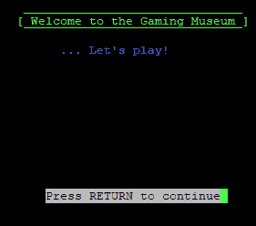

# Telnet 的失落世界

> 原文：<https://thenewstack.io/the-lost-worlds-of-telnet/>

大多数人认为 Telnet 是“我用来远程访问服务器的东西”但是一些热心的人仍然保持他们的远程登录服务在线——这是体验老式的浪费时间的乐趣的好方法！

尽管作为一种工作工具，Telnet 早已被弃用，取而代之的是安全外壳(SSH)，但几分钟的探索很快就会发现，在 Telnet 可以带你去的地方，仍然有一种被遗忘的亚文化。“通过 Telnet 连接到其他服务器，查看他们的动画 ASCII 艺术，游戏等，”在 [Mewbies](http://mewbies.com/) 的一个目录中解释道，该网站提供“安装和使用(主要是非传统)软件”的教程该网站最近一次更新是在 2014 年，包括一个名为“[码头](http://mewbies.com/acute_terminal_fun_telnet_public_servers_watch_star_wars_play_games_etc.htm)的乐趣”的列表，以及一些简单的说明。如果您还没有从 shell 帐户的命令行访问 Telnet，只需将站点的 Telnet 地址粘贴到任何终端客户端。

## 复古乐趣

最著名的 Telnet 服务可能是原版《星球大战》的 ASCII 艺术版——是的，是整部电影——当你远程登录到**towel . blinkenlights . nl**(“Telnet towel . blinkenlights . nl”)时，它会显示出它所有的荣耀。现在，它也被亲切地存档，并可以在 Asciimation.co.nz 的网络浏览器上查看。“如果你有 IPv6，你可以看到彩色和额外的场景，”Mewbies 指出。

但是在同一台服务器的不同端口上等待会让每个系统管理员笑逐颜开:这是一台 BOFH 式的借口服务器。“地狱来的混蛋接线员”是

[a legendary character from geek folklore](https://thenewstack.io/sys-admin-appreciation-day-bofh/)

他们用自己高超的技术知识来发泄对无知用户的不满。远程登录到

**towel.blinkenlights.nl 666**

你会得到一个听起来像是技术上的胡言乱语的东西，用来典当你自己的麻烦的技术支持票。很抱歉，但是…

*“可用的计算机太少。”*

*“由于来自附近道路的振动，必须调整 CPU 角度。”*

我个人最喜欢的是:

*“我们目前正在尝试使用活体鼠标的新概念。不幸的是，一个人还没有从与电脑的连接中幸存下来…..请容忍我们。”*

最著名的远程登录网站之一是 telehack.com T2(也可以通过你的网络浏览器 T4 进入)。根据 TechRadar 2011 年的一份简介[，一个名叫 Forbin 的用户“决定尽可能多地重建 ARPANet 供人们探索”。它的产品包括《降临》(advent)，1976 年关于探索巨大洞穴的原始文本冒险，以及 1966 年的经典“聊天机器人伊莱扎”(chatbot eliza)，试图模拟与心理治疗师的对话。甚至有](https://www.techradar.com/news/networking/hack-virtual-1980s-networks-with-telehack-1035135)[新闻组读者](https://www.techopedia.com/definition/3210/usenet)实际上从 1990 年的新闻组论坛上获取帖子。

当我周四访问 Telehack.com 时，它的欢迎屏幕上有这样一句令人欣慰的问候:“愿命令行永远存在。”

TechRadar 解释说:“远程黑客是一种游戏，需要达到不同的等级。“当你学习一项新的黑客技能时，一个名为 Operator 的账户会向你发送一条系统消息，告知你的进度。您还可以访问更多命令和系统资源。”如果您最终运行它的 **`netstat`** 命令，您将看到一个您可以登录的更多模拟主机的列表。还有一种方法可以扫描远程主机上可利用的端口，您可以运行 rootkits 来获得完全的管理员级别的访问权限。甚至有一个老式“wardialer”的模拟，它给给定区号内的每个号码打电话，寻找拨号调制解调器。

在网络的其他地方，仍然有一些 Telnet 目录列出了数量惊人的服务器，它们提供 90 年代风格的多用户角色扮演环境，如 [MUDs、Mucks 和 Mushes](http://www.jumpjet.info/Offbeat-Internet/Public/TelNet/url.htm) ，以及可 Telnet 的 BBSs(公告板系统)。还有其他 Telnet 服务器为访问者提供玩一些更古老游戏的机会。

例如，你可以通过远程登录到**FreeChess.org**来下棋。igs.joyjoy.net 6969 也有一个围棋服务器。它的[网页](https://pandanet-igs.com/communities/pandanet)将它描述为“一个在互联网上玩、看、学习和享受围棋的好地方。”

gt.gamingmuseum.com 的“游戏博物馆”提供经典的 BBS 游戏，如“银河交易者”，这是上世纪 80 年代早期基于文本的太空交易游戏。(你可以在网上找到该网站最新的[排行榜](http://www.gamingmuseum.com/gal-trader.html)。)

该网站甚至在玩经典的流氓式、基于文本的 D&D 游戏 net hack(**nethack.alt.org)**。该网站指向一个提供西洋双陆棋的 Telnet 网站，地址为**fibs.com 4321**。FIBS 代表第一台互联网双陆棋服务器。该网站的[网页](http://www.fibs.com/)指出，自 1992 年以来，它一直是“免费和非商业性的”。“虽然现在被它的创造者抛弃了，FIBS 通过志愿者的工作继续发展，”它指出。

## 远程登录的起源

在 IETF.org，你仍然可以找到 1972 年关于 Telnet 协议的原始“征求意见稿”。它是由 Jon Postel 写的，他是互联网标准发展早期的一个重要人物，他在攻读博士学位时参与了 ARPANET 项目。

但是该协议似乎有一个不光彩的开始。“在 1971 年 10 月的网络工作小组会议上，”Postel 写道，“我承诺将迅速提出一份文件，清楚简洁地说明和解释官方的 Telnet 协议。这份文件未能满足这一承诺的任何部分。

“这份文件没有及时提交。这份文件既不清楚也不简洁。没有官方的 Telnet 协议。

他继续解释说，Telnet 当时有一个特别的协议，它的最终目标是提供一种虚拟电传打字机。

在互联网的早期，它是一个经常使用的工具——至少在大多数娱乐网络用户放弃 Telnet 的基于文本的服务，转而使用万维网上的“多媒体”页面之前是如此。回到 20 世纪 90 年代初，你仍然可以使用 Telnet [访问美国国会图书馆](https://www.loc.gov/loc/lcib/93/9310/remote.html)的文件，访问 [NASA 的最新头条新闻和新闻稿](http://info.cern.ch/hypertext/DataSources/Yanoff.html)，甚至阅读最高法院裁决的 ASCII 版本。

但是 Telnet 的简单性最终导致了它的失败。早在 2007 年，《连线》杂志[就指出](https://www.wired.com/2007/04/telnet-dead-at-/)Telnet 不包含在微软的 Windows Vista 操作系统中。“Telnet 是在一个更简单的时期设计的，它没有加密，也不符合登录远程机器的现代安全标准。”现在，大多数远程连接都使用更安全的 SSH 客户端，如 [PuTTY](https://www.putty.org/) 。

https://twitter.com/bad_packets/status/1103870300712665089

但是很高兴看到几十年过去了，旧的 Telnet 协议仍然有一些支持者。上个月在 Reddit 的编程论坛上，一个开发者分享了“我不久前做的一个 Telnet 游戏。”远程登录 arin.ga 44444 调出一个快节奏的数学测验，答案总是 1、2 或 3。

看到它今天在万维网上的上市，Reddit 上的评论者开玩笑说，“不知道这是否有未来……”

* * *

## WebReduce

<svg xmlns:xlink="http://www.w3.org/1999/xlink" viewBox="0 0 68 31" version="1.1"><title>Group</title> <desc>Created with Sketch.</desc></svg>