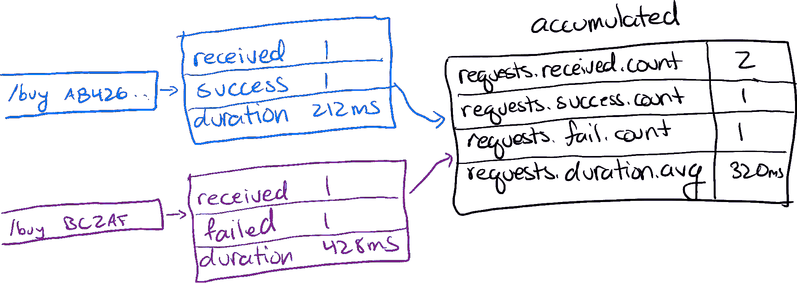

# 度量的魔力以及它是如何灼伤你的

> 原文：<https://thenewstack.io/the-magic-of-metrics-and-how-it-can-burn-you/>

 [杰西卡·科尔

杰西卡是一名有 20 年经验的软件开发人员，现在是 Honeycomb.io 的开发倡导者。她撰写、演讲和播客，内容涉及 DevOps、开发人员体验、TypeScript、Ruby 和 Java、函数式编程、领域驱动设计以及其他一些主题。在推特@jessitron 上找到她，在 jessitron.com/blog.](https://www.linkedin.com/in/jessicakerr/) 

作为产品开发人员，我们的责任不仅仅是发布代码。为了保持我们的软件运行，我们需要注意它是否在生产中工作。为了让我们的产品更流畅、更可靠，我们需要了解它在生产中是如何工作的。我们可以通过让软件告诉我们需要知道什么来做到这一点。

如何才能注意到软件何时运行流畅？让它告诉我们！通过一些开发工作，每个服务的每个正在运行的实例可以随时告诉我们它是否正在运行，使用了多少 CPU，以及它正在服务什么请求。

软件可以给我们所有这些数据——太多的数据。我们如何理解这一切，并在不使网络和磁盘不堪重负的情况下传输和存储数据？输入度量。

度量是神奇的，因为它们使用一个很酷的抽象将每个时间段的大量数据缩减为一个有限的数量，然后我们可以绘制这些数据，并在出现问题时注意到。将我们所有的信息简化为度量标准会让我们焦头烂额，因为它剥夺了那些向我们展示我们的软件是如何工作的信息。

这篇文章将帮助你热爱度量标准，然后害怕它们，最后知道何时使用它们以及如何做得更好。

## 幺半群的巧妙抽象

度量的魔力:不管有多少请求进来，我们都可以将关于它们的数据收集到一个固定的空间中。例如:当一个请求发起时，计算一个传入的请求。当它终止时，计算一个成功的请求或一个失败的请求。记录持续时间(例如，212 毫秒)。把它存在记忆里。

图 1 显示了一个传入的请求和我们可以存储在内存中的相关计数。

当另一个请求进来时，计算一个请求。如果失败了，也算一次。如果这一次用了 426 毫秒，结合这段时间。当我们从第二次请求、第三次、第四次或第五百次请求中积累数据时，所使用的总内存不会增加。

图 2 显示了合并到一个幺半群中的额外传入请求，内存大小的增加可以忽略不计。

对于每个度量，我们使用幺半群。(这是一个来自范畴论的数学术语，在软件中很有魔力。)幺半群由三部分组成:一个数据类型、一个“组合”操作和一个空值。它的神奇之处在于，我们可以获取任意数量的实例，以任意顺序组合它们，并获得一个累积所有信息的实例，其大小的增加可以忽略不计。(我们可以定义在尺寸上确实增加的幺半群，但是那些不用于度量。)

“计数”幺半群很简单:数据类型是整数，组合是整数加法，空值是 0。我们可以将一个传入请求添加到总数中，它仍然是一个整数。

图 3 显示了在我们的幺半群中作为计数接收的两个请求。

持续时间幺半群需要稍微多一点。我们希望累积平均持续时间，而不是总持续时间。计算平均值的公式是:相加，然后除以相加的总数。在本例中，平均为(212 毫秒+426 毫秒)/2 = 320 毫秒。

图 4 显示了我们的幺半群中两个请求持续时间的平均值。

当持续 134 毫秒的第三个请求进来时，如何组合成幺半群？我们不能做同样的操作:将 134ms 加到我们的平均值 320ms 上，然后除以 2。这给予平均值和新的非平均值相等的权重。如果我们这样做了，(320 毫秒+134 毫秒)/2 = 227 毫秒

227 毫秒的平均值更倾向于 134 毫秒，因为在 320 毫秒的平均值中有两个数据点。为了处理这个问题，我们的“平均”幺半群有一个比整数更详细的数据类型。它存储总持续时间和包括的请求数；我们可以在任何时候将它们简化为一个“平均值”。在一个适当的“平均”幺半群中，这个新请求将总持续时间增加 134 毫秒，请求计数增加 1。

图 5 显示了聚合到我们的幺半群中的三个请求持续时间。

通过存储足够的信息让 monoid 正常工作，我们为 3 个请求积累了 774ms。为了显示这一点，我们将总数 774 毫秒除以计数 3，得到 258 毫秒。

幺半群是惊人的，因为它们的内存大小随着输入的数据量次线性增长。使用 count 和 average，合并的每个新值都不会增加存储数据的大小。其他度量使用尺寸稍微增加的幺半群。例如，直方图可能需要添加一个存储桶。

图 6 显示了一个直方图幺半群如何添加一个桶。

对于像 P90 和 P95 这样的百分位数，指标使用更复杂的数据结构，如 [q-digest](https://papercruncher.wordpress.com/2011/07/31/q-digest/) 。这并没有得到完美的百分位数，但误差是有限的，最大值是固定的。

## 幺半群如何变成度量

除了幺半群存储的数据之外，一个度量包括说明数字含义的元数据。然后，每个保存的指标实例都有一个时间戳，因为我们用它们来表示一段时间内的系统状态。

图 7 显示了我们的 monoids 指标:每个指标都有时间戳、元数据、类型和存储。

指标的美妙之处在于，不管我们的应用程序规模如何，每个指标都有固定的资源成本。传输和存储成本不依赖于数据积累。具有度量的可变成本是收集间隔(10 秒、60 秒、5 分钟等。)以及累积了多少不同的数字(每个服务、每个 URL、每个主机等的总请求数)。虽然每个指标的成本是固定的，但指标的数量可能不是固定的。

当元数据相同时，度量只能使用它们的幺半群魔法。例如，只有当每个数字都将自己描述为截至时间戳 2021-09-09T00:24:02 的“us-west-1”区域中标记为“serviceA-app”的“主机 abc123”的
“1 分钟平均 cpu 使用率”时，数字才能累计。

如果我们跟踪每台主机的 CPU 使用情况，那么每个主机名都有自己的指标。如果该主机是一个具有不同 pod 名称的 Kubernetes pod，那么每个新 pod 在旋转时都会创建一个 CPU 指标。相反，如果我们用 pod 标签来标记指标(例如，“serviceA-app”)，那么具有相同标签的 pod 的所有 CPU 使用情况将合并为一个指标。标签组合的数量是固定的，所以我们知道会产生多少指标。我们可能有一组固定的主机名，所以仍然有固定数量的指标。如果我们将 pod 名称放在元数据中，并且每当需求波动时就增加新的 pod，那么我们不知道将存储多少不同的指标。像这样的属性，可以有任意数量的不同值，也被描述为具有“高基数”这些类型的属性打破了我们的幺半群的固定大小的魔法。

如果我们向我们的指标添加一个高基数属性，比如一个带有查询参数的完整请求 URL，我们会得到不同指标的爆炸式增长，随着请求量线性增长。如果我们添加两个高基数属性，那么我们就有了和不同值组合一样多的度量。我们的指标量可以比请求的数量增长得更快。

高基数破坏了这种魔力。使用度量标准时，避免使用具有无限值的属性。我们喜欢我们的幺半群彼此结合。

## 度量和幺半群闪耀的地方

幺半群是制作图形的神奇工具，因为它们可以任意组合。这是添加跨主机名的请求计数、跨 URL 路径和状态代码的平均持续时间的时间。以分钟、小时或天为间隔查看所有请求。它们很容易画出来！

图 8 显示了以不同的方式绘制相同的指标，按状态代码分割或汇总。

随着时间的推移，指标被存储为一系列数字。所以我们总是可以看到变化发生的时间。我们可以看到内存使用随着时间的推移而增长，或者看到请求持续时间在周三凌晨 4 点超过两秒。将度量可视化为图形让我们看到事情何时变得缓慢。

有了度量标准，我们可以知道生产中的事情是否正常，以及什么时候出现了问题。但是事情是如何运作的，又是如何不运作的呢？对于这些问题，我们需要深入细节。哪些请求花费的时间太长？他们是来自某个特定地区还是几个重要客户？也许它们包括从特定分区检索大量项目或项目的查询？

## 衡量标准不突出的地方

度量标准的问题是:我们可以任意相加，但不能任意相除。图表的粒度受到我们记录的元数据的限制。如果单独记录状态，我们可以看到失败和成功请求之间的区别。如果地区是分开记录的，我们可以按地区划分。

我们应该分别记录所有这些指标吗？小心点！我们进入了高基数度量爆炸。

像所有好的抽象一样，幺半群去掉了上下文。度量通过剥离任何没有被特别选择作为我们关心的属性的数据，获得了它们高效的资源魔力。对度量标准很吝啬。

有一种方法可以得到我们需要的任意图形，一种方法可以根据请求除以任意属性，而不需要对它们进行计数。它仍然使用幺半群，但是它在过程的后面被使用。

诀窍是:让每个请求讲述它自己的故事，包括所有这些属性，如完整的 URL、客户 ID、返回的行数和查询持续时间。通过为每个请求发出事件，我们可以完整地存储这些请求。

图 9 显示了两个数据流。之前，请求事件被转换为指标，然后进行累积，然后通过网络流入指标数据库，进而进入图表。之后，请求事件通过网络流入 events DB，许多事件从 events DB 流入填充图的任意查询。

在该模型中，我们在查询时进行计数、平均和直方图。从那里，我们得到相同的图形，告诉软件是否平稳运行，像总持续时间，请求计数和失败计数。我们还可以通过客户 ID 或检索到 10 行以上的地方或事件中的任何其他属性来获取持续时间。

如果我们存储事件而不是度量，我们可以任意添加它们，也可以任意划分它们。

每个属性可以有多少不同的值已经无关紧要了。事件不关心。添加一个数据库查询的全文！然后我们可以看到哪些数据库查询比预期的慢。

事件，尤其是作为痕迹，给了我们每个慢请求的故事。没有必要用日志来拼凑所发生的事情。这样，那些告诉我们什么时候出了问题的事件也能告诉我们为什么出了问题。

二四十年前，磁盘和网络流量极其有限。在收集和存储信息之前，我们需要将我们的信息占用空间减少到几个小数字。度量标准非常适合这一点。

对于像 CPU 和内存使用这样的数字，指标仍然是完美的。我们不希望每次内存分配都有一个事件；我们希望对内存在运行时的样子有一个大致的了解。这些并不特定于我们的软件，客户也不直接关心它们。CPU 的使用可能与请求的故事有关，所以我们可以把它放在请求事件上。或者将其定期记录为指标，或者两者都有。度量对于基础设施来说已经足够好了；我们的应用程序的工作是值得的事件。

有了现代的磁盘和网络容量，我们可以发出包含所有可能对我们的应用程序有影响的属性的事件。我们练习网络日志，所以我们也可以练习网络跟踪。如果这些数据变得太多，我们有现代采样技术来选择有代表性的事件。它允许我们选择我们需要和想要保留的故事。

当涉及到有关我们的应用程序的数据、影响我们客户的请求时，不要通过将它简化为指标来丢弃故事和上下文。发送整个事件，然后根据需要提取指标。

我们可以做的不仅仅是保持软件运行。我们可以不断改进我们的产品，让它变得更可靠、更有用。作为开发人员，我们可以将代码放在我们的团队中；我们可以让软件教我们它的问题和内部运作。这是一个产品团队需要的；这就是可观察性。

*要了解这是如何工作的，请查看 Honeycomb 的[平衡指标和事件](https://www.honeycomb.io/blog/metrics-ga-announcement-2021/)。*

<svg xmlns:xlink="http://www.w3.org/1999/xlink" viewBox="0 0 68 31" version="1.1"><title>Group</title> <desc>Created with Sketch.</desc></svg>