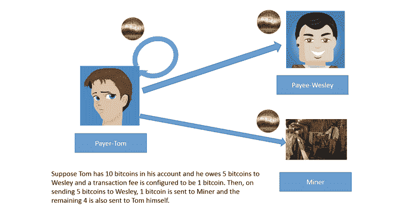

# 比特币的机制

> 原文：<https://thenewstack.io/the-mechanics-of-bitcoin/>

媒体不断谈论比特币，但大多数人都无法解释它是如何工作的。所以我们决定自己解释它，以便为它的各种用例提供一些更深入的背景和理解。

## **比特币是什么？**

[比特币](https://bitcoin.org/en/)是一种去中心化的点对点虚拟或加密货币系统。没有像银行这样的中央机构来控制系统。但是它有非常严格的规则，由密码功能控制。

## **密码学有什么重要的？**

在密码学中，有对称和非对称算法。

在这里，我们将坚持非对称算法，因为它们在比特币系统中被广泛使用。

使用非对称算法，您可以生成一对密钥——公钥和私钥。一旦使用公钥对消息进行了加密，就只能使用相应的私钥对其进行解密，反之亦然。

您可以安全地向全世界发布您的公钥，并对私钥保密。

该过程实现了两个关键因素:

*   不可否认性——在用 Alice 的私钥签名的消息中，产生的密文将具有 Alice 的唯一签名，该签名可以通过其对应的公钥来验证，并推断该消息确实来自 Alice。这就是不可否认性的概念。
*   保密性—假设 Alice 只想向 Bob 发送消息。Alice 用 Bob 的公钥对消息进行签名，因此只有 Bob 能够对其进行解密，因为只有他拥有自己的私钥。这就是保密的概念。

比特币也融合了哈希技术。哈希用于检查信息的完整性。当散列一个值时，您获得一个唯一的字符串。即使对原始值做了微小的更改，哈希也会完全改变。

比特币地址是公钥的散列格式。

## **使用比特币是匿名的……真的吗？怎么会？**

涉及金钱的在线交易通常会通过用户的地址来验证用户的身份。在比特币网络中，用户可以随意创建多个身份，无需任何证明或文件。

比特币网络中的身份是一个比特币地址。通过这个比特币地址，用户可以进行比特币交易。为了接收比特币，用户需要做的只是向付款人提供他们的比特币地址。因此，为了提供匿名性，用户只需创建许多帐户，并使用这些帐户进行公共交易，同时保持主帐户的比特币地址私有。创建账户很容易，而且是免费的。

请注意，所有交易都在一个叫做区块链的公共分类账中进行跟踪。而且任何人都可以看到哪个比特币地址拥有多少比特币。

## **下兔子洞**

交易在被网络接受之前被验证。这是通过遵守脚本中定义的契约来实现的。该脚本是一个函数或一系列指令，当遵循时，验证比特币的所有者，以便所有者可以使用它。这个脚本可以定制。

用户有输入，是之前发给他们的比特币，也有输出，是用户已经消费的比特币。输入有助于证明未用完的比特币属于用户，这是通过他们的私钥来完成的。输出具有指令，当遵循这些指令时，将验证接收器。因此，接收者必须使用他们的密钥对成功地传递拥有比特币的指令。

## **区块链**

一些经过验证的交易被整理成比特币世界中所谓的区块。这些积木，为了被接受并附加到现有的区块链上，需要解决一个数学难题，或者工作证明。这项工作是由矿工完成的。

矿工是提供计算资源来解决数学难题的参与者。拼图的规则是:

*   如果提供了一个质询，应该存在一个随机数(一个长度为 4 个字节的随机值)，它会附加上质询，以便在应用哈希算法时生成带有几个前导零的哈希。
*   挑战基本上来源于计算当前块的 merkle 根。
*   merkle 树将来自块的事务 id 配对，并输出单个散列，最终为当前块中的所有事务提供唯一的散列，从而产生 merkle 根。

考虑到散列的随机性，没有已知的捷径来计算将产生 0 前导散列值的 nonce。但是，考虑到计算机技术的进步和硬件成本的下降，平均至少有一名矿工能够在大约 10 分钟内解决这个难题。

该拼图的难度等级被校准，以便在两周内生成大约 2，016 个积木。如果生成的方块较少，则系统会自动调整到较容易的难度级别，反之亦然。计算的唯一方法是使用蛮力，通过尝试 nonce 与给定挑战的所有组合。

## **矿工有什么好处？**

第一个解决难题的矿工有权获得比特币奖励。每一代新的区块都会凭空创造出比特币。这些比特币也被称为 coinbase 记录。一个区块的第一个交易记录是矿工作为奖励发给自己的 coinbase 记录。

除了 coinbase 奖励之外，还有另一个激励，即与当前块中的每笔交易相关联的交易费。这种交易费用可以由用户或付款人设定。

当比特币在 2009 年 1 月开始时，coinbase 的数量是 50 个比特币。每隔四年，coinbase 的价值就会减半。可用的比特币总数有上限——2100 万。这意味着，可能在 2110 年至 2140 年之间的某个时间——取决于每年产生多少比特币——新的比特币一代将停止。即使 coinbase 记录不再增加，矿工仍将获得交易费奖励。

假设在区块链已经创建了 2000 个块。在此之后发生交易，需要在区块链的 2001 区块进行开采。然后，据说有了第一次确认。但棘手的是，它必须在 2001 块之后的至少五个块中被挖掘，从而使它在总共六个块中出现/出现，以确定它已经被成功地传送到事务的发送地址。当然，确认的次数还在不断增加，但是六次确认就足够完成一笔交易了。在那之前，付款人必须等待。

Arun Kumaraswamy 是一名 Java-Oracle 开发人员。他的技术技能跨越了网络、操作系统和 web 服务器等非常广泛的技术领域。他擅长编程、PL/SQL 和 Linux。他为网站进行渗透测试。简而言之，他就是极客的定义。他喜欢在业余时间看板球。他有一些证书，如剑桥大学、CDAC 大学、SCJP 大学和 RHCE 大学。

通过 Flickr 知识共享的特色图片[。](https://www.flickr.com/photos/jason_benjamin/8631889823/in/photolist-e9LG7B-c7TeVY-a1DE33-e9SmUj-e9SmRY-e9LGa4-frS34B-i2xJE1-gGGQdP-dPcqJ1-i2yuN8-fs7uhY-hyiErG-gGQUSJ-gGQr2d-gGQRbT-hBKvvp-j1XXSa-ekuPT3-mqZ21z-gGQNJb-gGQDZA-gGHFex-gGQzK3-gGQFTe-gGQT8b-hgL66m-gGQLQD-gGPxXE-idijdK-hgLc1q-gGPGh3-gGQBBF-fNpNJY-hgM7NV-gGQtjt-hgM48i-hgL6pL-hWQeQb-it3guk-nodNN5-gGQU3V-gaRCV5-gGQPhA-nTZFTr-gAtcyN-n9UrF6-gGmEFd-fD4SZs-fur6LV)

<svg xmlns:xlink="http://www.w3.org/1999/xlink" viewBox="0 0 68 31" version="1.1"><title>Group</title> <desc>Created with Sketch.</desc></svg>