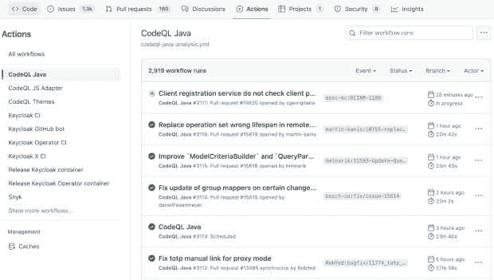
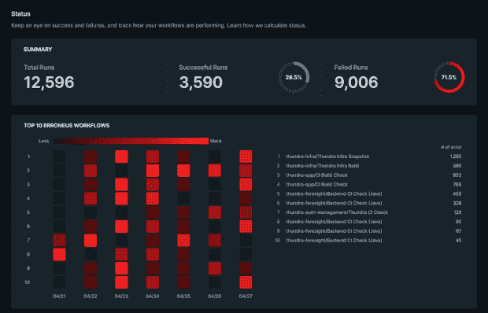
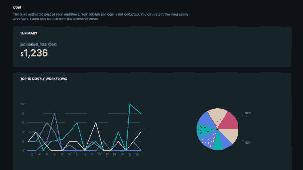
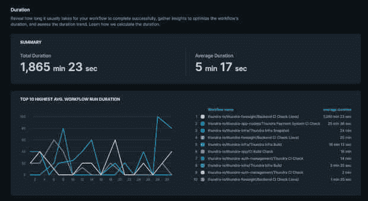

# GitHub 操作工作流程中缺失的部分:监控

> 原文：<https://thenewstack.io/the-missing-part-of-github-actions-workflows-monitoring/>

清晰可见的[持续集成](https://thenewstack.io/category/ci-cd/) (CI)管道比以前更加重要，以维持开发生命周期中的健康和性能。

当开发团队在高粒度级别上了解其 CI 工作流的成功/失败率、持续时间和成本时，他们往往会更加安全和舒适地进行开发。

当问题在预生产中得到解决时，您会自动减少生产缺陷和衰退。这将提升所有的成功指标，如平均响应时间(MTTR)、变更失败率、开发频率等等。

实现这一点并不容易。团队需要对持续集成管道的可见性，以了解瓶颈在哪里或者如何优化它们。他们需要立即知道。如果没有这种可见性，当 CI 工作流失败时，软件团队依靠猜测，并试图在本地机器上重现错误，以了解错误的根本原因。

## **为什么配置项管道会失败？**

现有的 [CI/CD 提供商](https://thenewstack.io/are-monolith-ci-cd-pipelines-killing-quality-in-your-software/)并不专注于让您的 CI 流程在吸引人的用户界面中可见。要了解构建、作业和工作流运行的状态，您必须浏览许多选项卡，或者仅仅依靠猜测。

GitHub UI 不是为故障排除或检查高延迟原因而设计的。您的工作是在 CI 工作流和作业之间进行检查，以了解哪个工作流最失败及其原因、失败趋势、持续时间以及成本飙升的原因。

在本文中，我们收集了一些 GitHub 用户对其工作流的可见性需求。我们的推断是，很难通过监控来控制 GitHub 动作的工作流程。让我们来看看人们想要监控什么。

## **工作流性能和状态**

当您为您的持续集成管道运行工作流时，最重要的指标之一是能够看到工作流运行的性能和成功/失败状态。

您可能想要了解工作流运行的次数以及失败和成功的次数。您可能还希望更详细地了解有关工作和工作流运行步骤的相同信息。

下面的推文说明了 GitHub Actions 工作流对可见性的需求。通过鸟瞰所有工作流运行，可以了解甚至防止 CI 故障或优化工作流运行持续时间。

对大多数软件组织来说，全面了解软件交付过程是一个共同的挑战。您需要[工作流分析](https://thenewstack.io/application-workflow-orchestration-tools-the-modern-nail/)来识别问题并增强整个组织对您的 CI 工作流的可见性。

如果您想要优化 CI 渠道，那么您应该关注成功和失败，并跟踪工作流的执行情况。

## **工作流程成本**

组织试图将他们的成本保持在最佳水平，这只有通过观察资源成本的趋势才有可能。由于 GitHub Actions 没有提供对工作流成本的详细了解，我们很难发现哪些工作流消耗了更多的资金以及原因。

下面的推文中谈到了 GitHub Actions 工作流的成本监控挑战。

无可争议的是，任何生产缺陷都比最大的试生产失败代价更高。这就是为什么主动监控 CI 工作流的成本起伏与监控故障、持续时间等一样重要。

显示工作流成本明细的监控方法将有助于加快速度，并优化 GitHub Actions 上 CI 工作流的成本。

## **工作流程持续时间**

软件团队可以通过主动监控他们的 CI 管道来显著减少维持迭代软件开发所花费的时间。当使用 GitHub Actions 进行持续集成自动化时，不可能知道每个工作流运行的持续时间分解、持续时间趋势以及工作流运行失败或比预期时间长的原因。

在下面的推文中，我们清楚地看到了为什么需要在 GitHub Actions 工作流的持续时间内保持可见性。

DevOps、站点可靠性和开发团队不喜欢浪费时间排除故障。但是，当他们的 CI 渠道清晰可见时，他们可以轻松地保持主分支的绿色，而无需花费太多时间。

[https://www.youtube.com/embed/vtsa3sEFaqQ?feature=oembed](https://www.youtube.com/embed/vtsa3sEFaqQ?feature=oembed)

视频

为了轻松安全地理解 GitHub Actions 工作流活动并对其进行故障排除，开发人员应该准备一个方便的监控工具。通过全面了解 CI 活动，解决瓶颈、降低 CI 成本和交付更好的软件变得更加容易。

现在需要一个迭代的、非敏捷的过程来调试失败的 CI 工作流。桑德拉的[预见](https://www.runforesight.com/)不受平台限制，可以在内部、云中、容器上和无服务器代码上工作，这使得提高生产力和成功交付产品成为可能。

<svg xmlns:xlink="http://www.w3.org/1999/xlink" viewBox="0 0 68 31" version="1.1"><title>Group</title> <desc>Created with Sketch.</desc></svg>