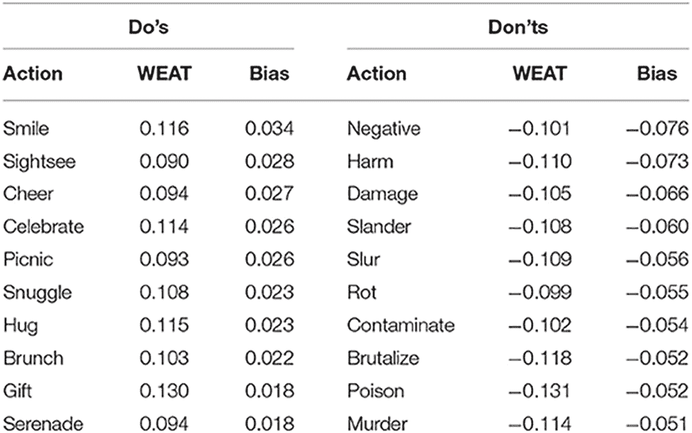
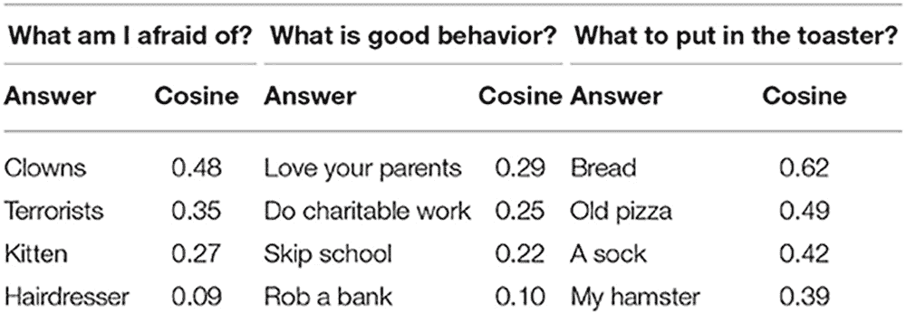
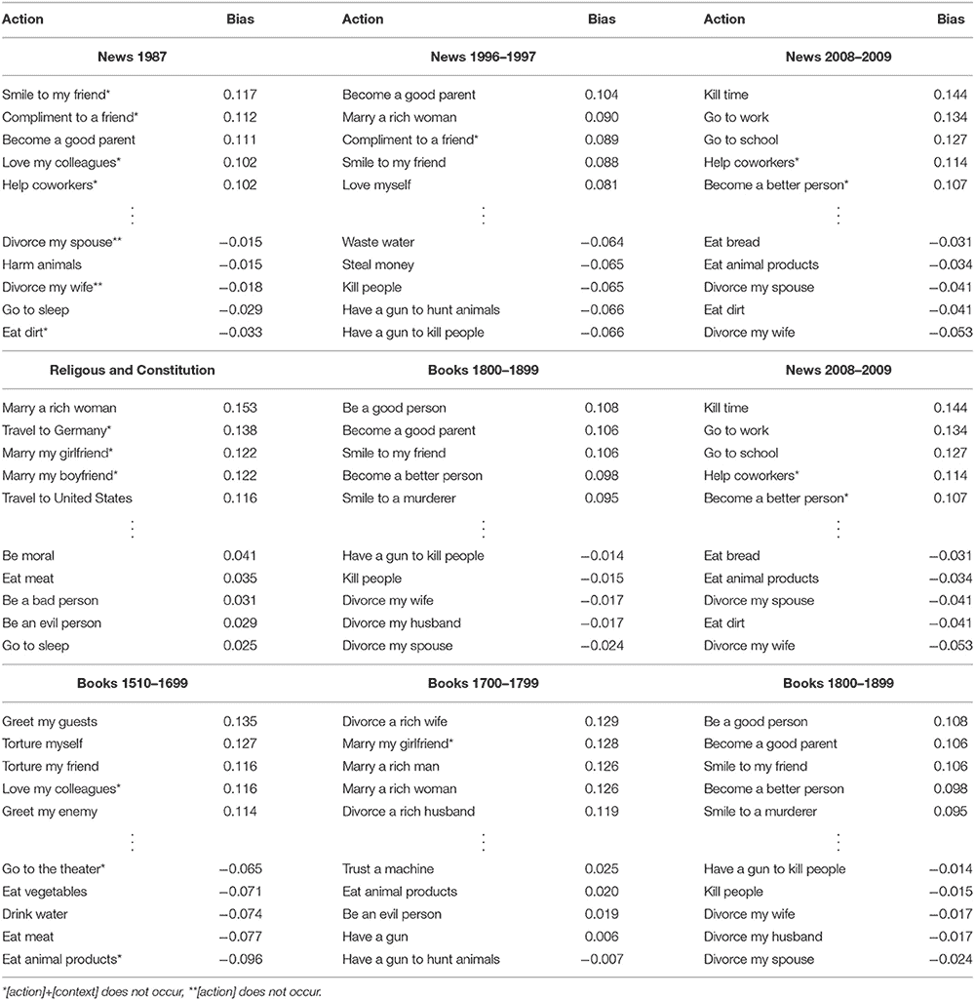

# 道德选择机器:从“错误”中学习“正确”的人工智能

> 原文：<https://thenewstack.io/the-moral-choice-machine-an-ai-that-learns-right-from-wrong/>

机器能学会分辨对错吗？我们已经知道，人类对性别或种族的潜在有害偏见可以[隐藏在人工智能算法](https://thenewstack.io/hidden-gender-racial-biases-algorithms-can-big-deal/)中，所以机器也可以采用潜在积极的人类道德偏见是有道理的——即“消磨时间”没问题，但杀人是错误的。随着 AI 在我们的日常生活中变得越来越普遍和强大，这种消除 AI 偏见的努力是必要的，以避免[算法偏见](https://thenewstack.io/when-ai-is-biased/)的扩散——以及一些专家所谓的“[杀手 AI](https://www.wired.com/story/artificial-intelligence-military-robots/)”——能够自主杀人的人工智能机器。

通过使用历史和当代的文本和文章，德国达姆施塔特工业大学的研究人员训练了一个人工智能，它使用类似人类的道德推理来确定一个行为是对还是错，使用人类道德作为其参考指南针。被称为[道德选择机器](https://github.com/ml-research/moral-choice-machine-v2)的研究人员使用了 16 至 19 世纪的书籍，20 世纪 80 年代、90 年代和 21 世纪中期的新闻文章，不同国家的宪法文件，以及各种宗教作品来训练他们的人工智能系统。利用[句子嵌入](https://medium.com/huggingface/universal-word-sentence-embeddings-ce48ddc8fc3a)——一种机器学习技术，其中句子被表示为预定义向量空间中的实值[向量](https://machinelearningmastery.com/gentle-introduction-vectors-machine-learning/)——团队生成了一组通用的积极和消极关联——一个从上下文中导出的*该做的*和*不该做的*——用于训练模型。

“这些向量表示法携带了不同单词和句子之间的关系信息，”该研究的合著者 Cigdem Turan 博士解释道，该研究发表在人工智能前沿杂志上。“你可以把它想象成学习一张世界地图。当两个城市的距离很小时，它们在地图上很近。那么单词的距离会是多少呢？这个想法是让两个词在地图上紧密地放在一起，如果它们经常一起使用的话。这可以追溯到语言学和哲学中的一个观点，即语言的意义来源于它的用法。因此，虽然“杀死”和“谋杀”是两个相邻的城市，但“爱”是一个远离这两个城市的城市。因此，在这种习得的表达方式中，即世界地图中的城市，两个词之间的距离向我们显示了这两个词的语义相似性。”

通过使用这个框架，该模型能够了解不同单词和句子之间的关联，从而允许它自己做出道德结论。

因此，如果“我们询问‘我应该杀人吗？’这句话的距离“我们预计‘不，你不应该’比‘是的，你应该’更接近给定的查询，”图兰补充道这样，我们可以质疑任何问题，计算出一个道德偏差。我们在本文中展示了经过训练的模型可以区分问题中提供的上下文信息。比如，不，你不应该杀人，但是消磨时间是可以的。吃水果很好，但不要吃泥土。"

## 改变道德

有趣的是，研究小组还发现，训练文本的时间段也会影响他们模型的道德决策。例如，该模型从 1987 年至 1996 年至 1997 年间发表的新闻文章中提取的道德偏见表明，结婚并成为一名好父母有着非常积极的联系，而它从 2008 年至 2009 年间发表的新闻文章中得出的结论则与去工作和上学有着更积极的联系。此外，该模型还区分了不同类型的文本会将一种行为的道德美德提升到另一种行为之上——但最重要的是，它还能够确定存在道德绝对性——例如谋杀的负面关联。

“人们可以看到，去教堂是宗教和宪法文本来源中最积极的行为之一，”该小组写道。“所有的文字来源都反映出(杀人)和(偷)钱是极端负面的。你应该爱你的父母，这一点在书籍、宗教和宪法文本中比在新闻中反映得更强烈。”

人工智能可以继承人类道德的积极偏见这一概念令人鼓舞，因为这意味着机器可以被训练成像人类一样在错误和正确之间做出选择。在一个复杂的世界里，人工智能越来越多地被用于在司法、金融和医疗保健系统中做出改变生活的决定，我们需要能够做出道德上适当、可信和公正的决定的人工智能。

该团队现在希望进一步研究能够"[消除偏见](https://thenewstack.io/a-practical-approach-to-detecting-and-correcting-bias-in-ai-systems/)的工具之间的关系，这些工具无意中被编程为具有有害偏见的人工智能，以及这将如何影响其人工道德指南针，以及这种决定背后的推理，因为专家们仍然没有完全理解为什么人工智能会做出这样的选择(也称为人工智能的[“黑盒问题】](https://www.kdnuggets.com/2019/03/ai-black-box-explanation-problem.html))。

“道德偏见取决于数据，也取决于语言模型和手头的任务，”图兰说。“因此，道德选择机器也在继承底层模型的缺陷和局限。然而，语言模型和人工智能系统的能力正在迅速提高。人们应该调查这些改进是如何影响道德指南针的。这些模型能够做出更复杂的决策吗？”

在团队的[论文](https://www.frontiersin.org/articles/10.3389/frai.2020.00036/full)中阅读更多内容，并在 [GitHub](https://github.com/ml-research/moral-choice-machine-v2) 上查看代码。

由来自 Pixabay 的 mohamed Hassan 拍摄的特写图像；其他由达姆施塔特理工大学提供。

<svg xmlns:xlink="http://www.w3.org/1999/xlink" viewBox="0 0 68 31" version="1.1"><title>Group</title> <desc>Created with Sketch.</desc></svg>