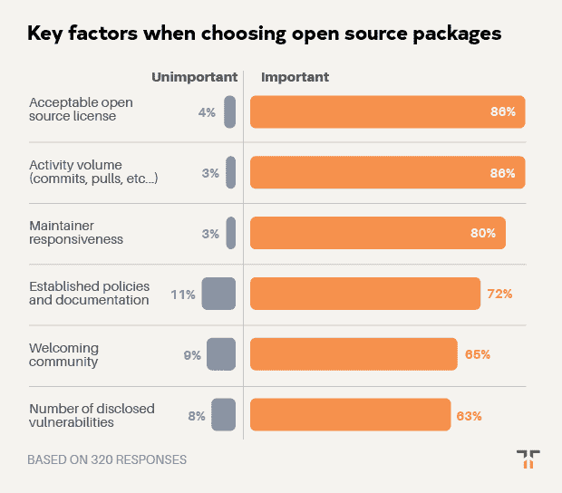
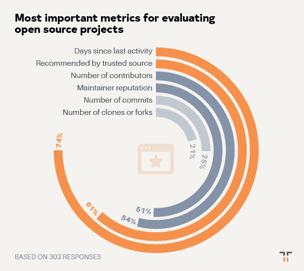
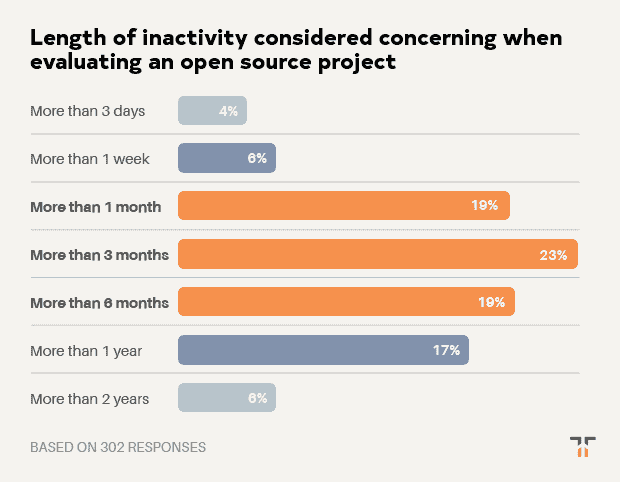

# 选择新的开源项目时最重要的因素

> 原文：<https://thenewstack.io/the-most-important-factors-when-choosing-a-new-open-source-project/>

Tidelift 赞助了这篇文章。

*2019 年 6 月，Tidelift 和 New Stack 联合开展了一项专业软件开发人员调查。近 400 人回答了他们今天如何使用开源软件，是什么阻碍了他们，以及什么工具和策略可以帮助他们更有效地使用它。特别是，通过这次调查，我们有兴趣了解一个[管理的开源战略](/how-managed-open-source-boosts-developer-productivity-and-saves-money/)如何帮助开发者回收时间，加快开发，并降低风险。*

 [克里斯·格拉姆

克里斯是 Tidelift 的营销主管。Chris 在创建开源技术公司方面拥有超过 20 年的经验，包括在 Red Hat 和技术品牌代理 New Kind 各工作了 10 年，在那里他帮助创建了 Ansible、NGINX 和 Anaconda 等品牌。](https://tidelift.com/) 

在本帖中，我们分享八个关键发现中的第五个。如果你不想等待剩下的结果，你可以点击下面的链接下载完整的调查报告。

**发现#5:项目活动、许可和维护者响应是选择开源项目的关键因素。**

鉴于受访者在本次调查的早期发现中描述的维护难题，避免它们的一个显而易见的方法是首先选择好的软件包。在我们调查的下一部分，我们要求开发者告诉我们更多关于他们如何决定使用哪个开源包的信息。

关于这个主题的第一个问题是，当开发人员选择包时，一些关键的项目特性有多重要。

当谈到选择软件包时，许可是最关键的问题:61%的受访者表示拥有一个可接受的软件许可极其重要。另有 25%的人认为许可有些重要，总共有 86%的人认为开源许可非常重要或有些重要。只有 4%的受访者不认为这是一个重要问题。

这对拥有 1000 多名员工的公司尤其有意义，78%的受访者表示拥有一个可接受的开源许可证极其重要。这些发现清楚地表明，有一些“dealbreaker”许可是大多数用户试图避免的。

> 当谈到选择软件包时，许可是最关键的问题:61%的受访者表示拥有一个可接受的软件许可极其重要。另有 25%的人认为许可有些重要，总共有 86%的人认为开源许可非常重要或有些重要。

虽然活动(例如，最近和大量的问题、提交和拉取请求)在总体重要性上与许可相关(86%)，但它比许可具有更低的“极其重要”评级百分比(43%)。

选择开源包时同样重要的是维护者的响应能力，80%的受访者认为在选择使用开源包时，这一点非常重要或有点重要。其次是既定的政策和文件(如行为准则、贡献指南)，72%的受访者认为这一特征很重要。

按重要性排序的最后两项是拥有一个受欢迎的社区(65%被评为重要)和一些已披露的漏洞(63%)。虽然这两个选项的排名都没有其他选项高，但有趣的是，几乎三分之二的受访者仍然认为这些是选择开源项目时要考虑的关键因素。

我们想更深入地了解开发人员如何分析项目活动。因此，对于那些认为这是关键特征的人，我们继续询问他们以下哪些活动指标对他们最重要。

总的来说，74%的人在决定使用开源项目时会考虑自上次活动以来的天数。虽然这是回答者认为项目处于活跃状态的一个低门槛，但它确实很快排除了许多项目。

另一个后续问题是，当评估一个开源项目的健康状况时，自上一次活动(例如，提交、发布)以来的时间长度与他们有关。结果绘制成一条均匀分布的曲线，最大的受访者群体属于“超过三个月”一类。

受访者在评估开源项目时考虑的其他重要因素包括由他们尊敬的人推荐(61%)、贡献者数量(54%)和拥有良好声誉的维护者(51%)。

总的来说，这些数据表明，开发人员在选择开源包时花了很多心思，他们知道好的选择将有助于他们避免维护、安全和许可方面的麻烦。

但是这里有没有另一个机会来为开发人员提供额外的方法来帮助他们对包做出更好的选择——并且有更好的、更积极维护的包可供选择？我们认为是的。

想在一份报告中获得完整的调查结果吗？[让他们现在就过来](https://tidelift.com/subscription/managed-open-source-survey)。

泰勒·拉斯托维奇在 [Unsplash](https://unsplash.com/s/photos/activity?utm_source=unsplash&utm_medium=referral&utm_content=creditCopyText) 拍摄的照片。

<svg xmlns:xlink="http://www.w3.org/1999/xlink" viewBox="0 0 68 31" version="1.1"><title>Group</title> <desc>Created with Sketch.</desc></svg>