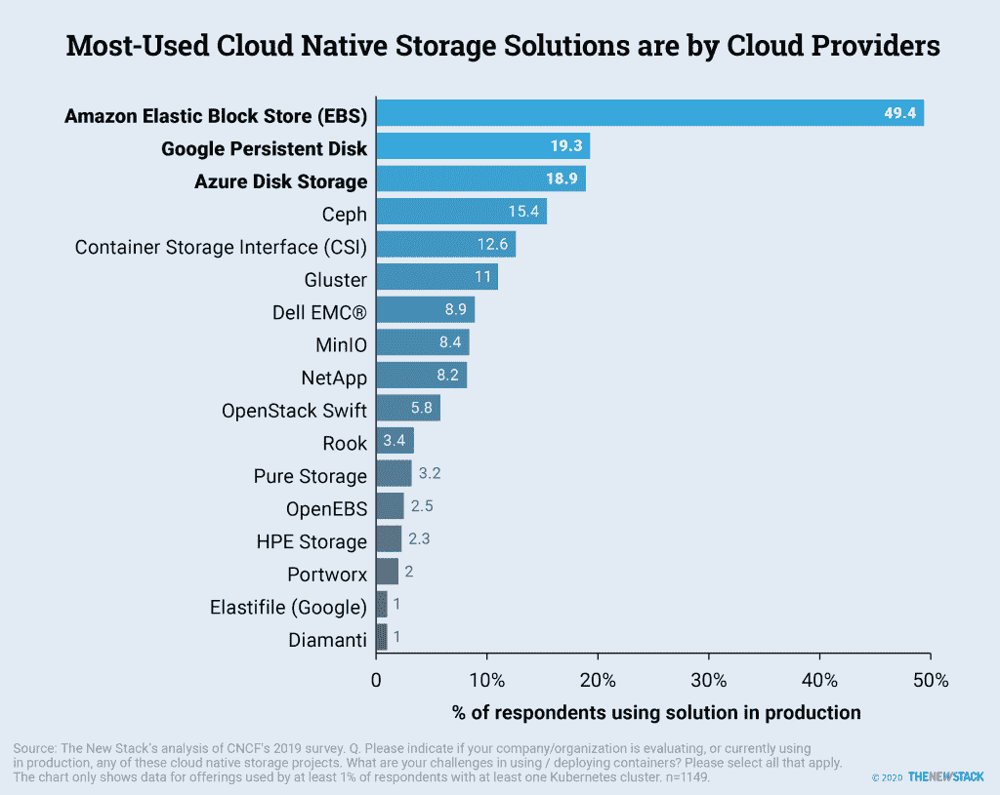
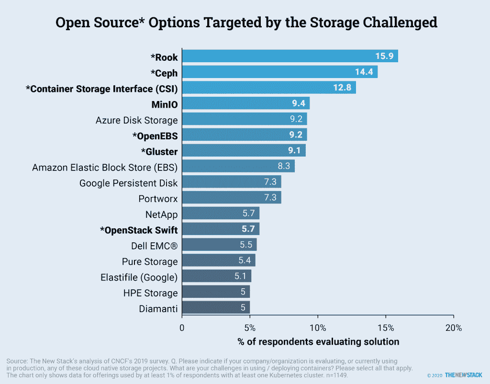

# 最受欢迎的云本地存储解决方案

> 原文：<https://thenewstack.io/cloud-native/the-most-popular-cloud-native-storage-solutions/>

存储是[容器即服务平台](https://thenewstack.io/what-is-the-modern-cloud-native-stack/)最关键的组件之一。容器原生存储向容器和微服务公开底层存储服务。与软件定义的存储一样，它聚合并汇集来自不同介质的存储资源。

容器原生存储通过提供持久卷，支持有状态工作负载在容器内运行。结合 Kubernetes 原语，如 [StatefulSets](https://kubernetes.io/docs/concepts/workloads/controllers/statefulset/) ，它提供了在生产环境中运行任务关键型工作负载的可靠性和稳定性。

除了容器运行时，容器原生存储和容器原生网络构成了云原生堆栈中容器优化操作系统之上的层。

尽管 Kubernetes 可以使用传统的分布式文件系统，如网络文件系统(NFS)和 GlusterFS，但我们建议使用容器感知存储结构，该结构旨在满足生产中运行的有状态工作负载的需求。客户可以从各种开源项目和商业实现中进行选择。

## 容器原生存储解决方案

云原生生态系统通过[容器存储接口](https://github.com/container-storage-interface/spec) (CSI)定义了存储规范，该接口鼓励采用标准、可移植的方法来通过容器化的工作负载实施和使用存储服务。

Ceph、 [Longhorn](https://github.com/longhorn/longhorn) 、 [OpenEBS](https://openebs.io/) 和 [Rook](https://rook.io/) 都是一些容器原生存储开源项目，而 MayaData 的 [Kubera](https://mayadata.io/product) ，NetApp 的 [Trident](https://netapp-trident.readthedocs.io/en/stable-v20.07/) ，Red Hat 的 [Portworx](https://portworx.com/) 、[容器存储平台](https://www.redhat.com/en/technologies/cloud-computing/openshift-container-storage)，Robin System 的 [Robin](https://robin.io/) 和 [StorageOS](https://storageos.com/) 都是商业项目

传统厂商如 [NetApp](https://www.netapp.com/us/index.aspx) 、 [Pure Storage](https://www.purestorage.com/) 、 [VMware](http://bit.ly/2Rqhnu3) 也为 Kubernetes 提供存储插件。

## 应对基础设施挑战

托管 Kubernetes 产品可以降低管理大型容器部署所需的复杂性和技能。当 IT 专业人员评估他们的技术路线图时，简化支持 Kubernetes 工作负载的基础设施是最重要的标准之一。

我们将关注来自 [2019 云本地计算基金会调查](https://www.cncf.io/wp-content/uploads/2020/03/CNCF_Survey_Report.pdf)的数据，这些数据涉及当前和未来的 Kubernetes 采用计划，以及 Kubernetes 用户面临的容器挑战。结果表明，早期的技术采用受到当时的供应商关系的影响。然而，对这些早期选择的满意程度参差不齐。

许多 Kubernetes 用户将他们当前的存储和云供应商列入了他们的云原生候选名单。然后，用户似乎很难缩短列表。至少有 5%的 Kubernetes 用户对调查中的 38 个选项进行了评估。

随着托管 Kubernetes 的兴起，云提供商通过存储类和动态预配置公开了块存储。客户可以将亚马逊弹性块存储(EBS)卷附加到 AWS、Azure 托管磁盘、谷歌持久磁盘上，以及运行在 AWS、GCP 和微软 Azure 上的 Kubernetes 工作节点上。这给了云提供商一个优势。

当被问及他们使用的云原生存储时，亚马逊 EBS、谷歌持久磁盘和 Azure 磁盘存储被 Kubernetes 用户称为使用最多的。在许多情况下，StatefulSets 允许集群工作负载访问云提供商提供的块存储。虽然被广泛采用，但大型云提供商的块存储并不是专门为 Kubernetes 工作负载设计的。

接下来是 Ceph、CSI 和 Gluster，37%的 Gluster 用户也使用 Ceph。Ceph 和 Gluster 是分布式文件系统，它们跨多个节点添加了一个持久层。但是，它们没有很好地集成到 Kubernetes 工具和工作流中，因此存储管理员可能会发现它们更难维护和配置。

与更传统的存储公司的产品相比，Ceph 这样的文件系统通常被视为云存储的竞争对手。来源:新堆栈对 CNCF 2019 年调查的分析。问:请指出贵公司/组织是否正在评估或目前在生产中使用这些云原生存储项目。您在使用/部署容器时面临的挑战是什么？请选择所有适用的选项。该图表仅显示了至少 1%的受访者使用的产品数据，这些受访者至少拥有一个 Kubernetes 集群。n=1149。

排名靠后的是专注于存储的老牌公司，如戴尔、EMC、NetApp 和 Pure Storage。最初，Kubernetes 集成了卷插件来连接这些公司的存储后端。不幸的是，上游的 Kubernetes 发行版变得臃肿，这意味着对插件的任何微小更新或更改都意味着重新构建和编译整个代码。

传统存储公司的客户更有可能抱怨存储挑战。例如，46%的纯存储客户在处理与容器相关的存储时遇到了挑战，相比之下，Kubernetes 的普通用户只有 27%遇到了挑战。不过也有希望，因为 13%的人使用了集装箱存储接口(CSI)。CSI 在 2019 年开始普遍适用于 Kubernetes，并消除了不断需要集成上游的挑战。传统存储供应商、云提供商和 Portworx 等纯容器存储公司正在转向 CSI。

CSI 让人们开始考虑评估新的方案，以应对当前的集装箱存储挑战。总体而言，只有 13%的 Kubernetes 用户在考虑 CSI，而在面临存储挑战的用户中，这一比例跃升至 22%。

虽然一些老牌公司正在考虑，但开源项目是那些寻找新存储选项的人的首选。与普通受访者相比，27%面临存储挑战的 Kubernetes 用户更有可能评估 Rook (26%对 16%)、Ceph (22%对 15%)、Gluster (15%对 9%)、OpenEBS (15%对 9%)和 MinIO (13%对 9%)。这些开源努力显然不是由销售硬件的需求驱动的。

对于传统存储公司和新一代独特的云原生存储产品，用户更有可能提出存储挑战。但是，通过实施 CSI 等新方法，传统存储公司解决了客户的顾虑。虽然许多新产品的用户——如 MayaData 的 OpenEBS、Minio 和 Portworx——表示他们面临存储挑战，但他们可能指的是他们在连接传统数据存储时遇到的问题。

对于第三方最佳解决方案的早期采用者来说，实施挑战是常见的。随着时间的推移，评估新玩家的效力将会是一件有趣的事情。这可能会影响云和传统存储公司在这一领域留住客户的能力。

对提到存储挑战的 Kubernetes 用户的进一步分析(数据未显示)显示，在那些面临存储挑战的用户中，考虑 Rook、Ceph 和 OpenEBS 的比例高出 50%。三家都有 CSI 司机。

云本地计算基金会、戴尔、MayaData、Portworx 和 Red Hat 是新堆栈的赞助商。

<svg xmlns:xlink="http://www.w3.org/1999/xlink" viewBox="0 0 68 31" version="1.1"><title>Group</title> <desc>Created with Sketch.</desc></svg>