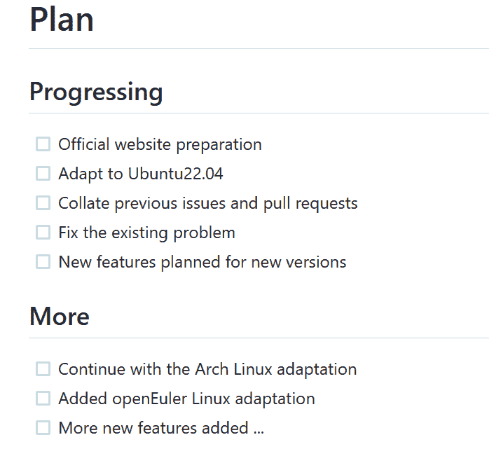
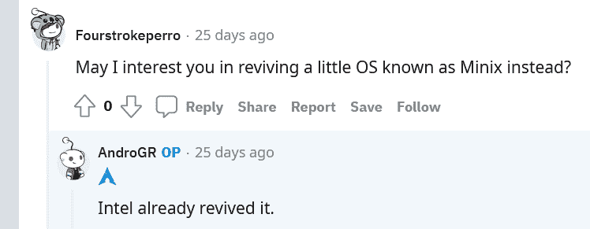

# 可爱鱼的神秘失踪和可能的回归

> 原文：<https://thenewstack.io/the-mysterious-disappearance-and-possible-return-of-cutefishos/>

有数百个 Linux 发行版——但是 Linux 粉丝真的不想放弃 CuteFishOS。当开发看起来停滞不前时，十个粉丝发起了一个分叉，以确保积极的开发将会继续。

但是现在看起来 CuteFishOS [背后的原始开发团队正在起死回生](https://github.com/cutefishos)——而那个分叉已经被[搁置](https://www.reddit.com/r/linux/comments/vwd0m8/i_am_about_to_fork_cutefishos_and_i_need_your_help/)。到底发生了什么——以及所有激动人心的背后是什么？在过去的四周里，人们对 CuteFishOS 的兴趣和兴趣与日俱增——也有机会看到开源社区动员起来，仅仅是为了填补一个感知的空白。

这是关于[的最新状态更新。](https://cutefish-ubuntu.github.io/)

## 令人惊讶的抛光

去年 9 月，Register 称其为“可爱的鱼”[令人惊讶的完美](https://www.theregister.com/2021/09/24/cutefishosreview/)，到今年 4 月，ZDNet 头条称其为“你将使用的最可爱的 Linux 发行版”，在一篇文章中称赞其 MacOS 风格的桌面“难以置信的优雅”。

“令人惊讶的干净(和可爱)的外观，加上非凡的易用性，使 CutefishOS 成为一个不可抗拒的选择，”ZDnet 热情地说。

科技博客*调试点*首先[注意到](https://www.debugpoint.com/cutefish-os-development-halts/)开发看起来“完全停止了”，GitHub 活动很少(尝试访问 CuteFishOS.com 时报告超时)。

迄今为止，可爱鱼的官方推特已经四个多月没有更新了。

就在周三，科技 YouTube 频道 Ksk Royal 抱怨说，文件管理器“完全坏了”，只能处理黑暗主题，即使这样“看起来仍然很奇怪”。

[https://www.youtube.com/embed/mOVDuDoFk5o?feature=oembed](https://www.youtube.com/embed/mOVDuDoFk5o?feature=oembed)

视频

但是上周日——7 月 31 日——它在 GitHub 上的官方知识库更新了一个新的公告。

"你最喜欢的可爱的鱼回来了！"[原文如此]

它还承诺“新网站正在建设中(即将推出)”并指向[一个新的网址](http://openfish.org/)。

你可以看到就在你眼前发生的变化。该网站的域名——OpenFish.org——是十天前，也就是 7 月 28 日星期四注册的，目前仍在建设中。周四下午，它指向了巴基斯坦云平台 QCloud 上的一个非英语页面，但周四晚上，它显示了一个运行 T4 红帽企业 Linux 的 T2 NGNIX HTTP 服务器的测试页面。

现在在 CuteFish 的 GitHub 资源库中还有一个新的 README 文件,列出了五个“进展中”的项目。第一项是“官方网站准备”，但其他项包括整理以前的拉请求和问题，“修复现有问题”，并最终添加新功能。这个库的唯一贡献者似乎是一个名为 [Biukang](https://github.com/biukang) 的中国程序员。

一名开发者特别注意到了这一声明——一名网名为 [Aggelos Tselios](https://github.com/AndroGR) 的 Reddit 用户。他早些时候宣布了自己启动 CuteFishOS fork 的计划，但“由于最初的开发者将自己完成所有工作，我不会继续我自己的 fork。”

十个不同的人早些时候同意帮助推出新的 fork，但 Tselios 的更新(对宣布 fork 的 Reddit 帖子说)说“考虑这个帖子被否决，除非项目再次消亡，也许我会再次 fork 他们……”

## 不是的叉子

距离 Tselios 最初的帖子(吸引了 1035 次投票和 396 条评论)还不到四周。)一名 Linux 粉丝本周添加了一条新评论，只是说他们对 fork 没有继续下去感到失望——但 Tselios 回应道，“我会毫无理由地重复工作。”

Tselios 将来可能会提出一些拉请求，“如果 Cutefish 想做任何改变，他们可以，我会帮助他们。”但是分叉并没有发生，Tselios 强调说。“不管怎样，我对这个项目不再感兴趣了，考虑到许多人[想要一个跨发行版桌面](https://old.reddit.com/r/linux/comments/vwd0m8/i_am_about_to_fork_cutefishos_and_i_need_your_help/ifpecv3/?context=3)而不是一个新的发行版。”

但该帖子中的数百条评论将永远保留为确保可爱鱼存活而付出的真诚努力——重温公共交换的一瞥也很有趣。

首先，他们用了不同的名字。(Cuddlefish？河豚？尼斯鲨鱼？)

但是实际的开发过程更加棘手。由于没有办法创建 CuteFish 的 ISO 映像，fork 渴望保留桌面、应用程序和其他软件(同时基于其他发行版)。“可爱的鱼毕竟只是 Ubuntu/Debian 的一个不同版本，没有太多不同，”Tselios [在 7 月 11 日](https://old.reddit.com/r/linux/comments/vvyc8b/rest_in_peace_cutefishos_you_were_amazing/ifoxu9x/)发帖称。“我们不需要制作一份完全相同的副本来维护它。”

对于那些强烈要求 Fedora 桌面版本的人，Tselios 写道“据我所知，Cutefish 有一些 Fedora 没有提供的非常奇怪的依赖。或许是这样，但祝你好运找到他们。”

八天后，Tselios [发布了一个更新](https://old.reddit.com/r/linux/comments/vwd0m8/i_am_about_to_fork_cutefishos_and_i_need_your_help/igt7u0k/)。“在 Arch Linux 上测试已经有很多问题，虚拟机对 Wayland 来说是一个噩梦，所以我不能添加一些非常基本的功能，没有文档或注释的非常糟糕的代码，以及数百人要求我实现其他发行版做不好的东西。”

有时，这超出了开发人员开始自己的分支的正常工作，Tselios 在本周接受 TNS 的电子邮件采访时详细阐述了这一点。

“最初我尝试从源码编译 Cutefish，主要是为了确认可以正常编译测试。不幸的是，这与现实相差甚远，因为桌面环境的工作方式会与我自己的桌面环境(当时是 KDE，目前我使用 GNOME)相冲突，因为添加了一些为 Cutefish 制作的 KWin 和 Qt 插件，使其无法使用。我不得不手动找到每一个新文件并删除它来修复我的桌面。

“我转而在虚拟机上进行尝试，但是性能限制意味着很难对桌面进行编程和测试。我试图通过简单地在虚拟机内部进行测试并在主机中编写代码来克服这一点，但在虚拟机中安装它将需要大量繁琐的工作。”

"我唯一取得的成就是一次相当糟糕的韦兰会议."

在我们的采访中，Tselios 补充说，他甚至在宣布 fork 之前就已经试图联系最初的开发者了——但是从来没有收到回复。这种持续的无线电静默仍在继续。"直到今天，我还没有收到任何答复。"

到 7 月 28 日，Tselios 在 Reddit 上发帖称，“如果一开始就没有 fork，那么网站就没有任何意义，”当天晚些时候，他补充说仍然没有 GitHub 库，因为“该软件目前使用起来很糟糕，所以我只是在玩 Wayland 端口。”

本周，Tselios 说，整个体验过程是一种没有回报的旅程。“我以为这是一个已经死亡的项目，但它突然卷土重来——因此在此之前我所做的任何工作都没有真正的意义。现在唯一的选择就是让我自己的版本自生自灭。

“除此之外，没有进行任何重大的源代码更改，所以我甚至没有向他们的存储库提交任何东西。我大部分时间都被困在测试部分。”

但这仍然是一个显著的例子，说明持续发展几乎是通过社区为成功欢呼的纯粹力量实现的。回过头来看，Tselios 最终听起来很有哲理。“我是喜欢从零开始写东西的一类开发者；分叉几乎总是我避免的事情，因为我必须从头开始阅读源代码并了解其内部，这需要一些时间，这取决于项目的大小。

"可爱鱼也是一样，只是这次很多人想要合作."

<svg xmlns:xlink="http://www.w3.org/1999/xlink" viewBox="0 0 68 31" version="1.1"><title>Group</title> <desc>Created with Sketch.</desc></svg>