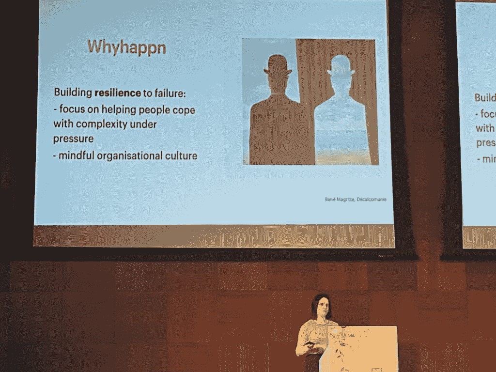

# 将人为错误从事故响应中分离出来的需要

> 原文：<https://thenewstack.io/the-need-to-decouple-human-error-from-incident-response/>

西班牙巴伦西亚——科幻小说可能是关于人类与机器的对决。然而，许多软件管理人员仍然很快将事故归咎于人为错误，而不是我们与之交互的机器的复杂性。

在我们了解[倦怠](https://thenewstack.io/this-cant-be-normal-the-tech-industry-after-a-year-of-burnout/)和[心理安全](https://thenewstack.io/5-ways-to-build-psychological-safety-at-fast-moving-startups/)对团队的影响的时候，发现[根本原因分析](https://thenewstack.io/the-power-of-the-debriefing-to-get-at-root-causes/)中包含的“人为错误”只是一件坏事。指责游戏必须结束，因为它会破坏团队和组织的弹性。

独立软件工程师西尔维娅·皮娜在她闪电般的演讲“Whyhappn 而不是 Whodunnit”中恳求 kube con+CloudNativeCon Europe 2022 观众从他们的词汇中删除术语人为错误。因为当我们谈论具有未知的未知和日益复杂的攻击载体的一贯复杂的系统时，它不能归结为仅仅一个人。

[正如 Charity Majors 所主张的](https://thenewstack.io/charity-majors-recipe-for-high-performing-teams/)，软件交付和所有权的最小单位是团队。是时候将我们的关注点从责备个人转移到应用 Pina 的系统思维和组织心理学的观点来增加弹性。

## 甚至航空业也不再谈论人为错误了

技术上的人为失误这个概念是从航空业改编过来的。“因为系统或机器被认为是真正可靠的，所有的安全问题都来自于人类在操作它，所以人类是薄弱环节，”皮纳解释说。或者至少我们被认为是。

随着时间的推移，航空中的人为错误从失败的原因变成了失败的征兆。安全不再被认为是系统固有的，因此进步被重新定义为对工具、任务和环境交互方式的更好理解。

唉，人为错误仍然被应用于软件事故背后的原因。

“这就像阿加莎·克里斯蒂的故事，试图找出谁犯了罪，或者，在这种情况下，事件，”皮纳说。“这与一种陈旧的人为错误观点有关，这种观点来自要求高可靠性的航空业。”可靠性当然是软件工程中的一个要求，但不是满载乘客的飞机所要求的 100%正常运行时间。

像航空一样，分布式软件系统具有高度的复杂性。但是这些系统也有很大的可变性。“这种程度的可变性需要一定程度的调整，”她说。“这是我们成功的原因之一，但也是有失败的原因之一。”团队必须接受失败总会发生的事实，不管他们做了什么计划来应对失败。

还有拥抱失败——在软件工程中，而不是航空——作为一个实验和学习的机会。这甚至是现场可靠工程实践的一个关键部分，允许[误差预算](https://thenewstack.io/how-to-correctly-frame-and-calculate-latency-slos/)，应用[可观测性](https://thenewstack.io/category/monitoring/)和[混沌工程](https://thenewstack.io/chaos-engineering-can-give-distributed-systems-stability/)通过将系统推向极限以及有时的失败来更好地学习。

## 高绩效组织的心理安全

成功和失败被更好地理解为一枚硬币的两面。皮纳称这种对人为错误的新观点更像是“无观点”。我们不再需要把人为错误作为事后分析的一个类别。

“我们应该把注意力从个人身上移开，试着看看组织能做些什么，”她说。

在这个层次上，她建议考虑[高可靠性组织](https://psnet.ahrq.gov/primer/high-reliability)[共有的五个特征](https://thenewstack.io/googles-formula-for-elite-devops-performance/)，它们是:

1.  全神贯注于失败——尝试识别技术、过程或人的层面上所有可能失败的警告信号
2.  不愿简化—拥抱复杂性，不要寻找简单的答案，理解专业化、技能提升和培训以及自动化的需求
3.  对运营敏感——保持全局观点，并着眼于理解[已完成的工作](https://thenewstack.io/can-sre-bring-governance-and-compliance-into-the-future/)、[接受坦诚的员工反馈](https://blog.kainexus.com/improvement-disciplines/hro/5-principles)
4.  致力于恢复能力——失败成为学习的机会，团队不断寻找更快恢复的方法
5.  尊重专家意见——任何人都可以提问或提供答案，专家意见比权威更有价值

皮纳解释说:“失败在这些(精英)组织的工作方式中扮演了一个角色。“我们通过专注于帮助人们在压力下应对复杂性来建立对失败的适应能力。”

她说，这意味着在组织层面保持意识，并在整个过程中传播经验教训。考虑到这一点，[无可指责的尸检](https://thenewstack.io/top-12-best-practices-for-better-incident-management-postmortems/)对于了解事故的根本原因至关重要。事后分析是持续学习和改进事件响应的重要机制，但前提是不要相互指责。

皮纳说:“我们从这种人类特有的判断倾向发展到了能够理解为什么会发生失败的地步。”"这就是为什么我们不再需要谈论人为错误."

这也是为什么[零信任文化](https://thenewstack.io/how-to-build-a-zero-trust-culture/)致力于摆脱人类是任何安全链中最薄弱环节的假设，更致力于让安全成为每个人的工作。然后从技术层面，加强协作治理。是的，[人为错误是 Kubernetes 安全事故的主要原因](https://thenewstack.io/red-hat-human-error-a-leading-cause-of-kubernetes-security-mishaps/)，但那是因为编排系统在安全意识默认方面非常薄弱。

[红帽](https://www.openshift.com/try?utm_content=inline-mention)甚至发现这些 Kubernetes 事件都是[误配置事件](https://www.redhat.com/rhdc/managed-files/cl-state-kubernetes-security-report-ebook-f29117-202106-en.pdf)造成的。但是如果这是一个重复的错误，这是一个系统性和程序性的问题——以及一个技术问题——而不是一个队友的错误。高绩效的组织明白他们必须改进流程和技术作为回应，而不是玩指责游戏。

心理安全对于建立组织对失败的复原力至关重要。皮纳说，因此，帮助人们应对压力下的复杂性是领导者的工作。

她解释说，将人为错误与事件响应分离会获得视角，你会从新的角度看待事物，就像勒内·马格里特的画作一样。

<svg xmlns:xlink="http://www.w3.org/1999/xlink" viewBox="0 0 68 31" version="1.1"><title>Group</title> <desc>Created with Sketch.</desc></svg>