# 全球新冠肺炎疫情的网络影响

> 原文：<https://thenewstack.io/the-network-impact-of-the-global-covid-19-pandemic/>

随着如此多的国家处于封锁状态，如此多的人在家工作(和学习)，在线使用已经显著增加，但迄今为止，互联网保持良好。

上网流量普遍比平时高 25%到 30%，我们在网上做的事情也在变化。互联网的使用通常在一个典型的月内增加；对于 Akamai 来说，通常是 3%的增长，上个月增长了 30%。2019 年 3 月，他们的峰值流量为 82Tbps 今年 3 月为 167Tbps，持续的每日流量高于去年 3 月的峰值。3 月 9 日左右，阿姆斯特丹、法兰克福和伦敦的互联网交易量增加了 10-20%。意大利被隔离的当天，米兰的交易量增加了 40%。

令人不安的是，攻击也在增加:Akamai [在 2 月和 3 月之间的每日 DDoS 攻击增加了 20%](https://www.nokia.com/blog/network-traffic-insights-time-covid-19-april-9-update/),诺基亚测量增加了 40%。 [Cloudflare 跟踪](https://www.cloudflare.com/builtforthis/)的互联网流量增长因城市而异；1 月初至 3 月末，柏林和伦敦的失业率分别上升了 11%和 22%(英国整体上升了 17%)，但纽约和旧金山及硅谷的失业率分别上升了 40%和 48%。事实上，在全球范围内，Cloudflare 首席技术官 [John Graham-Cumming](https://www.linkedin.com/in/john-graham-cumming-519779177/?originalSubdomain=pt) 表示增幅在 20%到 70%之间。

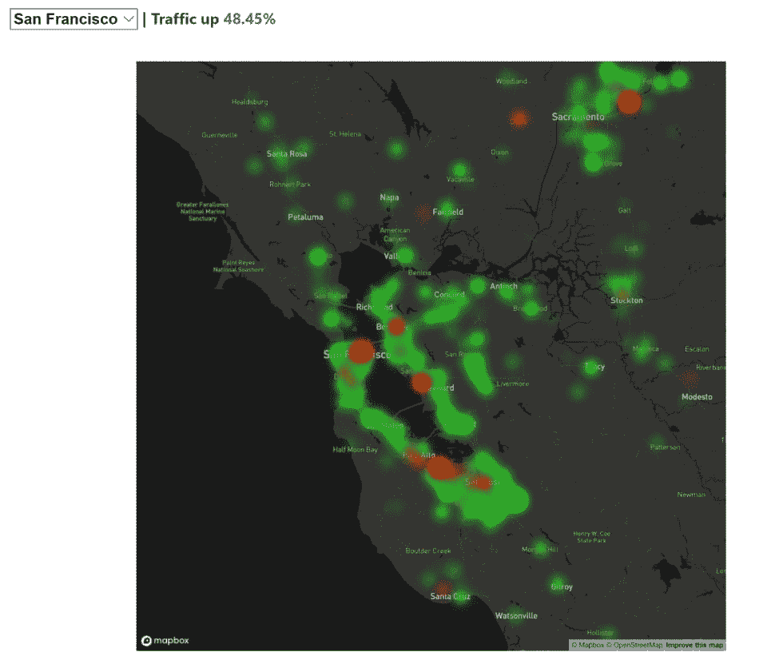

你也可以看到人们联系方式的改变；住宅区的使用率上升，但在旧金山市中心、圣何塞市中心，尤其是苹果和谷歌总部所在地库比蒂诺和山景城附近，使用率明显下降。格雷厄姆-卡明说，大学里的用法是“在夏季长假的周日下午”才会看到的。总的来说，美国的互联网使用率从一月份开始上升，并且仍在上升。

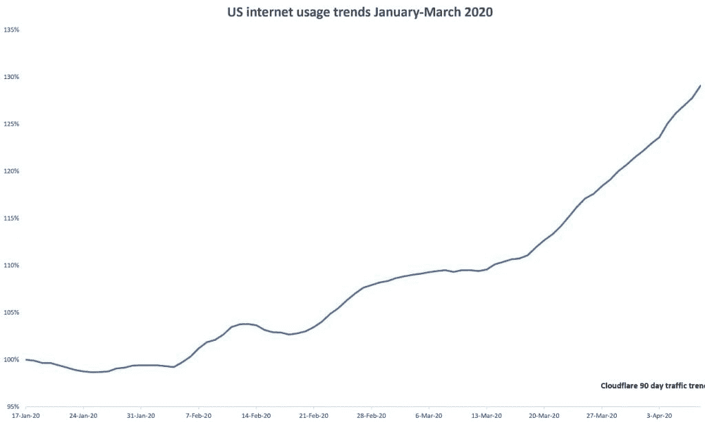

## 我们在网上做什么

Windows 虚拟桌面服务的使用量增加了两倍，Azure 的使用量在 3 月份增加了几百万个内核，团队会议以指数速度增长:从 3 月 12 日的 5.6 亿分钟和 3 月 16 日的 9 亿分钟，增加到 3 月 31 日的 27 亿分钟。Google Meet 每天有 20 亿分钟的使用时间，Skype 每天有 4000 万用户(从 2 月到 3 月增长了 40%)，Skype 到 Skype 的通话时间增长了 220%。

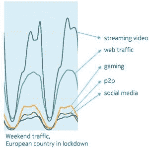

图片由诺基亚提供。

也许是为了寻找更私人的联系，现在有两倍多的人在团队中打开视频，视频通话在 3 月份增加了 1000%以上。Azure Stream 会议越来越大:微软不得不将一次会议的用户限制从 10，000 人提高到 100，000 人。仅在美国。所有的视频会议正在改变互联网流量模式。根据诺基亚的数据，三月份美国的上游流量增加了 30%;在欧洲的一些地区，自 3 月初以来，每个用户的平均上行流量已经从 1.1 兆比特/秒的峰值上升到 1.7 兆比特/秒(并且一天中的很长一段时间都保持在这个水平上)。)

游戏流量是上升了，但据诺基亚称，它被仅仅浏览网页的人盖过了；除了视频流，网络流量是产生流量最多的东西。Akamai 的流量表明，不仅现有的视频流媒体用户观看量显著增加，而且新订阅量也在上升。

威瑞森[的网络流量在一周内增长了 20%](https://www.verizon.com/about/news/how-americans-are-spending-their-time-temporary-new-normal),因为美国用户在三月份开始呆在家里，这仍然比平时高出 27%;由于员工在家工作，VPN 的使用率上升了 49%，视频上升了 36%，在线游戏上升了 115%。 [ThousandEyes](https://www.thousandeyes.com/) 监测云和 ISP 连接，并表示 VPN 的使用在全球范围内增长了五倍。

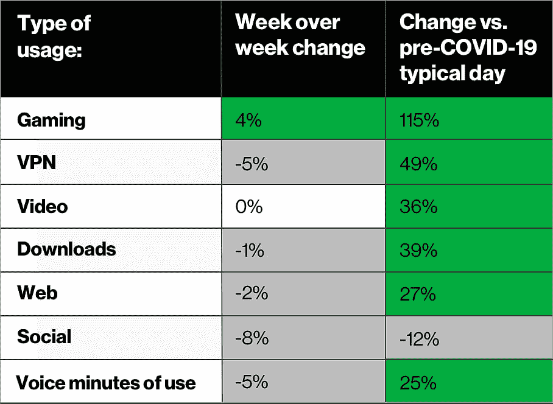

威瑞森的好意

甚至在政府下令封锁之前，沃达丰在英国的数据使用量就上升了 30%，在一些欧盟国家上升了 50%。根据 App Annie 的数据，全球范围内，3 月份我们下载的手机游戏数量同比增长了 30%,尤其是多人游戏，如《与朋友的对话》,但人们也在下载更多的购物应用、更多的健康和健身应用、更多的送餐应用、更多的理财应用，以及更多的视频会议应用。

我们正在访问不同类型的网站，搜索不同的东西，格雷厄姆-卡明告诉我们:娱乐、工作、健身和财务规划上升，体育、旅游和婚礼下降。“在锁定期开始时，我们看到育儿资源和教育资源大幅增加，特别是对年幼的孩子，因为家长们想知道我该如何对待我的孩子，然后他们想出了办法，这种情况就减少了。”

“急剧下降的事情与职业体育有关:篮球、棒球、足球，甚至是美国的足球——所有这些都急剧下降，因为没有比赛。其他下降较多的是寻找新公寓、买卖汽车、婚礼。”然而，人们对怀孕信息的兴趣正在上升。

这与美国银行关于支出变化的数据相吻合:杂货销售和在线电子产品上升(笔记本电脑需求很高，但供应有限)，旅游、服装和餐馆支出下降。

[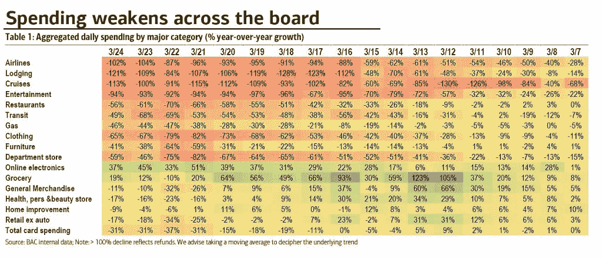](https://thenewstack.io/?attachment_id=10876534)

Akamai 总裁里克·麦康奈尔说，电子商务流量自然很高。“前几天，我和我们的一个大客户聊了聊，他说虽然商店都关门了，但他们的客流量却在增长，就像美国的网络星期一一样。客流量非常、非常高，因为这是他们的客户现在能够从他们那里购买的唯一方式。”

正如 Akamai 首席执行官 Tom Leighton 所说，“这些用例都不是新的，但它们的规模要大得多，如果它们以前不重要，现在就重要了。”

手机通话也增加了:威瑞森的 [8 亿次每日通话是网络在母亲节(一年中最繁忙的周日)看到的两倍，主要是打电话到会议号码。智能手机的使用普遍增加，但所有年龄段的笔记本电脑和台式机的使用也在增加:最近的全球网络指数研究](https://www.verizon.com/about/news/update-verizon-serve-customers-covid-19)[中，72%的千禧一代表示他们更多地使用手机，但 42%的人表示他们更多地使用笔记本电脑，31%的人使用台式电脑。](https://blog.globalwebindex.com/chart-of-the-week/device-trends-shaping-2020/)

Graham-Cumming 指出，由于人们在家，更多的移动设备通过 Wi-Fi 连接。

## 全世界，每时每刻

不仅仅是我们花在互联网上的时间和我们使用的不同服务发生了变化；一天中的时间也不同。Akamai 执行副总裁 Adam Karon 表示，以前的高峰时间是下午 5 点至晚上 11 点，现在全球范围内是早上 8 点至晚上 11 点。"几乎所有的在线停机时间都是在你睡觉的时候."

Cloudflare 在封锁区域发现了明显的早高峰和通常的晚高峰。沃达丰在英国的移动使用高峰过去是下午 6 点到 8 点，现在是中午到晚上 9 点。同样在英国，BT 的宽带日间数据流量上升了 60%，尽管这仍然只是平均晚间高峰使用量的一半。美国有线电视用户更多是在工作时间上网:根据 OpenVault 的数据，在 CDC 宣布新冠肺炎为疫情的那一周，3 月份上午 9 点至下午 5 点的使用率上升了 40%。

互联网的使用显示出一种清晰的模式，这种模式与类似的新闻以及封锁令相对应，这似乎在不同国家之间是一致的。

Akamai 将锁定前四个国家(中国、意大利、韩国和日本)的流量与全球互联网流量增长进行了比较。今年年初，也许是因为中国新年的庆祝活动，流量增长略低于世界其他地区，但当封锁开始时，流量增长比其他国家快 30%——直到其他国家也进入封锁状态，他们的流量增长赶上来。根据 App Annie 的数据，在 2 月份的前两周，中国苹果应用商店的每周应用下载量比去年增长了 40%。

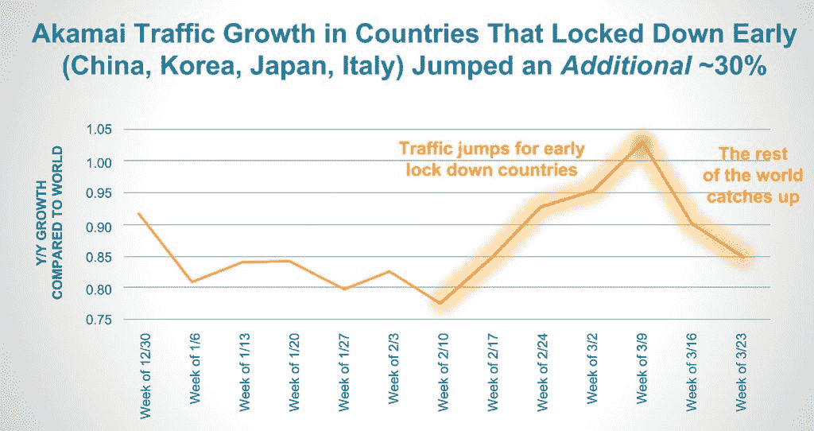

来自云辉的图像

同样的模式也出现在其他国家。格雷厄姆-卡明说，当荷兰政府宣布关闭非必要的企业，当法国总统宣布封锁时，人们观看和收听新闻时，互联网流量下降。

在锁定之后，诺基亚通过其 Deepfield 服务测量的工作日高峰互联网流量[立即上升 45-50%，周末晚上高峰流量上升 20-40%，但随后稳定在 20-30%的水平。Akamai 的 Amanda Goedde 说，Akamai 也看到了同样的情况:在法国和纽约，不同的渐进关闭公告出现了反复的高峰，然后是封锁，随后是流量的下降。](https://www.nokia.com/networks/solutions/deepfield/)

“人们花时间看新闻和视频，在家里适应新的工作环境。随着隔离协议的实施，总会出现流量高峰，一旦隔离协议实施，人们为新的正常生活做好准备，他们[安顿下来]满足家庭办公室、家庭教育和家庭娱乐的需求，随着协议开始生效，人们习惯于一直呆在家里，流量就会增加，”Goedde 说。

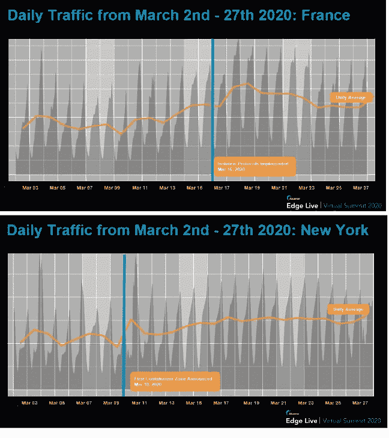

Akamai 提供

## 互联网还在发展

互联网被设计成可扩展的，但通常会有高峰。现在，Goedde 说，“这就像一个重大的博彩活动或每天的银行假日。”

Graham-Cumming 说，为了保持稳定，还有很多工作要做，但互联网还在继续。“互联网是网络的网络，所以整个互联网是伟大的。我们已经看到世界各地的交通流量大幅增长，很难想象还有其他网络，如电力或供水网络，能够如此好地适应需求的增长。”

Akamai 自己的网络性能在网络和移动流量上都保持良好。

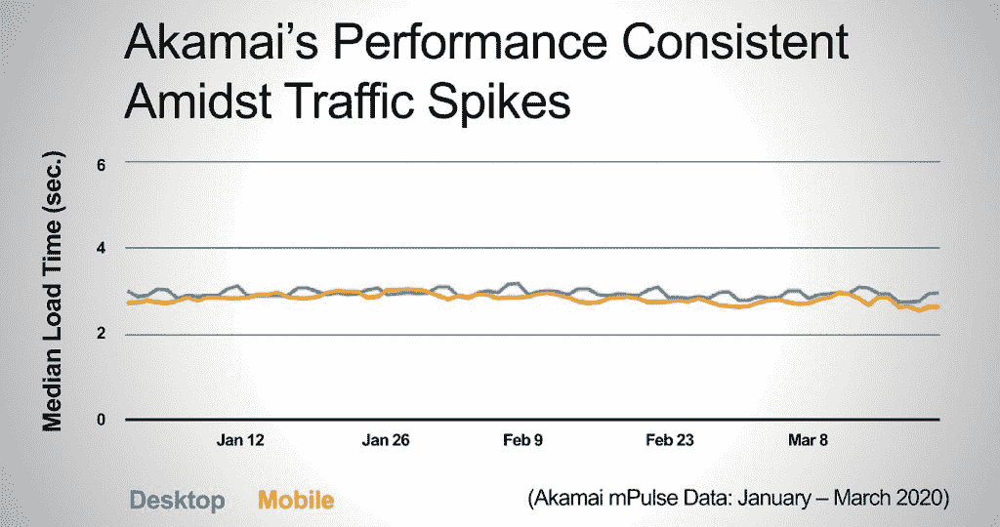

Akamai 提供

部分原因是电信公司、cdn、云计算和其他网络提供商正在升级基础设施；它们被归类为基本服务，因此安装和维护仍然可以进行。Graham-Cumming 告诉我们:“人们不鼓励做非必要的工作，但我们进入全球任何一个地点都没有问题。”

例如，微软预计从二月底开始，在七周的时间里，[已经将团队容量](https://twitter.com/SuperBahl/status/1240703363500478464)增加了 60 倍。

还主动减少了一些负载。为了优先考虑教育和医疗用途，微软对免费试用设置了一些限制，并调整了一些云服务功能(例如，OneDrive 中存储的文件缩略图仍会在文件浏览器中显示照片，但不会显示视频，游戏下载会在夜间提供)。

微软还从 5 月份开始暂停 Windows 可选非安全更新的早期测试版本，但这是为了让 IT 团队优先考虑安全更新，而不是节省带宽。

亚马逊、迪士尼+、网飞和 YouTube 等流媒体视频服务一直在降低比特率，以限制他们使用的带宽。但是，尽管比特率仍然低于通常的质量，诺基亚指出，由于网络继续很好地应对额外的需求，自网飞首次降低流质量以来，比特率已经上升了 11%。

格雷厄姆-卡明说，事实上，这种减少主要发生在欧洲；“在美国，我们没有看到这种情况，尤其是在康卡斯特这样的大型网络上。在英国，主要网络对自己的架构感觉良好。”同样，拥塞不在互联网主干或大型网络提供商，而可能在进入家庭的最后一英里，一些 ISP 可能没有足够的能力。

他说，为了避免问题，网络和发布视频和游戏等大型软件下载的人之间有很多行业合作。“网络真正试图避免的是多种事情同时发生。当热门游戏推出新版本时，他们已经看到了很大的流量，所以他们说‘让我们不要同时做这两件事:让我们不要流传输所有那些网飞视频，让两个游戏更新和一个新的操作系统都在早上八点钟出来’。”

虽然公共云的中断次数很少，但在过去的八周里，ISP 的中断次数一直在增加，T2 的产品营销总监 Archana Kesavan 告诉我们——但现在似乎趋于平稳。

她认为，事实上，一些中断时间如此之短，可能实际上是 ISP 在为流量上升做准备。“他们可能在后端进行了一些流量工程优化，这可能会导致数据包被丢弃或速率下降。这不一定是因为他们的网络严重拥塞，或者他们不堪重负，他们的基础设施无法处理激增的流量。”

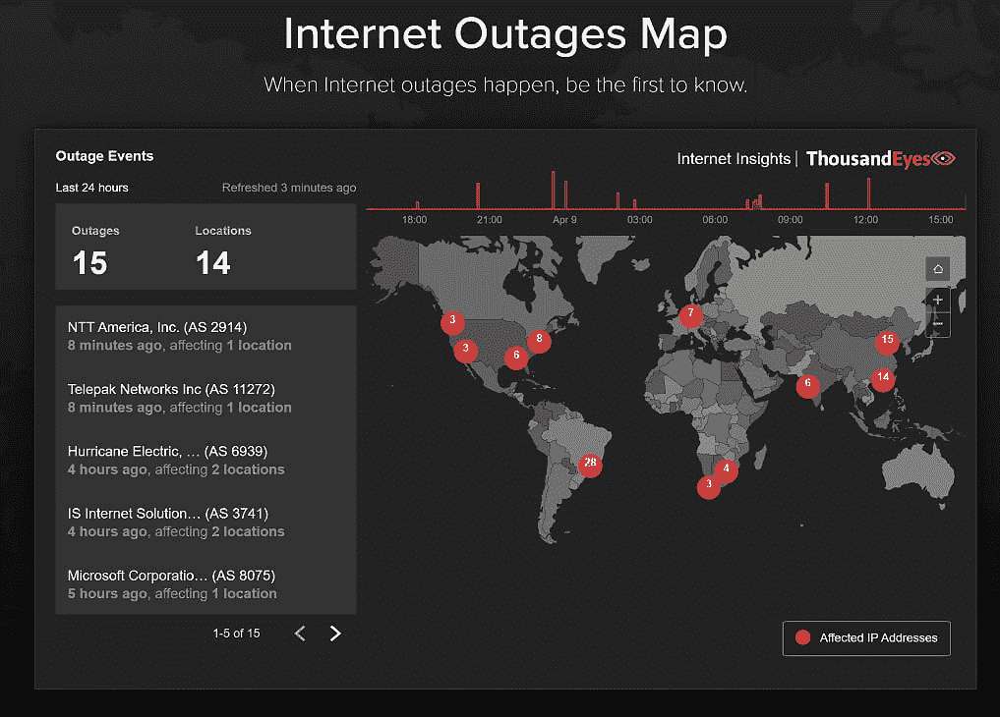

图片由千里眼提供

通信和视频会议服务出现了一些中断，主要是在美国。“交通流量肯定让他们更加紧张。互联网主干有能力处理所有这些流量，但某个特定的应用可能没有能力处理激增的使用量。”

根据数据显示，一些地区的网络下载速度下降很快:意大利一个月内下降了 34%，法国在全国封锁当天下降了 20%。西班牙、纽约和加州的互联网基础设施受到的影响要小得多:分别为 5.5%和 1.2%。再说一遍，这取决于进入家庭的最后一英里基础设施的质量。

如果你只使用移动宽带(这是移动运营商近年来一直在推动的)，你可能会发现网络拥塞和低带宽会将你拒之门外，比如 On24 notes CCS Insight 企业研究副总裁 [Nicholas McQuire](https://www.ccsinsight.com/blog/author/nickmcquire/) 。宽带和 LTE 仍然没有普及，[甚至在美国](https://www.microsoft.com/en-us/corporate-responsibility/airband/technology)。他渴望看到更多的提供商了解在线会议和视频工具在次优带宽下的表现。这不仅在疫情期间很重要，而且对于给一线工人提供工具也很重要。“我们不仅需要考虑云应用的可靠性，还需要考虑连接性。”

## 新常态？

展望未来，很难预测当封锁和就地安置订单增加时，互联网流量是否会下降。微软和 Akamai 都认为至少一些新的行为会持续下去。

“我认为我们将在这里经历一个阶跃函数，全球范围内的正常流量每年增长 30%至 40%，今年的增长将远远超过这一数字，阶跃函数将保持不变，并以正常的有机速度再次增长，”麦康奈尔建议道。

来自中国的早期数据表明这可能是真的。尽管中国解除了封锁，但 Teams 在中国的使用仍在增长，3 月底每天新增的 Teams 用户数量是 1 月份的两倍。随着社交聚会回归面对面，企业用户不再像以前那样需要人际接触，视频的使用可能会回落，但在线协作和远程工作将会继续。正如 Twitter 上一个流行的笑话所暗示的，新冠肺炎推动数字化转型的速度远远超过了许多首席执行官和首席技术官的管理速度，凯斯文对此表示赞同。

“新冠肺炎无疑加快了许多企业的数字化转型步伐；对他们来说，这是一种强制的功能，让他们勇往直前去做，而不是循序渐进。像 SD-WAN 部署这样的事情可能不是最先想到的，但围绕员工或远程工作人员或员工使用的任何事情，肯定会越来越多。”

上升的不仅仅是 VPN 的使用；各公司也在采用 Akamai、Cloudflare 和微软等供应商的云访问网关工具，让员工能够安全地远程访问通常位于防火墙后的应用程序。当您在周末为 30，000 名员工设置对几十个应用程序的远程访问时，您必须使用云工具，而不是将网关设备运送到数据中心。

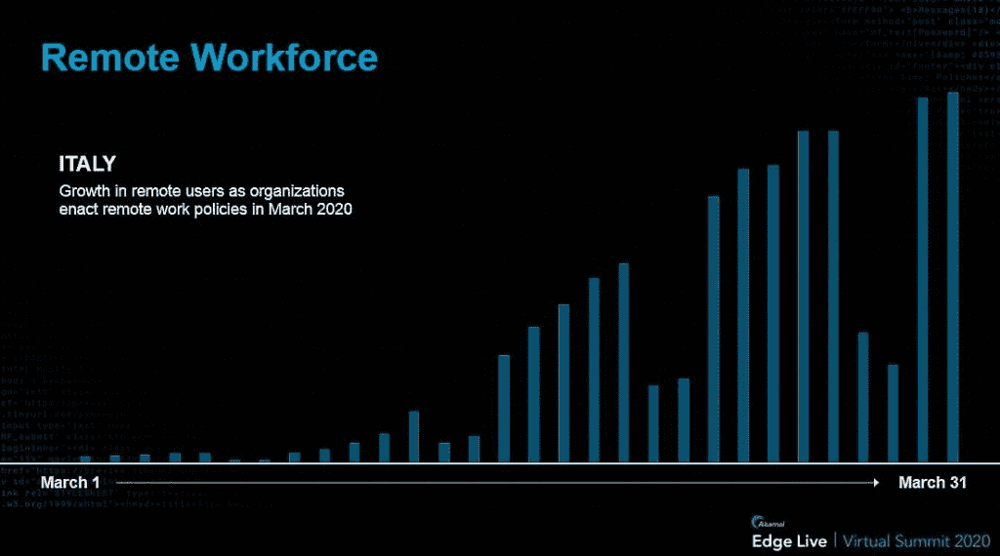

图片由 Akamai 提供

能够切换到完全远程工作的公司正在推动 Akamai 的应用网关平台流量增加 25%。但是，受到扩展 VPN 基础设施能力限制的组织不得不发挥创造力；Akamai 全球副总裁 Lelah Manz 说(她礼貌地称之为“次优”)，一些公司将员工分成两组，每隔几周给他们 VPN 访问权限。

但是在疫情时代，在家工作和普通的远程工作是不一样的。麦克奎尔说，在对在家工作做出初步调整后，公司需要开始更加关注员工在家的体验。

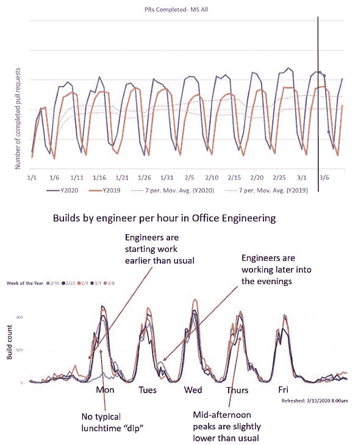

图片由微软提供

虽然微软研究发现，与 2018 年或 2019 年的同月相比，该公司的开发人员在 2020 年 3 月的“[生产率更高](https://twitter.com/SuperBahl/status/1247909736197967872)，随着该组织转向在家工作，全公司范围的拉式请求[保持在同一水平](https://www.microsoft.com/en-us/microsoft-365/blog/2020/03/20/helping-developers-stay-productive-working-remotely/)，但办公室团队的工程师也工作更长时间。其中一部分是上下班路上节省的时间；有些可能是忘记停下来吃午饭，没有熟悉的办公室惯例提醒你，在压力下工作不休息是不可持续的。

即使对于一家实施“零信任”访问、通常像对待无线热点一样对待办公室、像对待 Akamai 一样对待远程员工连接的公司来说，也有一些文化和流程问题需要克服。员工不能打电话给服务台，让它下来帮助他们解决问题，新员工不能到办公室来登机并领取笔记本电脑。零售商可能会保留他们的新电子商务网站，企业将保留他们的 VPN 替代方案，但儿童和学生将回到学校，一些人将回去工作。

但是正如 Graham-Cumming 指出的，一些员工可能会要求继续远程工作。“如果他们喜欢在家工作的灵活性，他们可能会说‘猜猜危机时我们能做什么，现在我们大概也能做到’。”

<svg xmlns:xlink="http://www.w3.org/1999/xlink" viewBox="0 0 68 31" version="1.1"><title>Group</title> <desc>Created with Sketch.</desc></svg>