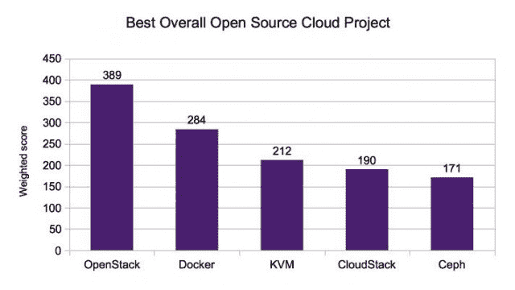
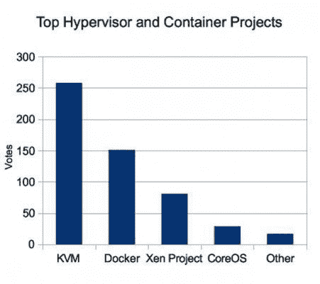
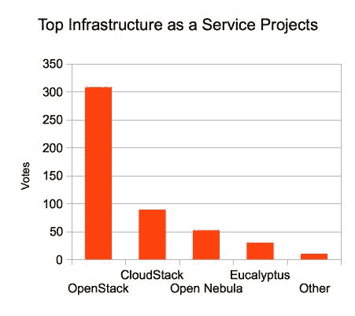
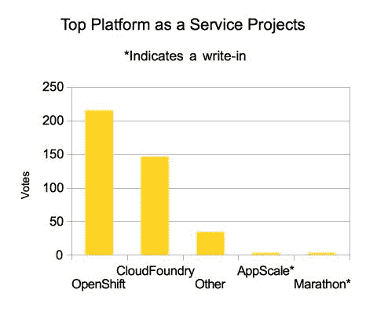
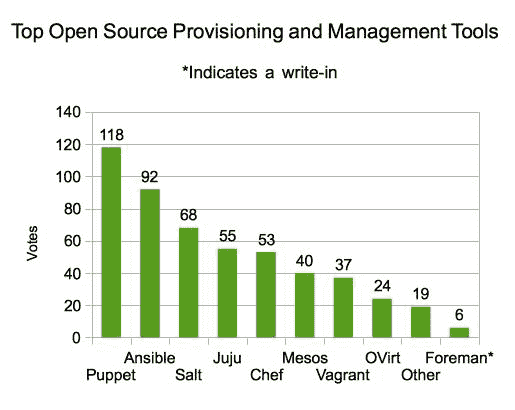
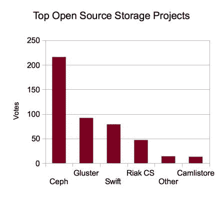

# New Stack 和 Linux Foundation 调查:OpenStack 和 Docker 是最受欢迎的开源项目

> 原文：<https://thenewstack.io/the-new-stack-and-linux-foundation-survey-openstack-and-docker-are-the-most-popular-open-source-projects/>

编者按:这个故事也出现在 Linux.com 上。

根据 Linux.com[和新堆栈对 550 多名受访者进行的调查，OpenStack 是最受欢迎的开源云项目，其次是](http://linux.com) [Docker](http://docker.io) 和 [KVM](http://www.linux-kvm.org/page/Main_Page) ，并于今天在芝加哥 CloudOpen 上宣布。

这些结果反映出新一代开源项目越来越受欢迎，这些项目大多不到五年，旨在满足企业对云计算基础设施不断增长的需求。反过来，这些年轻的项目正显示出青睐，但实力更坚实的技术有一定程度的寿命，这也反映在结果。

该调查于 7 月在 SurveyMonkey 上进行，为期两周，调查对象为不同类别的最佳整体开源云项目，包括以下内容:

*   虚拟机管理程序/容器
*   IaaS
*   PaaS
*   配置和管理工具
*   储存；储备

总的来说，受访者被要求提供他们认为的第一、第二和第三好的开源项目。通过以下公式得出总得分，以确定最佳项目:

首选票数 X3
+二选票数 x2
+三选票数
=总分

OpenStack 以 389 分(第一名 72 分，第二名 68 分，第三名 37 分)成为最受欢迎的选择。Docker 获得了 284 个总加权分，是第二好的。KVM 获得 212 分，成为第三大最受欢迎的开源项目。

OpenStack 在调查中拥有最多的参与者，并且发展迅速。很少的受访者说他们为 Docker 做贡献，但每个人都表示他们想为这个项目做更多贡献。这些都是热门项目。总数显示了这些新项目的实力。OpenStack 是四年前开始的开源云软件项目。Docker 成立不到两年，但已经成为有史以来发展最快的开源项目之一。

## 按类别列出的顶级项目

在虚拟机管理程序类别中，KVM 获得了 48%的选票，其次是 Docker，获得了 28%的选票。有趣的是，选择 Docker 的人比选择 Xen 的人多，Xen 获得了 15%的选票。Xen 是一种成熟的虚拟机管理程序，用于世界上一些最大、最复杂的云服务。相比之下，Docker 成立还不到两年，但似乎已经具有足够的影响力，使其成为过去 20 年中最重要的开源项目之一。

OpenStack 是 IaaS 平台中最受欢迎的，获得了 63%的选票，其次是 Apache CloudStack，获得了 18%的选票。在 PaaS 平台中，OpenShift 是明显的赢家，约 54%的受访者选择了它，而 CloudFoundry 获得了约 36%的选票。

受访者还可以选择列出他们选择的平台，而不是“其他”类别。在 IaaS 平台中，有少数平台不同于所提供的四种选择(OpenStack、CloudStack、OpenNebula 和 Eucalyptus)，占总响应的 2%左右。在 PaaS 平台中，OpenShift 和 Cloud Foundry 的写入替代方案占了 10%的响应，尽管并非所有都是开源项目。例如，Marathon 和 AppScale 是两个被多次列出的候选词。Heroku 也经常被提及，但它不是开源的。

 
无论是 OpenShift 还是 Cloud Foundry 都反映了市场的不成熟。开发人员开始使用 PaaS，因为这两种产品由大型企业公司主导。真正的变化可能来自使用 Docker 的新型 PaaS 提供商，也就是说，他们是开源的，旨在让用户运行自己的 PaaS。

这表明 PaaS 平台仍处于早期阶段，有明显迹象表明两个平台占主导地位。

## 管理工具

Puppet 获得了 23%的选票，被评为最受欢迎的供应/管理工具，Ansible 以 18%的选票紧随其后。Salt Stack 获得了 13.3%的选票，JuJu 以 10.7%的选票险胜 Chef，Chef 获得了 10.4%的选票。与更传统的配置管理系统相比，Ansible 和 Salt Stack 的强劲表现说明了在云规模环境中对更高级别的自动化的需求。

### 储存；储备

Ceph 以 49.6%的得票率领先于存储类别。格鲁斯特以 20%的选票位居第二，斯威夫特获得 17%的选票。来自巴绍的 Riak CS 获得了 10.2%的选票。

## 决定性因素、挑战

不出所料，社区的质量和开放性被认为是为每个类别选择开源项目的最重要的决定因素。这些因素都获得了 55.3%的选票。性能(51.6%)和安全性(50%)被评为第二重要的因素。灵活性占 49 %,相关性占 45 %,项目的成熟度占 43%的投票，而代码库的大小占 36 %,这不仅反映了对信任的渴望，也反映了对项目丰富性的渴望。

## 贡献

有趣的是，27%的受访者表示他们没有为开放云项目做贡献，这可能反映了这些项目的大多数参与者代表他们的公司作为投票群体的事实。他们代表了开放源码社区的一个强大的部分，但是从参与者的总数来看，他们的整体规模较小。

在受访者中，OpenStack 的贡献者最多，有 17.2%的受访者表示他们有贡献，其次是 CloudStack，有 12%的受访者有贡献。OpenStack 的使用也最多，13%的受访者选择它作为他们工作最多的项目，其次是 KVM(10.5%)和 open shift(7.3%)。

大约 47%的投票者认为糟糕的文档是贡献者在部署他们最常用的项目时面临的最大挑战。38.8%的人认为复杂的安装步骤是最大的挑战，其次是复杂的配置管理，占 22.7%。Github 是最受欢迎的开发平台，约有 67%的受访者使用它。文本编辑器仍然很流行，60%的受访者使用它们，而只有大约 32%的人使用成熟的开发平台。可悲的是，3%的受访者根本不使用任何源代码控制机制！
Docker 是大多数受访者表示愿意参与的开源项目，有 21%的受访者表示愿意参与，这表明 Docker 开源项目很受欢迎。在缴费者中，约 42.5%是独立缴费者。

调查结果表明，OpenStack 和 Docker 是开源云项目中 mindshare 的明显赢家。结果还强调了正确有效的文档以及更简单的部署选项的必要性。最后，他们还显示了独立贡献者产生影响的重要百分比。

OpenStack 和 Docker 将继续主导开源云的讨论。但是 Docker 可能会获得最大的收益，因为它也在培育一个开放源码项目的多样化生态系统。OpenStack 主要用于开发自己的云操作系统。例如，它确实与 OpenShift 集成在一起，但在很大程度上，OpenStack 中的不同团队承担了大部分开发工作。Docker 的影响力如此之大，以至于它正在影响整个开源社区。与 Docker 紧密相关的项目，如 Ansible，将随着开发人员寻找工具来使用快速发展的容器技术而继续增长。

<svg xmlns:xlink="http://www.w3.org/1999/xlink" viewBox="0 0 68 31" version="1.1"><title>Group</title> <desc>Created with Sketch.</desc></svg>