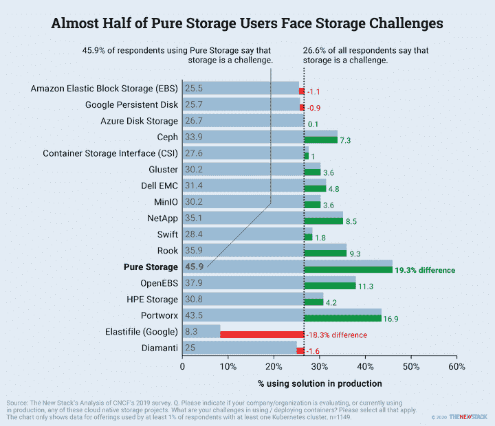

# 纯存储需要 Portworx

> 原文：<https://thenewstack.io/the-new-stack-context-kubernetes-2020-by-the-numbers-2/>

Pure Storage 对 Portworx 的[待收购](https://thenewstack.io/pure-to-purchase-portworx-for-prowess-in-cloud-native-storage/)受到了其客户 Kubernetes 挑战的推动。发表在“[Kubernetes 生态系统状况](/ebooks/kubernetes/state-of-kubernetes-ecosystem-second-edition-2020/)”中的调查数据发现，1149 名 Kubernetes 用户中只有 3.2%在生产中部署了纯存储。不幸的是，46%的受访者表示部署和使用容器时存储是一个挑战，这一比例高于所询问的 17 种技术或解决方案中的任何一种。一般来说，传统存储公司的客户更有可能抱怨存储挑战，但 EMC 长期以来一直参与开发 Kubernetes 的[容器存储接口](https://kubernetes.io/blog/2019/01/15/container-storage-interface-ga/) (CSI)标准，NetApp 一直致力于开发其 [Trident 技术](https://thenewstack.io/stateful-workloads-in-kubernetes-with-trident-the-netapp-way/)。

值得注意的是，只有 2%的 Kubernetes 用户是 Portworx 的客户，他们经常遇到容器问题。然而，由于它是一家如此年轻的公司，这些挑战很可能在部署之前就存在了。要了解有关这项研究的更多信息，请收听新堆栈上下文的[8 月 14 日版本](https://thenewstack.io/the-new-stack-context-kubernetes-2020-by-the-numbers/)。

Portworx 是新堆栈的赞助商。

来自 Pixabay 的 Dessie_Designs 的特征图像。

<svg xmlns:xlink="http://www.w3.org/1999/xlink" viewBox="0 0 68 31" version="1.1"><title>Group</title> <desc>Created with Sketch.</desc></svg>