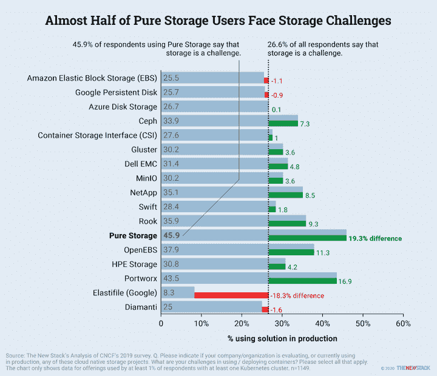

# 新的堆栈环境:数字上的 Kubernetes 2020

> 原文：<https://thenewstack.io/the-new-stack-context-kubernetes-2020-by-the-numbers/>

New Stack 刚刚发布了一本关于 Kubernetes、[《Kubernetes 生态系统的状态》](/ebooks/kubernetes/state-of-kubernetes-ecosystem-second-edition-2020/)和的更新电子书，所以本周在 [The New Stack Context](/podcasts/context) 播客上，我们邀请了 TNS 分析师 [Lawrence Hecht](/author/lawrence-hecht/) 来讨论他为本卷所做的一些分析。我们讨论了 Kubernetes 在云计算、存储和网络方面的应用，以及围绕云计算的不断变化的 DevOps 文化。在播客的最后，我们还讨论了下周的[kube con+CloudNativeCon Europe](https://events.linuxfoundation.org/kubecon-cloudnativecon-europe/)虚拟会议的预期。

《新书库》的高级编辑理查德·麦克马努斯在 TNS 总编辑约布·杰克逊和《新书库》的创始人兼发行人亚历克斯·威廉姆斯的帮助下主持了这一集。

[第 129 集:Kubernetes 2020，由数字](https://thenewstack.simplecast.com/episodes/episode-129-kubernetes-2020-by-the-numbers)

这本 80 页的电子书是我们 2017 年版本的完整修订版，也解释了 Kubernetes 如何成为企业数据中心、云服务和混合方法的底层架构——以及在边缘。在这本书里，赫克特的发现提供了这个社区的许多情况，包括:

*   *   **使用最多的云原生存储解决方案来自云提供商**。几乎 50%的受访者表示他们使用 AWS，另有近 20%的人使用 Google 和 Azure。像 Rook 或 Pure Storage 这样的开源软件解决方案很少有人使用。
    *   传统存储公司的客户更有可能抱怨存储挑战。例如，46%的传统存储供应商 Pure Storage 的客户在处理与容器相关的存储时遇到了挑战，相比之下，Kubernetes 的普通用户只有 27%遇到了挑战。

*   **传统的 HAProxy/NGINX 仍然是网络代理领域的明显领导者**，Envoy 和 Traefik 紧随其后。
*   **使用最多的服务网格是 Consul 和 Istio** (各占不到 20%)，尽管许多客户可能已经将 Consul 用于其他目的。
*   **同样在服务网络领域，网飞的 Zuul 似乎悄悄地赢得了近 5%的用户**,仅次于 LinkerD，同时也减少了管理员的麻烦:只有 23%的 Zuul 用户抱怨服务网络挑战，相比之下，所有受访者中有 27%的人抱怨。Zuul 是这里值得关注的“黑马”吗？

【T2

*   **拥有五个以上集群的受访者继续看到与扩展部署相关的挑战减少，但拥有五个或更少集群的公司情况更糟** —特别是在扩展部署、开发文化和日志记录方面。
*   **较小的公司在重组其组织结构以满足云原生计算的需求方面没有走得那么远**。尽管许多组织成立了开发运维团队或 SRE 团队，但是开发人员在这些组织中的角色仍然是处理基础设施层的各个方面。
*   在云提供商提供的容器管理产品中，亚马逊的弹性 Kubernetes 服务刚刚挤掉了谷歌的 Kubernetes 引擎。EKS 和 GKE 都有大约 30%的受访者尝试过，而只有大约 17%的人使用过 Azure。

要了解更多信息，请查看[Kubernetes 生态系统的状态](/ebooks/kubernetes/state-of-kubernetes-ecosystem-second-edition-2020/)。

亚马逊网络服务公司、云本地计算基金会和哈希公司都是新堆栈的赞助商。

<svg xmlns:xlink="http://www.w3.org/1999/xlink" viewBox="0 0 68 31" version="1.1"><title>Group</title> <desc>Created with Sketch.</desc></svg>