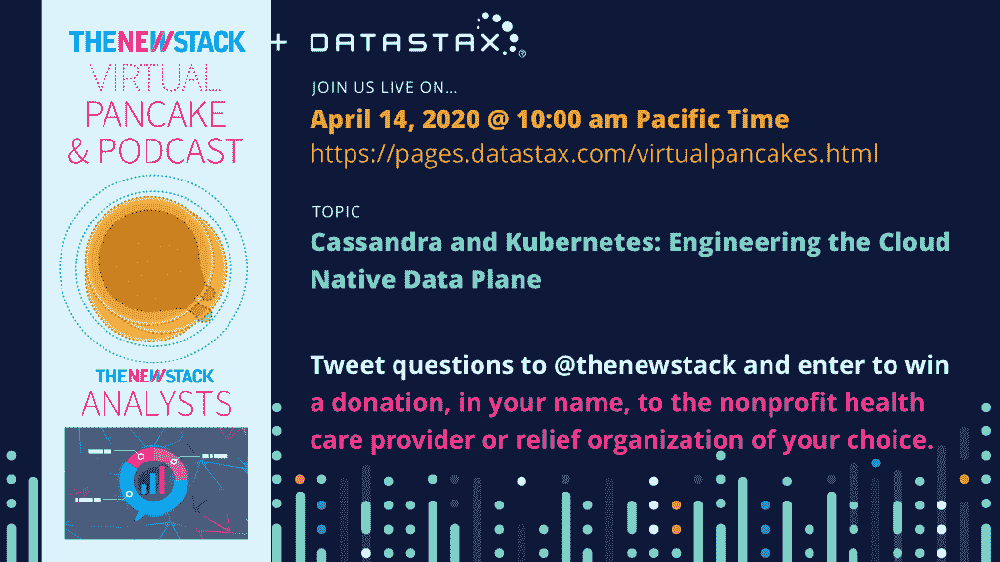

# 新的堆栈环境:DevSecOps 商店成功的秘密

> 原文：<https://thenewstack.io/the-new-stack-context-the-secret-of-successful-devsecops-shops/>

欢迎来到[新的堆栈环境](https://thenewstack.io/podcasts/context)，在这个播客中，我们将讨论云计算领域的最新新闻和观点。在本周的节目中，我们采访了 [Sonatype](https://www.sonatype.com/) 的副总裁[德里克·威克斯](https://www.linkedin.com/in/derekeweeks/)，了解该公司刚刚在 DevSecOps 上发布的[新社区调查](https://www.sonatype.com/2020survey)的结果，该调查提供了一些关于团队如何整合自动化安全工具以及这种转变如何影响公司文化和开发人员幸福感的见解。

TNS 编辑和营销总监 Libby Clark 主持了这一集，旁边是 TNS 创始人兼出版商 Alex Williams 和 TNS 执行主编 Joab Jackson。

[第 112 集:Derek Weeks 副总裁 Sonatype——一家成功开发店的秘密](https://thenewstack.simplecast.com/episodes/episode-112-derek-weeks-vp-sonatype-the-secrets-of-a-successful-devsecops-shop)

Sonatype 的 Nexus 开源治理平台帮助 1000 多家组织和 1000 万软件开发人员同时加速创新和提高应用程序安全性。这是 Sonatype 做这份 DevSecOps 报告的第七个年头，据该公司称，这是关于这一主题的持续时间最长的社区调查。我们与 Weeks 讨论了自该公司开始进行调查以来，DevSecOps 的实践是如何变化的，以及组织在将安全性嵌入其 DevOps 实践中所面临的挑战。我们还思考了令人困惑的发现背后的原因，即那些拥有成熟 DevSecOps 的公司实际上有更多的安全漏洞。

随后在节目中，我们将讨论一些最新的热门新闻和播客。我们对 Sysdig 的 Kris Nóva 的采访深入探讨了云原生基础设施以及新冠肺炎对旧金山的影响。此外，云铸造基金会[宣布](https://thenewstack.io/chip-childers-takes-executive-director-role-at-cloud-foundry/)其长期首席技术官 Chip Childers 将于 4 月 2 日接替 Abby Kearns 担任执行董事。我们就如何[保护你的下一次会议](https://thenewstack.io/how-to-protect-your-virtual-meetings-from-zoombombing/)免受 Zoombombing 提供建议。最后，我们谈论开源如何扩展到软件之外，以帮助解决新冠肺炎的呼吸机短缺问题:一个麻省理工学院附属的专家志愿者团队发布了一个开源“紧急呼吸机”的设计，[可以以 500 美元的价格建造](https://thenewstack.io/mit-is-making-an-affordable-open-source-ventilator-for-the-covid-19-crisis/)，比购买一个新的商业模型所需的 30，000 美元便宜得多。

Sonatype 是新堆栈的赞助商。

<svg xmlns:xlink="http://www.w3.org/1999/xlink" viewBox="0 0 68 31" version="1.1"><title>Group</title> <desc>Created with Sketch.</desc></svg>