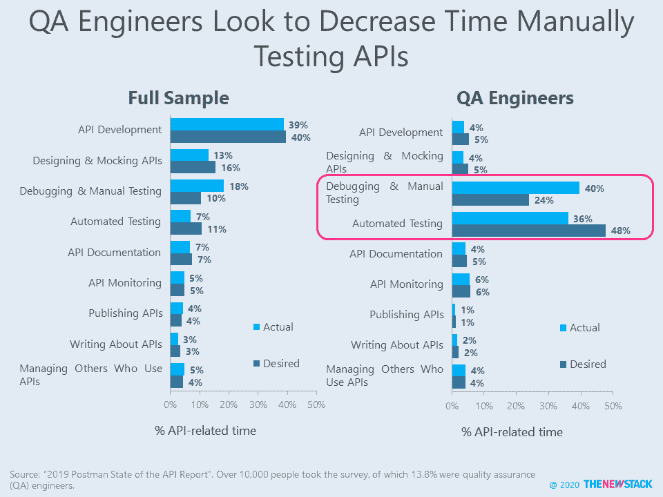
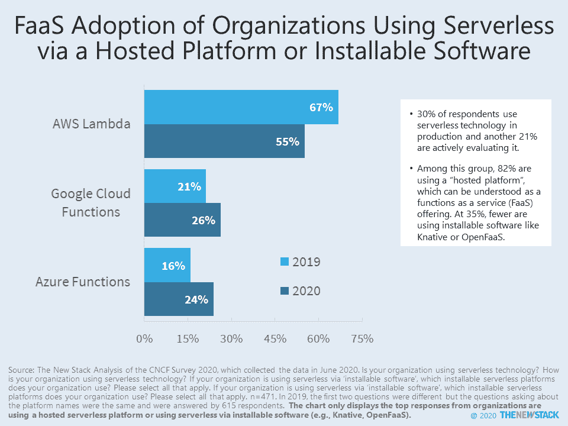

# 新堆栈:2020 年的顶级云原生技术趋势

> 原文：<https://thenewstack.io/the-new-stack-top-cloud-native-technology-trends-from-2020/>

在 3 月下旬的几个星期里，新冠肺炎让全球商业陷入停滞，因为每个人都在试图找出抗击疫情的最佳方式，迄今为止，这场战争已导致全球近 200 万人死亡，并带来了无法估量的痛苦。没有人知道会发生什么，所以会议被取消，合同被搁置，项目被推迟。一切都停止了。

然而，到了四月初，我们见证了 IT 社区的工作重新焕发生机。虽然其他行业，如餐馆，已经被社会距离的努力严重削弱，但很快就清楚了，我们仍然需要它来进行经济和社会活动。你甚至可以说，在这几个月里，[它拯救了全球经济](https://twitter.com/Joab_Jackson/status/1343587521729605637)，因为 Slack、谷歌、Zoom 和其他公司在几天内就帮助公司采用了远程工作技术。

然而，在我们的领域中，云本地技术的发展持续快速，因为这个社区对远程、分布式工作并不陌生。在“新堆栈(虚拟)”新闻专栏中，我们看到了过去 12 个月中该领域出现的一些有趣的技术趋势，以及它们在未来几年将如何影响云原生计算。

### 系统设计:整体的回归

在过去的几年里，TNS 一直在鼓吹新兴的云原生应用程序构建的[微服务风格](https://thenewstack.io/category/microservices/)，它将大型应用程序分解为更小的、相互连接的组件，允许不同的团队在应用程序的不同部分工作，而无需相互跨越。然而，微服务也带来了他们自己的挑战，其中最臭名昭著的是跨组件调试的困难。Kubernetes 的传道者 Kelsey Hightower [提出了这个想法](https://changelog.com/posts/monoliths-are-the-future)，有点半开玩笑地说，“单片是未来，因为人们试图用微服务解决的问题并不符合现实。”这正是核心云原生应用之一 Istio service mesh 背后的设计团队承认他们正在[迁移到单片方法](https://blog.christianposta.com/microservices/istio-as-an-example-of-when-not-to-do-microservices)的时候，在这种方法中，更多的服务被集成到单个守护进程中。

在所有问题中，任何给定项目的正确方法可能在这两个极端的中间，但今年微服务的理想在企业软件设计的其他因素中得到平衡。

[第 110 集:凯尔西·海托华和本·西格曼辩论微服务 vs 独石](https://thenewstack.simplecast.com/episodes/episode-110-kelsey-hightower-and-ben-sigelman-debate-microservices-vs-monoliths)

参见: [Lightbend 的 Cloudstate 构建于 Akka 之上，提供有状态无服务器](https://thenewstack.io/lightbends-cloudstate-builds-on-akka-to-offer-stateful-serverless/)。

### 云服务:统一的控制平面

Kubernetes 在如何轻松扩展和管理分布式应用程序方面带来了一场革命，尽管它的界面主要面向系统运营商。对于开发人员来说，it [呈现出一条令人生畏的学习曲线](https://thenewstack.io/oam-the-kubernetes-application-model-bridging-development-and-deployment/)，需要在其自身的运营概念(即[“入口】、【豆荚】、【服务】、](https://thenewstack.io/learning-kubernetes-the-need-for-a-realistic-playground/))和开发人员所理解的应用的实际需求之间进行大量的转换。因此，毫不奇怪，今年我们看到了很多关于[通用控制平面](https://thenewstack.io/how-kubernetes-is-becoming-the-universal-control-plane-for-distributed-applications/)的想法，这将为企业为其开发人员构建自己的基于 Kubernetes 的自助式平台即服务奠定基础。 [Crossplane](https://crossplane.io/) ，一个由 Upbound 构建的开源控制平面，支持从 Kubernetes 供应云服务和[推出您自己的基于 Kubernetes 的 PaaS](https://thenewstack.io/crossplane-a-kubernetes-control-plane-to-roll-your-own-paas/) 。Crossplane 在这个领域已经获得了很多早期的关注:IBM 正在测试 Crossplane now 来帮助用户在它的 IBM 云上统一操作。Crossplane 也是[开放应用模型(OAM)](https://thenewstack.io/open-application-model-build-the-next-generation-of-cloud-native-applications/) 的 [Kubernetes 实现](https://oam.dev/#ecosystem)，默认[集成云服务](https://thenewstack.io/oam-the-kubernetes-application-model-bridging-development-and-deployment/)。OAM 提供了一个标准化的应用程序模板，该模板很快成为 Kubernetes 社区中事实上的标准。

[KubeVela](https://github.com/oam-dev/kubevela) 是一个可扩展的“平台引擎”[位于 Crossplane](https://kubevela.io/#/en/platform-engineers/cloud-services) 和 Kubernetes 之上，开发人员无需担心底层基础设施，可以专注于应用。正如该项目的开发商[解释的](https://thenewstack.io/kubevela-the-extensible-app-platform-based-on-open-application-model-and-kubernetes/):

“对于开发人员来说，KubeVela 是一个易于使用的工具，使您能够以最少的工作描述应用程序并将其发布到 Kubernetes，但对于平台构建者来说，KubeVela 是一个框架，使他们能够轻松创建面向开发人员但完全可扩展的平台。”

[第 133 集:cross Plane——一架 Kubernetes 控制飞机来滚动你自己的 PaaS](https://thenewstack.simplecast.com/episodes/episode-133-crossplane-a-kubernetes-control-plane-to-roll-your-own-paas)

**参见** : [Kubernetes 移动到边缘](https://thenewstack.io/the-new-stack-context-kubernetes-moves-to-the-edge/)。

### 操作:一个可编程的 Linux 内核

Linux 内核，云原生操作的事实上的操作系统，由于扩展的 Berkeley 包过滤器(eBPF)的引入，在如何使用它方面开始看到一个彻底的转变。尽管最初的目标是高级内核监控，但这种原始 BPF 的内存映射扩展可以在内核空间内运行任何沙盒程序，而无需更改内核源代码或加载模块。实际上，eBPF 充当了一个微内核，提供了一种潜在的更快更安全的方式来使用 Linux 内核。这样，eBPF 为开发人员提供了一种将他们自己的程序添加到内核本身的方法。最直接的好处是对应用和系统的监控(和调试),以及加速网络路由的决策过程，允许内核做内联工作，这在以前是交给模块的。一些专注于 Kubernetes 的公司，如 Isovalent 和 Tigera [已经在使用技术](https://thenewstack.io/beyond-kube-proxy-tigera-calico-harnesses-ebpf-for-a-faster-data-plane/)到[提供一种更快的替代方案](https://thenewstack.io/ebpf-put-the-kubernetes-data-plane-in-the-kernel/)来使用 Kube-Proxy 进行流量路由。

***参见*** : [Systemd 的 Lennart Poettering 想把 Linux 主目录带入 21 世纪](https://thenewstack.io/systemds-lennart-poettering-wants-to-bring-linux-home-directories-into-the-21st-century/)。

管理 API 对软件工程师来说仍然是一个挑战(劳伦斯·赫克特)

### 安全性:重新思考漏洞管理

在过去的一年中，越来越明显的是，当前用于处理新安全漏洞的系统可能不适合云本地计算的步伐。来自云安全公司 [Rezilion](https://www.rezilion.com/) 的 Tal Klein 在该网站上认为，当前行业范围内对新发现的漏洞进行优先排序的系统，即[通用漏洞评分系统](https://www.first.org/cvss/) (CVSS)，与攻击者利用漏洞攻破系统的方式格格不入。有些人认为，人们过于关注严重性分数本身，而对分数周围的环境背景缺乏足够的了解。Rezilion 发现，67-75%的 CVSS 分数为“高严重性”的漏洞从未被加载到内存中，因此不可能被利用。与此同时，攻击者正在利用评级较低的漏洞，因为很少有公司真正修补这些漏洞。CVSS 维护者正在努力更新云原生变化速度的标准和排名，看看未来一年左右会有什么变化会很有趣。

[第 111 集:过时漏洞管理的补救措施](https://thenewstack.simplecast.com/episodes/episode-111-a-remedy-for-outdated-vulnerability-management)

***参见*** : [Kubernetes 操作员可能是一个安全隐患](https://thenewstack.io/the-new-stack-context-operators-can-be-a-security-hazard/)。 [Bridgecrew:错误配置的地形模块是一个安全问题](https://thenewstack.io/bridgecrew-all-these-misconfigured-terraform-modules-are-a-security-issue/)。

### 开发:铁锈在 C++上蔓延

几十年来，我们的操作系统和其他重要的基础设施软件一直是用 C 或 C++编写的，它们是快速的低级语言。然而，最近，越来越多的系统架构师得出结论，由于它们处理内存和其他因素的不安全方式，要完全保护用这些语言编写的程序是非常困难的，如果不是完全不可能的话。安全地处理内存分配当然需要很多才能，即使这样，一个被忽略的错误也可能为。所以最近，越来越多的追随者开始使用一种新的语言， [Rust](https://www.rust-lang.org/) ，这种语言既有 C/C++的速度，也有编写安全应用程序所必需的类型安全。在今年早些时候的 AllThingsOpen 虚拟会议上，[微软](https://www.microsoft.com/)云开发者倡导者瑞安·莱维克[解释了](https://youtu.be/NQBVUjdkLAA)为什么微软逐渐转向 Rust 来构建其基础设施软件，远离 C/C++。并鼓励其他软件行业巨头也考虑这样做。

***参见*** : [WebAssembly 可能是云原生可扩展性的关键](https://thenewstack.io/webassembly-could-be-the-key-for-cloud-native-extensibility/)。

AWS Lambda 无服务器服务的采用在今年停滞不前，因为组织开始规划更多的内部功能即服务(Lawrence Hecht，TNS)。

专题图片:[犹他州巨石柱](https://en.wikipedia.org/wiki/Utah_monolith)，作者[patrickamack2](https://commons.wikimedia.org/w/index.php?title=User:Patrickamackie2&action=edit&redlink=1 "User:Patrickamackie2 (page does not exist)")通过维基百科。

<svg xmlns:xlink="http://www.w3.org/1999/xlink" viewBox="0 0 68 31" version="1.1"><title>Group</title> <desc>Created with Sketch.</desc></svg>