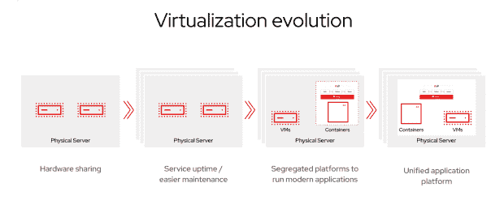
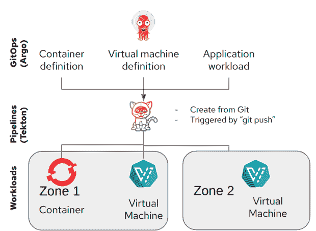
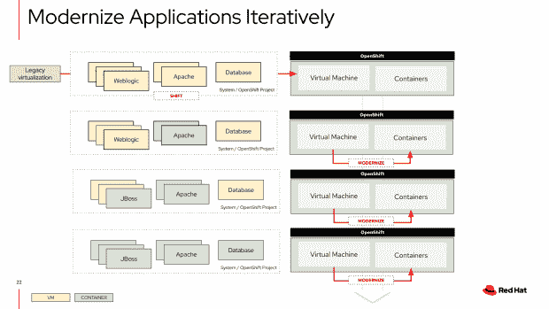

# 虚拟化基础架构的下一次发展

> 原文：<https://thenewstack.io/the-next-evolution-of-virtualization-infrastructure/>

虚拟化正在进入一个新时代，这是第四个进化时期，数据中心整合和工作负载标准化的优势正在加速向云原生环境的迁移。像任何进化的有机体一样，虚拟化必须适应。
第一个虚拟化时代是数据中心概念的巨大飞跃。VMware 通过 ESX 虚拟机管理程序开创了虚拟化的先河，并主导了市场，迅速将虚拟机的诸多优势带给了世界各地的企业。虽然出现了许多挑战者，但没有一个能够摆脱传统虚拟化市场的束缚。

虚拟化的第二个时代是向云的迁移。它不再只是在内部运行虚拟机；现在是在公共云中运行它们，比如 Amazon Web Services、Azure、Google 等等。用户可以按需将他们的虚拟机运送到云中，而不是提交一个票证，然后等待 IT 在数据中心基础架构上调配他们的虚拟机。

整个开发团队脱离了内部 IT 队伍，开始逃向“我现在就想要”的云供应基础架构世界。

对于仍然绑定到数据中心的应用程序，OpenStack 等替代方案出现了，可以为私有云以及许多公共云基础架构即服务部署支持横向扩展虚拟化基础架构。Red Hat OpenStack 继续在该领域提供领先的发行版，为企业私有云以及电信 4G 网络功能虚拟化环境提供支持。

虚拟化的第三个时代实际上是远离虚拟机管理程序和传统虚拟机的时代:容器时代。正如虚拟化通过利用虚拟机管理程序的力量将物理服务器分成许多单独的虚拟服务器，每个虚拟服务器运行自己的操作系统，容器化也通过名称空间、cgroups 和 Docker 打包格式的力量将运行在这些虚拟机上或直接运行在裸机服务器上的单个 Linux 操作系统分成更小的应用沙箱，现在通过[开放容器倡议](https://opencontainers.org/)实现了标准化。

这使得先驱开发人员能够在他们的本地机器上构建和提供容器化的微服务，并推动他们一致地按需测试、试运行和生产环境。Kubernetes 成为容器编排和管理的行业标准平台，并使这个时代蓬勃发展。

这些技术的持续发展，加上 Broadcom 宣布收购 VMware，使得许多客户开始评估他们现有虚拟化基础架构的未来，并想知道接下来会发生什么？我们认为我们已经进入了第四个虚拟化时代:在云原生平台上发展和融合的时代。

## 第四时代

在人类历史的各个时代，变化是不变的，尤其是在计算机历史的各个时代。在虚拟化和容器化之前，巨大的一体化分时 UNIX 系统被更小、更便宜的 X86 服务器所取代。虽然预测未来可能很困难，但驾驭未来总是需要不断前进。

最近，我们收到了许多关于这种不断发展的虚拟化格局以及它对客户现有虚拟化资产的意义的问题。由于它与 Red Hat 的虚拟化产品组合有关，我们在四年多前就决定围绕 Linux、KVM 和 Kubernetes 构建一条新的云原生路径。

我们的指引北极星是我们的信念，即 Kubernetes 已经成为云原生应用程序开发的关键推动者，并且正在渗透到企业数据中心和所有主要的公共云中。

我们还知道，尽管 Kubernetes 加速了容器的采用，但绝大多数企业应用程序仍在虚拟机上运行，容器和虚拟机将长期共存。

四年前，我们启动了 KubeVirt 项目来管理 Kubernetes 中的虚拟机和容器。利用 KVM 虚拟机管理程序本身是一个可以容器化的 Linux 进程这一事实，KubeVirt 使基于 KVM 的虚拟机工作负载可以作为 Kubernetes 中的 pods 进行管理。

但是从建筑的角度来看，这意味着什么呢？这意味着您可以将您的虚拟机带入一个现代的基于 Kubernetes 的云原生环境，而不需要实际的应用程序跳转到容器本身。

虽然许多基于 VM 的应用程序已经迁移到了容器中，但是并不是每一个运行在 VM 中的应用程序都已经迁移或者甚至适合运行在容器化的环境中。虚拟化的第三个时代是将容器迁移到虚拟机中，而这个新时代是将 Kubernetes 和云原生平台的优势带给所有应用程序，无论它们位于何处。

虽然能够在一个通用的 Kubernetes 平台上同时管理容器和虚拟机是非常强大的，但更强大的是，这使得虚拟机工作负载能够利用在 [CNCF](https://landscape.cncf.io/) 云原生环境中围绕 Kubernetes 构建的所有新功能。像 Prometheus、Istio、Knative、Tekton、ArgoCD 等创新项目已经从这个生态系统中脱颖而出，并在 Kubernetes 中得到容器和基于 VM 的应用程序的全面支持。

这意味着开发人员可以使用监控、管道、GitOps、无服务器、服务网格等功能，无论目标工作负载是容器还是虚拟机。这使您能够将虚拟机与容器一起带到云原生平台。

## 去哪里？

云的思维方式受到了很多影响，但是让您的公司开始过渡的最佳方式可能是了解容器和 Kubernetes 在您的环境中是如何使用的。许多公司可能已经在 Red Hat OpenShift 和/或其他 Kubernetes 服务中运行容器。你今天要做什么？

了解容器和 Kubernetes 是如何在您的组织内部使用的，可以帮助您找到一个过渡一些现有虚拟机的良好起点。对于在数据中心运行的工作负载，Red Hat OpenShift 可以安装在裸机服务器环境中，以运行容器和虚拟机工作负载。

安装完成后，我们创建了 [OpenShift 虚拟化迁移工具包](https://access.redhat.com/documentation/en-us/migration_toolkit_for_virtualization/2.0/html/installing_and_using_the_migration_toolkit_for_virtualization/index)，它提供了将现有虚拟机迁移到 OpenShift 虚拟化的途径。一旦引入云原生基础设施，这些虚拟机可以链接到现有的 Kubernetes 和 OpenShift 功能，如云原生平台服务、[集群管理](https://www.redhat.com/en/technologies/management/advanced-cluster-management)、[存储](https://www.redhat.com/en/technologies/cloud-computing/openshift-data-foundation)等。

当前进的道路不明朗时，我们总是乐于回答问题。一般来说，当变化和问题出现时，我们一直认为向前发展总是比横向发展更好的选择。

虽然虚拟机绝不是死的，但它们肯定越来越成为现有传统应用的象征，而不是新的云原生应用正在登陆的地方。像邮政系统一样，许多信息已经转移到更新、技术更先进的贸易模式中。我们期待着第五个虚拟化时代的到来。

<svg xmlns:xlink="http://www.w3.org/1999/xlink" viewBox="0 0 68 31" version="1.1"><title>Group</title> <desc>Created with Sketch.</desc></svg>