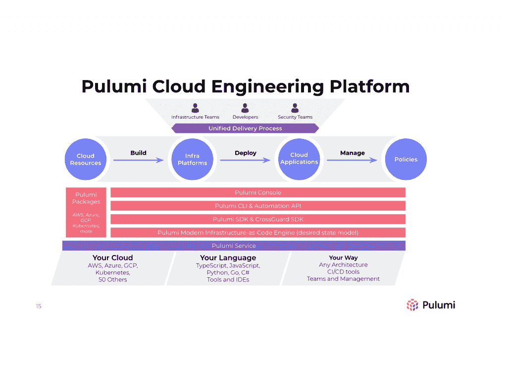
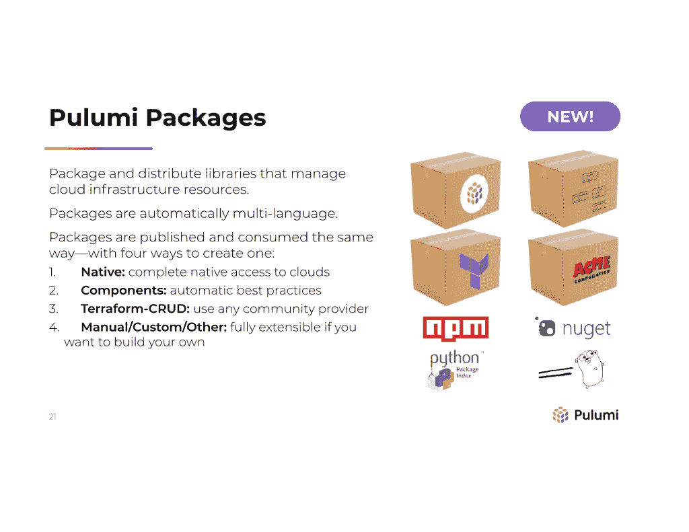
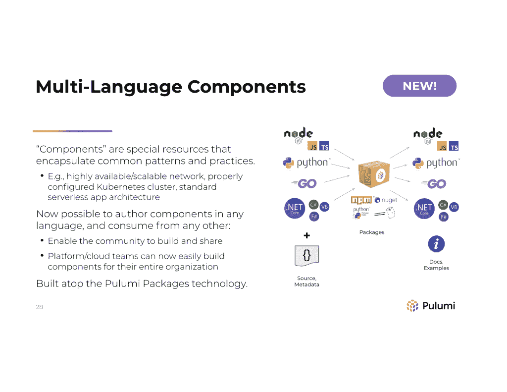
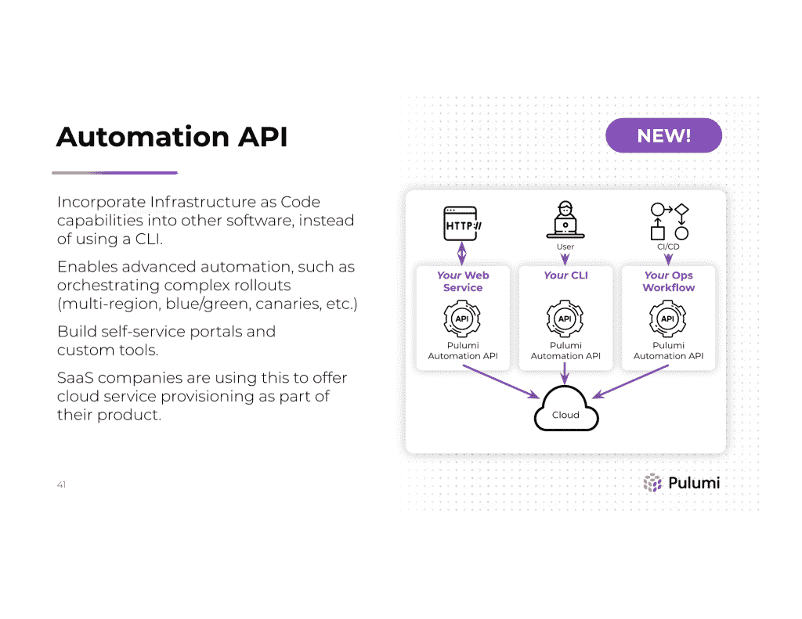

# Pulumi 说，DevOps 和 GitOps 之后的下一步是云工程

> 原文：<https://thenewstack.io/the-next-step-after-devops-and-gitops-is-cloud-engineering-pulumi-says/>

如果我们将基础设施视为代码，难道基础设施工程师不应该拥有让软件工程师高效工作的相同工具，甚至相同的语言吗？这就是刚刚发布了其开源平台第三版的 Pulumi 的理论。

创始人兼首席执行官[乔·达菲](https://www.linkedin.com/in/joejduffy/)所称的“云工程平台”是一种尝试，旨在“从帮助开发人员构建现代云应用程序中提取大量经验教训，帮助基础设施团队越来越多地将工程学科应用到他们进行基础设施建设的方式中，并帮助整个团队充满信心地加快速度。”

“人们意识到，跟上现代云的步伐和创新水平的唯一方法是让开发人员能够更加自助，同时从过去几十年的软件工程中吸取经验，并将其应用到我们的基础设施建设中。”

“不是每个人都可以花两年时间来搞清楚如何进行云工程:我们希望确保每个人在第一天就能接触到它。”

## 云工程文化

IDC DevOps 研究总监 [Jim Mercer](https://www.idc.com/getdoc.jsp?containerId=PRF005085) 向新堆栈解释说:“云工程使用标准软件工程和工具，跨越基础设施、应用程序开发和合规性，简化和统一现代云环境的复杂性。

Justin Fitzhugh 在 Pulumi 客户 Snowflake 的职位是云工程副总裁，对于他来说，这个术语代表了开发和运营这两种独立文化的持续发展。

“通过 DevOps，我们看到开发人员和运营团队在一个产品或一个特定的交付品上合作。我们看到联合开发的应用程序和系统在开发阶段就考虑到了运营问题，相反，开发人员关心的是它们如何扩展，以及在投入生产时如何管理。”

云工程将此提升到了一个新的高度。“这更像是一种积极主动的工程文化，我们通过开发工具、软件和组件来构建、管理、实例化和维护基础设施。对我们基础设施的任何更改都是对通过 CI/CD 管道运行的代码库的承诺，在这里您可以进行区分、测试并进行适当的审查，就像任何其他软件更改一样，然后通过自动化管道推向生产。我们将它视为软件工程功能，只关注基础设施，而不是 UI 或后端工程。”

Fitzhugh 指出，基础设施仍然需要一个特定的学科，因为他们关注的是集成、规模、抽象以及如何与云服务交互和操作云服务，但其中大部分可以自动化。

一些 DevOps 团队将他们的基础设施配置保存在 git repos 中，但是太多情况下，操作更改是通过运行待办事项列表上的步骤来进行的，即使它保存在 wiki 或配置管理系统中。“与我如何对其进行整理、如何将其提交给代码库相反，我如何使其成为可重复测试运行的一部分，并使其成为管道的一部分。”

雪花广泛使用 Go，以及从 Ansible 到 Python 的所有东西，它运行在 AK、EKS 和 GKE 上，因此需要处理不同的 API、账户指标和云原语。"我们使用 Pulumi 将它包装成一个单一的工作流程编排."

Duffy 将 Pulumi 称为“结缔组织”,并指出，安全工程团队越来越多地成为同一工作流的一部分，因为 Pulumi 用户正试图摆脱孤岛，他们必须处理 YAML 和多种特定于领域的语言，以及不同的基础架构交付机制(其中许多是手动的),即使他们正在为一些工作负载自动交付容器。

云原生越来越需要跨多个服务的编排；用 bash 脚本这样做可能会很痛苦，尤其是在考虑安全性的时候。

“我们发现这些现代架构的界限开始变得模糊。是无服务器功能基础架构还是应用程序？队列或发布子主题是应用程序的一部分还是基础设施的一部分？对于许多倾向于现代云的人来说，两者都有一点。这就是为什么用一种方法来构建、部署和管理应用程序和基础架构非常重要，用一个基础来管理所有这些东西非常重要，尤其是当它们相互依赖时。”

## 基础设施功能的开发人员术语

Pulumi 3.0 中的新特性对于开发人员来说是熟悉的概念，对于基础设施团队也是有用的，并带有云的特点。

团队已经可以在 [Pulumi Resources](https://thenewstack.io/infrastructure-is-code-and-with-pulumi-2-0-so-is-architecture-and-policy/) 中共享和重用代码，但是由于您正在使用的云对象的底层语言中立模型，Pulumi 包现在可以跨多种语言工作，并且适用于更高级别的组件，而不是低级别的资源。

“以前，如果你用 Node.js 编写你的包，你就被绑定到了 Node 生态系统，或者如果你用 Python 编写，它只能用 Python 编写。Duffy 解释说:“如果基础设施团队使用 Python 并定义 Kubernetes 集群组件，客户希望能够用 Python 编写包，但他们希望他们的开发人员能够从 Node.js 或 Go 或他们最喜欢的语言中开发这些东西。

包可以用 Pulumi 支持的任何语言编写，也可以从任何其他支持的语言使用。Pulumi 还提供一些多语言组件；第一个处理 AWS EKS 集群的供应和管理，这通常很复杂。“我们正在启动一个生态系统，”Duffy 建议并指出，一旦该功能普遍可用，许多客户将发布他们自己的产品。

原生提供者是一种新型的 Pulumi 包，它从 Azure、Google 和 Amazon API 规范中自动生成接口。自 2020 年 9 月以来，Azure 在现有服务中增加了 166 项新服务或新功能；“他们无时无刻不在提供运输服务，如果你无法访问它们，那就是一个问题。”

因为微软在 OpenAPI 中记录了整个 Azure surface，所以 Pulumi 可以立即支持新功能。Azure native provider 包含的服务是 Pulumi 手工构建的两倍，比如 Azure Static Websites 在发布后一小时内就实现了。Azure 原生支持现在是 GA，公开预览版的 Google Cloud 和今年下半年的 AWS。

Fitzhugh 指出，对新功能的快速支持使 Pulumi 与众不同。“云提供商正在推进他们的 API，有时速度非常快；实时支持这一点至关重要。特别是当我们看到云提供商基于 Kubernetes 的产品时，他们迭代和前进的速度如此之快，以至于许多框架都难以跟上。”

因为他们使用所有三个主要的云提供商，雪花热衷于为其开发者提供一个统一的平台来部署容器，并使用 Pulumi 来获得抽象。“我们并不试图在它的基础上建立一个完整的其他云平台，因为我看到人们陷入困境的地方是当他们试图几乎重新发明云提供的东西，并在它的基础上建立它，因为你永远不会像云一样快速迭代，”Fizhugh 解释说。

“我们非常关注终端用户的入职和用户体验:我们如何简化这一过程，如何尽可能提高效率。但这一切都是因为我们可以通过代码描述该环境的样子，并且我们可以在多个云提供商的许多许多部署中快速迭代。”

新的自动化 API 是另一个有帮助的特性，它允许客户将基础设施作为代码构建到他们自己的软件中。“如果作为代码的基础设施不是基于 CLI 的体验会怎样；如果它只是一个可以在其他程序中使用的库，”达菲解释道。

这对于像蟑螂实验室这样的 SaaS 提供商特别有用，蟑螂实验室的数据库即服务在幕后代表他们的客户管理 Kubernetes 集群，但组织也使用它来构建自助服务门户，如雪花的内部平台。“您可以与 Pulumi 链接并管理您的基础架构，并且仍然可以以代码的形式获得基础架构的所有功能，但不必拥有您以编程方式驱动的这种笨重的基于 CLI 的界面。您可以构建自己的自助服务门户:我们已经看到人们构建自己的定制工具来进行多区域部署和许多复杂的场景。”

## 下一个是普鲁米

对于 Fitzhugh 来说，自动化 API 和新的 RBAC 支持(允许使用 SAML 进行单点登录)、与中央身份提供者同步的细粒度权限和身份工作流，使他们向云工程又迈进了一步。“以任何方式接触基础设施，无论是创建、管理还是拆除，都最好通过适当的方式完成；您真的需要一个 CI/CD 管道来自动测试和部署。我们的客户问我们，我们如何减少与生产环境交互的人，而更多地通过管道推动生产。SAML SSO 的身份管理、合规性和法规部分以及更精细的访问控制部分对我们非常有用。”

对于将 Pulumi 用于混合云的组织来说，身份非常重要；虽然 80%的 Pulumi 客户严重依赖公共云，但混合云和私有云也很重要。Pulumi 支持 Azure Arc 和 AWS 前哨站；它已经在 EKS 发行版中使用，并将在任何地方支持 EKS。Duffy 指出，其他客户正在将 Pulumi 与 vSphere 结合使用；“一个客户正在使用 Pulumi 在全球范围内为新的数据中心生产裸机。”

Pulumi 服务永远不会看到您的身份或云提供商的凭证，让您按照自己选择的方式进行凭证管理。“但我们几乎成了如何正确管理云凭证的顾问，因为不幸的是，我们经常看到错误的做法，”达菲告诉我们。“我们尝试推出一些最好的 CI/CD 集成，我们帮助人们制作临时凭据，这样就没有长期凭据—我们一直将此视为反模式，但你看 CI/CD 提供商本身，他们会告诉你这样做，这真的非常非常糟糕。我们努力帮助人们保护 CI/CD 管道；当所有部署都经历这一过程时，您可以锁定并保护它。”

他注意到处理这么多有自己的身份模型的系统的复杂性，并建议在未来，Pulumi 将能够在这方面提供更多的帮助。“整个云工程平台愿景的一部分是，我们将在 Pulumi 中引入更多内容。如果你想让我帮你送货，很好。如果你只是想点击一个按钮来做一些部署，很好。因此，将会有更多这样的活动，这将使我们更多地涉足身份凭证管理业务。”

达菲还谈到管理更多的动态基础设施。“Pulumi 可以捕获您的基础架构和应用程序的静态拓扑，这很有好处，可以让您验证很多东西，但它不能验证所有东西。我认为下一个前沿是捕获动态依赖关系，并理解它们之间的语义连接。”这可以建立在像 AWS 安全组分析器这样的工具上，用于跟踪像阻止两台机器连接的防火墙规则这样的问题。

Pulumi 还将继续改进和扩展语言支持。在添加新语言之前，重点是改进现有的语言支持:Python 支持现在包括静态类型检查器，Go 库更小，因此加载更快。Pulumi 4.0 将包括新的语言:PowerShell、JVM 和 Ruby。“你可以在 PowerShell 中使用 Pulumi，只是 API 的设计不支持 PowerShell，或者说不符合 PowerShell 的习惯。”

达菲说，来自厨师和傀儡生态系统的客户正在推动人们对 Ruby 的兴趣。"实际上，这是我们所有开源问题中票数最多的一个问题."

<svg xmlns:xlink="http://www.w3.org/1999/xlink" viewBox="0 0 68 31" version="1.1"><title>Group</title> <desc>Created with Sketch.</desc></svg>