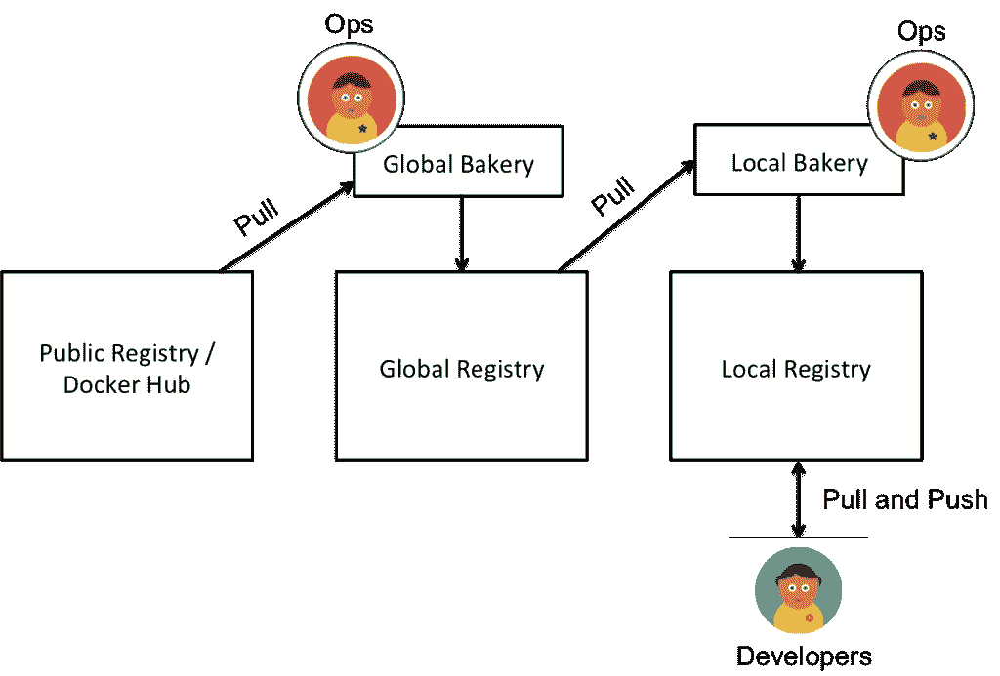

# 非独角兽公司的集装箱运输指南

> 原文：<https://thenewstack.io/the-non-unicorns-guide-to-riding-the-container-bandwagon/>

墙上写着:Docker 和容器生态系统正在疯狂增长。开发人员、运营人员……整个行业都在通过拥抱不断增长的浪潮来尽可能多地进行实验、学习和分享。但是，不祥之兆仍然错过了大画面:与独角兽(那些拥有一个整体和多个应用程序的企业)不同的组织仍然处于使用容器和生态系统项目的早期阶段。

不难看出原因:一家非独角兽公司会对一项技术进行主流推广(理解为:生产)，其他非独角兽公司会看到这一点并效仿。称之为 it 在企业中的[镜像神经元](https://en.wikipedia.org/wiki/Mirror_neuron)效应。

## 容器采用生命周期

为了充分理解这一点，让我们更仔细地看看这些非独角兽的采用生命周期。在他们的企业架构中，大多数情况下会有单片或某种形式的多应用程序。每个这样的多应用程序可以是一个整体。一些非独角兽企业将会尝试独立服务或微服务的模式。开发/运营人员通常会在内部将容器宣传为微型虚拟机，以引起业务方面的注意——实质上是获得资金，在整个架构的非关键部分运行它们。

更有可能的是，这种对容器的采用遵循下图所示的拓扑结构，从底层开始:

【T2

## 基础

这种采用的基础是建立对容器技术的信心。这通常是通过让开发人员评估开发和测试环境的容器来实现的。最大的障碍是应用程序的容器化。大多数候选应用程序都是为非容器环境设计的。理想情况下，这些应用程序必须进行重构，以便于容器化。以下是关于容器化应用程序的主要观点:

1.  该过程从识别可信且相对轻量级的基础映像开始。任何此类基础映像都必须有 docker 文件形式的历史记录，可以检查和验证潜在的问题或漏洞。[选择多进程还是单进程容器是有争议的](https://www.quora.com/What-are-the-pros-and-cons-of-running-one-process-per-Docker-container)，通常要权衡利弊。
2.  对于需要数据持久性的容器，比如数据库，选择工具是有用的，比如来自 ClusterHQ 的 [Flocker，它允许通过可移植数据集管理有状态容器。或者，对于开发环境，从一次性数据容器开始会很容易。这些一次性容器，尤其是数据库，可以通过数据脚本来托管种子数据。数据脚本向数据库加载测试应用程序所需的信息。这为运行需要开发和测试基础设施中的持久性的容器化应用程序提供了一个快速测试平台。](https://github.com/clusterhq/flocker)
3.  容器化的应用层，如 web 服务器、应用程序或数据库，需要从外部源(如环境变量)或集中式基础设施(如服务发现系统)注入运行时配置。运行时配置可以包括其他相关服务或环境特定参数的端点。对于初学者来说，通过 OS 环境变量使所有这样的配置可用来更改应用程序更容易。长期的重构可能包括通过应用程序实现的变化来使用[服务发现基础设施](http://blog.blikk.co/service-discovery-in-docker-environments/) 。
4.  网上有很多创建可用 Docker 文件和 Docker 图像的最佳实践。Docker 发布了其[安全白皮书](https://blog.docker.com/2015/05/understanding-docker-security-and-best-practices/)，该白皮书也解决了设置 Docker 和创建容器映像时的关键考虑事项。学习构建优化的 Dockerfiles 对于开发团队在迈向容器化的旅程中获得信心是至关重要的。
5.  在作为独立容器部署在单个主机上的多应用架构的情况下，端口号被用作进行容器发现的手段。这允许应用程序各层之间的相互通信。
6.  此类应用程序容器化的另一个方面是让相关流程在前台容器内运行，日志被路由到标准输出。这为应用程序容器提供了一个方便的生命周期，这样一个过程的终止会导致容器本身的终止。此外，这些容器的标准输出中可用的日志可用于将它们路由到日志服务器，如 Loggly，或基础架构中预先存在的任何其他日志服务。编写 [Dockerfiles](https://docs.docker.com/articles/dockerfile_best-practices/) 的最佳实践也提倡这些实践。

## 开发工作流程

一旦应用程序容器化完成，需要创建一个[开发工作流](https://www.airpair.com/docker/posts/efficiant-development-workfow-using-git-submodules-and-docker-compose)，这将允许开发人员不断测试应用程序中的变化。理想情况下，在单一主机上部署时，可以使用 Docker Compose 等工具来协调应用程序容器的创建。

在这一采用步骤中，一个重要的基础设施要素是对所有容器映像进行集中注册。容器图像与它们的元数据一起存储在这个注册表中，也可以作为版本控制系统。Docker 提供私有注册 2.1 发行版，可以在内部安装，或者像 Docker Hub 和 Quay.io 这样的服务提供类似于 SaaS 的功能。

> 这个基础层的主要目标是让开发人员熟悉容器化环境的活动部分。

## 容器编排

下一层采用包括使用容器编排系统，如 Mesosphere、Kubernetes 和 Docker Swarm。编排包括在主机池中部署容器工作负载，每个主机运行一个 Docker 守护进程。此类编排工具还提供部署清单，该清单公开声明性格式来捕获部署拓扑和数据。像 Mesosphere 和 Kubernetes 这样的工具也通过集群技术的实现提供了容错和对参与主机的有效利用。对于公有云用户，Google 容器引擎和 AWS 弹性容器服务提供了类似的能力。

### 面包店

这一层的另一个参与因素是使用面包店的实践。

面包店一词的出现是由于对[网飞](http://techblog.netflix.com/2013/03/ami-creation-with-aminator.html)云基础设施的广泛报道。

> 核心思想相对简单:对应用程序、源代码或基础设施所做的更改都被部署为等幂机器映像。

工具，比如网飞的 Aminator，仍然是这个概念的有效参考实现。围绕面包店的实现有两种不同的思想流派。

对于某些人来说，面包店的输出是一个密封的机器快照，它与环境和基础设施无关。在这种情况下，与特定服务或功能相关的源代码、配置和所有工件都被打包成一次构建、随处运行、可部署的产品。

另一个学派以稍微不同的方式来看待面包店。这包括有一个完全准备好的机器映像，但是缺少源代码或配置。只有在部署时，运行时实例(容器或 VM)才决定从哪里以及如何获取源代码和配置。这允许在整个烘焙过程中有一定的灵活性，并且基本上产生参数化的烘焙图像。

面包店必须坚持构建标准化的基本容器映像，然后通过编排工具用于部署。通常面包店可以以层级的形式实现——全球和本地面包店。全球面包店的范围是整个企业，而本地面包店只存在于项目级别。每个这样的面包店都有自己的保存容器图像的图像注册中心。以下说明了全球和本地面包店之间的总体流程:

例如，一名在全球面包店工作的运营人员构建了标准化的基本容器映像，然后将这些映像推送到全球映像注册中心。然后在本地注册中心使用全局映像注册中心中的这些容器映像，本地注册中心仍然是特定于特定项目的。在本地面包店工作的 Ops 人员可以提取这些全球容器图像，并对其进行定制或扩展，以满足项目需求。然后，这些定制的映像被推送到本地映像注册中心。特定项目中的开发工作流使用特定于该项目的本地注册表。在一个组织中，通常有一个全球面包店和多个本地面包店。

[面包店可以扩展到包括测试自动化](https://robots.thoughtbot.com/tdd-your-dockerfiles-with-rspec-and-serverspec)，用于测试在面包店制作的图像。使用这种自动化，面包店操作员(最好是 Ops)可以创建测试案例，以确保烘焙图像符合容器图像的预期。这些期望可以包括验证检查，验证检查涵盖以下一些想法:

1.  容器映像在其历史中没有太多的中间容器映像。
2.  容器映像公开了应用程序容器所需的适当端口。
3.  容器映像应该避免不需要的工具(否则它会变成臃肿的软件)。
4.  容器映像不能采用特定 Docker 主机的细节，如 IP 地址或操作系统。

由编排系统管理的 Docker 主机池也可以通过添加更多容器映像来扩展。企业可以重用他们已经拥有的任何预先存在的基础架构自动化，并快速调配 Docker 主机并将其添加回池中。因此，本质上，您可以自动配置新的 Docker 主机——它可以在编排引擎后面进行配置——并开始接收容器部署请求。当然，这是显而易见的，考虑到许多非独角兽公司可能已经在他们的企业中这样做了，因为各种原因而供应主机。

## CI/CD 管道

下一层采用包括将 CI 和 CD 渠道与编排工具和面包店联系起来。组织通常会重用他们现有的 CI 和 CD 基础设施，并将它们与编排工具集成在一起。像 Jenkins 这样的集成服务器提供构建后步骤，这些步骤将采用准备部署的构建，并将它们打包成容器映像。然后，这些图像被推送到项目本地的图像注册中心。它以触发整个应用程序堆栈(即，该应用程序的所有相关容器映像)的部署或者对应用程序的已运行状态的部分更新结束，后者是最常采用的，除非在构建的映像和其他参与运行的容器之间存在隐式依赖关系。大多数编排工具都提供多模态接口来集成 CI 和 CD 工具，比如 RESTful APIs 或友好的 CLI。部署清单需要使用构建的容器映像的新版本，然后通过接口发送到编排工具。

编排工具，如 Mesosphere 的 Marathon-Mesos，提供了[健康检查和依赖感知部署](https://mesosphere.github.io/marathon/docs/health-checks.html)，可以处理应用拓扑的部分更新，避免重启整个应用的需要。

这一层采用的目标是在不牺牲易用性和部署习惯的情况下，为最终开发人员提供类似的体验。编排工具与预先存在的工具集和部署基础设施的集成为最终开发人员提供了类似的用户体验，从而增加了他们对容器化部署的信心。

如果企业已经投资了一个日志基础设施，比如 Logstash 或 Flume，那么将相同的功能扩展到容器化环境中就变得显而易见了。幸运的是，有了 Docker 守护进程中各种日志驱动程序的[支持，以及像](https://blog.logentries.com/2015/06/the-state-of-logging-on-docker-whats-new-with-1-7/) [Logspout](http://nathanleclaire.com/blog/2015/04/27/automating-docker-logging-elasticsearch-logstash-kibana-and-logspout/) 这样的项目，与正在运行的 Docker 主机相结合就相对容易了。日志驱动程序和 Docker 日志容器还可以将传入的日志路由到集中式日志服务器进行聚合。将 ElasticSearch 和 Kibana 等工具与 Logstash 等日志服务器结合使用，可以方便地诊断日志中的问题，并提供一致的仪表板来查看日志指标。

容器生态系统提供了丰富的监控功能，因此这成为基于便利性、预算和整体体验的决定。像 cAdvisor 这样的工具确实存在，并且提供了关于每个容器使用状态的大量信息，这是开始监控的良好开端。流行的工具，如 Datadog 和 New Relic，已经提供了与 Docker 主机的本地集成，对于那些需要容器监控的人来说是一个很好的选择。除此之外，某些编排工具，如 Mesosphere，通过马拉松 API 提供了关于在 Mesos 集群[上运行容器化应用程序的指标。](https://github.com/mesosphere/marathon)

总之，这一层将各种缺失的部分捆绑在一起，以将所需的基础设施放置到位，并为开发团队提供一致的体验，因此他们可以为持续交付做好准备。

## 生产部署

所有必要的部分都准备好了，是时候提升采用的层次了。下一个采用步骤是在组织中成功采用容器的关键试金石。这个想法是提出连续交付管道，允许开发人员在所有环境中快速集成和部署应用程序的变更，直到生产。

这一层的挑战之一是能够跨多个环境(从开发到生产)维护部署配置的一致性。在这些不同的环境中，部署拓扑、网络配置的选择和持久数据需求通常会有所不同。这些变化为以更通用的方式管理容器基础设施提供了机会。

生产环境要求对如何构建容器映像进行强有力的控制，尤其是考虑到在容器内操作应用程序所需的访问凭证和密钥。关键是要避免将这些安全凭证放入映像中，而是依赖一个可以在容器的运行时实例中访问的外部密钥存储库。Hashicorp 的 Vault 和 Square 的 KeyWhiz 等解决方案是实现容器中应用程序的密钥存储库的有用替代方案。

在生产环境中推出 Docker 时，文件系统驱动程序的选择也是一个重要的考虑因素。默认的文件系统驱动程序 AUFS 通常不是生产中的首选，但是考虑到开发和测试的使用，它仍然是一个很好的选择。新的文件系统驱动程序，如 [overlayFS](https://www.kernel.org/doc/Documentation/filesystems/overlayfs.txt) ，是一个更好的选择，但它们仍然不是主流，需要最新版本的内核，这是大多数组织仍然远离的。

一旦非 unicorn 能够获得在生产中运行容器的有用经验，它就会为企业内部所有其他非容器化应用程序产生多米诺骨牌效应。这种经历增加了一层信任和关于大规模和关键工作负载的集装箱操作的工作知识。这对于在企业内实现更大规模的采用路线图至关重要。更广泛的采用需要一个更符合托管平台即服务(PaaS)的系统，它为多个项目提供与这里讨论的相同的容器化构建块。[来自网飞的 Titan】就是这样一个内部 PaaS，在最近的 Dockercon 2015 上获得了很好的报道，它本质上提供了类似的功能。会议还包括覆盖 Ebay，他们在他们团队的容器平台上运行类似的托管基础设施产品。](http://www.slideshare.net/Docker/dockercon-sf-2015-reliablilty-shippin)

## 达到顶峰

在生产中推出容器后出现的一个关键属性是需要为企业推出有趣的用例。这包括为生产中的容器实例执行 [canary 释放](http://martinfowler.com/bliki/CanaryRelease.html)的能力，以及基于业务事件执行自动伸缩的能力。这是通过工具的可用性实现的，这些工具通过无缝控制负载平衡器层来提供生产环境中变化的声明性展示。像[鞋面](http://vamp.io/)这样的工具来自磁力。IO 是一个有趣的选择，它提供了网飞风格的金丝雀释放和 SLA 驱动的自动伸缩，并为非独角兽实现用例提供了基础。VAMP 集成了现有的编排平台，如 Kubernetes 和 Mesos，以提供这些功能。利用这种能力的一个有趣的用例是对架构变更执行 A/B 测试的能力，比如数据库的选择或新的设计。以一组新容器的形式出现的更改后的应用程序状态在生产中运行，与旧版本的应用程序并排运行。这允许对开发团队的快速反馈，因此他们可以通过在生产中测试架构变更来迭代架构变更，这是最重要的。对于非独角兽企业来说，投入时间和精力从零开始构建这种能力是事后的想法。

采用阶梯——从在开发和测试中测试容器一直到能够自动伸缩和执行容器的金丝雀发布——为非 unicorn 初学者提供了基础。这篇文章并不是说明性的，而是希望为那些希望为自己的企业构建和运营超敏捷基础设施的非独角兽企业开启话题。

随着更多非独角兽分享他们的故事，以及即将在欧洲举行的 Dockercon，组织中运行容器的情况将变得更加清楚。通向容器的道路并不容易，因此它需要的不仅仅是一种实验性的心态，以避免宣传并开始在您的企业内部测试它。

CoreOS、Docker 和 New Relic 是新堆栈的赞助商。

专题图片:torbakhopper 的《野马彩虹泼水画，scott richard (2009)》在 [CC BY-ND 2.0](https://creativecommons.org/licenses/by-nd/2.0/) 下授权。

<svg xmlns:xlink="http://www.w3.org/1999/xlink" viewBox="0 0 68 31" version="1.1"><title>Group</title> <desc>Created with Sketch.</desc></svg>