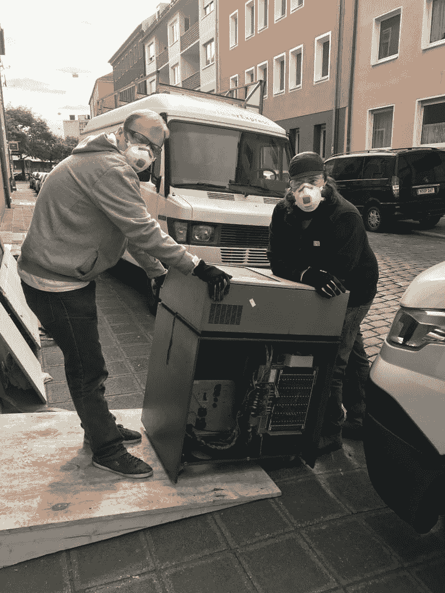
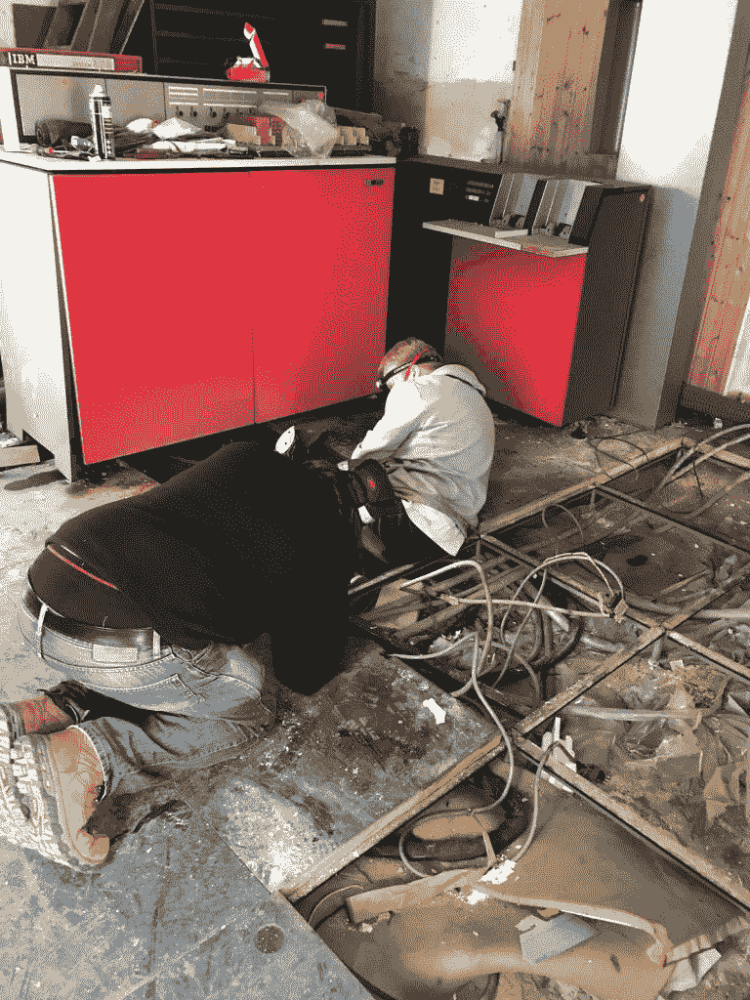
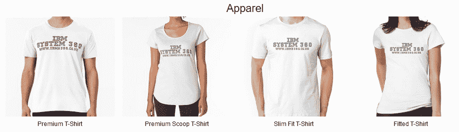
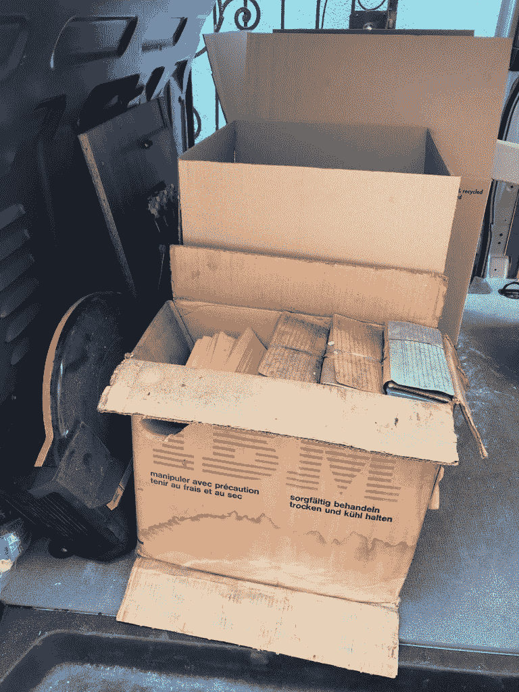
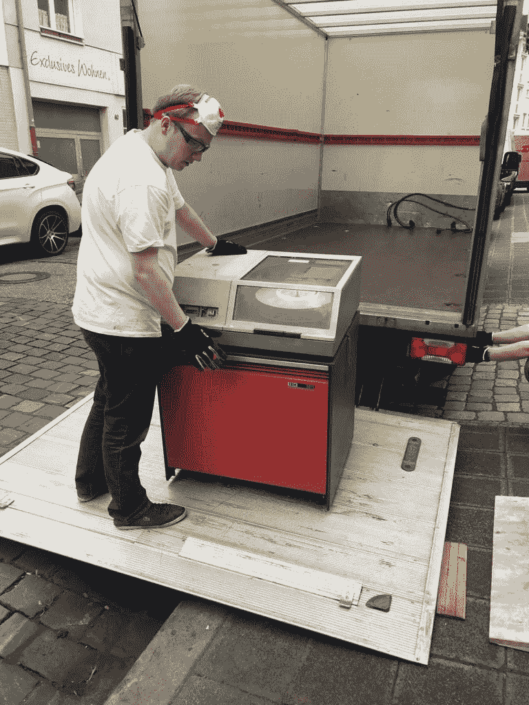

# 拯救 20 世纪 60 年代 IBM 大型机的持续努力

> 原文：<https://thenewstack.io/the-ongoing-effort-to-rescue-a-1960s-ibm-mainframe/>

本周，一个故事有了新的进展，这个故事激发了各地极客的想象力。24 岁的电脑发烧友 Adam Bradley 成功赢得了易贝的一场拍卖，拍卖了一台 20 世纪 60 年代的 IBM 大型机——然后处理了物流问题，试图在它所在的建筑被救援队摧毁之前将它运到海外的一家博物馆。

我们找到亚当·布拉德利了解最新情况，并问他这个项目有什么重要意义。

“这不像收集另一台硬件和软件都标准化的个人电脑，”亚当在周四的一封电子邮件中告诉我们。“工程团队花了一个月又一个月的时间手工设计这种设备，构建电路并进行测试，手工布线背板，设计难以置信的复杂机械项目，如果没有 CAD，我无法想象会这样。我认为保存我们历史的这一部分并能够向公众展示这一点很重要，同样，欣赏蒸汽火车或经典汽车也很重要……它们来自一个实验和偏离常规的时代，它们展示了我们今天社会这一部分的起源。

“不仅如此，它的设计非常漂亮，非常另类，只有亲自观察才能真正欣赏。”

## 一场冒险开始了

亚当和他的合作者在“IBM 360 Model 20 Rescue and Restoration”网站上亲切地记录了他们的努力。(布拉德利在网站上的简历称，多年来，他一直在英国布莱奇利的[国家计算博物馆](http://www.tnmoc.org/)从事计算机历史领域的工作，白天是一名铁路软件工程师)。4 月下旬，他和他的工程师朋友 Christopher Blackburn 在一家英国酒吧喝酒，他的工程师朋友 Christopher Blackburn 也在国家计算博物馆工作，两人[在易贝发现了一个罕见的 20 世纪 60 年代主机](https://ibms360.co.uk/?page_id=22)——在德国“一生一次的发现”。当竞标结束时，他们赢得了€3710 的主机，大约 4141 美元。

根据他们解释 IBM System/360 Model 20 历史的页面，它的核心存储在 4K 和 32K 字节之间。早在 1970 年，就有 7400 台在运行。(IBM 以 62710 美元出售这些机器，或者以 1280 美元出租。)很快，亚当就预订了机票、酒店和一辆租来的宝马(外加一辆带尾板的卡车——还有储物空间),然后前往德国检查他们购买的东西。

它就在那里，一个红色的前面板，上面有巨大的磁带机，周围是废弃建筑中的随机物品——网球拍和关于网球的书籍，加上汽车轮子和木头——旁边是一台 IBM 370 型号 125。网站上的一个页面(标题为“[预定收集日和遇到的问题](https://ibms360.co.uk/?p=64)……”)解释道:“它显然已经在那里尘封了很长时间。”

亚当还买了防尘口罩，因为“我想在这一点上，建筑物充满了石棉-安全总比遗憾好！”

很快，克里斯(和他的父亲约翰)加入了亚当的行列，进行一些急需的侦察。但是主机不可能通过侧门进入，而且唯一的另一扇门“显然没有被打开过，因为，据猜测，在 70 年代末或 80 年代初。没有人有钥匙，更糟糕的是，大楼的假地板一直建到门口，挡住了任何打开它的方法。”

他们最终得到了业主的许可，把门切掉了…

这台机器的连接电缆证明了它在某个时间点是可操作的。(他们还兴奋地发现了一些实际的现场工程手册。)但是仍然会有一些其他的大挑战。这些机器重达 620 公斤(1366 磅)，多年来，这台机器实际上已经沉入潮湿的木地板。最后，该团队使用可充气的“气囊千斤顶”来提升机器及其沉重的外围设备，以便他们可以在车轮下滑动木板，“以释放他们下陷的地板草皮。”

## 救援仍在继续

还有第二次旅行——一辆满载工具的货车行驶 681 英里，穿过欧洲隧道，到达纽伦堡——5 月 15 日是“搬家日”(根据一个名为“[大搬家](https://ibms360.co.uk/?p=185)”的页面))光是处理器就至少重达 520 公斤(1146 磅)，但“我们设法把它拖出大楼，走下斜坡，放到卡车上。”

他们还获得了一个磁盘驱动器，一个 370 处理器，一台机器和一个阅读器，“以及一些随机组件，如备用电机和电源”，外加一台打印机和电传打印机，一些磁盘包和一个系统控制台。事实上，他们最终不得不为所有外围设备租赁第二个存储单元。(他们的网站解释说，团队仍然不确定他们特定机器的确切规格，因为“机器的位置目前不允许进行深入调查！")

但是当重要时刻到来时，他们的工作变得越来越困难。“剩下的一切都以某种方式在假地板下互相连接在一起。电缆在那里已经超过 37 年了。”

除了开始拆东西——从电传打字机开始——别无他法。寻找主磁带机的电缆“需要将大部分的地板砖拉起来。”拔下处理器“花了我们几个小时来整理，因为布线复杂，在低地板下很难找到位置，以及电缆的年龄。”

他们在 YouTube 上分享了一些延时视频，“IBM 360 恢复项目[”。](https://www.youtube.com/channel/UC2wvqqQreCiEAcJq9uGEQLQ)

[https://www.youtube.com/embed/6HU-yOn2jj8?feature=oembed](https://www.youtube.com/embed/6HU-yOn2jj8?feature=oembed)

视频

第三根柱子的终点是主机[安全地存放在它的(两个)储存空间](https://ibms360.co.uk/?p=185)——更多的工作即将到来。“我们计划在几周内返回，更彻底地记录这台机器，并希望弄清楚我们所拥有的具体规格。”

但是这篇文章仍然以扣人心弦的结尾。“我们目前正处于如何将它从纽伦堡运回英国的计划阶段，所以如果任何人看到这篇文章，并且有任何承运人朋友从纽伦堡空手而归，请给我们打个招呼！”他们的[“参与”页面](https://ibms360.co.uk/?page_id=170)有更多的细节。“该机器将安装在白金汉郡艾尔斯伯里附近的一座带有活动地板和三相电源的建筑中。如果你有兴趣帮助我们，请给我们发电子邮件。”

一个[的募捐页面](https://ibms360.co.uk/?page_id=384)有更多的信息——指出他们的后备计划是为一名专业搬运工筹集资金。(预计费用:5000 英镑或 6330 美元。)“到目前为止，我们已经花了一大笔钱，仍然需要为存放机器的空间、修复等支付租金。如果我们达到我们的目标，这将意味着我们可以以更快的速度向前推进恢复，并希望提供更多的更新！”

他们还建立了一个在线商店页面，在那里你可以买到他们自制的“IBM System 360”t 恤、手机壳和咖啡杯。

但上周日，该团队还发起了 GoFundMe 活动，以覆盖跨越英吉利海峡的主机运输，在头三天吸引了 100 多项捐款。“我们非常感谢非常慷慨的捐赠者，他们在过去的几天里捐赠了令人难以置信的大量资金来帮助我们将机器运回英国，”亚当通过电子邮件告诉我们。

## 意外的回报

他们的冒险还没有结束。周三，该团队发布了关于“意外紧急返回”纽伦堡的消息。显然，当屋顶在周末开始漏水时，他们及时地把机器取出来了，“正好放在存放穿孔卡片和处理器的地方！”但是埋在一堆保时捷零件下面的一些工程手册(和 IBM 设备的一些零件)被发现了——在阁楼上发现了更多标有“IBM”的盒子。新发现的设备包括一个蓝色的 2501 穿孔读卡器和一个 5444 磁盘驱动器的“残余物”。(楼上的阁楼里有两盘 IBM 的磁带，仍在原来的包装里，还有“一盒又一盒崭新的、未开封的 IBM 穿孔卡片。”)

取回文物也有了新的时间压力——因为救援人员已经在破坏建筑了！

亚当告诉我们，现在他们希望在以前的军情六处大楼里存放和维护这台机器。“之后，我们将开始清洁过程，清除目前覆盖在机器上的多年灰尘和碎屑！

“在那次演习之后，我们将对机器的状态进行全面检查，并记录它们的状况。在此基础上，我们将起草恢复计划，最初将包括用现代等效物替换电源中的 PCB 电容器，并测试电源以确保它们正常工作。”

但是，正如他告诉《T2 登记报》的，“我们目前的重点是把机器搬到这里，把文件数字化。如果有人有办法安全而缓慢地光学读取 80 列 IBM 穿孔卡片，那将是非常有用的。我们还可以使用专门的扫描设备，例如 A0 扫描仪和书籍扫描仪，以数字化和共享我们获得的全套工程手册。”

但在整个过程中，他们一直受到网上大批隐形粉丝的支持。他们的 GoFundMe 页面上的一位评论者似乎来自一位资深程序员，他说这个项目让他想起了中学时代关于一台类似机器的一些很久以前的记忆——以及它所产生的影响。“它让我着迷。给了我一生的职业生涯。

“感激应该在某个地方——这里是最好的地方！”

* * *

## WebReduce

<svg xmlns:xlink="http://www.w3.org/1999/xlink" viewBox="0 0 68 31" version="1.1"><title>Group</title> <desc>Created with Sketch.</desc></svg>