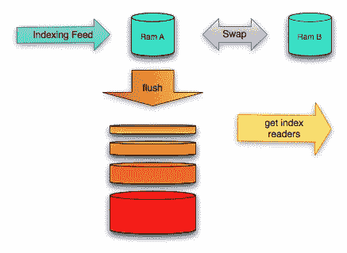

# LinkedIn 搜索架构 Galene 的开放之路

> 原文：<https://thenewstack.io/the-open-road-to-galene-linkedins-new-search-architecture/>

像许多互联网规模的公司一样，LinkedIn 不得不开发自己的工具和技术组合来满足特定的要求。我们不断在 Airbnb、脸书、谷歌等公司以及任何数量的公司中看到这种情况，这些公司现在的经营规模远远超过世界上大多数公司。LinkedIn 从第一周的 2500 名用户开始，到 2007 年增长到超过 1300 万名成员，达到了必须改变其存储、访问和组织数据的方式的地步。

今天，该公司在网络上拥有超过 3 亿用户，为了发挥其潜力，需要通过更深层次的搜索功能进行互联。如果没有进步，LinkedIn 网络将缺乏联系人们、帮助他们找到工作和参与的能力——无论是通过小组、博客还是其他方式。

这种增长预示着 LinkedIn 需要转变其数据基础设施。通过这一过程，LinkedIn 开发出了 Galene，这是一种搜索架构，可以立即对用户档案的每一次更新进行索引。在通往 Galene 的道路上，LinkedIn 已经建立了一个开源技术的核心，这个核心已经影响了它的搜索架构。

LinkedIn 的故事对 SaaS 公司来说是一个熟悉的故事，这些公司在 RESTful APIs、NoSQL 数据库和现代灵活的编程语言等创新出现之前就开始了。今天，我们面临着向必须适应应用需求的基础设施的过渡，这预示着容器、微服务和分布式架构带来的一系列新的复杂性的到来。

伴随着这些新的复杂性而来的是开源项目的驱动力，这些项目吸引开发人员来构建需要扩展的技术。LinkedIn 是较早采取这种方法的公司之一，此前它意识到了更多为公司企业而非网络规模运营构建的技术的局限性。它使 LinkedIn 有能力建立一个搜索产品，LinkedIn 首席员工工程师 Sriram Sankar 在一篇博客文章中写道，该产品旨在“找到人、工作、公司、团体和其他专业内容。”

> “我们的目标是根据每个成员的身份和关系提供深度个性化的搜索结果。”

LinkedIn 工程副总裁伊戈尔·佩里希奇

在今年早些时候的一次采访中，LinkedIn 工程副总裁 Igor Perisic 向我们解释了该公司如何转变其数据架构，并随后开发了一套开源技术，帮助该公司通过 Galene 转变其搜索功能。

LinkedIn 的变化发生在 2007 年，当时回头看，似乎对应用程序开发界来说是一个神奇的时期。由于多种因素，市场见证了新技术的爆炸式增长，以及网络规模架构的相应成熟，以适应数百万新用户。REST APIs 现在是标准，允许 web 开发人员使用该架构来构建向外扩展的服务。这些 API 引领了分离客户端-服务器关系、无状态协议、缓存、不同形式的负载平衡和编程语言(如 JavaScript)的接口的接受。API 证明了互联应用的价值以及对开放技术的日益接受。

当时还出现了大规模计算能力和存储的突然可用性，这反过来对开发工具、平台和数据库产生了自己的影响。这些技术的成熟反映在许多使用亚马逊网络服务的服务提供商身上，这种方式是上一代公司所没有的。

思科云计算副总裁兼首席技术官、OpenStack 基金会副主席卢·塔克(Lew Tucker)表示，Hadoop、Cassandra 和 MongoDB 等技术使新创业者能够做出早期创业者必须做出的投资的一小部分。随之而来的是网络规模的公司和一批新的商业软件提供商对开源项目的贡献激增，这些公司和提供商已经将他们的业务建立在开源项目之上。Docker 是符合这一要求的公司的一个很好的例子。

LinkedIn 的例子显示了一些最大的科技公司如何开源技术来建立开发者社区，这反过来又导致了基于社区贡献的平台。在这个过程中，一条线索浮现出来:更高的效率，更自动化的技术，以及为公司工作的更敏锐的开发团队。

“网络公司受益于他们在贡献开源项目时吸引开发者，”塔克在接受新堆栈的电话采访时说。“这使得雇佣员工变得更加容易。”

## 开阔的道路

LinkedIn 在搜索方面的进步可以追溯到 2007 年，当时工程师们正在与缓慢而笨拙的搜索算法作斗争。该公司希望为会员提供搜索功能，可以立即更新用户的个人资料。作为回应，LinkedIn 开发了 Zoie，这是一个基于 T2 Apache Lucene 的开源实时索引和搜索系统。LinkedIn 在 2008 年夏天开源了 Zoie。

LinkedIn 还发现，随着搜索进步带来的新功能，内存和 CPU 成本也在增加。可靠性也是一个问题，它会导致大型网络成员偶尔停机。也有关于最佳图划分是什么样子的问题。W 它可以随机分片吗，或者互相交流的人可以放在同一个分片上吗？最重要的是，它的工程师处理的是一个极其动态而非静态的环境，有许多耗时的更新。反过来，他们缺乏快速重建分区的能力，因为 Hadoop 还没有出现。最终，LinkedIn 的搜索、网络和分析团队决定采用随机分片，在 [Riak](http://basho.com/riak/) 上散列，这已经足够有效了。

LinkedIn 在 2008 年开始使用 Zoie 进行开源开发，随后逐渐转向其他开源工具，如 [Hadoop](https://hadoop.apache.org/) 。该公司需要 Hadoop 来取代 Oracle，因为它依赖 Oracle 来存储数据。尽管 Oracle 很强大，但它带来的成本证明是相当可观的，足以探索更多的开源计划。

2009 年，LinkedIn 开源了分布式键值存储系统[伏地魔](http://www.project-voldemort.com/voldemort/)。2011 年，该公司开源了 Kafka，这是一个大容量、低延迟的信息系统，用于管理实时数据。2012 年，它开源了 Sensei，一个分布式、弹性、实时、半结构化的数据库。

2013 年，Samza 出现，这是一个分布式流处理框架，最初是为了帮助实时标准化各种数据流而开发的，而不是离线，因为离线需要更多的周期，也不具备可扩展性。所有这些项目都是为了适应不断增长的数据规模，以及改造不再足够灵活的架构。LinkedIn 还开发了 [Espresso](http://data.linkedin.com/projects/espresso) ，这是一个可横向扩展的、有索引的、时间线一致的 NoSQL 数据存储，最终将取代该公司遗留的 Oracle 数据库。

Sankar 在他写的关于 Galene 的博客中说，前 Galene 的建筑还包括 Bobo，Cleo，Krati 和 Norbert。这些组件也是开源的。

该架构在许多方面仍然缺乏深度。索引很难重建。如果索引确实需要重建，比如说在数据损坏之后，这通常意味着需要几个人来完成这个项目。更新很麻烦，当只有一部分需要修改时，需要重新构建整个实体。评分是不灵活的，这使得插入机器学习分数成为一项繁琐的任务。Lucene 的能力有限。离线相关性、查询重写、重新排序、混合和实验都是 Lucene 无法实现的。

还有关于开源组件的问题。随着越来越多的东西被开源，跨多个组织整合东西就变得越来越分散和复杂。那次经历教会了他们不要拆散 Galene。相反，根据 Sankar 的说法，Galene 变成了一个具有单一身份的单一统一框架。

去年，该公司推出了 Galene 作为其新的搜索架构，以取代 Lucene。对于 Lucene 来说,“最初存在内存泄漏。为了持久化索引和进行 Lucene 优化，你必须关闭机器。“[Galene]改造了整个后端搜索栈。”

Galene 代表了 LinkedIn 从反应式的临时方法向更全面的方法转变，以跟上规模的步伐。在他写的关于 Galene 的帖子中，Sankar 解释了为什么 LinkedIn 超越 Lucene，以及这一转变背后的技术细节:

随着我们的成长，我们通过在 Lucene 之上增加层来发展搜索栈。我们扩展系统的方法是被动的，通常是狭隘的，并导致在我们的架构中增加新的组件，每个组件解决一个特定的问题，而没有整体地考虑整个系统的需求。这种渐进式发展最终碰壁了，要求我们花费大量时间来保持系统运行，并执行可伸缩性攻击来扩展系统的极限。

Galene 背后的新搜索架构允许成员和公司快速检索复杂搜索查询的结果，如“巴西具有 Hadoop 经验的工程师”或“我的关系在纽约的公司中的数据科学工作”。

除了响应 LinkedIn 不断增长的需求，Galene 的搜索架构也是向该公司建立全球首个“

[economic graph](https://www.linkedin.com/pulse/20121210053039-22330283-the-future-of-linkedin-and-the-economic-graph)

“—全球经济的数字地图，它确定了人员、技能、工作和公司之间的联系，整合了实时趋势，从而创建了一个节点网络，将人才与大规模机会无缝链接。

那么，对于 LinkedIn 来说，即将到来的一年会是怎样的呢？根据 Perisic 的说法，该公司关注的首要数据科学和发展主题包括数据标准化，如何优化多样性，添加更多语言，简化排名，以及关注跨平台以类似方式表达模型的能力。

特色图片[通过](https://www.flickr.com/photos/smi23le/4613342990/in/photolist-82EA9o-7w564c-6M62rr-7yuDWB-9fLRVv-n5ztS-d59ToJ-82EAFQ-5BwY81-82Buin-98SppB-cNL4r7-27Msfr-2hG19-82EAmu-cNL2KS-82EzHN-5R4hW5-9MKoLL-adWYuV-3ahJ3L-9d9ApV-2wHv8-ayeJFw-dyyYT5-dTZsva-7RD8PQ-dQuDXo-eqJboT-dpcrWp-zX9Xu-5xLtMw-dQp4Xr-9Js88s-axKupX-5zyyhF-8W2L2-aFbk4G-9v76Un-4v6vLm-brCjfb-dwtTSy-8mf6pd-ayc3yD-9Y9nGA-7xatis-gjuvyS-6tLekM-8QaTgm-8Q7Mti) Flickr 知识共享。

<svg xmlns:xlink="http://www.w3.org/1999/xlink" viewBox="0 0 68 31" version="1.1"><title>Group</title> <desc>Created with Sketch.</desc></svg>