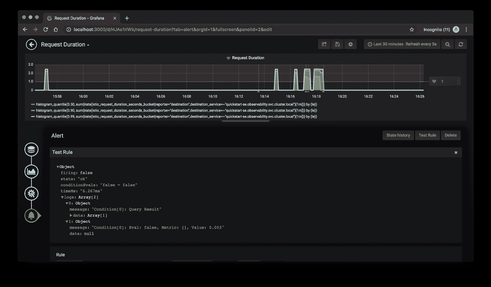

# 开源容器——本地可观察性工具包

> 原文：<https://thenewstack.io/the-open-source-container-native-observability-toolkit/>

[Mickey Boxell](https://www.oracle.com/cloud-native/)

[Mickey 是甲骨文云原生实验室团队的解决方案架构师。他专注于构建客户可部署的云原生/容器原生解决方案，以弥合开源社区和核心 Oracle 云基础设施服务之间的差距。这包括与 Kubernetes 平台相关的解决方案教程、示例代码、技术博客文章。](https://www.oracle.com/cloud-native/)

本文将探讨与可观察性和监控相关的概念，以及一些流行的用于容器本地环境的开源监控工具。如果你想让你的 Kubernetes 环境更加引人注目，并且需要关于从哪里开始的建议，这是一个很好的起点。

采用容器原生和云原生开发实践带来了新的运营挑战。如今，部署在 Kubernetes 等容器编排平台上的微服务环境是多语言的、分布式的、基于容器的、高度可扩展的和短暂的。为了理解系统组件之间的交互，您必须能够跨分布式环境跟踪请求的生命周期。如果没有合适的工具，it 人员可能无法识别症状并确定问题的根本原因。这种情况要求我们在作战计划中把可观测性作为头等大事来考虑。

## 可观察性

当我提到可观察性时，我指的是设计和操作一个更加可见的系统。系统，尤其是复杂的分布式系统，不可避免地会遇到故障，识别这些故障并做好准备是很重要的。这种理念不同于系统监控，因为可观察性采取一种整体的方法，包括前瞻性的系统和过程设计。这不仅包括以现实的方式测试您的环境并在生产中报告有用的、可操作的数据的能力，还包括业务影响方面的考虑。

在可观察性的保护下，监视为用户提供了通过外部输出确定系统内部状态的能力。这些外部输出通常由日志、指标和跟踪组成。结合起来，这些用于准确和快速地对不利事件进行分类，以便恢复正常服务。它们还可以让你进行有益的事后分析，以帮助你避免未来发生类似事件。我将使用一个样本 Java 微服务应用程序直接测试这些概念。

现场可靠性工程(SRE)是一种有助于观察和监控的方法。这种观点来自 21 世纪初的谷歌，专注于大规模可靠运行系统和基础设施的最佳实践。从根本上说，目标是维护系统的可用性和效率。设计现代系统时，牢记 SRE 概念，如 SLIs、SLO 和 SLA(分别为服务级别指标、目标和协议)，会有所帮助。这些量化指标定义了对业务最重要的指标、这些指标的理想值以及未达到预期服务级别时的计划反应。

类似地，诸如故障间隔时间(MTTF)、系统故障前的运行时间和修复间隔时间(MTTR)、使系统恢复正常运行状态所需的时间等概念有助于评估事件响应的有效性。所有这些概念都有助于提醒我们，可观察性不仅仅是一个运营问题，因为服务中断或降级会影响企业中的每个人。

## 日志

日志是可观察性的最基本的支柱。它们是在给定时间发生的事件的记录，由可用于诊断问题的特定上下文的粒度信息组成。

大多数库都支持日志记录。例如，我们的示例应用程序使用 Java 日志类和一个 l *ogging.properties* 配置文件，该文件写入 *stdout* 。 *Stdout* 和 *stderr* 是 Kubernetes 环境中最常见的选择。开发人员有义务将有意义的日志放到他们的代码中。

实现一个工具来聚集日志是很重要的，否则它们可能会丢失。开源日志转发器，如 FluentD，用于从您环境中的所有节点抓取日志，然后处理并将其发送到持久性数据存储，如 Elasticsearch。

Elasticsearch 是一个开源的分布式分析引擎，可以直接查询或通过可定制的可视化仪表板 Kibana 进行交互。所谓的 EFK 堆栈，Elasticsearch，FluentD 和 Kibana，提供了集中的集群级日志记录和分析这些日志所需的工具。还有其他很棒的工具可以用来伐木，包括 Logstash、Graylog 和 Timber。

最后，一定要确保选择一种工具来捕获日志，并为您提供准确筛选日志以获得诊断问题所需信息的能力。

## 韵律学

度量是描述定期测量的组件或服务行为的数据的数字集合。因为指标是数字的，而不是基于文本的，所以它们易于存储和建模。度量对于理解典型的系统行为很有用。在 Kubernetes 空间中，有许多级别的可用指标，从底层节点到应用程序单元、应用程序性能监控(每秒请求数、错误率等)。)等等。大多数应用程序框架都包括用于测量指标的库。开源系统监控工具包 Prometheus 包括创建进程内样本的库、收集数据并将其发送到 Prometheus 时序数据库的工具以及分析数据的查询语言。我们的示例应用程序使用度量类，将数据推送到/metrics 端点，由 Prometheus 收集。您可能还想探索其他工具，如 Graphite、InfluxDB 和 Statsd。

Grafana 是一个用于监控的开源数据可视化工具，可用于将来自众多来源的指标数据聚合到仪表板中，从而提供关键指标的汇总视图。Prometheus 和 Grafana 共同组成了一个系统监控、警报和可视化工具包，由云本地计算基金会(CNCF)推荐用于基于容器的基础设施。

[Oracle 云监控服务](https://docs.cloud.oracle.com/iaas/Content/Monitoring/Concepts/monitoringoverview.htm)为 Oracle 云基础设施资源提供现成的聚合指标。这些指标既可以在 Oracle 云控制台上获得，也可以通过 API 获得。我们与 Grafana 合作[将监控服务作为 Grafana 数据源](https://thenewstack.io/how-oracle-plugs-into-the-cloud-native-dashboard-grafana/)公开，这意味着您可以在 Grafana 中将 Oracle 云基础设施数据与其他数据源一起可视化，并使用它来创建漂亮而有用的仪表板。

指标也非常适合触发警报。警报是指示人类需要立即采取行动来响应正在发生或将要发生的事情以改善情况的通知。Grafana 可用于创建一个规则，在满足特定条件时触发警报。我选择创建一个基于请求持续时间的规则，该规则将在超过特定请求阈值时发出警报。在本例中，我配置了一个警报，通过一个通知通道发送，该通道通过一个传入的 webhook 连接到 Slack。

## 跟踪

跟踪表示因果相关的事件，它们是分布式环境中请求流的一部分。它们提供了对请求结构和路径的可见性。跟踪非常适合理解请求的整个生命周期。因此，它们有助于为调试目的查明问题，例如，增加的延迟或资源利用率。

跟踪器存在于应用程序代码中。它们为每个请求分配一个全局 ID，并在传递 ID 之前，在流程的每一步插入元数据，称为一个跨度。跟踪的一个挑战是很难改进现有的应用程序来支持跟踪。应用程序的每个组件都需要被检测以传播跟踪信息，这在多语言体系结构中尤其具有挑战性。示例应用程序利用了 OpenTracing API for Java。OpenTracing 是一种与语言无关的分布式跟踪方法。可以使用工具来可视化和检查跟踪，例如开源的分布式跟踪系统 Jaeger。Zipkin 是跟踪的另一个选项，也与 OpenTracing 兼容。

## 服务网格

服务网格为微服务应用提供了一个可配置的基础设施层。服务网格监控和控制通过集群的流量。与处理进入集群的南北流量的 API 网关不同，服务网格处理服务之间的东西流量。许多服务网格使用 sidecar 模式，这种做法是为每个 pod 提供一个代理容器，如 Envoy，它控制和协调网格内服务之间的网络流量，而无需更改代码。

这种模式提供了对正在运行的内容的可观察性和感知。虽然有许多网格选项可供选择，包括 Linkerd 和 Consul，但我选择实现 Istio，因为它提供了与许多开源可观察性工具的现成集成。

虽然实现服务网格不会消除对应用程序进行检测的需要，但是在跟踪的情况下，它可以使过程更简单。网格将在代理级别处理跟踪和度量收集。

为了获得更详细的跟踪信息，应用程序仍然需要将报头转发到下一跳，但除此之外，代码更改的数量是最小的，因为网格可以捕获请求中每一跳的延迟、重试和失败信息。它还简化了部署各种从我们的仪表化应用程序获取数据的服务。

用于部署 Istio 的相同头盔图表可用于部署 Grafana、Prometheus、Jaeger 和 Kiali，并使用有用的仪表板预先填充它们。Kiali 是 Istio 的一个可观察性工具，可以帮助您可视化网格中运行的服务之间的关系。Kiali 还可以直接链接到 Grafana 和分布式跟踪工具，轻松切换到各自的仪表板。

## 示例应用程序

为了演示这些工具，我们将使用一个用 Helidon 框架编写的示例应用程序:为开发微服务而设计的 Java 库。该应用程序由 Main.java 和 RESTful web 服务 GreetService.java 以及用于将应用程序部署到 Kubernetes 集群的清单文件组成。应用程序的功能很简单:用 PUT 和 GET 请求更新问候和问候的接收者。该应用程序还包括执行“慢速问候”的选项，这是一种注入延迟的请求，可用于模拟延迟。模拟错误代码、延迟和失败也是您可以用 Istio 在不修改代码的情况下完成的事情。

我将应用程序部署到 Kubernetes 集群的 Oracle 容器引擎上，并启用了 Istio sidecar 注入。我选择的工具，Grafana，Prometheus，Elasticsearch，FluentD，Kibana，Jaeger，Istio 和 Kiali，只是可供选择的一部分。我之所以选择这些工具，是因为它们都是开源的，而且每个工具都可以很好地与 Kubernetes 一起工作。

## 示例场景

假设选择一个与请求时间相关的 SLI，比如对应用程序发出请求的持续时间。为了确保积极的用户体验，您决定将请求的 SLO 设置为不超过两秒钟。为了满足与您的目标相关联的 SLA，您使用上面讨论的监控工具来确保您能够快速、有效地识别和解决请求缓慢的根本原因。

为了测试一个示例故障排除工作流，我为我的应用程序配备了日志记录、指标和跟踪工具。我还在我托管的 Kubernetes 环境中配置了上述工具。我在 Grafana 中创建了一个与应用程序请求持续时间相关的警报规则:任何超过一秒的请求都会触发警报。首先，我将使用编写在应用程序中的人为缓慢的“慢速问候”处理程序向应用程序发出请求。这个比典型的请求时间慢的时间将使我们超过一秒钟的限制，触发来自 Grafana 的警报，该警报已被配置为每当超过请求阈值时，就向 Slack 发送通知，并带有消息:“请查看请求持续时间”。

接下来，我可以查看我的 Grafana 仪表板，看看异常缓慢的请求是如何开始的，以及它们与平均请求时间相比如何。

鉴于我不确定这种延迟发生在哪里，我接下来要做的就是让 Jaeger 检查通过各种系统的请求流。在 Jaeger 中，我可以找到与一个慢速请求共享时间戳(下午 4:16:47)的跟踪范围。这将向我显示哪个服务遇到了延迟，以及它的 Kubernetes 名称空间和容器名称。

一旦我找到了罪魁祸首(在本例中是 Greet 服务),我将前往 Kibana，这将允许我使用我们之前查看的跟踪跨度中相同的时间戳、名称空间和容器名称来搜索有问题的服务的日志。当我检查我的日志时，我可以在我的应用程序代码中看到与我的“慢速问候”相关的注释:“您故意使这个请求变慢！”

一旦我纠正了这个问题，在这种情况下不再发送缓慢的问候，警报将停止触发，我将收到通知，一切正常。

当然，这是一个简单应用程序的简单示例，但是这些概念可以应用于复杂的体系结构。如果这个场景涉及不止一个用户(我)来检查问题，那么票据队列将有助于确定谁需要采取行动。

## 摘要

采用能够洞察日志记录、度量和跟踪的可观察性实践，可以让您最大程度地了解现代分布式系统的行为。如果您的环境中出现问题，这些工具将允许您发现问题，查明其位置并确定如何修复它。这些相同的工具可用于主动测试您的环境，并提高系统的性能和效率。除了监控，可观察性还包括一种哲学方法，这种方法认识到问题可能对更大的业务产生的影响，以及当这些问题不可避免地出现时如何解决这些问题的因素。

## 进一步阅读

了解更多关于可观测性的有用资源是 O'Reilly 的“[分布式系统可观测性](https://www.oreilly.com/library/view/distributed-systems-observability/9781492033431/)”有关 SRE 的更多信息，请查看“[现场可靠性工程](https://landing.google.com/sre/sre-book/toc/index.html)”和“[现场可靠性工作手册](https://landing.google.com/sre/workbook/toc/)”

[https://www.youtube.com/embed/w2Yx7OmsX4c?feature=oembed](https://www.youtube.com/embed/w2Yx7OmsX4c?feature=oembed)

视频

<svg xmlns:xlink="http://www.w3.org/1999/xlink" viewBox="0 0 68 31" version="1.1"><title>Group</title> <desc>Created with Sketch.</desc></svg>