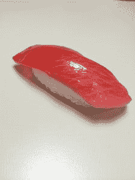
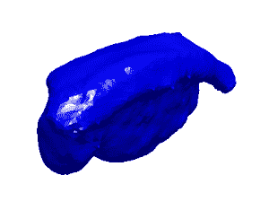

# 3D 打印日本假食品复制品的悖论

> 原文：<https://thenewstack.io/the-paradox-of-3d-printing-japanese-fake-food-replicas/>

它始于对日本食物的强烈渴望。不是为了吃它，而是为了看看这些美味的、超真实的日本塑料食品是否能被完美复制。如果有可能 3D 打印出[肯德基上校的原始配方鸡肉](http://www.foodbeast.com/2014/03/14/3d-printer-makes-model-of-kfc-drumstick-because-why-not/)、[的可食用奥利奥](http://www.foodbeast.com/2014/03/07/oreo-3-d-printing-machine-prints-trending-flavors-on-twitter/)、 [Foodini 的披萨面团和番茄酱](http://www.foodbeast.com/2013/12/19/heres-what-a-3-d-printed-pizza-dough-and-tomato-sauce-look-like/)，为什么不能 3D 打印出通常由蜡或聚氯乙烯制成的日本食品呢？然而，随着 3D 打印继续扩展到从珠宝到微型家具的市场[,出于一些原因，日本的假食品专注于手工制作的过去，对任何快速发展的技术都不感兴趣，尽管这似乎是可能的。](https://thenewstack.io/3d-printing-is-creating-a-new-arts-economy/)

堪萨斯城的教育家乔·卡姆(Jo Kamm)给艺术家们讲授数字设计和制作课程，他说:“(假日本食品复制品)肯定有一部分可以 3D 打印。”。“让我们看看面条。从面条开始总是比试图通过将面条做成固体来复制面条的一部分更有意义。”

关于面条，他指的是他在堪萨斯城教授艺术家的[“3D 打印的 10 个原则”](http://jokamm.dropmark.com/158902)中讨论的拉面的延展性。Kamm 在他的课程中加入了一个 [masa 模块](http://jokamm.dropmark.com/158902/2773647),它是通过悬垂细丝制作的，而不是就地印刷。

3D 打印过程，也称为添加制造，将一个 3D 实体对象转化为模型。这需要对物体进行扫描，打印机使用通过喷嘴分配的特定材料层来创建物体。3D 打印机自 20 世纪 80 年代以来就已经存在，但它自 2010 年代初以来越来越受欢迎，当时随着大规模生产的增加，3D 打印机的价格大幅下降。

有人会认为这对于 3D 打印假日本食物复制品的可能性来说是个好消息。在 ShapeWays 和在线 B2B 市场上已经有很多寿司，在 ShapeWays，任何人都可以制作设计模型并提交给客户进行 3D 打印。甚至日本最大的家居用品店，[山田电机也在 2013 年 7 月](http://www.3ders.org/articles/20130718-yamada-denki-japan-largest-home-appliance-chain-to-sell-3d-printers.html)开始销售 3D 打印机。

> “3D 打印确实是为独特的生产而优化的，”卡姆说。“如果你想要一模一样的东西，你需要 1 万个，3D 打印物体的成本永远不会下降——所以如果你想要 100 个，那么它的成本就和你想要 1 万个一样，而如果你想要大规模生产，制造 2 个或 10 个可能会非常昂贵，但如果你制造 1 万个，成本就会大幅下降。”

有一天，在浏览 Instagram 时，我突然又想吃日本料理了。这与气味无关，而与住在东京的电路工程师富户藤原发布的方形照片有关。作为一名狂热的 3D 打印机，他的 Instagram feed 专注于真正的日本食物和许多猫。他解释说，他在餐馆看到的日本食物样品是用蜡制成的，不是为了 3D 打印。

在东京浅草买的寿司照片，7 美元。图片由@beansoil 提供

“我认为用目前的 3D 打印机很难打败他们，”藤原说。“因为廉价的 3D 打印机没有足够的精度打印出一粒米那样的细节，也没有金枪鱼生鱼片那样生动的表情色彩。”

藤原告诉我，无论如何他都会尝试 3D 打印寿司。他在东京浅草区购买了这些寿司样品，每个 7 美元。他说:“这些寿司是聚氯乙烯树脂——不是 3D 打印的。”

藤原在他的扫描仪中对这些假寿司进行了 3D 扫描，得出了他称之为“石头”的数据换句话说，这不是寿司。

“这是我不使用 3D 打印机打印食物样本的一个原因，”藤原说。

藤原并不是唯一对 3D 打印寿司不感兴趣的人。Justin D. Hanus， [Fake Food Japan](http://fakefoodjapan.com/pages/about-us) 的创始人兼首席执行官表示，假冒食品制造商不使用 3D 打印方法。他的公司在日本大阪生产假冒食品，假冒食品行业始于 1932 年。

@beansoil 的寿司 3D 扫描

尽管有可能通过 3D 打印手段创造出一个原型(比如一个橙子)，但目前并不是所有的物品都是可能的，比如意大利面条，T4·哈努斯说。“我在电视上看到过 3D 打印的假食品与传统制作的假食品在真实性对比测试中较量。3D 打印在这方面输了，因为尽管它很好，但在有限的细节和真实感方面，它还不如手工制作的假食物。”

但是，没有 3D 打印日本假食品复制品的部分原因可能与这个领域手工设计的文化传统有关吗？卡姆指出，使用 3D 打印机生产假食物复制品的某些成分是可能的——比如拉面、餐桌中央的装饰品，甚至是米饭。

想想日本的传统“网助”(netsuke)吧，这是一种小型木制雕塑，最早出现在 19 世纪的日本，用于将小容器系在无口袋的和服腰带上。起初是一个实用的创作，netsuke 很快成为精细工艺品的一个例子，这类似于日本的假食品复制品。

【Hanus 说，“【3D 打印假日本食品】就是不划算，而且目前能做的东西相当有限也是一个因素。除非未来几年有一些重大创新，否则至少在未来十年到二十年内，我们似乎不会诉诸 3D 打印。”

通过 FakeFoodJapan.net 的特征图像[。](http://fakefoodjapan.net/img/med/osechi_new_years_dish_ver_2_MED.jpg)

<svg xmlns:xlink="http://www.w3.org/1999/xlink" viewBox="0 0 68 31" version="1.1"><title>Group</title> <desc>Created with Sketch.</desc></svg>