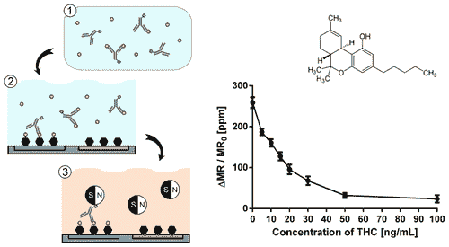

# Potalyzer，大麻探测器及其引发的问题

> 原文：<https://thenewstack.io/the-potalyzer-a-marijuana-detector-and-the-questions-it-raises/>

在美国，大麻是合法的——至少在四个州，而另外 16 个州至少将某些形式的大麻合法化。但这也提出了一个问题，即如何测试司机在大麻影响下的驾驶。大学和设备制造商正在争先恐后地用新的测试设备来填补空白，本周看到了一种实际上使用磁性纳米技术的新设备的到来。

因为它有效地为警察提供了一个吸大麻的酒精测试仪，头条新闻作者开始称它为“[酒精测试仪](http://www.mercurynews.com/2016/09/12/stanford-engineers-develop-potalyzer-test/)”。

但是除了有趣的标题之外，背后还有一些严肃的科学。精心制作的传感器检测磁性生物粒子的存在，这些粒子是专门设计来结合四氢大麻酚分子和抗体之间的反应的。几十年来，类似的基于抗体的“免疫分析”一直被用于研究，但“据我们所知，这是第一次证明巨磁阻生物传感器能够检测小分子，”该研究小组的负责人单 X. Wang 写道。

斯坦福大学教授王山

王是斯坦福大学电子工程系(以及材料科学与工程系)的教授，多年来他一直领导着一个研究纳米磁性的小组。斯坦福大学[磁性技术中心](https://nanomag.stanford.edu/)的网页上写道:“我们设想，我们的中心应该能够在新兴技术发展成为主流产业之前，影响或引领磁性相关技术的新浪潮。”。其他项目包括用磁性存储信息或用它来检测疾病，如癌症、心脏病，甚至传染病。

但是这种设备可以检测 THC 的存在，并且在 0 到 50 毫微克的范围内。“目前市场上没有任何设备能够像呼气测醉器测量酒精中毒那样有效地快速提供对司机大麻中毒的精确测量，”斯坦福报告说，并指出大多数 THC 测试还需要血液或尿液样本的实验室检查。

这比简单的免疫测试要复杂一点。这一程序涉及一次性芯片盒，每个芯片盒都含有预定量的四氢大麻酚。但是首先，根据斯坦福大学工程系网站的说法，唾液样本暴露于含有抗体的溶液中，该抗体对任何存在的四氢大麻酚都有反应。当该样本随后暴露于一次性试剂盒时，“传感器上与 THC 分子结合的抗体数量告诉该设备样本中的 THC 用完了多少抗体，因此样本中存在多少 THC 分子。”

换句话说，当抗体已经与唾液样本中的四氢大麻酚发生反应时，它在试剂盒上检测到的四氢大麻酚较少…

手持移动设备执行测试，甚至在三分钟内通过蓝牙连接将结果发送到智能手机或笔记本电脑。该设备还可以用于检测吗啡、海洛因、可卡因和其他非法药物。斯坦福大学的研究人员已经使用该设备进行了一些有前景的测试，以检测吗啡，根据该学校的网站，“内置 80 个传感器，GMR 生物传感器芯片可以筛查单一样本中的多种物质。”

在警方实际使用该设备之前，它需要更多的实地测试和官方批准。但是有更多的团体关注同样的问题。如果你想知道他们如何测试一种测量吸了多少大麻的设备，加州警察局有答案。据 RT 报道，警方已经开始在加利福尼亚州对“几个古怪的司机”实地测试另一种酒精测试仪[，明年警方将开始在全美测试该设备。这个毒品嗅探装置的名字？猎犬。](https://www.rt.com/usa/359242-marijuana-breathalyzer-california-police/)

尽管这种设备只测试过去食用大麻的情况，“基本上每个人都同意，因为他们很好奇……”猎犬实验室的首席执行官说，他也是阿拉米达县警察局的后备军官。《美国新闻&世界报道》的一篇文章称，猎犬实验室已经在市场上击败了另一家公司，该文章报道说 Cannabix Technologies 正在开发一种类似的产品。

同一篇文章还提到了 Intelligent Fingerprinting 的药物测试产品，这是一家总部位于英国的公司，拥有一种可以在特定阈值下检测几种非法药物存在的设备，他们希望明年在美国销售。“我们还没到那一步，”他们的销售副总裁告诉该杂志，“但我们确实有相当多的城市和县有兴趣进行试点，从而验证我们的产品在路边(药物影响下驾驶)的停止。”与此同时，他们的设备将在戒毒机构进行测试。

圣地亚哥加利福尼亚大学的研究人员也在研究这个问题。但是一家德国公司已经在销售 DrugTest 5000，一种类似的产品已经被纽约警察局、内华达公路巡逻队和俄克拉荷马部落警察使用。他们自豪地告诉杂志，他们的产品已经被用于超过一百万次测试。一位公司高管提出了一个重要的观点:问题不仅仅在于各种各样的设备。“未来十年，科学界将围绕这些(THC 数据)与损害的关系展开一场食物大战。”一家加州法院已经裁定该测试在一起车辆过失杀人案中是可接受的。

在最近发表的论文中，甚至王教授也指出“引起损害的 THC 的截止浓度仍有争议。”NPR 最近报道说，“事实证明，测量一个人的 THC 是[实际上是一个不良的醉酒指标](http://www.npr.org/sections/health-shots/2016/09/06/492810932/the-difficulty-of-enforcing-laws-against-driving-while-high)纽约大学的一位公共政策教授上周告诉他们，“你可以在最后一次使用大麻一周后对 THC 呈阳性，完全没有主观损害，没有任何客观衡量标准的损害，但仍然是阳性的。”

引用国家药物滥用研究所的信息，NPR 早些时候报道说这只是[不像测量某人血液酒精浓度](http://www.npr.org/sections/health-shots/2016/02/09/466147956/why-its-so-hard-to-make-a-solid-test-for-driving-while-stoned)那么简单。“测量你身体某个部位的酒精含量可以预测出你身体其他部位的酒精含量——比如在任何特定时间对你大脑的影响程度……但大麻不是这样的。你的醉酒程度并不是在血液中四氢大麻酚水平达到峰值的时候，而且这种高值并不是根据有多少四氢大麻酚离开和进入你的体液而均匀上升和下降的……”

因此，我们已经在制造可以检测各种样本中四氢大麻酚水平的设备——甚至在法律(和医学)对什么数字实际上有意义达成共识之前。

但这是一个注定会受到更多关注的问题。今年 11 月，加州还将投票决定大麻是否应该在该州完全合法化——该法案预计将在 T2 获得通过。它得到了前脸书总统肖恩·帕克和现任加州上尉州长加文·纽瑟姆的支持。“很明显，在过去的几年里，加州人在这个问题上的态度发生了巨大的变化，”加入南加州大学 poly sci 部门的前政治战略家丹·施努尔(Dan Schnur)说(他是这项民意调查的负责人)。收集了 60 万个签名，比实际需要的多了 20 万个，以便在 11 月的投票中实施这项措施。如果法案通过，“每六个美国人中就有一个生活在合法销售大麻的州，”据美联社报道，“T4”包括整个西海岸。"

所以“酒后驾车”可能会成为一个更大的问题。

至少在我们发明自动驾驶汽车之前。

特征图像通过[维基百科](https://en.wikipedia.org/wiki/Legality_of_cannabis_by_U.S._jurisdiction#/media/File:Map-of-US-state-cannabis-laws.svg)，归属于 Lokal_Profil，由 [CC BY-SA 2.5](http://creativecommons.org/licenses/by-sa/2.5) 使用。其他照片由斯坦福大学提供。

<svg xmlns:xlink="http://www.w3.org/1999/xlink" viewBox="0 0 68 31" version="1.1"><title>Group</title> <desc>Created with Sketch.</desc></svg>