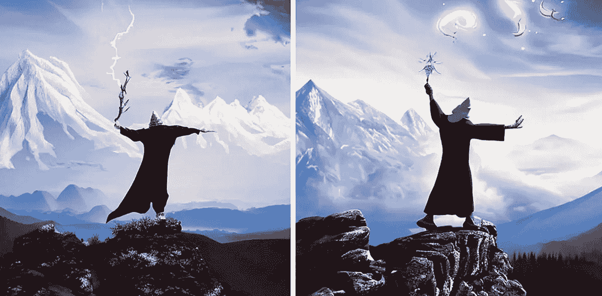

# 人工智能图像生成模型的权力和伦理困境

> 原文：<https://thenewstack.io/the-power-and-ethical-dilemma-of-ai-image-generation-models/>

最近出现的[深度学习文本到图像平台](https://thenewstack.io/avocado-chairs-at-the-intersection-of-human-language-and-neural-networks/)，如 [Midjourney](https://www.midjourney.com/) 和 [Stable Diffusion](https://github.com/CompVis/stable-diffusion) ，允许人们在几秒钟内变出令人难以置信的数字艺术作品，只需键入一个简短的描述性文本提示——例如，它可以像“一个巫师在山顶上施咒”这样简单

这些新工具中的许多对普通大众来说都相对容易使用——所有这些都不需要花费数年来学习绘画的基础知识。

我们中的许多人都很清楚机器学习的潜在好处，例如帮助[企业更顺利地管理数据](https://thenewstack.io/how-and-when-to-use-ai-to-augment-traditional-analytics/)，或者帮助[医疗专业人员做出更准确的诊断](https://thenewstack.io/deep-learning-ai-detects-rare-genetic-disorders-by-scanning-faces/)，或者从每日新闻中筛选[错误信息](https://thenewstack.io/deep-learning-ai-tool-identifies-fake-news-with-automated-fact-checking/)。然而，毫不奇怪，人们也有理由担心潜在的人工智能陷阱，例如它被滥用来创造[令人难以置信的深度假货](https://thenewstack.io/deep-learning-ai-generates-convincing-deepfake-videos-of-mona-lisa/)、算法偏见的社会影响[、或者围绕面部识别等人工智能技术的](https://thenewstack.io/hidden-gender-racial-biases-algorithms-can-big-deal/)[大规模监控焦虑](https://thenewstack.io/clearviews-controversial-facial-recognition-ai-automates-mass-surveillance/)。

现在，这些新的生成工具正在酝酿一波围绕人工智能伦理的担忧。

## 人类艺术家'与代码竞争'

这些系统就是所谓的[扩散模型](https://medium.com/mlearning-ai/enter-the-world-of-diffusion-models-4485fb5c5986)，这是一种[类型的生成模型](https://en.wikipedia.org/wiki/Generative_model#Generative_models)，它创建的数据输出看起来与它们被训练的输入数据相似。

这些扩散模型于 2015 年首次出现，其工作原理是通过连续添加高斯噪声来破坏训练数据，然后通过逆转这种“噪声”或扩散过程来学习恢复数据——这使它们在图像生成方面比[生成对抗网络](https://thenewstack.io/logan-is-a-deep-learning-ai-that-transforms-3d-shapes-seamlessly/) (GANs)更强大。

正是通过这种“去噪”和“去噪”的扩散过程，人们甚至可以使用这些人工智能图像生成器来创建特定艺术家风格的图像，只需输入他们的名字。这是因为这些模型是在从互联网上搜集的数百万张图片上训练出来的——一项[研究](https://arxiv.org/pdf/2110.01963.pdf)最近显示这些图片可能包含有害甚至非法的内容。

“巫师在山顶施法”的图像，由稳定扩散生成(通过 OpenArt.ai)。

一位特别受欢迎的艺术家是波兰概念艺术家 [Greg Rutkowski](https://www.artstation.com/rutkowski) ，他的名字和图像经常被用来帮助训练和制作这些模仿的人工智能艺术品，他以其经常为游戏行业创作的奇幻画作而闻名。

但问题是，Rutkowski 本人从未批准以这种方式使用他的图像。更糟糕的是，一些人工智能生成的模仿品甚至有他的签名。

Rutkowski 在接受 Crypto Mile 采访时说:“(人工智能艺术一代)的发展方式和前进方向令人恐惧。”。“现在只需要 5 到 10 分钟就能创造出人类两周才能创造出的东西。我们可能要等一年，直到它变得足够好，能够与在世的艺术家竞争。”

这就是这种人工智能图像生成器背后的伦理难题。为了以特定艺术家的风格创作出一些东西，该艺术家的作品必须从互联网上刮下来，然后输入这些人工智能训练数据集。

然而，这些图像生成器背后的公司都没有明确征求艺术家本人的许可——艺术家也没有得到补偿。

“选择使用这项技术的人需要明白，这些算法中的绝大多数是在不受控制的数据集上训练的，”Adobe 的创意总监弗拉基米尔·彼得科维奇在最近的 LinkedIn 帖子中说。

“受版权保护的艺术品、艺术家的个人姓名和风格被简单地摄取，而没有对合法作者的任何尊重。这创造了一个环境，艺术家需要与代码竞争，这是利用他们的辛勤劳动。人工智能作为一种强大的工具，可以增强许多创造性的工作流程。然而，在我们有一个合适的系统之前，这个系统将[正当地]归属和补偿那些其工作被用来训练这些算法的每个人，我个人认为用它们来产生‘艺术’概念是不道德的。”

## 不可预见的影响

除了侵犯版权和潜在威胁人类艺术家的生计，人工智能可能会在行业中产生更广泛的、不可预见的连锁反应。例如，人工智能图像的广泛使用可能会阻止未来的艺术家追求创造性的职业生涯，因为他们可能会认为，在未来可能由机器生成的艺术主导的市场中竞争是徒劳的。

此外，人工智能还可能扰乱艺术行业内的教育渠道，在艺术行业，初出茅庐的艺术创作者通常会投入大量现金，参加由知名艺术家和艺术学校开设的课程，以获得有助于他们在行业内晋升的适销技能。

事实上，人工智能自动化从专业艺术家和插画师手中夺走工作的威胁不仅仅是一个模糊的前景；一些通常接受较小佣金的艺术家已经注意到工作正在枯竭，特别是来自预算紧张的客户。

密苏里州斯普林菲尔德的艺术家丹尼尔·哈里斯[告诉 CBC 新闻](https://youtu.be/gfZdg4l7Lks)说:“今年我个人已经损失了价值近 3000 美元的自由职业者作品。“(客户)直截了当地告诉我，他们会让这个人工智能来做这件事——虽然没那么好，但便宜多了。”

相反，已经有报道称[的客户被骗](https://twitter.com/Knifesart/status/1599697248254070786?s=20&t=wZf0wwHY2fF0swl8KCin4g)，他们为他们认为是原创的作品付费，但收到的东西实际上是人工智能生成的。同样，一位美国艺术家最近在一次州博览会的数字绘画比赛中获得了一等奖，他使用的作品实际上是由 Midjourney 创作的，然后被印在画布上。

到目前为止，似乎有越来越多的人工智能艺术家支持这项技术，但也有一些人直言不讳。最近，艺术家们在一个在线作品集网站[上张贴图像说“不要人工智能生成的图像”，以抗议](https://www.vice.com/en/article/ake9me/artists-are-revolt-against-ai-art-on-artstation)将他们的原创作品与人工智能生成的图像放在一起。其他艺术家已经走到一起，形成集体像[产卵](https://spawning.ai/)，这是后面的[我受过训练吗？](https://haveibeentrained.com/)，一个允许用户发现他们的作品是否被人工智能模型抓取并选择退出的网站。此外，也有人建议人工智能模型应该[排除在世艺术家创作的图像](https://news.artnet.com/art-world/a-i-should-exclude-living-artists-from-its-database-says-one-painter-whose-works-were-used-to-fuel-image-generators-2178352)。

## 一种数据清洗？

其他专家推测这些模型也被用作一种形式的数据洗钱，窃取的数据被转换成某种形式，以便出售或被所谓的合法数据库使用。从本质上来说，这是一个从学术到商业的管道，大型科技公司可以通过创建和资助非营利组织来建立数据集和训练模型以用于“研究目的”，从而绕过版权和责任这些模型随后被营利性企业共享，这些企业可以通过提供商业销售的 API 将这些模型货币化。

这可能看起来有点夸张——直到人们对艺术世界和音乐行业如何部署生成性人工智能进行令人大开眼界的比较。

“从技术上来说，这些模型创造了一些新的东西，所以它们应该受到合理使用的保护，”Clientell 的人工智能和数据科学负责人 Devansh Devansh 在[博客文章](https://medium.com/discourse/is-big-tech-using-data-laundering-to-cheat-artists-ccf1a8c87b91)中指出。“然而，我了解到[Stability AI](https://stability.ai/)【Stability Diffusion 背后的公司】也在为音乐创造基于扩散的模式。与稳定扩散不同，这种[[舞蹈扩散](https://huggingface.co/spaces/harmonai/dance-diffusion)模型不使用版权数据。这些模特避开了一个拥有更好律师的行业的版权材料，这不可能是巧合。”

虽然[艺术](https://thenewstack.io/ai-algorithms-one-day-make-better-art-humans/)、[文学](https://thenewstack.io/day-computer-wrote-novel-almost-won-literary-competition/)、[新闻](https://thenewstack.io/how-robots-are-replacing-reporters/)和[音乐](https://thenewstack.io/artificial-intelligence-todays-newest-hitmaker/)可能是大范围快速发展的人工智能模型的最初几个试验场，但人们有理由担心它也会对电影、摄影或时尚等其他行业产生负面影响，在这些行业中，人类演员、导演和模型可能会在未来被人工智能生成的图像取代。

最后，实验表面上让这些行业“民主化”的技术似乎很有趣，但应该谨慎、透明、不损害人类生计地进行。除了这些现实问题，我们还需要问自己:没有灵魂的[“艺术”真的是艺术吗](https://thenewstack.io/op-ed-the-rise-of-ai-content-generators-is-an-affront-to-creativity/)？

<svg xmlns:xlink="http://www.w3.org/1999/xlink" viewBox="0 0 68 31" version="1.1"><title>Group</title> <desc>Created with Sketch.</desc></svg>