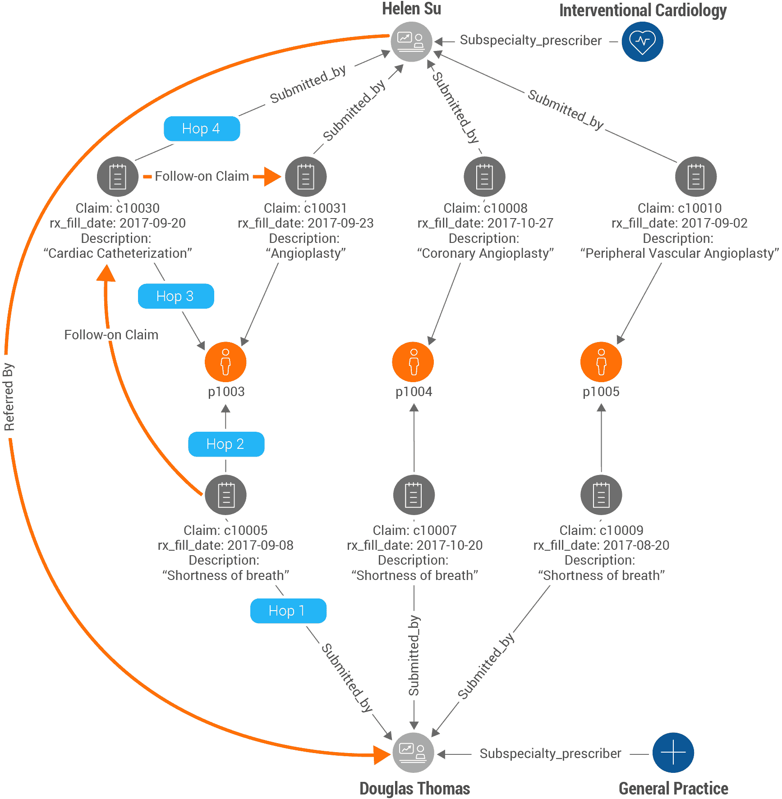
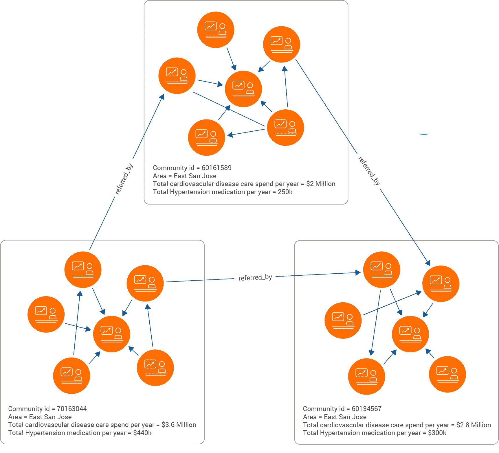

# 医学营销中图表技术的力量

> 原文：<https://thenewstack.io/the-power-of-graph-technology-for-marketing-medicine/>

 [徐雨博士

徐雨博士是全球首个原生并行图数据库 TigerGraph 的创始人兼 CEO。徐博士在加州大学圣地亚哥分校获得计算机科学与工程博士学位。他是大数据和并行数据库系统的专家，拥有 26 项并行数据管理和优化专利。在创办 TigerGraph 之前，徐博士致力于 Twitter 的数据基础设施，用于海量数据分析。在此之前，他曾担任 Teradata 的 Hadoop 架构师，领导该公司的大数据计划。](https://www.linkedin.com/in/yuxusandiego/) 

塔夫茨药物开发研究中心(Tufts Center for the Study of Drug Development)的一项经常被引用的研究估计，从 R&D 到批准，开发一种新药的成本约为 26 亿美元。

影响者营销通常被认为是在消费者背景下进行的，例如网飞广泛使用社交媒体平台来吸引千禧一代。然而，类似的营销策略可能会影响一个决定，比如说，转用一种新的胆固醇或血压管理药物，因为你信任的心脏病专家推荐了它，而不是目前的药物，因为它的疗效更高。

主要的挑战是确定这些有影响力的中心，了解附属于每个中心的社区，并对营销活动进行优先排序，以便通过这些中心有效地推出新产品或服务。

在 Instagram、YouTube、Twitter、脸书等网站上寻找有影响力的中心。很好理解，并且有许多工具可以识别中枢，表征附属于每个中枢的社区或受众，并且对每个社区对于消费品营销的相对价值进行评级。

对于更复杂的产品，如新的药品、医疗设备或医疗保健治疗，确定医生和其他医疗保健提供商中的影响者中心需要对患者索赔数据进行深入分析，以揭示转诊关系。

建立在关系数据库上的传统分析解决方案需要在包含处方者、索赔和患者数据的大型表之间进行昂贵的连接。完成数据库连接可能需要几个小时，有时甚至几天。这使得传统分析解决方案不适合这种类型的分析。

图形技术使得发现转诊关系更加容易，因为患者、处方者和索赔数据在图形数据库中是预先连接的。

### 帮助安进绘制患者旅程图

例如，生物制药公司 Amgen 希望了解患者和处方者之间的关系，以增加药品的销售。这需要梳理万亿字节的记录，通过关联一段时间内的医疗和药房索赔，并基于索赔分析检测开处方者群体，来确定开处方者之间的转诊关系。

Amgen 很快在扩展其原始图形数据库时遇到了问题。加载数据花费了太多的时间，而且一旦加载完毕，计算就会非常缓慢或者根本无法完成。

借助最新的图表技术，该公司可以扩展对这些关系的分析，并得出新的、隐藏的见解。

### 用图形数据库揭示一个组中的推断关系

 [高拉夫·德什潘德

Gaurav Deshpande 是 TigerGraph 的营销副总裁。他是一位经验丰富的技术高管，专注于建立获胜团队，以创造新产品和行业解决方案，建立新市场并主导市场。在加入 TigerGraph 之前，他花了 15 年时间监管 IBM 的人工智能、区块链和云产品组合在银行和金融市场、电信和零售领域的营销。](https://www.linkedin.com/in/gauravdeshpande/) 

考虑另一个例子:一个全科医生看一个病人呼吸急促的症状导致保险索赔。同一名患者第二周去看心脏专家，做心导管插入术或血管造影术，一周后又去看血管成形术。

图形技术直观地显示了与患者和处方者相关的所有这些声明，以便数据分析师可以直观地了解这种关系。它还基于时间窗口将它们联系起来，以推断推荐关系。

在这个例子中，三周内发生的索赔被考虑用于建立推荐关系。通过相关权利要求，从转诊医生到转诊专家需要四个跳跃或步骤。

在两个医生之间建立转诊边缘或关系，并且关系边缘携带重要信息，例如转诊患者的数量、与转诊患者相关的健康状况组。

可以添加处方要求数据，以提供两个医生经常开出的用于心脏护理的特定药物。有了这些认识，生产心脏护理药物的制药公司和生产心脏手术支架和其他产品的医疗设备制造商可以向医生及其网络销售这些产品。

### 使用图形数据库识别影响中心及其周围的社区

在影响者或受信任的产品或服务提供商(如制药和医疗保健行业的处方医生或医生)之间建立推荐关系后，下一步包括确定推动大多数活动的最有影响力的中心，如针对特定疾病(如心脏护理或糖尿病管理)的医疗保健索赔。

在确定了枢纽的影响力并对其进行排名后，由影响者驱动的产品和服务营销的最后一步是确定每个枢纽周围的社区，并评估市场机会，以确定每个社区的相对重要性。

该技术包括社区检测算法，以识别每个中心周围的社区。

****

考虑这样一个例子，在加利福尼亚州圣何塞东部，有三个相互连接的处方者和患者社区，用于治疗心血管疾病和提供高血压药物的预防性护理。

类似 SQL 的图形查询语言用于汇总与心血管疾病相关的社区所有索赔的支出，以及保险支出和患者的自付费用。计算药物处方的总支出以及保险支出和自付费用。

有了这些认识，生产药物的制药公司和为心脏手术生产支架和其他产品的医疗设备制造商可以优先访问社区中最有影响力的中心，这些中心在罗利医疗保健市场上对这些产品或服务的花费最大。

这为可能从中受益最大的社区带来了医学以及医疗保健仪器和程序方面的新创新，同时为这些产品和服务的生产商带来了最大的收入提升。

确定影响力中心是医疗领域营销的有力工具。

来自 Pixabay 的 rawpixel 的特征图像。TigerGraph 提供的其他图片。

<svg xmlns:xlink="http://www.w3.org/1999/xlink" viewBox="0 0 68 31" version="1.1"><title>Group</title> <desc>Created with Sketch.</desc></svg>