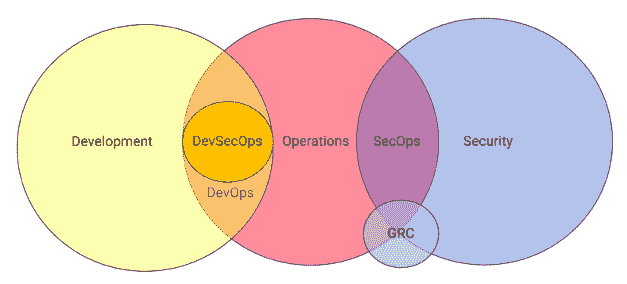

# SecOps 的力量:重新定义核心安全能力

> 原文：<https://thenewstack.io/the-power-of-secops-redefining-core-security-capabilities/>

[SaltStack](https://www.saltstack.com/) 赞助了这篇文章。

SecOps(安全+运营)是一项运动，旨在促进 IT 安全和运营团队之间的协作，并整合他们用于保护系统和数据安全的技术和流程，以降低风险并提高业务灵活性。

在本帖中，我们概述了当今企业面临的安全挑战，探讨了 SecOps 如何使用文化和技术来应对这些挑战，并确定了每个组织可以用来改善其安全状况的 SecOps 最佳实践。

## 发展完善的 SecOps 环境的优势:

*   出现的配置错误更少。
*   应用程序代码的变化与部署规则联系在一起。
*   可以主动管理已知的漏洞。
*   自动检查并强制执行符合适当标准的策略。
*   关键的安全程序是自动化的。

## SecOps 的起源

 [托马斯·哈奇

Tom 是 SaltStack 的技术创始人和首席技术官，也是自动化企业 IT 管理和安全工作方面广受尊敬的权威。他曾担任 Beyond Oblivion 的首席云架构师、Applied Signal Technology 的软件工程师和 Backcountry.com 的系统管理员，接触了数十种新旧基础设施自动化技术，并帮助建立了 Salt 的愿景。](https://www.linkedin.com/in/thhatch/) 

为了理解 SecOps 的起源，看看赋予它名字的运动是有用的:DevOps。与 DevOps 非常相似，SecOps 的诞生是为了应对两个团队之间关系失调所带来的挑战和风险。在 DevOps 的情况下，开发和 IT 运营团队需要调整优先级和沟通，并使用集成自动化来更快、更可靠地推出软件。自从 DevOps 发明以来的十年中，它已经被广泛采用，其影响是难以估量的。可以说，过去十年中绝大多数的软件进步都是因为它才成为可能。

与开发运维之前开发和 IT 运营之间的关系类似，大多数安全和 IT 运营团队经常在功能失调的状态下运营，导致 IT 安全措施无效且不充分。尽管有相似之处，但 SecOps 带来了 DevOps 解决方案无法解决的独特挑战。事实上，具有讽刺意味的是，DevOps 驱动的应用程序部署技术的扩散导致并加剧了安全问题，而不是减少它们。

## SecOps 与 DevSecOps:有什么区别？

DevSecOps 在过去一年中获得了极大的欢迎和关注。事实上，一些思想领袖已经宣布 2020 年为发展科普年。随着这一术语的流行，它有时与 SecOps 互换使用，虽然肯定会有重叠，但也有重要的基本区别。

如下图所示，DevSecOps 的发明主要是为了将安全实践集成到软件开发中，而不是作为一种事后的想法。一些 DevSecOps 支持者将在定义中包括提供安全基础设施(第 0 天)。然而，关键的区别在于 DevSecOps 通常忽略了正在进行的(第 2 天)IT 系统安全和优化。

DevSecOps 将安全性集成到应用程序开发周期中，而 SecOps 则维护这些应用程序及其数据所驻留的 IT 系统的安全性和合规性。

## 挑战

根据 Gartner research 的研究，2019 年利用的 99%的安全漏洞将继续是组织在利用时已知的漏洞，这一事实可能最能说明对 SecOps 的需求。在 Voke 2017 年的一项调查中，79%经历过安全漏洞的公司表示，通过补丁或配置更改可以避免安全漏洞。

> 79%经历过安全漏洞的公司表示，通过补丁或配置更改可以避免安全漏洞。
> 市场快照|安全运营自动化，Voke

如果一个外部观察者看到这些统计数据，想知道为什么公司不解决已知的问题，这是可以理解的。以下是几个原因:

### 没有足够的人类(永远也不会有)

诚然，安全和 It 工程专业都面临着巨大的人才短缺。然而，即使人才无限，也无法解决今天的安全挑战。系统太复杂，犯罪分子只会越来越快。

### 速度和工具采用优先于安全性

运营团队绝对关心安全性，但他们生活在一个由创新、增长和“五个九”正常运行时间主宰的世界里。他们不仅要负责维护快速增长且越来越难以管理的环境(通常由成千上万个独立系统组成)，还要利用这些环境为企业及其客户提供越来越多的价值。

除了确定优先级，安全和运营团队还使用完全独立的工具和工作流，每次在团队之间来回传递信息时，都需要对信息进行翻译。这使得闭环验证和报告几乎不可能。

### 创新已经超过了安全

当业务创新以极快的速度向前推进时，安全性却痛苦地落后了。这并不是说没有任何安全创新，但其中大多数都是对不断变化的 it 环境所造成的漏洞和差距的反应，而不是积极主动地以安全的方式帮助塑造 IT。

> 利用已知漏洞的平均时间已经从 45 天减少到 3 个 Sonatype

### 塞科普斯是前进的道路

SecOps 的口号看似简单:让安全和运营团队更好地合作，并实际修复他们已经知道有问题的东西。本文已经确定了一些挑战，这些挑战使这一点说起来容易做起来难，但实现这一点并非不可能，它只需要安全和运营团队改变他们的交互方式，并实施新的技术和流程，为 it 安全提供一个战斗机会。

### 技术促成文化转变

DevOps 的早期支持者很快强调这是一场关于人的运动，而不是技术。虽然人很重要，但事实是，如果没有技术的支持，文化变革是不会发生的(无论是在开发中还是其他方面)。对于开发运维来说，这是自动化、基础设施即代码(IaaC)和云资源的可用性，这为两个团队提供了“进行开发运维”所需的速度和精度

同样，一旦安全和运营团队决定要“执行 SecOps”，他们就必须找到或构建使他们能够这样做的工具。

### SecOps 工具要求

SecOps 团队应寻求允许他们将“安全策略定义为代码”的技术解决方案，这些代码可以自动地、全局地应用于每个新配置的 IT 资源。

这些策略应该足够严格，以保护业务免受威胁并确保适当的合规性，但也应该足够动态，以允许业务创新继续进行。

SecOps 团队还必须以可操作的格式标准化安全事件跟踪。在理想情况下，这意味着扫描、优先排序和补救在单个平台上进行。至少，来自安全和运营工具的数据必须汇集到记录系统中。这将允许团队缩短解决问题的时间，并确保，首先，识别的威胁是合法的，其次，它实际上已经按照安全团队的标准得到解决。

## 自动化，自动化，自动化

虽然 SOAR(安全流程编排、自动化和响应)等安全自动化解决方案提高了安全团队简化工作流程和更快识别威胁的能力，但它们并没有跨越鸿沟，以实际改变 IT 系统。

SecOps 团队必须使用现有的工具和新的解决方案来协调自动化行动，直至补救和闭环报告。这需要两个团队密切合作，制定基于角色的微调访问控制，使安全部门能够快速识别问题并应用批准的修复程序，同时仍然给予运营部门监督和控制，以测试并确保提议的安全修复程序不会妨碍关键业务运营。

世界上一些最大、最复杂的 IT 组织正在夜以继日地帮助实现 SecOps。虽然 SecOps 仍处于早期阶段，但使用它的公司报告了这些有希望的收获:

*   **集成:**运营管理和安全控制之间的集成。
*   **自动化:关键安全任务的**。
*   **更好的云安全性:** SecOps 与特定的基于硬件的解决方案的联系更少。相反，它侧重于定义明确的安全实践，这些实践可以在云环境中自动化。
*   **更好的跨团队沟通:**跨团队协作意味着关键安全信息丢失的情况更少。
*   **更好的安全审计:**自动化流程轻松生成可信的记录。
*   **投资回报:**安全支出比传统方法更快产生更好的结果。

照片由来自 Pixabay 的乔尼·林德纳拍摄。

<svg xmlns:xlink="http://www.w3.org/1999/xlink" viewBox="0 0 68 31" version="1.1"><title>Group</title> <desc>Created with Sketch.</desc></svg>