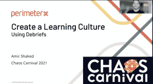

# 述职对找到根本原因的力量

> 原文：<https://thenewstack.io/the-power-of-the-debriefing-to-get-at-root-causes/>

每个生产系统都有问题。每个生产系统都会失败。这就是为什么一个团队和整个组织必须经历“变革的过程，创造一个健康和支持性的学习文化，”网络应用安全提供商[perimerx](https://www.perimeterx.com/)的研发高级副总裁 Amir Shaked 说，他们在那里有 300 个完全备案的微服务。

Shaked 在他的演讲中谈到了[混乱嘉年华](https://chaoscarnival.io/)的一个共同主题，他解释了 PerimeterX 如何学会实施一个广泛的沟通渠道来帮助防止重复发生事件，因为它有助于弥合信任差距。最有效的方法之一是通过汇报。

考虑到这一点，Shaked 的团队开始研究重复的问题。他说，那些持续不断、但看似微小的生产失败了，因为“随着规模的扩大，微小的风险会变成灾难性的”。

当他审视这些重复的问题时，逻辑上一个企业想要在未来解决或防止的事情，Shaked 立即感到了阻力。这个团队非常害怕判断:你为什么问这么多问题？你为什么不信任我们？

沙克德说:“如果你的团队成员害怕或感觉他们在工作环境中受到评判或缺乏安全感，他们就会表现不佳，作为一个团队，你将无法学习和适应你应该学习和适应的东西。”

因此，大约三年前，他开始为团队设置一个新的流程，专注于改进他们分析不同类型失败的方式。

因为，他说，“假设你有合适的工程师基础，如果你修复了流程，任何事情都有可能发生。”

Shaked 和[混沌嘉年华](https://chaoscarnival.io/)的虚拟观众分享了 PerimeterX 的述职过程，现在新栈今天和大家分享一下。

## 汇报侧重于根本原因

发生了一个事件—一个客户打电话投诉。通常，你就是这样发现的。

Shaked 说，“当他们没有解决方案时，他们会呼叫工程团队，通常会叫醒他们。他们会发现问题并解决问题，但会对不得不醒来解决问题这一事实感到不满。”

但是，他补充说，“如果这就是结束，你会再次遇到类似的问题，因为你没有根本原因。”

> “人类会犯错。这就是为什么我们需要修正流程，而不是试图修正人员。”阿米尔·沙克德，视野 x

PerimeterX 团队指出，他们遗漏了关键的最后一步——事后分析，以吸取教训，防止近期历史重演。

在他们的第一次新的汇报中，他们意识到这个特殊的事件是由错误地将代码部署到生产中引起的。一名工程师正在并入主要分支机构。代码没有通过测试，但是已经晚了，所以工程师决定暂停一切，明天再看。

Shaked 说:“他不知道的是，他正在开发的微服务是由一名 DevOps 工程师添加的，可以自动部署到生产中，具有自动伸缩功能。”

他说，他们可以专注于为什么首先会有合并，为什么开发者不知道自动扩展，或者微服务是多么复杂，不容易自动扩展。

相反，他们的新报告聚焦于为什么在如何对待主要分支上存在误解。

团队一起决定主分支等于生产。这意味着，无论如何，任何涉及主分支的变更都被认为是剧烈的变更。

Shaked 的团队不得不有意在汇报过程中去除判断。他说，当你只是假设人们在做他们的工作，当你专注于过程时，你可以消除责备，找到根本原因。

然后，随着团队的成熟，团队也会从[较小的事件](https://thenewstack.io/call-rotations-best-wake-devs-middle-night/)中学习。在解决问题后的 24 至 72 小时内，PerimeterX 会召开汇报会议。然后，在汇报后的两到三周，他们会召开一个检查点会议，以确保当前的任务被纳入。

## 进行汇报，而不是回顾。

T2 回顾是敏捷仪式中最神圣的。通常被称为“复古”,团队用它来反思他们的工作方式，并在他们的工作中不断变得更好。PerimeterX 可能有一个追溯来检查他们的任务报告过程，但不是具体的事件。

另一方面，汇报是一种公式化的活动，用于检查任何可能对您的操作产生严重影响的事件。

回顾和汇报的一个共同点是问很多问题。在 PerimeterX 的汇报会议中，他们会问以下问题:

*   **发生了什么**？这是事件的详细时间表。从问题开始进入生产到分析和解决。正如 [PagerDuty 的 Julie Gunderson 提醒](https://thenewstack.io/chaos-carnival-cultivate-a-corporate-culture-for-chaos-engineering/)的那样，在事件发生期间，像 Slack 这样的简单聊天工具有助于标记时间。
*   **有什么影响**？Shaked 说，你必须传达成本影响，有多少和哪些客户受到影响，以及收到的投诉。你需要得到一个完整的范围，因为让每个人理解你为什么钻研这个问题是至关重要的。“了解大局，你做得越多，他们就会关注大局，关注更大的影响。这种学习将会更快地传播到有决心的地方，”他说。
*   **一切都是如何关联的**？跟进和行动项目是汇报全面展开的必要条件。随着你对你的系统和它是如何失败的了解越来越多，试着找出模式。
*   **我们是否在一定时间内发现了问题**？视野计设定五分钟。你需要一个时间框架来建立一致性，但是这个时间框架会因团队而异。
*   **我们多久才能解决问题**？同样，这也因团队而异，从不到一小时到 10 分钟到自动。混沌工程的目标是研究你的系统，以支持它并尽可能多地自动修复。

接下来要讨论的是为了确保实现上述所有目标需要做些什么，接下来是一个使系统变得更好的行动计划。

## 由简化的汇报推动的“激烈的”文化变革

Shaked 说，随着时间的推移，任务报告的这些变化导致了剧烈的文化变化，但他们必须从这个过程中的错误中学习。

首先也是最重要的一点，他们发现了当时新提拔的 Shaked 缺乏信任，他是来“安装”新的流程和文化的。

不可避免的是，你的团队会开始玩指责游戏，他说你必须尽可能快地防患于未然。

> “当重点放在流程和系统上时，就不是谁造成了事故。这为创造学习机会和提高奠定了基础。”阿米尔·沙克德，视野 x

“如果你看到它开始发生，你需要礼貌和冷静地干预，”Shaked 建议。

让你的汇报集中在一个事件上，而不是像回顾会这样更广泛的主题上，集中在什么上，而不是谁。记住不要问为什么。

他解释说，“你需要问为什么有人做某事，但你不想产生自我怀疑——你想专注于过程而不是行为。”

他们还意识到，如果你不包括后续行动项目，汇报就是一个没有意义的仪式，然后你再回来检查。

但有时你需要在当下交流。这就是为什么他们实施了一个危机模式流程——一个众所周知的红色大按钮，澄清它是什么以及何时按下它以确保它唤醒每个人。因为让每个人都参与到一个大问题中来，可以弥补知识上的差距，并带来更快的解决方案。

Shaked 说，一个好的汇报可以归结为过程的一致性，所以人们提前知道他们将被问到的问题，这有助于保持一切更加积极。

他说，“保持冷静并明确前进的道路对于变化的环境非常重要，尤其是当发生影响非常大的非常严重的事件时。”

在过去的三年里，通过简单的任务汇报，PerimeterX 学到了一些宝贵的经验——关于他们的团队和系统。但是最重要的是永远不要试图修理人类，因为你应该相信你有一个好的团队，但是也要明白人类会犯错误。

[下载您自己的 PerimeterX 免费报告模板。嘉年华](https://tinyurl.com/y4hs8cnc)

延斯·p·拉克·德·皮沙贝的特写。

<svg xmlns:xlink="http://www.w3.org/1999/xlink" viewBox="0 0 68 31" version="1.1"><title>Group</title> <desc>Created with Sketch.</desc></svg>