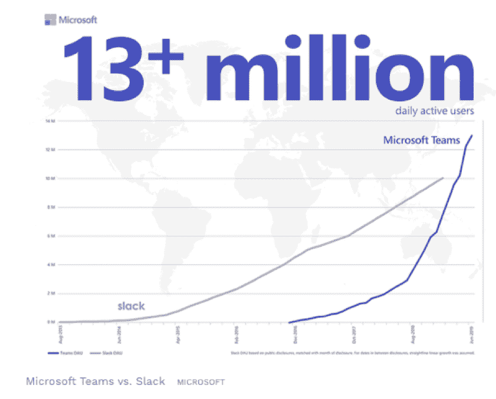

# 塑造现代企业的强大力量

> 原文：<https://thenewstack.io/the-powerful-force-shaping-the-modern-enterprise/>

[Raygun](https://raygun.com/) 赞助本帖。

 [约翰·丹尼尔·特拉斯克

JD 是一个高增长的 CEO、企业家和技术领导者。作为 Raygun.com(一家专注于应用性能监控的公司)的首席执行官和联合创始人，John-Daniel 对扩展软件业务、软件团队领导力和构建健康的软件以提供出色的用户体验有着独特的见解。](https://www.linkedin.com/in/jotrask/) 

没有哪一个技术类别比企业软件竞争更激烈。随着为企业提供稳定的生产力工具的竞赛每年产生数以千计的创业公司，硅谷的宠儿和企业巨头之间的差距正在扩大，这种差距几乎每天都在发生。

当我们六年前开始[ray gun performance monitoring](https://raygun.com/)时，我们看到典型的高速增长路径已经发生了变化。一些突破性企业正在开辟一条新的道路:一条由创新和最终用户第一的方法驱动的道路。再过几年，企业不再意味着庞大和缓慢。Slack、Atlassian 和 PagerDuty 等公司正在重新定义企业，以在 2019 年达到3.8 万亿美元的市场中占据份额。

这些“同类最佳”的软件企业了解他们的客户，行动迅速，并利用云创建了一个新的企业 IT 类别:现代企业。

## 用户期望正在塑造现代企业的定义

企业软件的消费化一直受到快速、易于使用的平台的支持，这些平台提供了非凡的价值。当我们看到 Atlassian 等软件的日常功能时，这些软件不仅对公司有价值，对使用它们的人来说也是不可或缺的。这些工具在团队的日常生活中变得如此根深蒂固，它们必须在现任者无法理解的水平上理解最终用户。随着公司更换跨团队、部门和业务的流程，这种客户至上的方法为未来的创业公司带来了巨大的机遇。

正如 Box 的首席执行官 Aaron Levie 指出的那样，每个人都认为视频会议是一个疲惫的市场，但 Zoom 证明了极度专注和更好的用户体验可以建立一个价值 150 亿美元的公司。

Salesforce 取代了过时的销售流程，革新了客户关系管理(CRM)软件，使数据可以跨部门访问，从而增长到资产净值1110 亿美元。

如果你认为把客户放在第一位的想法会被董事会一笑置之，微软首席执行官[塞特亚·纳德拉](https://www.linkedin.com/in/satyanadella/)用客户至上的方法改变了微软的经济、观念和文化。这样做，他就是 [带领公司从生产人们需要的产品](https://www.wired.co.uk/article/microsoft-ai-satya-nadella-company-tech-business) 转向生产消费者想要的产品。他的目标？来说服顾客热爱公司。

此外，透明的定价模式支持自助服务和“先试后买”的方法，从而形成用户驱动的自下而上的方法。通过消除进入壁垒，潜在客户有机会首先享受简单的界面和无缝的免费试用，这是不可避免的向云迁移所带来的可能。

然而，尽管像 Slack 这样用户至上的公司期望他们的软件和任何消费类软件一样好，但仍有工作要做。

 高速、自下而上的分布模型 [像 Intercom 的](https://www.intercom.com/blog/podcasts/scale-how-atlassian-built-a-20-billion-dollar-company-with-no-sales-team/) 需要时间来构建。竞争是激烈的，即使是 Slack 这样的硅谷宠儿也不能幸免于微软这样的缓慢行动者，他们仍然可以迫使被困在其技术生态系统中的公司采取行动。虽然 Slack 显然担心微软团队 [收紧其控制](https://www.forbes.com/sites/adrianbridgwater/2019/07/12/microsoft-teams-hits-13-million-users-to-tighten-grip-on-slack/#4cb70d0e5351) ，但许多人认为两者都有空间，微软和 Slack 都可以从彼此身上学到一两件事，以提供更好的用户体验。

例如，Slack 最近因[安全问题](https://www.techrepublic.com/article/slack-vulnerability-allows-attackers-to-intercept-modify-downloads/) 而受到抨击，而微软团队用户则抱怨 [太慢。](https://techcommunity.microsoft.com/t5/Microsoft-Teams/Very-slow-and-lagging-UI-in-TEAMS/m-p/38960)

随着越来越多的内部流程被数字化，对用户至上软件的需求在每一类技术中都有所体现，提供了 [万亿美元的机会。](https://techcrunch.com/2015/06/21/enterprise-softwares-trillion-dollar-opportunity/) 随着开放的集成平台开始战胜单一技术套件，不想落后的企业需要开始他们的长征，更加关注他们的最终用户需求。

专注于客户的企业将在下一个数字时代蓬勃发展。软件 [性能和质量](https://thenewstack.io/raygun-apm-makes-finding-performance-bottlenecks-easier-faster-and-cheaper/) 随着软件越来越消费化，软件将继续扮演越来越重要的角色。

企业不再掌控一切——它们的成功依赖于更加变化无常的东西:客户的需求。

通过 Pixabay 的特征图像。

<svg xmlns:xlink="http://www.w3.org/1999/xlink" viewBox="0 0 68 31" version="1.1"><title>Group</title> <desc>Created with Sketch.</desc></svg>