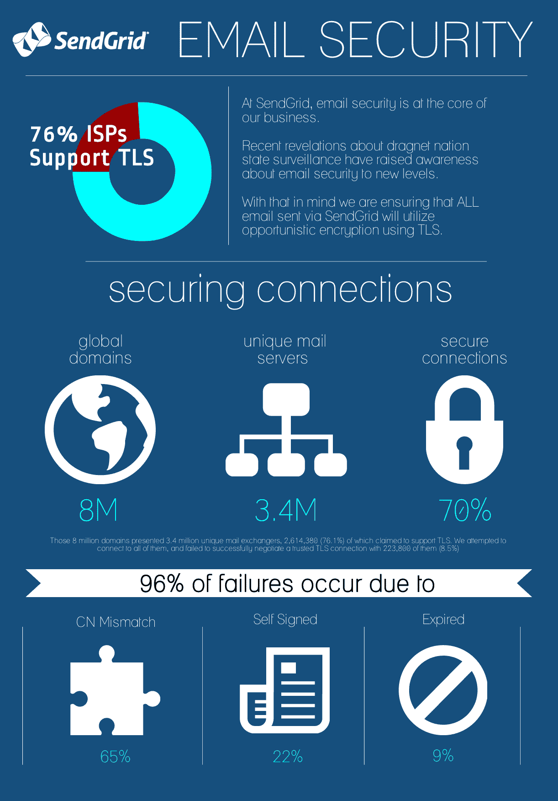

# 电子邮件安全的问题

> 原文：<https://thenewstack.io/the-problem-with-email-security/>

在上周的 BlackHat 大会上，雅虎首席信息安全官亚历克斯·斯塔莫斯(Alex Stamos)宣布，雅虎邮箱的端到端加密将于 2015 年对所有用户开放。雅虎将基于谷歌开源的[代码，实现 OpenPGP 标准(RFC 4880)。](https://g.co/endtoend)

那么，邮件安全到底出了什么问题？用户设备与 Google 或 Yahoo Mail 等服务之间的连接是安全和加密的。然而，从那里向前到在和接收者之间的电子邮件服务器，在信息的安全上没有保证。端到端加密为互联网上的整个传输提供了安全性。该代码是开源的，供开发者社区审查，它是谷歌漏洞奖励计划的一部分。谷歌将通过 Chrome 网上商店的扩展提供这一功能。所以，是的，用户将不得不使用 Chrome 浏览器。有趣的是，移动 Chrome 浏览器还不支持扩展。谷歌的移动方法尚不清楚，但亚历克斯·斯塔莫斯在推特上说，对移动的支持将是原生的。这是令人欣慰的，因为移动用户可能最终会在他们的电子邮件中看到许多难以理解的文本。

用于加密的私钥在 Chrome 沙箱下的内存中是不加密的。更重要的是，如果在 Chrome 中，用户可以发送统计数据和崩溃报告，如果浏览器崩溃，私钥可能会被发送到谷歌。

此外，如果坏人有密钥，加密是没有意义的，Adallom 营销副总裁 Tal Klein 说。

加密是好的，只是没有指数级的好，他在本周的一次在线讨论中表示。加密就像门锁一样。你的门上应该有一把锁。这是有用的。但是你门上的锁越多并不是越有用。一把比你现有的锁更难打开的锁也不会更有用。所以，加密是一件好事。别再赌了。和所有的事情一样，如果你的观点是定性的而不是定量的，那么安全是容易的。

安全性未能通过降低复杂性和限制用户接触点来为普通用户提供更简单和透明的安全性。这个项目和类似的项目有希望改变这种情况。当然，还有像 [keybase.io](https://keybase.io) 这样的项目你应该看看。

六月， [SendGrid 加密了它的电子邮件发送服务](http://sendgrid.com/blog/sendgrid-and-the-future-of-email-security/)，开发者用它来管理进出他们应用的电子邮件。

加密意味着 SendGrid 每天发送的 10 亿封电子邮件在发送给邮件提供商之前会被加密。Gmail、雅虎和 Aol 都支持加密工作。

SendGrid 的 Dave Campbell 在电话采访中说，这项服务类似于网络的安全套接字层(SSL)，可以保护网站免受攻击。对于电子邮件，SendGrid 使用一个传输套接字层，其行为与 web 对应物非常相似。它被称为[机会加密](https://en.wikipedia.org/wiki/Opportunistic_encryption)，旨在防止被动窃听。

机会加密也可以用于特定的流量，如使用 SMTP STARTTLS 扩展通过 Internet 中继邮件的电子邮件，或使用 Internet 邮件访问协议(IMAP) STARTTLS 扩展阅读电子邮件。通过这种实现，不需要从证书颁发机构获得证书，因为可以使用自签名证书。

【T2

通过 Flickr Creative Commons 的特色图片。

Adallom 是新堆栈的赞助商。

<svg xmlns:xlink="http://www.w3.org/1999/xlink" viewBox="0 0 68 31" version="1.1"><title>Group</title> <desc>Created with Sketch.</desc></svg>