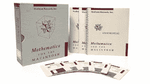
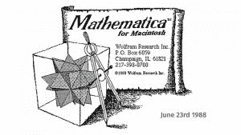
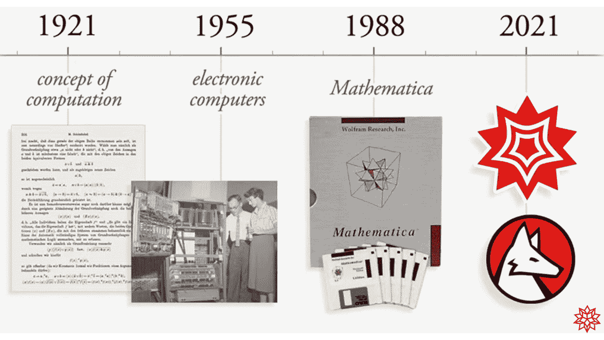
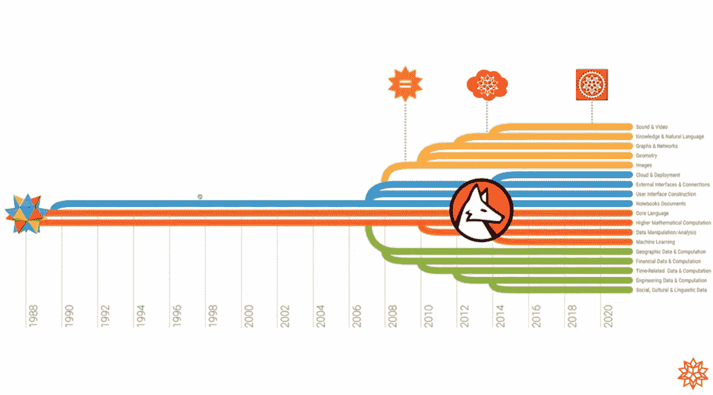

# 编程语言 Mathematica 标志着一个里程碑

> 原文：<https://thenewstack.io/the-programming-language-mathematica-marks-a-milestone/>

本月早些时候，Wolfram 编程语言庆祝了它的“1/3 世纪生日”——33 又 1/3 岁。

1988 年 6 月 23 日，[史蒂夫·沃尔夫勒姆](https://twitter.com/stephen_wolfram)的公司 Wolfram Research 推出了 Mathematica 的第一个版本——“大张旗鼓地，”Wolfram 在 YouTube 视频中回忆道(嵌入在下面)，因为这个消息是在加州圣克拉拉的一次新闻发布会上宣布的。

在发布活动的前一天晚上，他说，“我们仍然在收缩包装这些盒子，以便 Mathematica 可以在社区软件商店买到——这在那个时候是一件事情。”

大约 1988 年 Mathematica 用户手册，模拟形式，软件在软盘上。

视频聊天充满了对早期个人电脑时代的有趣回忆。但 Wolfram 也借此机会展望未来——以及深入研究计算的历史，甚至是人类数百年来对知识和理解的探索。

“从某种意义上来说，”Wolfram 在一篇庆祝性的博客文章中写道[，“我们的计算语言的目标现在是做一些类似于数学符号的发明的事情，但是是为了更广泛和更深入的计算领域——从而使我们用计算术语思考的能力得到戏剧性的简化。”](https://writings.stephenwolfram.com/2021/10/celebrating-a-third-of-a-century-of-mathematica-and-looking-forward/)

[https://www.youtube.com/embed/5yLXrThYSPk?feature=oembed](https://www.youtube.com/embed/5yLXrThYSPk?feature=oembed)

视频

## 回到 1988 年:史蒂夫·乔布斯的支持

在 Wolfram 的视频早期，他分享了一张幻灯片，展示了 InfoWorld 杂志上一个古老的 1988 年标题，关于 Mathematica 语言的发布，以及关于 OS/2 操作系统和 IBM 个人电脑折价的故事。

他回忆起 1988 年伟大的科技名人是如何在一本 Mathematica 书上签名的，包括安迪·贝克托什姆(太阳微系统公司的联合创始人)，数字设备公司的戈登·贝尔(T8)，甚至 33 岁的史蒂夫·乔布斯(T10)。

当时，Mathematica 语言本身运行在“麦金塔电脑、一些工作站、各种其他电脑”上，包括乔布斯后苹果公司 NeXT 的一台电脑。(尽管这款电脑距离首次公开发布还有几个月的时间)。乔布斯甚至鼓励 Wolfram 的团队将新语言命名为 Mathematica。

## 另类和“不可能”的名字

有更多有趣的回忆。Wolfram 在视频的最后列出了该语言的其他名字，这是 1987 年 8 月在 DOS 文本编辑器中创建的一个文件的打印输出。沃尔夫拉姆开玩笑地称这张幻灯片为“本来可能会是什么样子”

考虑的一些名字:

*   超级数学
*   博学的人
*   欧米茄
*   QED
*   Paramath
*   公理
*   马蒂卡
*   xi
*   Mathscript
*   公式
*   综合
*   推断
*   数学工具
*   m(或者 X)

这份名单不包括“不可能”的产品名称，包括“Mathesourus”、“Mathdroid”和“Igor”

Mathematica 软件的初始启动屏幕。

有一次，Wolfram 甚至分享了一张 1997 年“Math Mobile，Wolfram 语言的巡回演示中心”在美国和欧洲巡回演出的照片

但从更严肃的角度来看，Wolfram 认为，在早期，这种语言拯救了它的采用者，使他们免于最黑暗的恐惧:“他们总是将计算过程委托给某个在地牢中某个地方实际与计算机打交道的人。

“由于 Mathematica 的发布，发生了巨大的变革——而且发生得相当快——像理论物理学家、数学家之类的人……这些人能够从思考计算的*到实际上直接进行计算的*,因此能够在很多很多不同的领域走得更远。**

“在过去的三分之一世纪里，看到所有的发明和发现都是利用我们创造的技术取得的，这真是太棒了。”

## 回到过去

在他纪念 Mathematica 周年的博客文章中，Wolfram 写道，“即使过了三分之一世纪，我们所拥有的仍然像是来自未来的人工制品——事实上，随着它的不断成长和发展，每年都是如此。”

但是如果你从另一个方向穿越时间，回到*三分之一世纪，你会到达 1955 年和“电子计算机的黎明……开始大规模生产计算机的时候”，Wolfram 指出。*

他写道，再往后跳三分之一世纪，将你带到 1921 年，“那时，数理逻辑的思想刚刚开始融合成计算的概念。

Wolfram 向 YouTube 观众展示了计算计算是如何发展的。

“从某些方面来说，我们所建设的更多地归功于 1921 年，而不是 1955 年。是的，Mathematica 及其衍生的一切都在电子计算机上运行；它们让我们能够实现我们所做的事情。但从一开始，Mathematica 的核心——也就是现在的 Wolfram 语言——就基于超越其实现细节的基本思想。”

在他的视频中，Wolfram 提供了科学本身历史的旋风之旅，从数学符号的发明，到伽利略，艾萨克·牛顿爵士，“科学的数学化”，最后，计算概念的最终发展。

## 20 世纪 50 年代

Wolfram 在他的博客文章中说，自 1955 年以来，趋势一直是按照计算机自己的方式来指导计算机。在很大程度上，他在他的视频中说，自战后以来，我们指导计算机运行程序的方式没有太大变化。“它们是从内存中获取数据，将两个数字相加，将数据存储回内存，如果发生什么事情，就跳到程序中的其他地方。”

他继续说道，“基于 1955 年计算机的方式，早期的想法是，‘我们必须为人类提供一个包装器来包装计算机正在进行的这些操作……这在很大程度上是一种基于计算机对计算的观点来思考计算的方式。"

他说，这是一个持续了几十年的趋势。早在 1979 年，他就指出，“如果你要写一个真正严肃的程序，那就用汇编语言来写……本质上，用机器的机器代码来直接处理数据去哪里的问题。它在哪个登记处登记？您正在执行哪个底层机器操作？

“所以在某种意义上，我感兴趣的事情的起源是建立这种计算框架，尽可能真实地反映计算的本质，并方便人类实际使用。”

## 以人为中心的计算方法

Wolfram 认为，Mathematica 在采用以人为中心的方法方面是独一无二的。“我们的目标不仅是创造一种专门为计算机编程的语言，而且是一种用计算术语来表示一切事物的语言，包括世界上的真实事物。”

他补充道，“我们所做的是从另一个角度出发——我们在这个世界上关心什么？我们人类是如何看待事物的？让我们试着用语言来表达。”

直到今天，这种语言仍然是专有的和封闭源代码的，Wolfram 在他的博客文章中没有对此道歉。“我认为，我们能够建立一个能够继续专注于开发和交付计算智能的长期任务的组织和企业，这是我们最大的成就之一，迄今已超过三分之一世纪。

“我不仅为我们在技术方面的持续创新感到自豪，也为我们业务实践的一致性和可持续性感到自豪。

最后，他认为，“我们所建立的核心是一些根本性的知识。”Mathematica 是一种全面的语言，“允许人类以计算的形式将他们的思想和知识具体化，然后利用实际计算机的能力来计算出他们的结果。”

## 能力的爆炸

在他的视频中，Wolfram 实际上将语言的进化与地球上的生命进行了比较。“这是一个缓慢的进化和理解的过程。然后，在 2000 年代中期的某个时候，各种不同的能力在寒武纪大爆发。”

Mathematica 自 1988 年推出以来是如何发展的。

“这是一次美妙而又非常有意义的旅程，它为世界带来了无数发明和发现的工具，并帮助教育了一代又一代的学生。但在某些方面，这是一个越来越孤独的旅程——似乎越来越远离人们对当今计算机和计算的共同期望。”

Wolfram 甚至在他的视频中说“我经常描述我们正在做的事情是建造来自未来的艺术品。”

“我们正在建造的东西不可阻挡地将成为人们思考事物的方式。这种计算语言的想法——就计算范式而言，这是否会成为每个人思考事物的最终方式，这并不是一个真正的问题。

沃尔夫拉姆说，计算范式是 21 世纪的伟大范式，也是智力发展下一步进展的基础。“就像 300 年前的数学范式一样——那就是一个这样的范式。现在，计算范式是我们对世界进行思考的新方式，它拥有巨大的力量，还有很长的路要走。”

但他指出，现在还为时过早。“非常令人满意的是，我们三分之一世纪前在第一版中建立的东西——你知道，它是纯粹的，正式的，它仍然存在。”比仅仅生存更好的是:“我们设法保持了兼容性。”

或者，正如 Wolfram 在他的博客文章中所写的，“就我个人而言，我感到非常幸运，能够生活在正确的历史时期，能够深入参与其中，并为我们所做的一切做出如此大的贡献。”

视频中，他开玩笑说，“我不知道一个世纪蛋糕的三分之一应该是什么样子。”

* * *

# WebReduce

<svg xmlns:xlink="http://www.w3.org/1999/xlink" viewBox="0 0 68 31" version="1.1"><title>Group</title> <desc>Created with Sketch.</desc></svg>