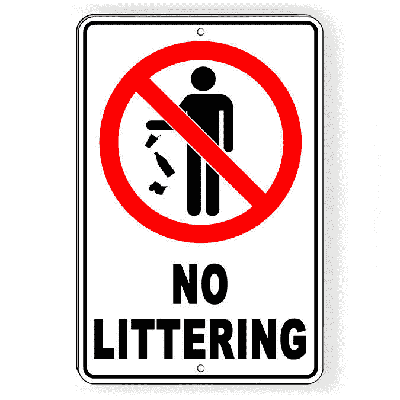

# R&D 经理与组织浪费:战争中的生态系统

> 原文：<https://thenewstack.io/the-rd-manager-vs-organizational-waste-an-ecosystem-at-war/>

 [杜迪科恩

杜迪是 Rookout 的研发副总裁。他热衷于技术、创新和将想法融入生活。他在网络安全和低级研发方面有丰富的经验。在办公室之外，他摆弄电子产品和物联网设备，在假期，他尽可能尝试潜水。](https://www.linkedin.com/in/dudi-cohen-1572673/) 

领导一个研发(R&D)团队需要克服许多挑战和障碍。当你的团队工作进展顺利，一切都朝着正确的方向发展时，没有比这更好的感觉了。这个团队很开心，很团结，每个人都觉得他们赢了。

管理的一个重要部分是处理意想不到的问题，无论是一个重要客户的计划外请求，还是竞争对手正在支持的新功能。当这种情况发生时，作为一名 R&D 经理，保护球队往往是第一本能。然而，这通常会给公司的其他部门造成浪费。当你专注于自己的团队时，你可能会忽视或忽略其他一切。作为 R&D 的经理，我们必须是团队成员，并且理解保护我们的团队的影响，以及为什么这样做并不总是正确的答案。一个高速度的 R&D 组织是惊人的，但是这是以什么——或谁的——为代价的呢？创建深度技术债务并增加您公司的负担真的值得吗？你准备好面对后果了吗？

## R&D 时间是宝贵的

你的 R&D 团队是推动你的公司前进的发动机室，无论是通过开发下一代产品、创新新产品还是修复漏洞。工程师的成本正在上升，在任何地方招聘新工程师都变得异常困难。当您团队的时间如此昂贵和重要时，自然要尽您所能确保他们的时间得到最有效的利用，并专注于关键任务。

你通常会在自己的团队内部做出改变，比如最大限度地减少会议时间，使用最好的工具，给你的团队更多的独立性来快速前进。同时，你也要确保他们在做重要的工作。我已经讨论了我对如何在你的团队中最大限度地减少浪费的一些看法，但是公司的其他人呢？当你在自己的团队中减少浪费的时候，你会不会碰巧在公司里乱扔垃圾？

【T2

## 我们都在一起

因为每个人都知道 R&D 时间是宝贵的，我们看到产品经理、解决方案工程师、支持工程师、销售人员和那些不写代码的人站出来帮助保护 R&D 时间。我们一次又一次地看到这种情况发生——我必须说这很鼓舞人心。应对众多客户的解决方案工程师渴望并等待您提供这些新功能。他们明白，R&D 不可能在提供客户期待的所有闪亮新功能的同时修复所有的缺陷。我们的产品经理、支持工程师，甚至我们的首席执行官经常成为 R&D 的第一道防线。他们会推掉 bug 和计划外的任务，说“别担心，R&D，我们有这个!”！取而代之的是关注那些闪亮的特征。”

然而，这是正确的方法吗？这对 R&D 有什么影响？会有 R&D 的代价吗？

## 乱扔垃圾的代价

不清理垃圾，把垃圾扔出你的团队可以节省很多时间。让其他人来处理垃圾会带来即时的满足感，因为现在没有什么能阻止你以闪电般的速度前进。

为了当前的讨论，让我们假设你公司的每个人都非常有耐心，他们的积极性不会因为你向他们扔垃圾而下降，并且他们喜欢收集你的垃圾。如果是这样的话，公司没有任何成本。所以，让我们来了解一下，当你乱扔垃圾时，你的 R&D 团队会付出什么样的代价。

## 等着一切都在你面前爆发

当你乱扔垃圾时，你基本上是在等着垃圾堆积起来，直到你看到它。就我们的目的而言，这是那些错误堆积起来，而您的客户厌倦了您的支持工程师提出的解决方法的时候。当你到达由于你堆积的垃圾水平而看不到地面的点时，这将是你不得不穿上橙色连身衣并被迫清洁一切的同一时间。我不知道你怎么想，但是我宁愿把我的垃圾直接扔进垃圾箱，而不是去地板上捡。我很高兴尝试了两种选择，而后者是一场噩梦。在处理特性的过程中不时地修复一个 bug 比最终只处理大量的 bug 要容易得多。

一些 bug 也可能影响其他 bug，更重要的是，一些 bug 实际上可能会影响你开发的特性。一旦臭虫出现就消灭它们是至关重要的，因为直到你真正消灭它们，你才真正了解它们的真正本质。

例如，假设您正在构建一个新特性，同时假设您当前的代码能够正确处理压力和负载。如果你发现它在负荷下崩溃时已经太晚了，你会非常头疼。就像火灾一样，在早期扑灭虫子比在烟雾太多甚至看不到火的时候容易得多。

## 不断出现的变通办法

当客户抱怨一个 bug 或问题时，您的支持工程师可能会提供很好的解决方法(例如，您是否尝试过关闭和打开它？).当这些变通方法最终成为您的客户的惯例时，会发生什么？它们可能会导致您的客户误用您的产品，从而导致更多的错误报告和更多的功能请求来支持那些未走过的路径。

如果这听起来像是未来的你需要做更多的工作，那么是的，就是这样。

## 数据不会永远存在

bug 的存在通常涉及两个主要角色:你的代码和它处理的数据。您的代码将永远存在，但是导致错误的数据是不稳定的。如果您推迟处理这个 bug，这意味着当您想要修复它时，您可能会丢失重要的数据。您的客户采用的那些变通办法将停止创建您根除这些错误所需的正确数据。你将不得不重新挖掘你满是灰尘的日志档案，如果它们存在的话，但是你甚至可能没有收集到正确的数据。

## 阻碍推广过程

R&D 乱丢垃圾的一个普遍被忽视的成本是，你会扼杀推广过程。当开发一个新特性时，你需要另一边的人来接收它。每个公司和组织都有推出新功能的不同流程。这样做的过程还取决于新功能的类型和复杂性。一个标准的功能将需要创建适当的文档，A/B 测试的首次展示，与潜在客户的讨论以促进它，支持它，向 R&D 写反馈，错误报告(和创建变通办法)，功能的货币化，等等。然而，如果整个公司都在忙于收集你的垃圾和清理你的垃圾，没有人会推出这个新功能。这对你的团队有什么影响？

好吧，如果没有人使用你的新功能，那么你还不如不开发它。你的团队的积极性会下降，你不会得到任何关于你的新功能的反馈。你不妨把它藏在你的阁楼里。你可以继续开发你的下一个功能，但是因为每个人都在忙着收拾你的烂摊子，所以产品团队没有在你的功能路线图上工作。

哦，好吧，还是清理你自己的垃圾吧。

## 为了你自己

我在这里试图指出的主要信息是，即使你是一个反社会者(我相信你不是)，并且不真正关心他人，如果你继续制造浪费并将其扔在研发之外的任何地方，你仍将不得不付出非常大的代价。就像生活的各个方面一样，当问题很小的时候处理它们很容易，最终没有人想在它们发展成灾难时处理它们。

<svg viewBox="0 0 68 31" version="1.1" xmlns:xlink="http://www.w3.org/1999/xlink"><title>Group</title> <desc>Created with Sketch.</desc></svg>