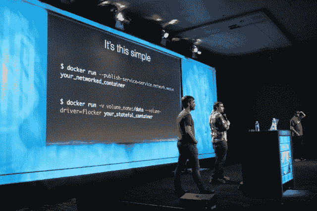

# 真正的 Docker 生态系统通过插件发布

> 原文：<https://thenewstack.io/the-real-docker-ecosystem-launches-with-plugins/>

Docker Inc .称其开发战略基于“包含电池但可拆卸”的理念，如果包含的电池是“首选”品种，这一理念可能没有太大意义。你可以去掉它们，但是为什么呢？

当 Docker Inc .去年 2 月收购 SocketPlane 时，它表示，其目的是向该公司注入必要的人才，使其能够围绕网络开发 API。这让社区中的许多人担心，[weave works](http://weave.works/)——集装箱联网能力最明显的贡献者之一——将被降级为“失败者”的地位，或者作为“替代电池”的提供商，如果你愿意的话。

周一在 DockerCon 2015 上，Weaveworks 首席执行官 Alexis Richardson 与 [Flocker maker ClusterHQ 的](https://thenewstack.io/clusterhq-lets-move-docker-like-cattle-but-make-the-data-special/) CTO Luke Marsden 和 Glider Labs 负责人 Jeff Lindsay 一起登台，首次公开展示了支持新的更“可组合”形式插件的最新版本 Docker containers。这个新的迭代是[的高潮，这个项目始于 ClusterHQ，名为 PowerStrip](https://clusterhq.com/2015/02/02/powerstrip-prototype-docker-extensions-today/) ，目标是实现可扩展性，以便容器可以在移动后保留它们的状态。

## “可组合”

从左至右:杰夫·林赛、卢克·马斯登和亚历克西斯·理查森。

“我们一直在与 Docker 密切合作，提供 Docker 开放可扩展平台，”马斯登在周一的会议期间对挤满了人的展厅说。“我们一直在这样做，因为我们相信客户想要的是选择，以及一致的 Docker 用户体验。”

滑翔机实验室的林赛解释说，实际上，每个应用程序都以不同的形象呈现给世界。虽然存储和网络是可扩展性的常见领域，但两者都有大量的选项，每一个都有自己的复杂性。因为可扩展性需求可能非常特殊，所以没有一个单一的 API 函数词汇表能够满足所有可预见的供应商的解决方案。

从左至右:卢克·马斯登、杰夫·林赛和亚历克西斯·理查森。

Lindsay 说:“插件为用户提供了选择、自由以及 Docker 中底层存储驱动程序和其他东西的实现。“到目前为止，供应商已经能够包装 API，以便与 Docker 集成。但这实际上不是一个非常“可组合”的系统。你不能同时使用 Flocker 和 Weave，也没有一个好的方法来真正扩展 Docker。”

换句话说，Docker 不是可以“构建”的东西，借用硬件世界的一个短语，意思是“定制能力”。

## 用织物织成的绒布

在周一的演示中，开发人员展示了如何将 Flocker 和 Weave 一起使用，这是第一次，在集装箱管理员可能很快就会在日常管理中遇到的场景中。提供网站的容器从一个位置移动到另一个位置。在这个过程中，如果它能够保持现有状态，并保持与已经绑定到现有会话的数据库的链接，那将是非常理想的。

Flocker 提供了 ClusterHQ 所说的“容器数据管理”，而 Weave 提供了一种面向容器形式的 SDN。两者都必须无缝地工作，以便进行传输。虽然从技术上来说这样说可能不准确，但从网站用户的角度来看，似乎发生的是一种实时迁移的形式，这是 VMware 虚拟机定期进行的一种方法，也是真正流动的云平台的一个标志。在任何情况下，在演示过程中，web 站点容器从一个 IP 地址移动到另一个 IP 地址(Weave ),同时保留到其状态和底层数据库的链接(Flocker)。

“这是将企业应用程序投入生产的另一个难题，”Weaveworks 的理查森说:“你已经有了一个应用程序，你已经将其容器化，现在你需要它可用、可靠、可维护，你需要更新它。您将需要管理状态。我们今天向您展示的就是一个解决方案。”他承认这些新的插件目前还处于试验阶段，但仍然很实用。

理查森说:“你可以选择你将用来解决这个问题的技术类型。”“您可以根据特定属性进行挑选，这将为您的企业应用程序带来合适的解决方案。这种能够管理状态但仍保持在简单的 Docker[上下文]中的能力，对于实现客户一段时间以来一直要求的目标来说，是一个不可思议的进步。”

## 二分法逐渐消失

Docker 最知名的支持者公开承认，纯粹的无状态架构不仅不可行，而且实际上可能是个坏主意。卢克·马斯登(Luke Marsden)在周一晚些时候与新堆栈的采访中，才明白了这一点。

“我认为有状态和无状态的二分法对我来说从来不是一个真正的争论，对我来说从来不是一个真正有争议的问题，”马斯登告诉我们。"关于应用程序组件应该是有状态的还是无状态的，曾经有过争论."

他举的一个例子是 WordPress，它将 state 混合到它的应用程序中，而[因这样做而受到批评](https://blog.engineyard.com/2014/why-your-app-wont-work-in-the-cloud)。“没有不尊重 WordPress 的人，但是这种风格的应用程序设计已经随着 Heroku 的[12 因素宣言](http://12factor.net/)而消失了。但是每个应用程序的核心都是数据。总会有数据库、键/值存储、缓存层需要作为应用程序的一部分进行部署。因此，从所谓的“有状态架构”到“无状态架构”的过渡只是应用层变得无状态，而不是应用程序中不再有数据库。

“几乎每个有意义的应用程序都有一个数据库或 NoSQL 或一个键/值存储，”Marsdan 继续说道，“特别是微服务，如果你听阿德里安·科克罗夫特的话，因为你不能单独升级它们，因为它们共享数据库模式，以及各种各样的讨厌之处。实际上，在现代微服务架构中，不同的数据服务激增。只是应用层是无状态的，因此更容易扩展。但这并不意味着没有有状态容器的位置，因为 Docker 的承诺是能够在您的笔记本电脑上用完全相同的 PostgreSQL 或 MySQL 或 MongoDB 版本一致地部署相同的应用程序，包括其数据库，然后一致地部署该应用程序并将其投入生产。”

从测试到生产的转变是贯穿周一许多演讲的一致主题，也是这些会议之外的讨论主题。周一，许多参与者似乎松了一口气，因为在未来 5 年、10 年或 20 年，纯粹的无状态应用程序不再是理想状态。也许无状态在微服务架构中有它的位置，但也许那不是每个地方。

“当 Heroku 最初提出应用程序应该是无状态的想法时，”Marsden 在与我们的采访中说，“他们通过避免必须解决管理有状态容器的困难问题，通过说服开发人员他们不应该在他们的应用程序中放置状态，以及通过创建一个在 Heroku 世界中有意义的外部化数据服务的生态系统，给自己帮了一个大忙。在完全公共的 PaaS 中，你可以让这些专业公司在 AWS 上管理 Mongo，因为它是 AWS，所以延迟足够低，应用程序只需连接到这个公共事物即可。但是 Docker 所做的最伟大的事情是让应用程序可以跨不同的环境移植。

“如果你真的希望能够做到这一点，你需要能够捕获整个应用程序，”他继续说道，“因为你不能认真地想象在一个私有数据中心运行一个应用程序——许多企业将在很长一段时间内继续希望这样做——并让它访问亚马逊上的数据库即服务。这可能没有意义，a)因为延迟，b)因为他们为什么要在内部运行他们的东西？可能是为了让他们可以在某个地区保存自己的本地数据。我认为，如果 Docker 要实现可移植性的承诺，以及跨不同环境的一致开发人员体验，那么处理状态是必不可少的。”

稍后在《新堆栈》中，我们将采访卢克·马斯登及其上司 ClusterHQ 首席执行官马克·戴维斯。

Docker 和 Weaveworks 是新堆栈的赞助商。

<svg xmlns:xlink="http://www.w3.org/1999/xlink" viewBox="0 0 68 31" version="1.1"><title>Group</title> <desc>Created with Sketch.</desc></svg>