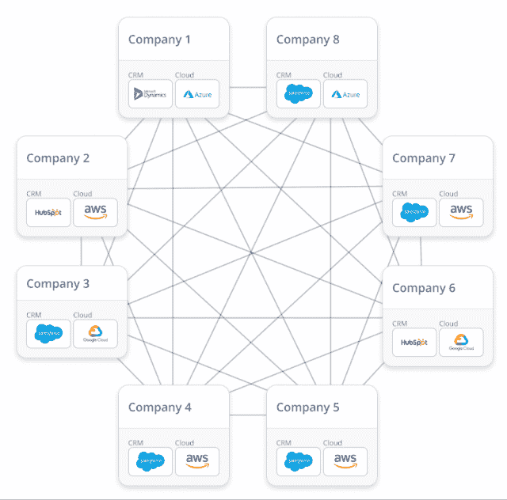
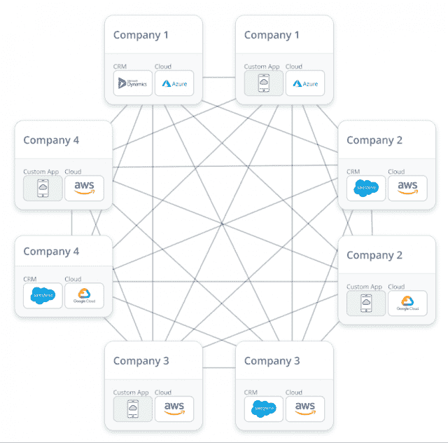
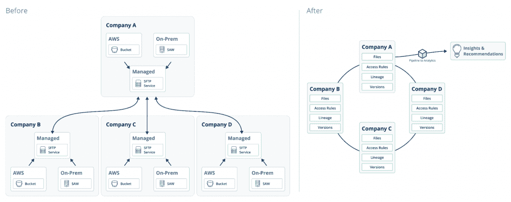
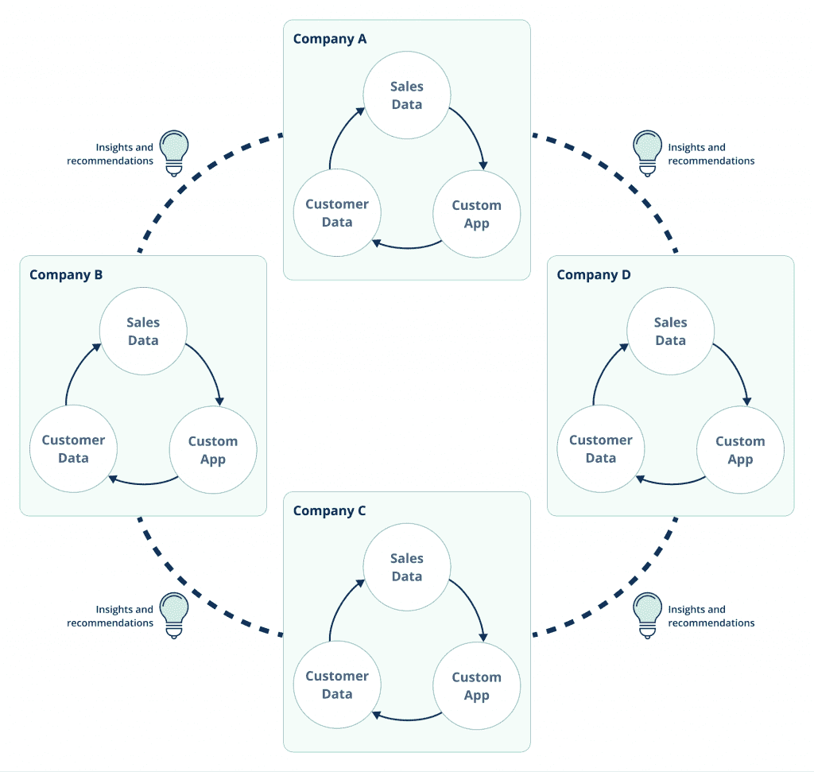

# 实时数据网格及其在现代 IT 堆栈中的位置

> 原文：<https://thenewstack.io/the-real-time-data-mesh-and-its-place-in-modern-it-stacks/>

*在本系列的[第 1 部分](https://thenewstack.io/addressing-the-challenges-of-real-time-data-sharing/)中，我们强调了实时数据共享的挑战，讨论了运营数据与分析数据，并考虑了传统解决方案及其局限性。本文定义了实时数据网格，并讨论了将它们融入现代 IT 堆栈的关键原则。*

 [蒂姆·瓦格纳

Tim 是 AWS Lambda 的发明者，也是 AWS Lambda 和亚马逊 API 网关服务的前总经理。他还曾在比特币基地担任工程副总裁，管理设计、安全和产品管理团队。蒂姆联合创立了 Vendia，以帮助各种规模的组织更有效地跨云和公司共享数据，他担任其首席执行官。](https://www.linkedin.com/in/timawagner) 

促进实时数据共享是一个具有挑战性的命题，特别是当多云和 SaaS 应用程序作为典型需求包含在内时。与此同时，这些困难的实施挑战令人惊讶地无差别:它们在不同行业、部门或公司规模之间没有显著差异，这使得数据共享成为基于平台的解决方案的理想选择。

同类最佳的解决方案与传统的区块链方法共享一个关键的架构洞察力:维护跨多方的单一真实来源的工作属于平台，而不是每一方。这产生了几个优点:

*   **平台理解数据。**与 Mulesoft 和其他“哑管道”解决方案不同，这些解决方案不知道正在传输的数据，让平台了解数据意味着它还可以确保数据在它流动的任何地方都是一致、正确和最新的。这一关键差异将处理来自单个应用程序和 IT 团队的数据的许多传统操作和安全挑战转移回平台提供商。
*   该平台可以提供统一的数据建模和访问控制方式。与共享数据几乎同样重要的是确保错误的数据不会被共享。当每一方和每一个系统都需要一种 DIY 方法来实现安全性、访问控制、审计、合规性和治理时，这些问题就有了自己的生命，成为沉重的负担，使简单地在各方之间移动数据的原始问题相形见绌。让一个平台来完成这一点不仅可以转移实现的负担(并将其分散给许多客户，使其生产和维护更具成本效益)，还可以确保该方法在所有各方和部署中都是统一的。

与早期的区块链不同，后者本质上是商业化的原型，现代数据网格产品基于坚实的公共云工程。它们与广泛采用的公共云服务共享相同的多租户、高度可扩展的设计，并利用现代接口，包括 GraphQL APIs 和基于容器的代码共享。工程和架构模式的这些进步使得“第二代”方法能够解决困扰早期(通常以失败告终)在企业环境中部署区块链技术的问题:

*   该平台具有高度可扩展性和低延迟性。区块链饱受性能不佳的困扰，像以太坊这样的公共链很难在全球范围内维持每秒 14 笔交易，由所有客户共享！交易结算时间可能接近 15 分钟或更长，每笔交易的成本可能高达 50 美元或更多。即使是私有链，如 Hyperledger Fabric，也受到“一盒部署”模式的困扰，与基于云的服务不同，它们永远受到单个服务器的处理和内存容量的根本限制，并且该服务器中最多只有几个核心。这对任何需要扩展的企业工作负载来说都不是好兆头。
*   **该平台以 SaaS 服务的形式交付。**第一代区块链在很多方面都是对早期方法的倒退:不仅其“单机箱部署”模式速度慢，吞吐量有限，而且这种限制还意味着必须手动部署、维护、监控、保护、扩展和容错等。这对已经捉襟见肘的 IT 团队来说是一个巨大的负担，只会增加基础架构管理和人员配备的负担。相比之下，下一代数据共享解决方案通常以 SaaS 服务的形式提供，不占用基础设施空间，也不具备扩展、容错、监控、基础设施维护等“能力”。，归服务提供商所有，而不是留给 IT 客户来做练习。

## 为什么数据共享如此困难？

尽管实时数据共享是一种无处不在的需求，但它并不总是现有 IT 堆栈中模型良好的元素。Gartner 呼应了这一想法，“IT 和面向业务的角色…采用 EiPaaS 作为其集成战略的关键组成部分…[但是]尽管它是主流用法，但提供商的选择是分散的，难以导航**。这是一个有趣的问题:为什么会这样？**

答案在于我们的行业正在经历的结构性转变。“经典”它有一个相对简单的问题要解决:

*   销售信息等数据是内部生成的。
*   处理这些数据的工作负载，如计算应收账款、生成和发送发票，是在内部根据收集的数据运行的。
*   数据被选择性地收集并运送到分析子系统进行离线分析，以产生用于管理的商业智能报告。

换句话说，数据的生产和消费以及任何传输或“共享”都是在内部处理的，通常是在一台大型机的范围内。无论是通过外包交付合作伙伴在内部构建，还是通过 ERP 系统提供，尽管存在其他挑战，但从共享的角度来看，这些“数据块”相对容易管理。

快进到今天:

*   SaaS 供应商越来越多地将数据从中央 IT 转移到他们自己的(通常基于公共云的)存储和计算解决方案中。
*   供应链等商业伙伴关系越来越全球化，这意味着越来越多的公司“感兴趣的数据”存在于公司之外。例如，亚马逊估计多达 80%的关键业务数据不再驻留在内部。
*   普遍采用公共云，特别是采用多云架构，需要将数据大规模转移到传统的内部数据中心之外，通常转移到完全托管的服务或专门的云数据库，如 AWS、Azure 或 GCP 上的 NoSQL、时序或图形优化产品。
*   客户对“永不停机”的互联网时代体验的需求意味着，过去“朝九晚五，周一至周五”的应用程序 SLA 现在是 24x7x365，99.99%的正常运行时间要求，这迫使 IT 团队为几乎所有具有公共或合作伙伴表面区域的应用程序设计和部署领先的可扩展性、容错和多云弹性方法。对于已经在努力满足业务需求并且内部对高级分布式系统设计技术了解有限的团队来说，这是一个难以置信的高要求。
*   “影子 IT”已经永远地将单个团队操作单个大型机的概念分割成应用程序、团队和方法的分布式拼凑，即使对于财富 100 强中运行最良好的企业来说，这也是一个管理难题。将安全性、可伸缩性、容错性和其他“能力”以及治理模型直接嵌入到产品或服务中的方法，相对于 DIY 应对这些挑战的方法而言，具有巨大的优势，因为在影子 IT 组织中 DIY 通常意味着不受约束的异构性以及随着时间的推移越来越混乱的组合。

由于所有这些结构性变化，很容易理解为什么在 90 年代开发的 ERP 系统，甚至在 2000 年代工作良好的 EAI 方法也不再能够满足公司的需求及其 it 需求:异构数据的挑战不是他们必须担心的事情，因此，他们无法在数据共享方面提供现代 IT 体验。

## 将实时数据网格解决方案融入现代 IT 体系

由于上面提到的挑战，即使是高功能的 IT 团队也不一定有一个强大的“配方”来以统一的最佳实践方式将实时数据共享集成到他们的方法中。本节简要调查了三种部署方法，它们的功能和复杂性不断增加，概述了如何将这些平台整合到基于服务的现代 IT 产品组合中。

### 基于应用的解决方案

最简单的部署方法是将数据模型和连接直接绑定到现有的基于 SaaS 的域，例如为了联合销售的目的在 CRM 系统之间共享营销或销售信息。因为在这些情况下领域是众所周知的，所以几乎没有数据建模的挑战，并且因为记录系统(Salesforce、Microsoft Dynamics)是众所周知的，所以连接也同样容易，通常仅限于针对有问题的系统授权平台。

设置和配置通常可以在一周内完成，包括:

*   各方(通常是两个或多个部门或业务伙伴)之间的字段名称对齐。
*   配置访问控制，以确保只有经过授权的数据才能与适当的人员共享。

图 1 以 CRM 联系人共享为例，展示了一个典型的基于应用程序的部署。

图 1: CRM 数据共享——一个示例部署架构

基于应用程序的解决方案通过共享域模型(如 CRM 数据)得以简化，但能够连接不同组织中的不同 SaaS 供应商，甚至是多家公司。它们代表了对基于点对点 API 的数据共享解决方案的充分利用，这些解决方案需要在每一对相关方之间构建和运行一个完整的、安全加固的和兼容的集成。

因为连接的应用程序和底层平台都是基于 SaaS 的，所以不需要部署基础架构或执行复杂的数据建模，并且部署可以在几周内从原型到测试再到生产，而不是几个月或几年。对于已经熟悉来自这些应用程序的 ETL“数据耗尽”的团队来说，设计模式是相同的，这使得部署更加高效，因为可以遵循相似的授权和启用模式。

## 更进一步

这种模式可以很容易地在其他 SaaS 应用程序中重复，并利用整个行业向 SaaS 发展的趋势:最终，每个主要的 SaaS 应用程序都将拥有实时数据连接器，简化与跨部门、云或组织线的类似应用程序的数据共享。

该设计也是开放式的:“混合”部署可以利用连接到 SaaS 系统(如 Salesforce 这样的 CRM 提供商)的简单性，同时还可以连接(内部或通过合作伙伴的实现)到内部应用程序(参见图 2)。这种灵活性支持任务关键型应用程序的定制开发，而不会放弃与现有系统进行简单数据连接的优势。

(有关完全建模的解决方案及其部署的更多信息，请参见下文。)

图 2:“混合”部署显示了通过合作伙伴的实现到内部应用程序的连接

### 基于文件的解决方案

定制开发的下一步是基于文件的共享。这种模式与基于应用程序的共享具有不需要构建数据模型的优势:数据模型本质上只是各方共享的文件系统。然而，基于文件的方法比纯粹基于应用程序的解决方案更灵活，因为它们可以利用传统格式。许多现有的跨公司数据共享解决方案都是基于文件的，基于文件的共享方法是保持兼容性的一种简单方法，同时也是一种面向实时数据需求的现代数据共享解决方案。图 3 展示了从基于 sFTP 的“文件仓库”解决方案迁移到基于文件的实时数据共享模式，同时保留现有的文件格式和应用程序处理逻辑。

图 3:从基于 sFTP 的“文件仓库”解决方案迁移到基于文件的实时数据共享模式

与上述基于应用程序的方法一样，访问控制非常关键:每一方都需要为其创作的文件定义哪些其他方应该接收数据。此外，文件可能很大，一流的平台实际上会区分**共享**数据和**复制**数据。这种额外的控制允许数据共享安排的成员，无论他们是应用程序中的两个区域部署、单个公司内的多个组织还是具有共享工作负载(如供应链)的多个公司，都可以决定保证文件的多少份拷贝。拷贝控制允许各方平衡制作拷贝的成本与“拥有自己的拷贝”自然提供的操作隔离。

实时数据网格产品还提供版本控制、沿袭(谁在何时更改了什么)、内置审计、记录和报告功能。随着时间的推移和规模的扩大，这些对于管理文件共享系统是必不可少的；否则，构建适当的法规遵从性和安全报告的巨大压力会使已经不堪重负的团队不堪重负。参与的各方越多，彼此之间的“距离”越大，细粒度的访问控制(以及相应的报告、版本控制和审计功能)就变得越重要。传统的区块链和“围墙花园”式 ERP 和 EAI 解决方案在这种复杂程度下通常会失败，因为它们不容易提供简单的文件共享功能，以及生产级的安全性和版本控制。

最好的文件共享平台还提供了与现有公共云博客存储 API 的向后兼容性。这种兼容性使得对流行的云服务 API(如 AWS 的 S3)的现有投资能够保持不变，同时仍然能够在两个组织之间以及与其他云实现无缝数据共享。内置基于云的文件可移植性意味着文件共享解决方案也可以在内部使用，只需几行配置代码即可创建多区域、多账户和多云策略，而不是通常为复杂的“跨云”数据共享平台规定的数月或数年的规划和开发。

## 更进一步

文件共享解决方案可以很容易地扩展，以增加额外的细粒度数据建模。这个可选过程可以分阶段进行:

1.  将简单的键/值元数据附加到文件上(没有真正的数据模型，但是它允许合并细粒度的“标量”数据)。
2.  与文件数据并行地选择性地添加数据模式。
3.  将基于文件的格式迁移到标量格式，通常使用步骤 2 中打下的基础。

即使对于想要采用完全建模的解决方案的团队(见下文)，基于文件的方法也可能是一个简单的入口，因为它们通常允许现有的应用程序工作负载和文件格式在采用实时数据网格框架的初始阶段保持不变。

### 完全建模的数据解决方案

实时数据共享的“圣杯”是一个细粒度的数据模型，能够自动支持安全的、可伸缩的公共 API。虽然这种方法要求手头有一个所有相关方都可以接受的数据模型(也称为数据**模式**),但平台可以从那里接管:现代平台方法(如 Vendia 的)可以自动生成 API，只需使用数据模型本身。这不仅包括共享当前数据，还包括版本控制(对旧版本数据的“时间旅行”访问)和沿袭/审计(访问关于“谁在何时做了什么”的信息，这是创建第三方可以成功审计的兼容的端到端解决方案所需要的)。图 4 展示了多方之间完全建模的细粒度数据共享架构。

图 4:多方之间完全建模的细粒度数据共享架构。

如上所述，共享数据只是成功的一半:正如从一方到另一方快速获取数据很重要一样，确保只共享正确的数据也很重要。访问控制、治理机制和对这些设置的完全可审计的跟踪是关键要求，不仅对于企业，而且对于在个人数据意外共享成为头条新闻的环境中运营的任何公司都是如此。细粒度的数据模型还提供了一个自然的框架来“悬挂”元数据，如访问控制、索引需求以及其他操作和安全注释，允许平台将它们自动编译成一个完整的 SaaS 交付的解决方案。

实时数据网格解决方案不会增加授权或身份验证等挑战的难度，但它们强调了与连接客户端相关的固有异构性和安全性挑战，这些挑战可能因各方而异。例如，一方可能从公共云服务获取数据，并需要云原生身份和访问控制解决方案，而另一方可能选择将共享数据分发到运行在数百万台手持设备上的移动应用程序。一个成功的平台需要通过支持各种身份验证和授权机制来接受而不是绕过这些差异，这些机制可以根据每个参与方进行定制。与共享数据和治理模型一样重要的是，允许和支持各方之间所需的差异也同样重要。

## 更进一步——模式进化

商业关系是不断变化的。业务需求以及推动这些需求的数据在不断发展。因此，为了取得成功，实时数据网格需要将“共享拓扑”建模为一级元素，并使其能够简单、安全地随着时间的推移发展数据模型，以满足业务需求。

成功的实时数据网格结合了这两个特征:共享数据的各方，无论他们是代表多个公司、单个公司内的不同组织、不同的云供应商、多个 SaaS 应用程序、区域部署还是它们的任何组合，都需要易于使用配置来捕获和表示，而不需要复杂的代码或工具。数据模型本身需要以一种基于标准的格式来表示，而不是一种专有的表示，这种表示可能会导致“围墙花园”问题，并且能够随着时间的推移以可控的方式增加或改变它。通过从数据模型自动生成 API 和其他基础设施，该平台还可以保证客户端的向后兼容性，确保随着数据模型的发展，应用程序和其他方不会中断，无法继续有效地共享数据。

一旦选择了部署策略，IT 组织如何执行有效的供应商选择过程？下一篇文章提供了一种供供应商考虑的方法，该方法结合了这些设计策略所公开的需求，以帮助定位最佳平台。

## Vendia 和实时数据网格

想了解有关实时数据网格或其与分析数据解决方案集成的更多信息吗？Vendia 博客有许多文章，包括这些功能如何出现在[现代应用](https://www.vendia.net/blog/lean-app)中，以及如何通过[数据感知 API](http://vendia.net/blog/smart-api)公开。

## 接下来

在本系列的[第 3 部分](https://thenewstack.io/vendor-checklist-for-real-time-data-meshes/)中，我们提供了一份供应商清单，重点关注有效评估实时数据共享解决方案需要什么。

<svg xmlns:xlink="http://www.w3.org/1999/xlink" viewBox="0 0 68 31" version="1.1"><title>Group</title> <desc>Created with Sketch.</desc></svg>