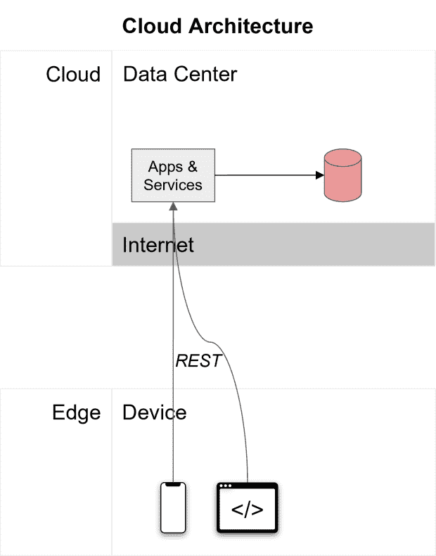
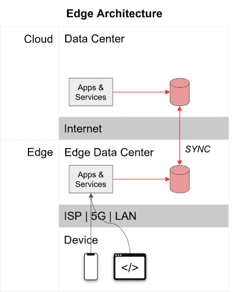
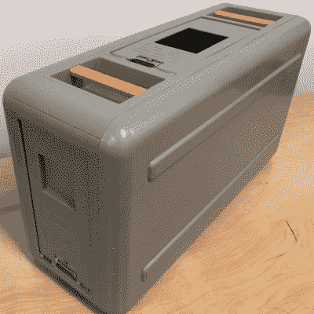
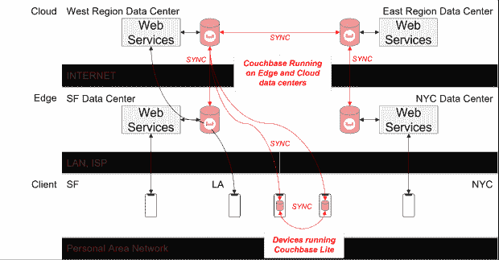
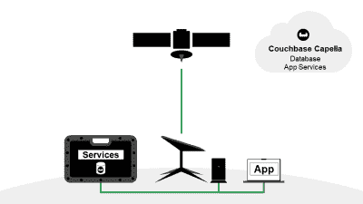
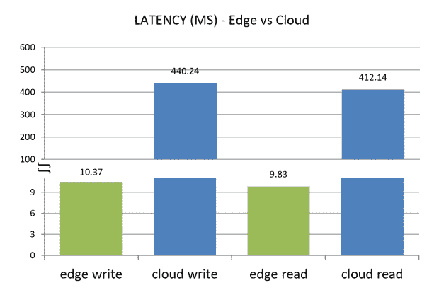
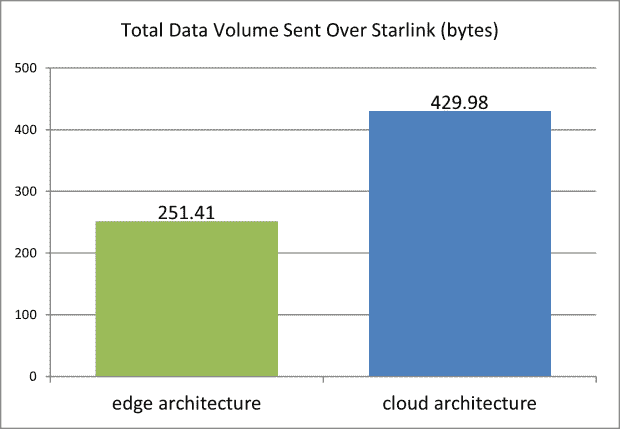
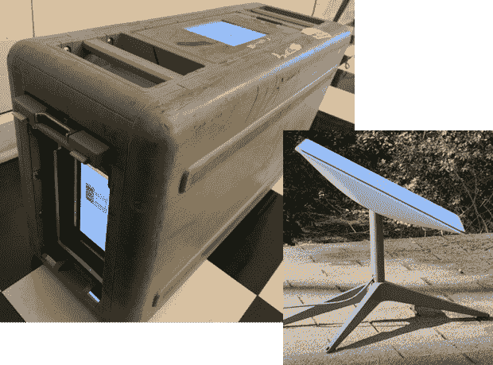

# 真正远程边缘计算的合适材料

> 原文：<https://thenewstack.io/the-right-stuff-for-really-remote-edge-computing/>

假设你在没有互联网的农村和偏远地区经营弹出式诊所。您需要在整个诊所中捕获和共享数据，以提供重要的医疗保健，但如果您使用的应用程序需要互联网连接才能工作，它们就不能在这些区域运行。

或者，您可能是一名石油和天然气运营商，需要分析来自北海一个平台上的压力传感器的关键警告数据。如果数据需要在云数据中心处理，它必须在不可靠的网络上传输难以置信的距离——花费巨大。这导致了高度的延迟或网络缓慢，因此当结果被发送回平台时，采取任何行动都可能为时已晚。

这些使用案例代表了越来越多的应用程序，这些应用程序需要保证 100%的正常运行时间和实时速度，无论它们在世界上的什么地方运行。

满足这些要求的一个基本挑战仍然是网络——全球仍有很大一部分地区很少或没有互联网——这意味着依赖连接的应用程序无法在这些地区运行。

网络技术的新兴进步正在缩小这些差距，但无论网络的覆盖范围、可靠性或速度如何，它都不可避免地会遇到缓慢和中断，从而影响依赖它的应用程序，导致用户体验不佳和业务停机。

## 负责任的发展选择

如何保证应用程序的可用性和超低延迟，尤其是在互联网死区运行时？这是通过了解网络连接中的挑战并解决它们而实现的。

负责任的开发选择是设计和构建这样的应用程序:

*   当网络连接中断或不可用时，仍然可以运行。
*   当网络连接可用时，可以最有效地利用它，因为它可能稍纵即逝，而且可能不总是很快。

要做到这一点，您必须将数据处理和计算基础设施带到网络的近侧，即字面上的边缘，例如在弹出式诊所货车或石油平台上，减少对远程云数据中心的依赖。

## 把它带到边缘

### 云架构

云计算架构假设数据存储和处理在云中托管。在此图中，应用服务和数据库托管并运行在云中，通过 REST 调用从边缘设备访问:

云架构依靠互联网让应用程序正常运行。如果有任何网络缓慢或中断，应用程序将放缓或停止。

### 边缘架构

边缘计算架构将数据处理带到边缘，靠近应用程序，这使得它们更快，因为数据不必一直传输到云和返回。这使得他们更加可靠，因为本地数据处理意味着他们甚至可以在没有互联网的情况下运行。

这不是要摆脱云；您仍然需要最终的聚合点。而是将云扩展到网络的近端。边缘架构使用网络进行同步，当连接可用时，数据在应用生态系统中同步。

需要注意的是，我们所说的“同步”不仅仅是指使用网络复制数据。这也是为了尽可能有效地利用宝贵而短暂的带宽。

Sync 技术提供了跨记录压缩、增量压缩、批处理、过滤、可重启性等功能，并且由于这些效率，它通过线路推送的数据更少，这在速度慢、不可靠或共享带宽的网络上是至关重要的。

简而言之，边缘架构允许您:

*   在数据出现时捕获、存储和处理数据，提供可用性和速度。
*   在连接允许的情况下，在整个应用生态系统中安全高效地同步数据，提供一致性。

现在让我们来探讨如何采用边缘架构。

## 你所要做的就是 **ASC**

在过去的几年中，我们已经看到了新一代技术的发展，这些技术旨在使应用程序比以往任何时候都更适用于更多的地方和更多的用户。

这些进步降低了门槛，使组织更容易采用边缘架构来保证应用程序的速度、正常运行时间和有效的带宽使用，尤其是那些在远程位置和互联网盲区运行的应用程序。

要构建 edge 架构，您需要四个基本的系统组件:

1.  云计算环境。
2.  边缘计算环境。
3.  连接云和边缘的网络。
4.  从云端同步到边缘的数据库。

在这里，我们结合了三种最先进的技术来创建一个边缘架构，可以在地球上的任何地方随时高速运行。

我们称之为 **ASC** 栈:

*   一个雪球
*   paceX Starlink
*   C ouchbase 五车二

## 什么是 AWS 雪球？

[AWS Snowball](https://aws.amazon.com/snowball/) 是一项服务，提供安全、便携、坚固的设备(称为 AWS Snowball Edge 设备)，运行 AWS 基础设施，为边缘应用提供动力。

AWS 雪球边缘设备(来源:亚马逊)

这些设备大约有手提箱大小，为船舶、矿山、石油平台、野外诊所和远程制造设施等不连接的环境提供本地计算、数据处理和数据存储。在需要 AWS 基础设施但由于缺乏可靠的互联网而不可行的地方，雪球提供了一个可移植的解决方案。

用更简单的话来描述，雪球是一个“盒子里的 AWS 数据中心”,它预先配置了 AWS 服务并随时准备就绪。它支持 AWS S3，EC2，Lambda，EBS 等。您插入它，然后通过本地网络上的 AWS 控制面板访问和管理环境。

通过提供一个可移植的，熟悉的，基于标准的基础设施，AWS 雪球使任何人都可以轻松地建立和运行边缘数据中心，而不用担心互联网连接。

## 什么是 SpaceX Starlink？

Starlink 是来自 T2 SpaceX 公司的下一代卫星互联网服务。它由低地球轨道上的数千个小卫星“星座”组成——在太空中大约 340 英里。这与在大约 22，000 英里高的固定位置运行的传统大型地球静止卫星相反。

由于客户的天线和卫星之间的物理距离较短，Starlink 平均可以提供 20 到 50 毫秒的延迟，这比传统的卫星互联网快得多(由于距离更远，延迟可达 600 毫秒或更长)。

低轨道和智能网络技术使 Starlink 能够提供与地面网络相当的性能。他们的“商业”服务提供高达 350 Mbps 的下载速度和 20-40 毫秒的延迟。

虽然 Starlink 为几乎没有或没有其他选择的地区提供了重要的互联网连接，但它并不是万无一失的。在[高峰时段](https://support.starlink.com/topic?category=8&category=39)，当一个特定小区的大多数用户可能共享带宽时，或者如果碟形天线受到附近家用电器、荧光灯或其他 Wi-Fi 网络的干扰[，连接可能会变慢。云层、树枝或厚墙等障碍物会](https://support.starlink.com/?topic=f28de520-ef3f-138d-9f69-7f1b37433f1e)[中断连接](https://support.starlink.com/topic?category=8&category=44)。

因此，开发能够承受间歇性缓慢和中断并保持完全可用的应用程序非常重要。为此，您必须以最紧凑的形式移动尽可能少的数据，从而最大限度地提高这一宝贵的共享网络资源的使用效率。

## 什么是 Couchbase？

Couchbase 是一个 NoSQL 云数据库平台，具有内存速度、SQL 熟悉度和 JSON 灵活性。它本身支持 edge 架构，提供:

*   五车二 couch base:完全托管的云数据库即服务(DBaaS)。
*   [五车二应用服务](https://www.couchbase.com/products/capella/app-services):针对移动和边缘应用的文件存储、双向同步、认证和访问控制的全面托管服务。
*   [couch base Lite](https://www.couchbase.com/products/lite):couch base 数据库的轻量级可嵌入版本。

五车二应用服务在连接允许的情况下同步后端云数据库和边缘数据库之间的数据，而在网络中断期间，由于本地数据处理，应用程序可以继续运行。

使用 Couchbase，您可以创建多层边缘架构，以支持任何速度、可用性或低带宽要求。

Couchbase 提供内置同步来支持复杂的多层边缘架构(来源:Couchbase)

## 测试堆栈

Couchbase Engineering 希望确定 ASC 堆栈如何更好地协同工作的基线，每项技术都致力于增强和扩充其他技术的功能。

为此，我们在传统边缘体系结构中的远程位置设置堆栈:

*   AWS 雪球边缘在边缘提供计算基础设施。
*   Couchbase 部署到雪球边缘设备，进行本地数据存储和处理。
*   Couchbase 五车二在云中充当托管的后端数据库即服务。
*   Starlink 提供从雪球边缘设备到五车二 Couchbase 的网络。
*   Couchbase 五车二应用服务提供边缘数据库和云数据库之间的安全同步。

在 AWS 雪球上运行的 Couchbase 使用 Starlink 同步到五车二(来源:Couchbase)

有了这个基本的 edge 架构，我们开始衡量它在减少延迟和带宽消耗方面的有效性，并与应用程序通过 REST 在 Starlink 上读写的云架构进行比较。

我们运行了四个测试场景:

*   **测试 1** 通过有线局域网(LAN)向雪球边缘写入 1000 个新文档，并测量每个操作传输的数据量和延迟。
*   **测试 2** 是通过 Starlink 将 1000 份新文档从雪球同步到五车二，并测量传输的数据量和完成传输的时间。
*   **测试 3** 是通过 Starlink 向五车二写入 1000 个新文档，并测量每个操作传输的数据量和延迟。
*   **测试 4** 是通过 Starlink 将五车二的 1，000 份新文档同步到雪球，并测量传输的数据量和完成传输的时间。

测试使用了真实世界的产品目录数据集(1，000 种产品)，平均每条记录 650 字节。

## 结果呢

### 延迟比较

与访问云数据库相比，访问本地雪球设备上运行的 Couchbase 数据库的应用程序显示出显著降低的延迟。

对于读取和写入，结果显示，与云体系结构相比，边缘体系结构将延迟降低了 98%:

### 带宽比较

当比较边缘架构和云架构的带宽使用情况时，结果显示通过 Starlink 发送的总数据量在边缘架构上显著减少。

由于同步可以提高效率，如交叉记录压缩、增量压缩、批处理、过滤、重启能力等，因此 edge 体系结构可以充分利用共享带宽，这对于高峰时期、在重云层覆盖下进行连接或在偏远地区(如森林或丛林，障碍物可能会阻碍速度和吞吐量)至关重要。

与使用 REST 调用云架构相比，通过 edge 架构同步更新可将通过 Starlink 传输的数据量减少 42%。

这些测试结果为延迟和带宽改进建立了一个保守的基准，当使用 ASC 堆栈用于基本边缘架构时，可以看到这一点。在大型生产环境中，改进可能会更大。

## 边缘比你想象的要近

Couchbase 在帮助客户满足其应用的实时速度和 100%正常运行时间的关键要求方面有着悠久的历史。通过 ASC 堆栈，Couchbase 与 AWS Snowball 和 SpaceX Starlink 联手，帮助组织更快、更容易地在更多地方采用边缘计算。

最棒的是，这款产品非常便携，无论你去哪里，都可以随身携带！

实际的 AWS 雪球边缘设备和 Starlink dish 用于 Couchbase 测试

自己看看入门有多容易。[今天就免费试用 Couchbase 五车二。](https://cloud.couchbase.com/sign-up)

<svg xmlns:xlink="http://www.w3.org/1999/xlink" viewBox="0 0 68 31" version="1.1"><title>Group</title> <desc>Created with Sketch.</desc></svg>