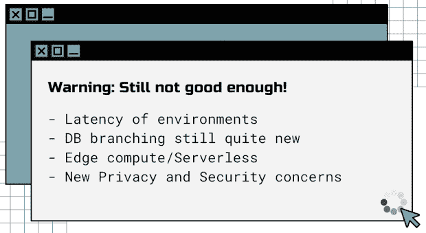
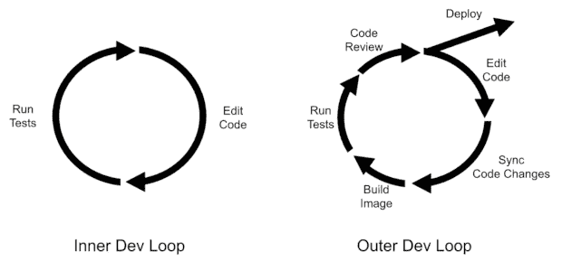
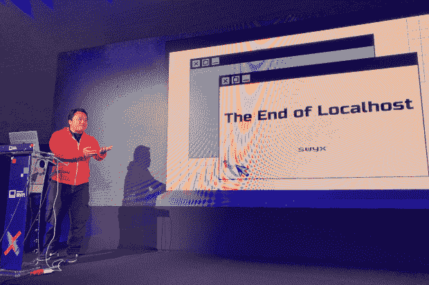

# 云开发的兴起和本地主机的终结

> 原文：<https://thenewstack.io/the-rise-of-cloud-development-and-the-end-of-localhost/>

[王自如](https://www.swyx.io/)，又名@swyx，是开发者大会的一个特色，也有[为网络技术做出深思熟虑的前瞻性预测的诀窍](https://thenewstack.io/the-third-age-of-javascript-an-update-from-reactathon/)。他的最新理论是，我们离开发者完全放弃桌面文件还有大约十年的时间——这将是“本地主机的末日”，王说。为了了解更多，上周在克罗地亚扎达尔举行的 [Infobip Shift](https://shift.infobip.com/) 开发者大会上，我和他坐在了一起。

Localhost 是一个计算机网络术语，指的是用户的机器，在这个意义上，它指的是开发人员将他们的文件存储在他们的设备上。默认情况下，大多数开发人员将他们的工作保存到本地主机，然后上传到应用程序环境。事实上，这就是 Git 的工作方式，因为它为开发人员提供了完整开发历史的本地副本，然后将更改同步到存储库(通常位于云中)。然而，正如王[在 6 月份指出的](https://dx.tips/the-end-of-localhost)，像 GitHub、Etsy 和 Shopify 这样的科技公司已经将他们的全部或大部分开发环境转移到了云端。

他指出云 IDEs 的趋势是 localhost(最终)消亡的另一个标志，以及允许你在远程服务器上运行的同时在本地设备上编码的产品。

然而，在他的 Infobip Shift 演示接近尾声时，他小心翼翼地在他的理论上加上了“我们还没到那一步”的免责声明。延迟仍然是在线编码的一个问题，他提出了关于数据库分支、隐私、安全等问题。

我们还没到那一步…图片 via @swyx。

尽管如此，王告诉我，对 100%云开发环境有一个被压抑的需求。

“我认为人们希望用强大的云机器来编码，这将带回大型机，”他说。“尤其是当他们在处理更复杂的事情时。比如，如果他们正在扰乱稳定扩散(最新的生成性人工智能程序)，或者他们正在运行 Kubernetes。”

他的一个主要论点是“云已经完全吃掉了外环。”他指的是在之后[发生的所有事情，开发者将他们的代码推向版本控制。](https://www.getambassador.io/docs/telepresence/latest/concepts/devloop/)

据@swyx 说，外环现在全是云。

“我们在云中做所有的事情，”王继续说，关于外部循环，“包括一起提交东西到 GitHub。但是内部循环已经在设备上存在很长时间了。与此同时，通过 Gmail，电子邮件的内部循环已经转移到了云端。媒体娱乐的内部循环——无论是流媒体电影、音乐还是游戏——也已经转移到了云端。这只是代码。”

他的观点是，如今我们几乎在网上做任何事情——从电子邮件到看电影——那么为什么不把编码也转移到网上呢？

## 开发人员还没有完全接受云 ide

开发人员 100%在线采用相对较慢的原因之一是，在王看来，云 ide 仍然不够普及。他现在使用的一种云服务是 [Gitpod](https://www.gitpod.io/) ，它支持[公司所说的](https://www.notion.so/Gitpod-s-Direction-be35d064c0704fbda61c542b84e07ef6)“短暂的基于云的开发者环境”但王告诉我，他花了一段时间才意识到这种方法的好处。

“我花了一年时间才听说 git pod……从，嗯，我为什么需要它——我总是可以将东西克隆到我的回购协议中。我花了一年时间才意识到，哦，每次有 PR【拉请求】进来，我都要预览一下。所以我点击一个按钮，并预览它的生活。我花了一年时间试用，然后开始使用。”

Infobip Shift 的王自如。

他还注册了 [Replit](https://thenewstack.io/developers-get-a-quick-start-to-coding-with-replit-ide/) ，这是一个面向学习编码的年轻人的在线编码平台。Replit 将自己描述为“一个浏览器内 IDE，可以用 50 多种语言编写代码，而无需花费一秒钟进行设置。”

“Replit 是从最纯粹的版本开始的，”王说，“如果你在 Replit 的世界里，你只能在云中做事情。你不知道任何其他方法，因为你是 13-14 岁。你在 Replit 上学习编码，而且你一直都有这种[……]它只是在某种程度上与生俱来，这是我们大多数在本地开发中长大的人所不习惯的。”

## 开发者不愿意放弃本地主机

尽管承诺完全在线编码，但王在 6 月份的推文收到了许多来自开发人员的负面反馈。事实上，他本人仍然倾向于为他工作流程的某些部分编写本地主机代码。“使用 Netlify Drop 部署前端预览需要一秒钟，使用 Netlify CLI 需要大约 10 秒钟，但我仍然习惯使用 localhost 进行开发，因为我的迭代周期以毫秒计，”他在 6 月的博客帖子中写道。

但他认为像延迟这样的问题不可避免地会得到解决，这使得开发人员越来越没有理由继续使用 localhost 方法。他把“本地主机的终结”的时间框架定在十年，尽管其他人声称它可能在五年内发生。

如果王有所发现，这意味着基于云的开发工具存在巨大的市场机会。像 Gitpod 和 Replit 这样的公司已经在做这方面的创新工作，但王也喜欢 [Brev](https://brev.dev/) 、 [Coherence](https://www.withcoherence.com/) 、 [Railway](https://railway.app/) 。

也许上述公司中的一家会成为网络开发的偶像——五到十年后再来看看。与此同时，我欢迎开发人员关于完全基于云的反馈。[告诉我](https://twitter.com/ricmac)您对您目前正在使用或正在测试的云开发工具的想法。

*披露:Infobip 出钱让 Richard MacManus 去克罗地亚参加 Infobip Shift 会议。*

<svg xmlns:xlink="http://www.w3.org/1999/xlink" viewBox="0 0 68 31" version="1.1"><title>Group</title> <desc>Created with Sketch.</desc></svg>