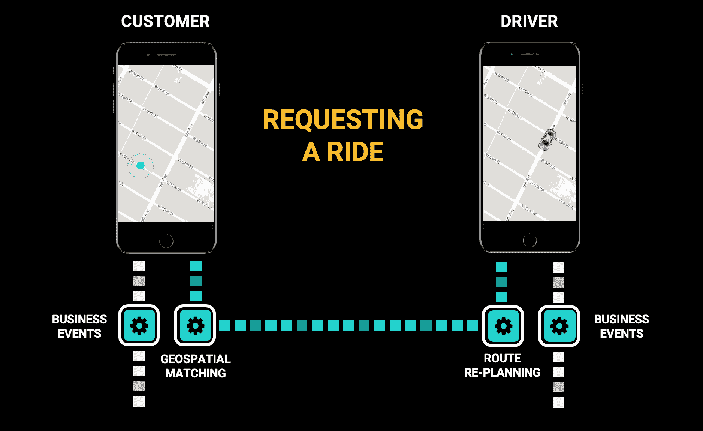
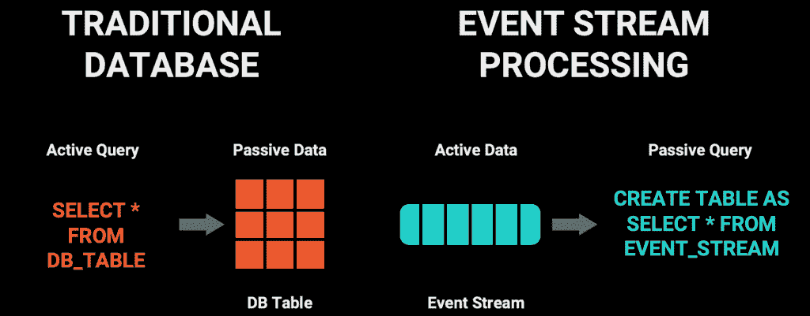
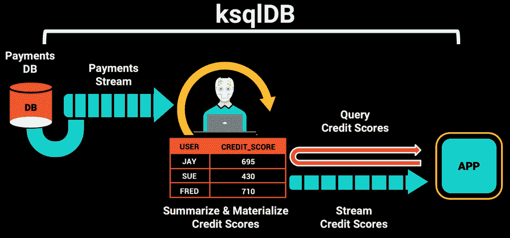

# 事件流数据库的兴起

> 原文：<https://thenewstack.io/the-rise-of-the-event-streaming-database/>

[Ben Stopford](https://www.linkedin.com/in/benstopford/)

[Ben 是 Confluent 公司首席技术官办公室的首席技术专家，他曾参与多个项目，从实施最新版本的 Kafka 复制协议到开发流媒体应用的策略。他在这个领域有二十多年的经验，主要关注分布式数据基础设施。他还是《设计事件驱动系统》一书的作者，O'Reilly，2018。在 benstopford.com 了解更多。](https://www.linkedin.com/in/benstopford/)

数据库是我们想当然的东西。作为有史以来最成功的软件工具之一，它们无处不在，在技术行业之外也广为人知。这些年来，它们随着数据仓库、NoSQL、大数据等不断发展。尽管发生了所有这些变化，数据库的外观和感觉仍然与 50 年前的数据库大体相似:静态的数据仓库，你可以向它提出问题并期望得到答案。然而，它们最近的进化却完全不同。

想一想使用数据库是什么感觉。您向远程服务器上保存的某个数据集发送一个问题。数据集很大，大到你无法独立思考。数据库为你的问题提供了一个近乎即时的答案——一个理解不可理解事物的非常强大的工具。

但这种设计已经越来越不适用于现代数字世界，因为这是一种注重人机交互的设计。也就是说，它是为了帮助*你*而设计的。回答你的问题。把数据放到你的屏幕上。显示购物篮的内容或支票账户的余额。帮助制作软件，使你的工作更容易。数据库的建立是为了帮助人们更好地管理和理解数据。

然而，今天的现代数字世界不是关于帮助人机交互，而是关于用软件解决整个商业问题，让人类离开关键路径。这种完全由软件定义的流程需要一种数据库，它不仅仅是一个端点，是数据流停止的地方。如今，数据的移动在大多数业务流程中扮演着与积累同样重要的角色，这就是事件流的用武之地。

像优步或 Lyft 这样的拼车业务就是一个很好的例子。当你订购一辆顺风车时，整个过程都是自动化的。事件流跟踪你的位置和附近司机的位置。业务事件触发许多独立的软件，这些软件与许多其他软件对话，为您的旅程招呼、安排路线和支付费用。这些与帮助传统出租车运营商接听和记录电话、管理接送等的数据库支持系统相去甚远。

事件流的趋势还包括银行自动化通常由银行信贷员和超市收银员执行的工作，以及支持大量新兴的用例——从实时分析到无人驾驶汽车。

今天最成功的企业不仅仅使用软件来让人们更好地工作，他们还使用软件来自动化业务。这改变了业务本身，但也改变了支持它的软件的架构。更重要的是—回到我们开始的地方— *这就是数据库本身也必须改变的原因。*

## 事件流如何关联

虽然流行的流处理技术有表和 SQL，就像数据库一样，但它们有不同的用途。这些技术在不同的软件之间移动数据，并允许在数据流动时对数据进行操作。它们使用相同的连接、过滤器、汇总等。，传统上应用于数据库表，但应用于动态数据。但是像这样的技术应该代替传统的数据库吗？

如果您曾经使用过 Apache Flink 或 Kafka Streams 之类的流处理器，或者 Spark 或 ksqlDB 的流元素，您就不太可能这样认为。这些技术感觉一点也不像传统的数据库。如果你运行一个查询，你会发现没有答案。查询完成后不会返回。它们连续运行，输出不是响应；这是另一个事件流。

事实上，向事件流的转变可能很难理解，因为它本质上不像数据库。在数据库中，数据是被动的。你必须向它发送一个查询。如果你出去泡杯茶，数据库实际上什么也不做，只有当你回来问它一个问题时，它才活跃起来。

对于事件流技术，情况正好相反。数据处于活动状态。没有人点击按钮并期待事情发生。相反，新数据的出现是触发查询运行的原因。更像是一系列的多米诺骨牌，一个软件触发下一个，创建一系列执行整体业务流程的流程。

所以在事件流中，触发器是*而不是*你。触发器是数据。触发器是事件的到达。数据不像在传统数据库中那样被动地存在；它总是在奔跑。

## 数据库和事件流融合在一起

虽然事件流对于相互依赖的业务操作链很有效，但对于许多端到端的用例来说还不够，尤其是涉及用户的用例。按钮仍然需要点击，订单仍然被创建，购物篮仍然以我们几十年来使用数据库的完全相同的方式显示在屏幕上。直到最近，流处理器对此无能为力，所以实现者最终会将技术捆绑在一起:消息传递系统、流处理器、数据库等。

两项技术变革解决了这个问题。首先，流处理器在本质上变得更像数据库，取代了为用户提供流计算结果的独立数据库组件。在第二种情况下，数据库变得更像流，在更新时从表中发出数据。

ksqlDB 是第一类的一个例子:一个可以物化视图的流处理器，您可以像查询数据库表一样查询这些视图。在下图中，使用流计算将支付流转换为信用评分，计算结果存储在信用评分表中。然后，用户可以向该表发送返回特定值的查询，或者通过事件流监听更改。像这样将事件流计算与用户可以查询的表格相结合的技术被称为*事件流数据库*。

[活动数据库](https://en.wikipedia.org/wiki/Active_database)从相反的方面解决问题，允许您创建触发器和物化视图来响应对数据库表的更改。这些已经存在了几十年，但是功能仅限于数据库本身:没有向外界发出事件流。最近的数据库技术——如 MongoDB、Couchbase 和 RethinkDB——已经结合了当记录改变时发出事件流的表的概念。然后，应用程序可以对这些流做出反应。

其结果是向中间地带的融合，将流和表作为一等公民，这正在被形式化为对 [SQL 标准](https://standards.incits.org/apps/group_public/workgroup.php?wg_abbrev=dm32)的扩展。

虽然这两种方法——活动数据库和事件流数据库——看似相似，但它们的使用方式不同。两者都建立在相同的三个构件上:查询、表和事件流。主动数据库更擅长查询表，但是它们不能查询事件流。事件流数据库可以查询事件流和表，但是基于表的查询不如活动数据库的查询高级。

这在实践中意味着，活动数据库适合简单的应用程序或单个微服务，它们可以从基于事件的数据接口中受益。相比之下，事件流数据库通常使用 Apache Kafka 来移动数据，这使它们更适合微服务(复数)或数据管道。它们充当系统，其中事件数据物理地从一个地方移动到另一个地方，或者创建由这些数据流捆绑在一起的业务逻辑链——相当于字面上的[将数据库翻了个底朝天](https://www.confluent.io/blog/turning-the-database-inside-out-with-apache-samza/)。这些也正是我们看到的应用类型，比如出租车司机、信贷员、收银员等。，偏离了关键路径。

50 年后，数据库正在适应新主人的需求。这种蜕变并没有结束。事实上，这很可能只是开始。但是有一件事似乎是清楚的:问题*“*什么是数据库？”可能会改变，因为软件世界变得越来越不仅仅是帮助像你我这样的人完成工作的软件，而是让我们的世界完全自动化的软件链。

<svg xmlns:xlink="http://www.w3.org/1999/xlink" viewBox="0 0 68 31" version="1.1"><title>Group</title> <desc>Created with Sketch.</desc></svg>