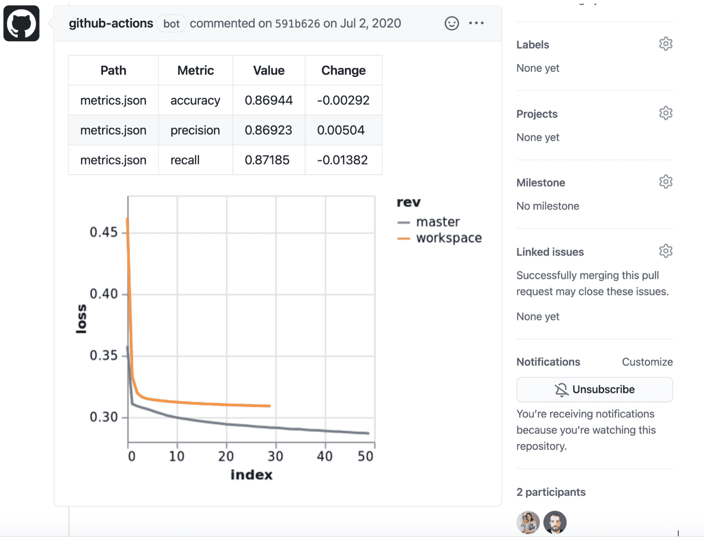

# 通往人工智能地狱的道路始于良好的动机

> 原文：<https://thenewstack.io/the-road-to-ai-hell-starts-with-good-mlops-intentions/>

[Dmitry Petrov](https://www.linkedin.com/in/dmitryleopetrov/)

[Dmitry Petrov 是微软的前数据科学家，拥有计算机科学博士学位，积极的开源贡献者。他编写并开源了机器学习工作流管理工具 DVC.org 的第一个版本。此外，他在 Python 的开源库 ImageHash 中实现了基于小波的图像哈希算法 wHash。Dmitry 作为旧金山 Iterative 的联合创始人兼首席执行官，正在研究机器学习和 ML 工作流管理的工具。](https://www.linkedin.com/in/dmitryleopetrov/)

机器学习操作(MLOps)在去年已经成为一个独特的 IT 学科，用于构建机器学习(ML)或人工智能(AI)模型。虽然乍一看，这似乎是一种自动化构建 AI 模型的可行方法，但实际上，MLOps 平台的供应商在说服组织收购最佳 DevOps 实践之外的平台方面有着既得利益，这些实践已经被证明可以加速应用程序开发。

然而，人工智能模型最终是一个软件产品，就像任何其他需要集成到应用程序中的产品一样。当今最常追求的 MLOps 的问题是，数据科学家正在几乎完全独立于组织的其余部分构建人工智能模型。希望是当人工智能模型完成时，它会神奇地被整合到应用程序开发工作流程中。不幸的是，使用最佳 DevOps 实践开发应用程序的速度很少与构建人工智能模型的速度一致。

结果不仅是浪费了大量的时间和精力，依赖于人工智能模型的数字业务转型计划的推出速度也成为一个重大的竞争劣势。实际上，通往人工智能地狱的道路是由良好的动机铺成的。

在微软担任数据科学家期间，我亲眼目睹了机器学习和人工智能传统上是如何以孤立的方式实现的。这种不满意的体验导致了开源数据版本控制(DVC)和连续机器学习(CML)工具的推出，这些工具将 ML 工作流集成到软件开发的最佳实践中。目标需要是扩展传统的软件工具，如 Git、协作和持续集成/持续交付(CI/CD)平台，以满足开发人员和 ML 工程师的需求，而不是创建一个需要收购和维护的单独的专有 AI 平台。整个 ML 栈需要以一种让每个开发者都可以访问的方式重新发明。

DVC 和 CML 是简化数据科学家工作流程的开源工具。他们将 ML 工作流集成到当前的软件开发实践中，通过扩展 Git 和 CI/CD 平台等传统软件工具来满足 ML 研究人员和 ML 工程师的需求，从而消除了对 AWS SageMaker、Microsoft Azure ML 和 Google Vertex AI 等专有 AI 平台的许多功能的需求。本质上，它们提供了一个基于最佳 DevOps 实践的开放平台，以实现 ML 和 AI。

MLOps 是关于 ML 和 AI 的操作和自动化。它涵盖了 ML 过程的整个生命周期，包括标记数据、开发、建模和监控。每个 ML/AI 平台都提供这种功能。然而，我们对 MLOps 的愿景是不同的。我们认为它应该嵌入到您的开发运维流程中。它应该是您的工程基础设施、工程堆栈和工程流程的一部分。ML 需要额外的工具。只是这些工具需要整合到一个更大的工具链中。

这样做的主要原因是为了更一致地与软件工程方面的人员进行交互，并重用诸如 Git、GitHub/GitLab 和 CI/CD 系统等成熟的工具。在传统应用程序开发流程之外构建人工智能模型的 ML 筒仓造成了一种鸿沟，每当数据科学家需要与工程师合作时，就需要弥合这种鸿沟。例如，对于传统的人工智能平台，所有的工作流都是预定义的。可能有机会修改它们，但是对于所有意图和目的来说，这些工作流是不灵活的。这是错误的方法。由数据科学家和开发人员组成的团队应该能够基于他们的业务需求和团队偏好来定义他们自己的工作流，就像他们今天在构建任何其他软件工件时所做的那样。他们可以使用灵活的工具，如 Git、GitHub 以及他们认为合适的现有 CI 工具，而不是一个平台强迫团队接受一个高度固执己见的工作流。

## 我们是如何做到的

当谈到软件工程时，工作流中的一切都基于工件的版本。然而，当处理大型数据集时，这种方法不起作用，因为现有工具没有数据版本控制。我们在 [Iterative.ai](https://iterative.ai/) 扩展了现有的 DevOps 工具，这样除了 ML 模型之外，开发人员还可以用他们的代码对数据进行版本控制。

除了允许数据和建模版本化，我们还让数据科学家与 CI/CD 流程保持一致。这使得数据科学家能够以一种在他们的机器上实际工作的方式与团队的其他成员共享代码和数据！这一点至关重要，因为代码通常通过第三方平台运行，以确定它是否能在生产环境中运行。没有办法将数据引入这个过程，这意味着在部署模型之前，没有真正的方法来确定它是否有效。没有显示指标的方法。没有办法将您的指标与您的生产指标进行比较。在这种情况下，所有的东西都需要被检测，以将所需的图附加到测试中。那要花很多时间。我们可以测试多个绘图点。最后，我们提供了一个可视化和分析数据的地方，而不是使用 Microsoft Excel 电子表格。我们通过提供一个更好的系统来扩展传统的软件工程功能，在您的 GitHub、GitLab 或 BitBucket 用户界面上可视化数据。

GitHub 用户界面中的 CML 报告权限

## 结论

我们相信，基于版本控制和 CI 工具的基于开源的工作流将简化机器学习，就像软件开发已经实现现代化一样。如果数据科学家、工程师和开发人员可以通过重用文件、管道、实验甚至存储在 Git 存储库中的整个模型来加速 ML/AI 模型的开发，那么人工智能融入软件的速度将会提高几个数量级，最重要的是，不会出现通往人工智能地狱的道路。

<svg xmlns:xlink="http://www.w3.org/1999/xlink" viewBox="0 0 68 31" version="1.1"><title>Group</title> <desc>Created with Sketch.</desc></svg>