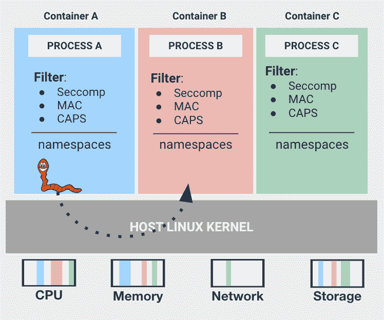
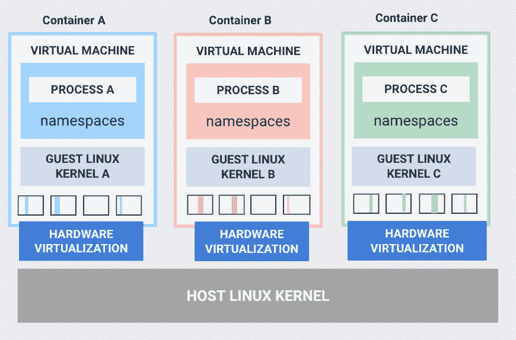

# 卡塔集装箱 2.0 之路

> 原文：<https://thenewstack.io/the-road-to-kata-containers-2-0/>

开源 Kata 容器项目[于 2017 年底](https://www.openstack.org/news/view/365/kata-containers-project-launches-to-build-secure-container-infrastructure)启动，旨在将虚拟机(VM)的安全优势与容器的速度和可管理性结合起来。这个项目在过去两年中取得了什么成果，下一个版本的路线图包含了哪些特性？让我们来看看形容器，从快速回顾形容器是如何产生的开始…

## 形容器是如何出现的

 [贺瑞斯·李

Horace Li 是 OpenStack 基金会的中国社区经理，他支持中国 OpenStack 生态系统的发展，并加速参与开放基础设施项目，包括 Kata 容器。在加入 OpenStack 基金会之前，Horace 在英特尔开源技术中心工作了 13 年，担任技术客户经理，支持参与中国的开源社区项目。](https://www.openstack.org/foundation/) 

当 Docker 登场，容器成为热门新事物时(大约在 2013 年*)，全世界的开发人员都被容器带来的好处所吸引。这也难怪。容器是一种标准的软件单元，它将代码及其所有依赖项打包，以便应用程序能够快速可靠地从一个计算环境运行到另一个计算环境，对于希望更快地构建、测试和部署软件的开发人员来说，容器至关重要。容器是轻量级的、低开销的、几乎可以即时调度和启动的、可以在任何地方运行的、有利于微服务的、提供可伸缩的资源消耗的，这仅仅是几个受欢迎的优点。

尽管有许多技术进步，容器也有一个缺点——由于容器共享对主机内核的访问而产生的安全弱点。从理论上讲，如果您在一台主机上有多个容器，并且其中一个容器被恶意代码利用，那么由于共享的名称空间，该主机上的所有其他容器也容易受到攻击。在这种情况下，容器会对组织的整个云基础设施造成严重的安全威胁。如果您是云提供商，威胁会扩展到您的云客户的数据和业务，这是完全不可接受的前景。

图 1:传统容器；描述:传统容器:名称空间隔离，共享内核的 cgroups。

因此，许多大规模运行容器的运营商将这些容器“嵌套”在虚拟机中，将它们与同一主机上运行的其他进程进行逻辑隔离。但是在虚拟机中运行容器剥夺了用户使用容器的速度和灵活性。意识到这个问题，两家公司的开发人员——英特尔(T0)和 Hyper.sh(现已解散的中国初创公司)——开始分别同时研究解决方案。两家公司都开始寻找一种方法来保护容器，而不强迫它们携带传统虚拟机带来的所有行李。或者换句话说，他们开始“重组”虚拟化以适应容器本地应用程序。

英特尔开源技术中心的工程师使用英特尔虚拟化技术来增强其英特尔 Clear Containers 项目的性能和安全隔离。

与此同时，Hyper.sh 的工程师推出了开源项目 runV，使用了类似的策略，将容器放在安全的“沙箱”中。Hyper.sh 通过支持许多不同的 CPU 架构和虚拟机管理程序，强调了一种与技术无关的方法。

2017 年，两家公司合并了他们的互补努力，创建了开源项目， [Kata Containers](https://katacontainers.io/) 。通过联手，英特尔和 Hyper.sh 致力于在性能和兼容性方面提供卓越的最终用户体验，统一开发人员社区，并加速特性开发以应对未来的使用案例。Kata Containers 成为 OpenStack 之外第一个由 [OpenStack 基金会](https://www.openstack.org/foundation/) (OSF)支持的项目。该项目于 2017 年 12 月在 kube con North America 首次公开亮相，社区吹捧“集装箱的速度和敏捷性以及虚拟机的安全性。”

这是这句流行语背后的实质。使用 Kata 容器，每个容器或容器箱都被启动到一个轻量级 VM 中，并有自己独特的内核实例。由于每个容器/pod 现在都运行在自己的虚拟机中，恶意代码无法再利用共享内核来访问相邻的容器。Kata Containers 还使容器即服务(CaaS)提供商能够更安全地提供在裸机上运行的容器，因为每个容器/pod 都由轻量级 VM 隔离。由于这种硬件隔离，Kata Containers 允许相互不信任的租户，甚至生产和预生产(未经验证的)应用程序在同一个集群中安全运行。

图 2:形容器；描述:Kata 容器:每个容器或 pod 在它自己的轻量级 VM 中更加孤立。

因此，Kata 容器与容器一样轻便快捷，并与容器生态系统无缝集成，包括 Docker 和 Kubernetes 等流行的编排工具，同时还提供了虚拟机的安全优势。

## 社区进步

在 Kata Containers 的第一年，社区的工作主要是合并 Intel 和 Hyper.sh 的代码，并在世界各地的活动中宣传该项目的独特硬件级隔离方法，这是其他容器运行时所缺乏的功能。这个初出茅庐的社区还邀请了更广泛的开发者社区来参与推进这个项目。

自推出以来，Kata Containers 社区已发展成为包括许多有影响力的公司的贡献者和支持者，包括 99Cloud、阿里巴巴、AMD、AWS、百度、Canonical、中国移动、City Network、DellEMC、EasyStack、烽火、谷歌、华为、IBM、微软、Mirantis、NetApp、Nvidia、PackageCloud、Packet、Red Hat、SUSE、腾讯、UnitedStack、Vexxhost 和中兴通讯。在这个扩大的社区的支持下，该项目取得了稳步进展。

社区成就包括:

*   **加入开放集装箱倡议(OCI)。**Kata 容器社区继续与 OCI 和 Kubernetes 社区紧密合作，以确保兼容性，并定期测试跨 AWS、Azure、GCP 和 OpenStack 公共云环境以及所有主要 Linux 发行版的 Kata 容器。
*   **增加对主要架构**的支持，除 x86_64 外，还包括 AMD64、ARM、IBM p 系列和 IBM z 系列。
*   **提供与上游 Kubernetes 生态系统的无缝集成**。Kata 容器现在可以连接到几乎所有的 Kubernetes 网络。
*   **移除堆栈中不必要的间接寻址。**该社区取消了 kata-proxy，并在 Kubernetes SIG-Node 和 containerd 社区的帮助下，引入了 shim-v2，减少了 Kata Containers assistant 进程的数量。
*   **减少消耗提高速度。**社区正致力于加速启动、减少内存消耗，并朝着创建(几乎)“零开销”沙盒技术的目标迈进。为此，它增加了对多个管理程序的支持，包括 QEMU、QEMU-lite、NEMU 和 AWS bracket；与 containerd 项目集成；并为 rust-vmm 项目做出了贡献。2019 年，该社区引入了用 Rust 编写的新的沙盒内代理，显著减少了匿名页面。有了这些进步，社区在最小化开销方面取得了很大进展；例如，鞭炮 VMM 的引入将内存开销降低到 10MB 级别，rust-agent 的合并将代理的开销从 10MB 级别降低到 1MB 级别。
*   **为云本地工作负载提供虚拟化**。云原生工作负载的虚拟化技术与虚拟机的虚拟化技术有很大不同。为了解决这个差异，社区已经采用了 virtio-vsock 和 virtio-fs，并且很快将添加内存扩展技术 virtio-mem。

要阅读更多关于这些成就的内容，请参阅许旺在 Medium 上的帖子，“[两年的形容器](https://medium.com/kata-containers/the-blueprint-of-kata-2-0-537e360c8ff6?source=rss----ae5a681b1e62---4)”

## 生产中的证明:百度 AI 云运行在 Kata 容器上

百度，一家占主导地位的中国搜索引擎运营商，世界上最大的中文网站的主机，以及全球领先的人工智能公司——正在[大规模运行 Kata 容器](https://katacontainers.io/collateral/ApplicationOfKataContainersInBaiduAICloud.pdf)(超过 43k 个 CPU 核心！)在其百度 AI 云中，支持其云函数计算、百度容器实例和百度边缘计算服务。

百度 AI Cloud 是百度面向企业和开发者的智能云计算平台，致力于为各行各业的企业提供一体化的人工智能、大数据和云计算服务。根据 Synergy Research Group 的数据，百度 AI Cloud 位列亚太地区四大公共云之一。

百度人工智能云是一个复杂的网络，具有巨大的流量和复杂的部署场景，例如每天 10 亿+页面浏览量(PV)的单个集群的峰值流量和单个租户的 50，000+容器。百度在对安全容器技术做了大量研究并确定 Kata 容器是一种高度安全和实用的容器技术后，选择使用 Kata 容器。

百度在白皮书《[Kata 容器在百度 AI 云的应用](https://katacontainers.io/collateral/ApplicationOfKataContainersInBaiduAICloud.pdf)》中详述了他们选择 Kata 容器的原因。在这个坦率的案例研究中，百度记录并分享了其 Kata 容器的用例，在应用该技术时遇到的技术挑战，以及百度工程师解决这些问题的创新方法。

百度云高级架构师兼白皮书作者张宇写道:

对于百度来说，当务之急是找出如何改善容器隔离以保护客户工作负载和数据，同时利用容器的轻量级和灵活性。Kata Containers 采用的虚拟机之间的隔离模式不仅确保了容器在多租户环境中的安全隔离，还有助于使虚拟机的隔离对应用程序和用户不可见。…作为一个安全的容器解决方案，Kata Containers 在百度提供的容器服务中发挥着重要作用，它通过支持多个基于 KVM 的 VMM 来满足不同的客户使用案例。

在其成功申请[超级用户奖](https://superuser.openstack.org/articles/shanghai-superuser-award-nominee-baidu/?_ga=2.159367484.702087549.1583889206-1374391620.1544394204)的过程中，百度描述了 Kata Containers 转变其业务的方式:

*2019 年，我们基于 Kata 容器的产品在 FaaS(功能即服务)、CaaS(容器即服务)和边缘计算领域取得了市场成功。百度基于 Kata Containers 的云函数计算服务(CFC)为百度 DuerOS(一个拥有“亿级规模”安装基数的对话式 AI 操作系统)提供了超过 3000 名开发者的近 2 万项技能运行云函数计算的计算能力。百度容器实例服务(BCI)为百度大数据事业部内部大数据业务搭建了一个面向多租户的无服务器数据处理平台。百度边缘计算(BEC)节点对所有客户端开放，同时为了安全和确保高性能，将它们彼此分开。*

[在 2019 年 11 月上海开放基础设施峰会](https://superuser.openstack.org/articles/baidu-wins-superuser-award-at-open-infrastructure-summit-shanghai/)上，俞报告称，百度的 17 项重要在线业务已经迁移到 Kata Containers 平台。Yu 解释说，Kata Containers 在容器级别提供了一种类似虚拟机的安全机制，这给了它的客户很大的信心。当将他们的业务转移到容器环境时，他们就不那么担心了。

## Kata 容器 2.0 路线图

在过去的两年中，Kata Containers 社区已经改进了容器世界中的隔离，使得虚拟化更加轻量级和容器友好，尽管对开销有一些负面影响。Kata Containers 项目的未来愿景是继续完善沙盒技术，以便以最低的成本透明地进一步隔离云原生应用程序。

更具体地说，预计今年晚些时候发布的 Kata 容器 2.0 版本的目标可以总结如下:

*   引入安全性改进，如调整架构以更好地将主机与工作负载隔离，添加虚拟机内映像处理以允许 Kata 容器集成到硬多租户环境中。(IBM 的贡献者已经开始了这项工作。)将图像处理移动到沙箱将阻止主机访问任何容器应用程序数据。
*   通过重写 rust 中的关键组件和采用各种其他架构改进，引入优化以减少运行 Kata 容器的占用空间。
*   在 2019 年底添加对云虚拟机管理程序 VMM 的支持后，继续添加其他功能，如设备直通和 CPU/内存热插拔。
*   添加对一种称为 virtio-mem 的新内存扩展技术的支持，这可能是对传统内存气球驱动程序的一个重大改进。这也将为容器上的内存资源限制提供更好的支持。
*   继续推动项目成为沙盒工作负载的行业标准容器运行时。

要更深入地了解社区希望在 2.0 版本中解决的挑战，请参阅许旺在 Medium 上的文章:“ [Kata 容器:云原生虚拟化](https://medium.com/kata-containers/kata-containers-virtualization-for-cloud-native-f7b11ead951?source=rss----ae5a681b1e62---4)”和“[Kata 2.0 的蓝图](https://medium.com/kata-containers/the-blueprint-of-kata-2-0-537e360c8ff6?source=rss----ae5a681b1e62---4)”

## 了解更多/参与其中

百度是一家投资开源项目和社区并取得巨大成功的公司的典范。Kata Containers 社区欢迎其他个人和组织也这样做:通过贡献代码、文档和用例在项目中发挥积极作用。

要了解更多并参与其中，请访问 [Kata 容器社区页面](https://katacontainers.io/community/.)。

<svg xmlns:xlink="http://www.w3.org/1999/xlink" viewBox="0 0 68 31" version="1.1"><title>Group</title> <desc>Created with Sketch.</desc></svg>